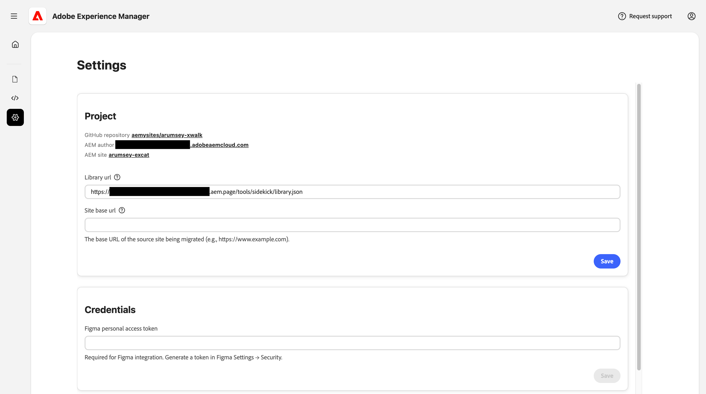

# Experience Moderation Console {#console-reference}

Referentiehandleiding voor de interface en mogelijkheden van de Experience Moderation Console

>[!NOTE]
>
>Als u geïnteresseerd bent in het gebruik van de Experience Modernization Console, kunt u toegang aanvragen voor een vloeiende instapervaring.

## Overzicht {#overview}

De Experience Modernization Console is een gehoste, door AI ondersteunde ontwikkelomgeving voor Edge Delivery Services, die beschikbaar wordt gesteld als een webinterface op [`aemcoder.adobe.io` .](https://aemcoder.adobe.io) Na het verbinden met hun project GitHub, kunt u onmiddellijk beginnen het veroorzaken van veranderingen in natuurlijke taal zonder enige verdere opstelling of lokale omgevingsconfiguratie.

>[!TIP]
>
>Als u in het worden bent begonnen onmiddellijk met de console, controleer het document [&#x200B; Begonnen Worden met de Agent van de Modernisering van de Ervaring.](/help/ai-in-aem/agents/brand-experience/modernization/getting-started.md)

## Mogelijkheden {#capabilities}

Kernmogelijkheden van de console:

* Interactief chatsbord met de agent en zijn vaardigheden
* Live AEM-voorvertoning voor directe visuele feedback over wijzigingen
* Browser voor inhoudsbestanden en viewer voor markeringen
* De synchronisatie van de inhoud met [&#x200B; Authoring van het Document &#x200B;](https://da.live)
* De browser van de code en diff kijker voor het herzien van aangebrachte veranderingen
* De integratie van GitHub met capaciteit om trekkingsverzoeken van veranderingen te creëren

Ontwikkelaars behouden de volledige controle over welke schepen. Alle wijzigingen die via de console zijn aangebracht, moeten vóór de implementatie worden gecontroleerd en goedgekeurd, zodat u verzekerd bent van governance, consistentie van het merk en beveiliging.

## Navigatie {#navigation}

Na het ondertekenen in de console bij [`aemcoder.adobe.io`, &#x200B;](https://aemcoder.adobe.io) u op het huisscherm van de console aankomt.

### Menubalk {#menu-bar}

De bovenste menubalk bevat:

* Een **Open menu** knoop op de linkerzijde om het detail van het linkerzijpaneel uit te breiden en samen te vouwen
* Een **knoop van de Rekening** op het recht voor omschakeling naar donkere wijze en het ondertekenen uit de console

### Linkerzijbalk {#sidebar}

Met de linkerzijbalk hebt u snel toegang tot belangrijke weergaven van de console.

* **[Mening van het Huis](#home-view)** (huispictogram) - Uw uitgangspunt voor het gebruiken van de console
* **[Mening van de Inhoud](#content-view)** (dossierpictogram) - Inhoud die u hebt ingevoerd
* **[Mening van de Code](#code-view)** (`</>` pictogram) - Code van de plaats die u aan werkt
* **[Mening van Montages](#settings-view)** (tandwielpictogram) - Montages van de console

## Home View {#home-view}

De **1&rbrace; mening van het Huis &lbrace;is uw uitgangspunt voor het gebruiken van de console.**

* Bij de bovenkant is a [&#x200B; snelle input &#x200B;](#prompt-input) voor het doen van verzoeken van de console.
* Onder het snelle paneel wordt voorgesteld herinneringen om met uw project te beginnen.

### Vragen om invoer {#prompt-input}

De snelle input verstrekt controles voor interactie met AI.

* **Plan/voer wijzen** (gloeilamp en magische waaipictogrammen) uit: Wissel tussen planning en uitvoeringswijzen, respectievelijk
   * **wijze van het Plan**: AI analyseert verzoeken en schetst een benadering zonder veranderingen aan te brengen, die voor het begrip van strategie alvorens te bevestigen nuttig is.
   * **voert wijze** uit: AI voert het plan uit en maakt daadwerkelijke dossierveranderingen.
* **Band dossiers** (paperclippictogram): Upload en maak dossiers aan de herinnering voor extra context (b.v. verwijzingsontwerpen, screenshots, specs) vast

## Inhoud weergeven {#content-view}

De **mening van de Inhoud** verstrekt hulpmiddelen om te doorbladeren en inhoud te previewing. Standaard wordt de weergave opgedeeld in drie deelvensters, van links naar rechts:

* Het paneel van de herinnering voor interactie met de console en het project
* De browser van het dossier voor een overzicht van uw inhoudsdossiers (knevel die dit paneel met het chevron pictogram toont)
* Deelvenster Voorvertoning voor het visualiseren van inhoud die is geselecteerd in de bestandsbrowser

### Deelvenster Chatten {#chat-panel}

Het praatjepaneel staat u toe om uw gesprek met de agent van de Modernisering van de Ervaring te bekijken en voort te zetten. Het praatjepaneel omvat de geschiedenis van het praatjebericht en a [&#x200B; snelle input &#x200B;](#prompt-input) voor het maken van extra verzoeken van de console.

* **de Acties van het Praatje**
   * **Duidelijke praatje**: Dit stelt het gesprek terug en ontruimt het de contextvenster van AI. Gebruik deze optie wanneer het beginnen van een nieuwe taak los van het vorige gesprek.
   * **praatje van de Download**: Dit downloadt de gespreksgeschiedenis als tellingsdossier.

### Voorvertoning, deelvenster {#preview-panel}

Het deelvenster Voorvertoning bevat maximaal vier modi:

* **Voorproef** (document met het vergrootglaspictogram) om de teruggegeven inhoud van HTML te bekijken
   * **Responsieve mening** om de teruggegeven inhoud van HTML in een Desktop, tablet, of mobiele mening te bekijken
   * **wijze van het Ontwerp** (het pictogram van het borstel) om elementen van de pagina aan uw herinnering voor extra context toe te voegen
* **mening van het Document** (documentpictogram) om de onderliggende document te bekijken creërend inhoudsstructuur, respectievelijk
* **de mening van de Prijsverhoging (het auteursrecht van AEM)** (codepictogram) om de onderliggende structuur van de prijsdalingsinhoud te bekijken
* **de mening van XML JCR (het auteursrecht van AEM)** (gegevenspictogram) om de resulterende JCR XML inhoudsstructuur te bekijken

U kunt **altijd klikken verfrist voorproef** pictogram om het voorproefpaneel bij te werken.

De **schrapping** knoop verwijdert de geselecteerde pagina uit de werkruimte. Voorvertoonde of gepubliceerde inhoud wordt niet verwijderd.

De **knoop van Fouten** (het auteursrecht van AEM) opent een modaal venster om de fouten op de geselecteerde pagina te bekijken.

De **uploadt inhoud** knoop opent een modaal venster om dossiers aan AEM te uploaden.

* **Organisatie** en **het gebied van de Bewaarplaats** is prepopulated als uw project een `fstab.yaml` dossier heeft
* Bestandsselectie biedt bewerkbare doelpaden
* Uploaden naar JCR (voor Universal Editor) wordt niet ondersteund

## Codeweergave {#code-view}

De **mening van de Code** verstrekt hulpmiddelen om code te doorbladeren en codeveranderingen te leiden. De weergave wordt opgedeeld in drie deelvensters, van links naar rechts:

* Chatpaneel voor interactie met de console en het project
* De browser van het dossier voor een overzicht van uw codedossiers of verandert als diffuse
* Deelvenster Voorvertoning voor het weergeven van een codebestand of geselecteerde wijzigingen in de bestandsbrowser

Het deelvenster Voorvertoning beschikt over twee verschillende modi:

* **de dossiers van Workspace** om de codedossiers in de huidige werkruimte te doorbladeren
   * Gebruik **toevoegen aan praatje** knoop om het dossier aan het praatjepaneel voor context toe te voegen.
* **Veranderingen van het Git** om de verschillen van dossierveranderingen te bekijken die door uw werk aan het project worden gecreeerd
   * Klik op het pictogram `+` om het gewijzigde bestand te plaatsen
   * Klik op het pijlpictogram om het gewijzigde bestand te verwijderen

Het **pictogram van de Informatie** maakt een lijst van uw momenteel verbonden rekening GitHub en project.

Het **GitHub acties** menu (hoogste recht) verstrekt bewaarplaatsverrichtingen.

* **verbind/opnieuw verbinden**: Initieert GitHub OAuth
* **Repository van de Schakelaar**: Vervangt de werkruimte met een verschillende bewaarplaats. Alle niet-toegewezen werk gaat verloren.
* **Tak van de Schakelaar**: De takken van schakelaars binnen de zelfde bewaarplaats
* **Synchronisatie**: trekt de recentste veranderingen van de verre oorsprong
* **Duw**: Opent een modaal om werkruimteveranderingen in GitHub te duwen
* **Logout**: maakt van GitHub los

Wanneer u wijzigingen aanbrengt, moet u eerst gefaseerde wijzigingen hebben aangebracht om deze in de push-modus op te nemen. Wanneer u drukt, kunt u een nieuwe PR maken of rechtstreeks naar de huidige vertakking duwen

## Instellingenweergave {#settings-view}

In de weergave Instellingen kunt u de basisinstellingen van de console beheren.

* **Project** staat u toe om projectmontages zoals het aanpassen van de bibliotheek URL te bekijken en uit te geven.
* **Steun** staat u toe om hulp van het de steunteam van AEM te verzoeken.
* **Geloofsbrieven** staat u toe om een persoonlijk toegangstoken voor Figma te specificeren zodat kan de [&#x200B; console tot ontwerpblokken voor uw project toegang hebben.](/help/ai-in-aem/agents/brand-experience/modernization/prompting-guide.md#figma-block-migration)
   * Het token vereist het volgende bereik (alleen-lezen):
      * `file_content:read`
      * `file_metadata:read`
      * `library_assets:read`
      * `library_content:read`
      * `team_library_content:read`
      * `file_dev_resources:read`
      * `projects:read`
   * [&#x200B; zie de documentatie van Figma &#x200B;](https://help.figma.com/hc/en-us/articles/8085703771159-Manage-personal-access-tokens) voor meer informatie over vestiging persoonlijke toegangstokens.
* **de werkruimte van het Terugstellen** keert de console aan zijn beginnende staat terug en alle niet-geduwde of niet-geuploade veranderingen zullen worden verloren.
