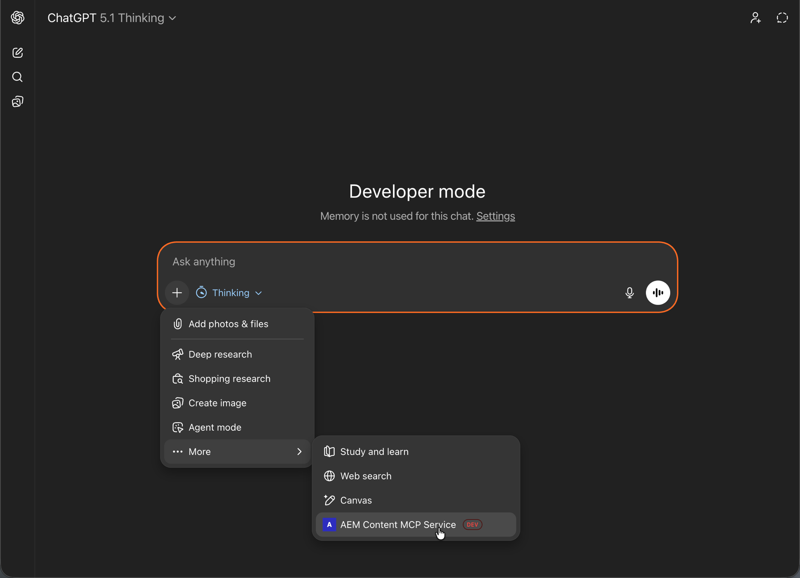

# OpenAI ChatGPT instellen met AEM MCP {#setup-chatgpt}

Voer de volgende stappen uit om OpenAI ChatGPT te verbinden met AEM MCP-servers.

* Voeg een of meer AEM MCP server-URL&#39;s toe in het gebied waar MCP-verbindingen of -gereedschappen zijn geconfigureerd.
* Trigger de verbinding en meld u aan bij de omleiding met uw Adobe ID.
* Verwijs in een praatje, de gevormde Hulpmiddelen van AEM in uw herinneringen, bijvoorbeeld:

  ```
  "Using the configured AEM MCP tools, list all sites in the author environment."
  ```



