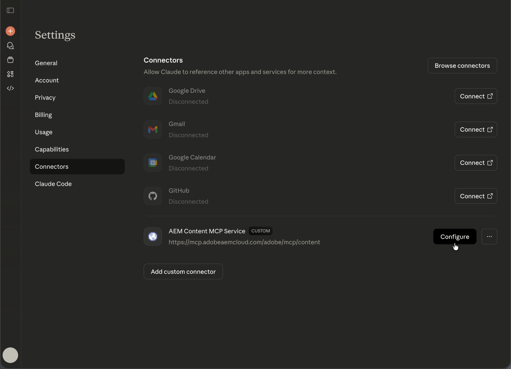

# Anthropic Claude instellen met AEM MCP {#setup-claude}

Voer de volgende stappen uit om Anthropic Claude te verbinden met AEM MCP-servers.

* Registreer een of meer AEM MCP server-URL&#39;s in de MCP-configuratie van Claude.
* Voltooi de Adobe-aanmeldstroom.
* Schakel desgewenst automatische bevestiging in voor bepaalde gereedschappen in het configuratiegebied. Deze optie wordt aanbevolen voor zoek- of alleen-lezen bewerkingen.
* Zorg ervoor dat de server MCP alvorens uw gesprek te beginnen wordt geselecteerd.
* Vraag Claude om AEM-gerelateerde taken uit te voeren. Claude selecteert de Hulpmiddelen van AEM die door de server MCP op uw herinnering worden blootgesteld.

