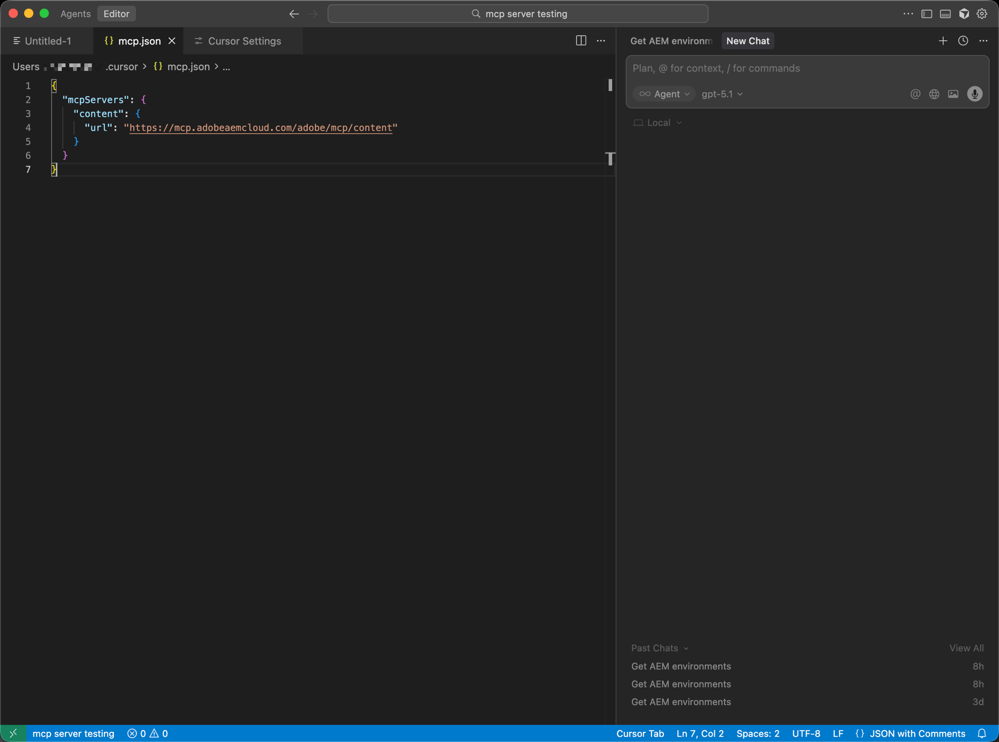

# Cursor instellen met AEM MCP {#setup-cursor}

Voer de volgende stappen uit om de cursor te verbinden met AEM MCP-servers.

* Maak in de MCP-instellingen van de cursor een nieuw MCP-serveritem met een of meer AEM MCP-URL&#39;s.
* Verifieer bij de vraag met uw Adobe ID.
* U kunt desgewenst afzonderlijke gereedschappen in- of uitschakelen door op de naam van het gereedschap te klikken. Alle gereedschappen zijn standaard ingeschakeld.
* Gebruik de cursoreditor of -chat om AEM Tools aan te roepen als onderdeel van ontwikkelings- of inhoudsworkflows.

