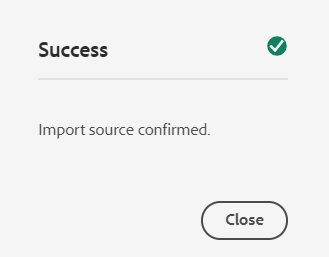

# Digitale elementen toevoegen aan [!DNL Adobe Experience Manager] als een [!DNL Cloud Service] [!DNL Assets] {#add-assets-to-experience-manager}

[!DNL Adobe Experience Manager Assets] accepteert veel typen digitale elementen van vele bronnen. Het slaat de binaire getallen en gemaakte uitvoeringen op, kan de verwerking van elementen uitvoeren met behulp van verschillende werkstromen en [!DNL Adobe AI] -services, waardoor distributie via vele kanalen over vele oppervlakken mogelijk is.

[!DNL Adobe Experience Manager] verrijkt de binaire inhoud van de geüploade digitale bestanden met rijke metagegevens, slimme tags, uitvoeringen en andere DAM-services (Digital Asset Management). U kunt verschillende bestandstypen uploaden van uw lokale map of een netwerkstation naar [!DNL Experience Manager Assets], zoals afbeeldingen, documenten en Raw-afbeeldingsbestanden.

Naast het meest gebruikte uploaden naar de browser bestaan er andere methoden om elementen aan de [!DNL Experience Manager] -opslagplaats toe te voegen. Tot deze andere methoden behoren desktopclients, zoals Adobe Asset Link of de [!DNL Experience Manager] desktop-app, het uploaden en insluiten van scripts die klanten zouden maken, en geautomatiseerde innamesintegraties die als [!DNL Experience Manager] -extensies worden toegevoegd.

Hoewel u elk binair bestand in [!DNL Experience Manager] kunt uploaden en beheren, bieden de meest gebruikte bestandsindelingen ondersteuning voor aanvullende services, zoals het ophalen van metagegevens of het genereren van voorvertoningen. Zie [&#x200B; gesteunde dossierformaten &#x200B;](file-format-support.md) voor details.

Ook kunt u ervoor kiezen om extra verwerkingen uit te voeren voor de geüploade elementen. Verschillende profielen voor middelenverwerking kunnen worden geconfigureerd in de map waarin elementen worden geüpload om specifieke metagegevens, uitvoeringen of services voor beeldverwerking toe te voegen. Zie [&#x200B; procesactiva wanneer geupload &#x200B;](#process-when-uploaded).

[!DNL Assets] biedt de volgende uploadmethoden. Adobe raadt u aan om uw gebruiksscenario en toepasselijkheid van een uploadoptie te begrijpen voordat u deze gebruikt.

| Upload, methode | Wanneer gebruiken? | Primaire persoon |
|---------------------|----------------|-----------------|
| [&#x200B; de gebruikersinterface van de Console van Assets &#x200B;](#upload-assets) | Soms uploaden, indrukken en slepen, zoeken naar uploaden. Gebruik deze optie niet om veel elementen te uploaden. | Alle gebruikers |
| [&#x200B; uploadt API &#x200B;](#upload-using-apis) | Voor dynamische beslissingen tijdens het uploaden. | Developer |
| [[!DNL Experience Manager]  Desktop app &#x200B;](https://experienceleague.adobe.com/docs/experience-manager-desktop-app/using/using.html) | Lage hoeveelheden asset opnemen, maar niet voor migratie. | Beheerder, Marketer |
| [[!DNL Adobe Asset Link]](https://helpx.adobe.com/enterprise/using/adobe-asset-link.html) | Dit is handig wanneer creatieve en marketingmedewerkers hun middelen gebruiken vanuit de ondersteunde [!DNL Creative Cloud] -bureaubladapps. | Creative, Marketer |
| [&#x200B; bulkingestor van Activa &#x200B;](#asset-bulk-ingestor) | Aanbevolen voor grootschalige migraties en incidentele bulkopname. Alleen voor ondersteunde datastores. | Beheerder, ontwikkelaar |

## Elementen uploaden {#upload-assets}

<!-- #ENGCHECK do we support pausing? I couldn't get pause to show with 1.5GB upload.... If not, this should be removed#

   You can pause the uploading of large assets (greater than 500 MB) and resume it later from the same page. Select the **[!UICONTROL Pause]** icon beside progress bar that appears when an upload starts.

   The size above which an asset is considered a large asset is configurable. For example, you can configure the system to consider assets above 1000 MB (instead of 500 MB) as large assets. In this case, **[!UICONTROL Pause]** appears on the progress bar when assets of size greater than 1000 MB are uploaded.

   The [!UICONTROL Pause] option does not show if a file greater than 1000 MB is uploaded with a file less than 1000 MB. However, if you cancel the less than 1000 MB file upload, the **[!UICONTROL Pause]** option appears.

   To modify the size limit, configure the `chunkUploadMinFileSize` property of the `fileupload` node in the CRX repository.

   When you click the **[!UICONTROL Pause]** icon, it toggles to a **[!UICONTROL Play]** icon. To resume uploading, click **[!UICONTROL Play]** option.
-->

<!-- #ENGCHECK do we support pausing? I couldn't get pause to show with 1.5GB upload.... If not, this should be removed#
   The ability to resume uploading is especially helpful in low-bandwidth scenarios and network glitches, where it takes a long time to upload a large asset. You can pause the upload operation and continue later when the situation improves. When you resume, uploading starts from the point where you paused it.
-->

<!-- #ENGCHECK assuming this is not relevant? remove after confirming#
   During the upload operation, [!DNL Experience Manager] saves the portions of the asset being uploaded as chunks of data in the CRX repository. When the upload completes, [!DNL Experience Manager] consolidates these chunks into a single block of data in the repository.

   To configure the cleanup task for the unfinished chunk upload jobs, go to `https://[aem_server]:[port]/system/console/configMgr/org.apache.sling.servlets.post.impl.helper.ChunkCleanUpTask`.
-->

Als u een bestand (of meerdere bestanden) wilt uploaden, kunt u de bestanden op uw bureaublad selecteren en in de gebruikersinterface (webbrowser) naar de doelmap slepen. U kunt het uploaden ook starten vanuit de gebruikersinterface.

>[!IMPORTANT]
>
>Assets dat u uploadt naar Experience Manager en een bestandsnaam van meer dan 100 tekens heeft een verkorte naam wanneer deze worden gebruikt in Dynamic Media.
>
>De eerste 100 tekens in de bestandsnaam worden als volgt gebruikt. De resterende tekens worden vervangen door een alfanumerieke tekenreeks. Deze methode voor het wijzigen van de naam zorgt voor een unieke naam wanneer het element wordt gebruikt in Dynamic Media. Het is ook bedoeld om de maximale lengte van elementbestanden die is toegestaan in Dynamic Media, te gebruiken.


1. Navigeer in de gebruikersinterface van [!DNL Assets] naar de locatie waar u digitale elementen wilt toevoegen.
1. Voer een van de volgende handelingen uit om de elementen te uploaden:

   * Klik op **[!UICONTROL Create]** > **[!UICONTROL Files]** op de werkbalk. U kunt de naam van het bestand desgewenst wijzigen in het dialoogvenster dat verschijnt.
   * In een browser die HTML5 ondersteunt, sleept u de elementen rechtstreeks naar de gebruikersinterface van [!DNL Assets] . Het dialoogvenster voor het wijzigen van de naam van het bestand wordt niet weergegeven.

   

   Als u meerdere bestanden wilt selecteren, selecteert u de toets `Ctrl` of `Command` en selecteert u de elementen in het dialoogvenster Bestandenkiezer. Als u een iPad gebruikt, kunt u slechts één bestand tegelijk selecteren.

1. Als u een actieve upload wilt annuleren, klikt u op Sluiten (`X`) naast de voortgangsbalk. Wanneer u het uploaden annuleert, verwijdert [!DNL Assets] het gedeeltelijk geüploade gedeelte van het element.
Als u een upload annuleert voordat de bestanden zijn geüpload, stopt [!DNL Assets] met het uploaden van het huidige bestand en wordt de inhoud vernieuwd. Bestanden die al zijn geüpload, worden echter niet verwijderd.

1. Het dialoogvenster voor uploadvoortgang in [!DNL Assets] geeft het aantal bestanden weer dat is geüpload en de bestanden die niet zijn geüpload.
Daarnaast wordt in de gebruikersinterface van [!DNL Assets] het element weergegeven dat u het laatst hebt geüpload of de map die u het eerst hebt gemaakt.

>[!NOTE]
>
>Om genestelde omslaghiërarchieën te uploaden, zie [&#x200B; bulkupload activa &#x200B;](#bulk-upload).

<!-- #ENGCHECK I'm assuming this is no longer relevant.... If yes, this should be removed#

### Serial uploads {#serialuploads}

Uploading numerous assets in bulk consumes significant I/O resources, which may adversely impact the performance of [!DNL Assets]. In particular, if you have a slow internet connection, the time to upload drastically increases due to a spike in disk I/O. Moreover, your web browser may introduce additional restrictions to the number of POST requests [!DNL Assets] can handle for concurrent asset uploads. As a result, the upload operation fails or terminate prematurely. In other words, [!DNL Assets] may miss some files while ingesting a bunch of files or altogether fail to ingest any file.

To overcome this situation, [!DNL Assets] ingests one asset at a time (serial upload) during a bulk upload operation, instead of the concurrently ingesting all the assets.

Serial uploading of assets is enabled by default. To disable the feature and allow concurrent uploading, overlay the `fileupload` node in CRX-DE and set the value of the `parallelUploads` property to `true`.

### Streamed uploads {#streamed-uploads}

If you upload many assets to [!DNL Experience Manager], the I/O requests to server increase drastically, which reduces the upload efficiency and can even cause some upload task to time out. [!DNL Assets] supports streamed uploading of assets. Streamed uploading reduces the disk I/O during the upload operation by avoiding asset storage in a temporary folder on the server before copying it to the repository. Instead, the data is transferred directly to the repository. This way, the time to upload large assets and the possibility of timeouts is reduced. Streamed upload is enabled by default in [!DNL Assets].

>[!NOTE]
>
>Streaming upload is disabled for [!DNL Experience Manager] running on JEE server with servlet-api version lower than 3.1.
-->

### Uploads voor bestaande elementen verwerken {#handling-upload-existing-file}

U kunt een element uploaden met hetzelfde pad (dezelfde naam en dezelfde locatie) als een bestaand element. Er wordt echter een waarschuwingsvenster weergegeven met de volgende opties:

* Bestaande element vervangen: als u een bestaand element vervangt, worden de metagegevens voor het element en eventuele eerdere wijzigingen (bijvoorbeeld annotaties en bijsnijden) die u in het bestaande element hebt aangebracht, verwijderd.

  >[!NOTE]
  >
  >De optie om elementen te vervangen is niet beschikbaar als het element is vergrendeld of uitgecheckt.

* Een andere versie maken: er wordt een nieuwe versie van het bestaande element gemaakt in de repository. U kunt de twee versies weergeven in de [!UICONTROL Timeline] en desgewenst terugkeren naar de vorige bestaande versie.
* Beide houden: als u beide elementen wilt behouden, wordt de naam van het nieuwe element gewijzigd.

Als u het gedupliceerde element wilt behouden in [!DNL Assets] , klikt u op **[!UICONTROL Keep]** . Als u het geüploade dubbele element wilt verwijderen, klikt u op **[!UICONTROL Delete]** .

### Bestandsnaamverwerking en verboden tekens {#filename-handling}

[!DNL Experience Manager Assets] voorkomt dat u elementen uploadt met de verboden tekens in de bestandsnaam. Als u een element probeert te uploaden met bestandsnamen die een niet-toegestaan teken of meer bevatten, geeft [!DNL Assets] een waarschuwingsbericht weer en wordt het uploaden gestopt totdat u deze tekens verwijdert of uploadt met een toegestane naam.

In het dialoogvenster [!UICONTROL Upload Assets] kunt u lange namen opgeven voor de bestanden die u uploadt, zodat u de specifieke conventies voor het benoemen van bestanden voor uw organisatie kunt gebruiken. De volgende tekens (lijst met door spaties gescheiden tekens) worden niet ondersteund:

* Ongeldige tekens voor elementnaam: `* / : [ \\ ] | # % { } ? &` of `;=` (een puntkomma gevolgd door een gelijkteken)
* Ongeldige tekens voor naam van elementmap: `* / : [ \\ ] | # % { } ? \" . ^ ; + & \t`

Voorbeelden van ongeldige bestandsnamen:

* `JPG_JD_small file ~!)$@;(-_=+^',..jpg`
* `JPG_JD_small file ~!)$@;=(-_+^',..jpg`

## Bulkupload-elementen {#bulk-upload}

De grote leverancier van bedrijfsmiddelen kan veel bedrijfsmiddelen efficiënt verwerken. Een grootschalige inname is echter niet alleen een grote bestandsstortplaats of een tijdelijke migratie. Voor een grootschalig project om een zinvol project te zijn dat uw bedrijfsdoel dient en efficiënt is, plant de migratie en leidt de middelenorganisatie. Alle ingesties zijn verschillend zo in plaats van generaliserend, factor in de genuanceerde bewaarplaats samenstelling en bedrijfsbehoeften. Hieronder volgen enkele overkoepelende suggesties voor het plannen en uitvoeren van bulkopname:

* Curate-elementen: verwijder elementen die niet nodig zijn in de DAM. Overweeg ongebruikte, verouderde of dubbele elementen te verwijderen. Dergelijke huishouden vermindert de overgedragen gegevens en opgenomen activa die tot snellere inname leiden.
* Elementen ordenen: u kunt de inhoud in een logische volgorde ordenen, bijvoorbeeld op bestandsgrootte, bestandsindeling, gebruik van hoofdletters en kleine letters of prioriteit. Over het algemeen is voor grote complexe bestanden meer verwerking nodig. U kunt ook overwegen grote bestanden afzonderlijk in te voegen met de filteroptie voor bestandsgrootte (hieronder beschreven).
* Staggeringestie: Overweeg uw inname op te delen in meerdere bulkinname-projecten. Met q kunt u de inhoud sneller zien en zonodig uw opname bijwerken. U kunt bijvoorbeeld verwerkingsintensieve elementen opnemen tijdens niet-piekuren of geleidelijk in meerdere stukken. U kunt echter kleinere en eenvoudigere elementen invoeren die niet veel verwerkingstijd in één keer vereisen.

Als u een groter aantal bestanden wilt uploaden, gebruikt u een van de volgende methoden. Ook, zie de [&#x200B; gebruiksgevallen en methodes &#x200B;](#upload-methods-comparison)

* [&#x200B; Activa uploadt APIs &#x200B;](developer-reference-material-apis.md#asset-upload): Gebruik een douane uploadt manuscript of een hulpmiddel dat APIs gebruikt om extra behandeling van activa (bijvoorbeeld, vertaal meta-gegevens of anders noem dossiers) toe te voegen, indien nodig.
* [[!DNL Experience Manager]  Desktop app &#x200B;](https://experienceleague.adobe.com/docs/experience-manager-desktop-app/using/using.html): Nuttig voor creatieve beroeps en marketers die activa van hun lokaal dossiersysteem uploaden. Gebruik deze optie om geneste mappen te uploaden die lokaal beschikbaar zijn.
* [&#x200B; Bulk ingestition hulpmiddel &#x200B;](#asset-bulk-ingestor): Gebruik voor opname van grote hoeveelheden activa of nu en aanvankelijk wanneer het opstellen [!DNL Experience Manager].

### Gereedschap Asset Bulk importeren {#asset-bulk-ingestor}

Het hulpmiddel wordt verstrekt slechts aan de groep van beheerders voor grootschalige opname van activa van datastores Azure of S3 te gebruiken. Bekijk een videodemo van de configuratie en opname.

>[!VIDEO](https://video.tv.adobe.com/v/329680/?quality=12&learn=on)

De volgende afbeelding illustreert de verschillende fasen wanneer u elementen vanuit een gegevensopslagruimte in Experience Manager invoert:


**Eerste vereisten**

Voor het gebruik van deze functie is een externe opslagaccount of emmer uit Azure of AWS vereist.

>[!NOTE]
>
>Maak de container of het emmertje van de opslagaccount als privé en accepteer alleen verbindingen van geoorloofde verzoeken. Aanvullende beperkingen op ingangsnetwerkverbindingen worden echter niet ondersteund.

>[!NOTE]
>
>Externe opslagaccounts kunnen andere naamregels voor bestanden/mappen hebben dan het gereedschap Bulk importeren. Zie [&#x200B; Behandelend filenames tijdens bulkinvoer &#x200B;](#filename-handling-bulkimport) voor meer details op niet toegelaten/ontsnapte namen.


### Het gereedschap Bulkimport configureren {#configure-bulk-ingestor-tool}

Voer de volgende stappen uit om het gereedschap Bulk importeren te configureren:

1. Ga naar **[!UICONTROL Tools]** > **[!UICONTROL Assets]** > **[!UICONTROL Bulk Import]**. Selecteer de optie **[!UICONTROL Create]** .

1. Geef een titel op voor de configuratie voor bulkimport in het veld **[!UICONTROL Title]** .

1. Selecteer het type gegevensbron in de vervolgkeuzelijst **[!UICONTROL Import Source]** .

1. Geef de waarden op om een verbinding met de gegevensbron te maken. Bijvoorbeeld, als u **de Opslag van Azure Blob** als gegevensbron selecteert, specificeer de waarden voor de opslagrekening van Azure, de container van Azure blob, en de toegangssleutel van Azure.

1. Selecteer de vereiste authentificatiemodus van de drop-down lijst. **Sleutel van de Toegang van Azure** verleent volledige toegang tot de de opslagrekening van Azure, terwijl **het Symbolische Symbolische Symbolische van Azure** de beheerder toestaat om de mogelijkheden van het token te beperken gebruikend toestemmingen en vervalsingsbeleid.

1. Geef de naam op van de hoofdmap die elementen bevat in de gegevensbron in het veld **[!UICONTROL Source Folder]** .

1. (Optioneel) Geef de minimale bestandsgrootte van elementen op in MB om ze op te nemen in het innameproces in het veld **[!UICONTROL Filter by Min Size]** .

1. (Optioneel) Geef de maximale bestandsgrootte van elementen op in MB om ze op te nemen in het innameproces in het veld **[!UICONTROL Filter by Max Size]** .

1. (Optioneel) Geef een door komma&#39;s gescheiden lijst op met MIME-typen die u wilt uitsluiten van de opname in het veld **[!UICONTROL Exclude MIME Types]** . Bijvoorbeeld `image/jpeg, image/.*, video/mp4` . Zie [&#x200B; alle gesteunde dossierformaten &#x200B;](/help/assets/file-format-support.md).

1. Geef een door komma&#39;s gescheiden lijst op met MIME-typen die u wilt opnemen van de opname in het veld **[!UICONTROL Include MIME Types]** . Zie [&#x200B; alle gesteunde dossierformaten &#x200B;](/help/assets/file-format-support.md).

1. Selecteer de optie **[!UICONTROL Delete source file after import]** om de oorspronkelijke bestanden uit de brongegevensopslag te verwijderen nadat de bestanden zijn geïmporteerd in [!DNL Experience Manager] .

1. Selecteer de **[!UICONTROL Import Mode]** . Selecteer **Overslaan**, **vervangen**, of **creeer Versie**. De modus Overslaan is de standaardinstelling en in deze modus slaat de functie Instantor over om een element te importeren als dit al bestaat. Zie de betekenis van [&#x200B; vervangen en creeer versieopties &#x200B;](#handling-upload-existing-file).

1. Als u een locatie in DAM wilt definiëren waar elementen moeten worden geïmporteerd met het veld **[!UICONTROL Assets Target Folder]** , geeft u een pad op. Bijvoorbeeld `/content/dam/imported_assets` .

1. (Optioneel) Geef het metagegevensbestand op dat u wilt importeren, in CSV-indeling, in het veld **[!UICONTROL Metadata File]** . Geef het CSV-bestand op de locatie van het bronblob en raadpleeg het pad tijdens het configureren van het gereedschap Bulk importeren. Het CSV- dossierformaat dat op dit gebied van verwijzingen wordt voorzien is het zelfde als het Csv- dossierformaat wanneer u [&#x200B; activa meta-gegevens van de Invoer en van de uitvoer in bulk &#x200B;](https://experienceleague.adobe.com/docs/experience-manager-cloud-service/content/assets/admin/metadata-import-export.html). Als u het **Bron dossier van de Schrapping na de invoer** optie selecteert, filterCSV- dossiers of gebruikend **uitsluiten** of **omvatten MIME Type** of **Filter door Weg/Dossier** gebieden. U kunt een reguliere expressie gebruiken om CSV-bestanden in deze velden te filteren.

1. Klik op **[!UICONTROL Save]** om de configuratie op te slaan.

### De configuratie van het gereedschap Bulkimport beheren {#manage-bulk-import-configuration}

Nadat u de configuratie van het gereedschap Bulk importeren hebt gemaakt, kunt u taken uitvoeren om de configuratie te evalueren voordat elementen in bulk worden toegevoegd aan uw Experience Manager-instantie. Als u de beschikbare opties voor het beheer van de configuratie van het gereedschap Bulk importeren wilt weergeven, selecteert u de configuratie die beschikbaar is op **[!UICONTROL Tools]** > **[!UICONTROL Assets]** > **[!UICONTROL Bulk Import]** .

### De configuratie bewerken {#edit-configuration}

Als u de configuratiedetails wilt bewerken, selecteert u de configuratie en klikt u op **[!UICONTROL Edit]** . U kunt de titel van de configuratie en de gegevensbron van het voer niet uitgeven terwijl het uitvoeren van geeft verrichting uit.

### De configuratie verwijderen {#delete-configuration}

Selecteer de configuratie en klik op **[!UICONTROL Delete]** om de configuratie Bulk Import te verwijderen.

### Verbinding met gegevensbron valideren {#validate-connection}

Als u de verbinding met de gegevensbron wilt valideren, selecteert u de configuratie en klikt u op **[!UICONTROL check]** . Als de verbinding tot stand is gebracht, geeft Experience Manager het volgende bericht weer:



### Een testrun aanroepen voor de Bulk Import-taak {#invoke-test-run-bulk-import}

Selecteer de configuratie en klik **[!UICONTROL Dry Run]** om een testrun voor de Bulk-importtaak aan te roepen. Experience Manager geeft de volgende gegevens weer over de Bulk Import-taak:


### Bestandsnamen verwerken tijdens bulkimport {#filename-handling-bulkimport}

Wanneer u elementen of mappen bulksgewijs importeert, importeert [!DNL Experience Manager Assets] de volledige structuur van wat er in de importbron bestaat. [!DNL Experience Manager] volgt de ingebouwde regels voor speciale tekens in de naam van het element en de map. Deze bestandsnamen moeten daarom worden ontsmet. Voor zowel de mapnaam als de elementnaam blijft de door de gebruiker gedefinieerde titel ongewijzigd en wordt deze opgeslagen in `jcr:title` .

Tijdens het bulkimporteren zoekt [!DNL Experience Manager] naar de bestaande mappen om te voorkomen dat de elementen en mappen opnieuw worden geïmporteerd en controleert het tevens de ontsmettingsregels die zijn toegepast in de bovenliggende map waar het importeren plaatsvindt. Als de ontsmettingsregels worden toegepast in de bovenliggende map, worden dezelfde regels toegepast op de importbron. Voor nieuwe importbewerkingen worden de volgende ontsmettingsregels toegepast om de bestandsnamen van elementen en mappen te beheren.

**Geweigerde namen in bulkinvoer**

De volgende tekens zijn niet toegestaan in bestands- en mapnamen:

* Besturings- en privé-gebruik (0x00 tot 0x1F, \u0081, \uE000)
* Bestands- of mapnamen die eindigen met een punt (.)

Bestanden of mappen met namen die aan deze voorwaarden voldoen, worden tijdens het importproces overgeslagen en gemarkeerd als mislukt.

**Behandelend activa naam in bulkinvoer**

Voor namen van elementbestanden worden de naam en het pad van de JCR gesimuleerd met behulp van de API: `JcrUtil.escapeIllegalJcrChars` .

* Unicode-tekens worden niet gewijzigd
* Vervang de speciale tekens door hun URL Escape-code. `new%asset.png` wordt bijvoorbeeld bijgewerkt naar `new%25asset.png` :

  ```
                  URL escape code   
  
  "               %22
  %               %25
  '               %27
  *               %2A
  /               %2F
  :               %3A
  [               %5B
  \n              %0A
  \r              %0D
  \t              %09
  ]               %5D
  |               %7C
  ```

**Behandelende omslagnaam in bulkinvoer**

Voor mapbestandsnamen worden de naam en het pad van de JCR ontsmet met de API: `DamUtil.getSanitizedFolderName` .

* Hoofdletters worden omgezet in kleine letters
* Unicode-tekens worden niet gewijzigd
* Vervang de speciale tekens door een streepje (&#39;-&#39;). `new folder` wordt bijvoorbeeld bijgewerkt naar `new-folder` :

  ```
  "                           
  #                         
  %                           
  &                          
  *                           
  +                          
  .                           
  :                           
  ;                          
  ?                          
  [                           
  ]                           
  ^                         
  {                         
  }                         
  |                           
  /         It is used for split folder in cloud storage and is pre-handled, no conversion here.
  \         Not allowed in Azure, allowed in AWS.
  \t
  space     It is the space character.
  ```

<!-- 
[!DNL Experience Manager Assets] manages the forbidden characters in the filenames while you upload assets or folders. [!DNL Experience Manager] updates only the node names in the DAM repository. However, the `title` of the asset or folder remains unchanged.

Following are the file naming conventions that are applied while uploading assets or folders in [!DNL Experience Manager Assets]:

| Characters &Dagger; | When occurring in file names | When occurring in folder names | Example |
|---|---|---|---|
| `. / : [ ] | *` | Replaced with `-` (hyphen). | Replaced with `-` (hyphen). A `.` (dot) in the filename extension is retained as is. | Replaced with `-` (hyphen). | `myimage.jpg` remains as is and `my.image.jpg` changes to `my-image.jpg`. |
| `% ; # , + ? ^ { } "` and whitespaces | Whitespaces are retained | Replaced with `-` (hyphen). | `My Folder.` changes to `my-folder-`. |
| `# % { } ? & .` | Replaced with `-` (hyphen). | NA. | `#My New File.` changes to `-My New File-`. |
| Uppercase characters | Casing is retained as is. | Changed to lowercase characters. | `My New Folder` changes to `my-new-folder`. |
| Lppercase characters | Casing is retained as is. | Casing is retained as is. | NA. |

&Dagger; The list of characters is a whitespace-separated list.
-->

#### Eenmalige of terugkerende bulkimport plannen {#schedule-bulk-import}

Voer de volgende stappen uit om een eenmalige of terugkerende bulkimport te plannen:

1. Maak een configuratie voor bulkimport.
1. Selecteer de configuratie en selecteer **[!UICONTROL Schedule]** op de werkbalk.
1. Stel een eenmalige opname in of voer een uur-, dag- of wekelijks schema in. Klik op **[!UICONTROL Submit]**.

   


#### De Assets-doelmap weergeven {#view-assets-target-folder}

Als u de Assets-doellocatie wilt weergeven waar de elementen worden geïmporteerd nadat de Bulk Import-taak is uitgevoerd, selecteert u de configuratie en klikt u op **[!UICONTROL View Assets]** .

#### Het gereedschap Bulkimport uitvoeren {#run-bulk-import-tool}

Na [&#x200B; het vormen van het Bulk hulpmiddel van de Invoer &#x200B;](#configure-bulk-ingestor-tool) en naar keuze [&#x200B; het beheren van het Bulk het hulpmiddelconfiguratie van de Invoer &#x200B;](#manage-bulk-import-configuration), kunt u de configuratietaak in werking stellen om bulkopname van activa te beginnen.

Om het Bulk proces van de Invoer te beginnen, navigeer aan **[!UICONTROL Tools]** > **[!UICONTROL Assets]** > **[!UICONTROL Bulk Import]**, selecteer de [&#x200B; Bulk configuratie van de Invoer &#x200B;](#configure-bulk-ingestor-tool), en klik dan **[!UICONTROL Run]**. Klik nogmaals op **[!UICONTROL Run]** om te bevestigen.

Experience Manager werkt het statuut van de baan aan **Verwerking** bij en aan **succesvol** op succesvolle voltooiing van de baan. Om de ingevoerde activa in Experience Manager te bekijken, klik **Mening Assets**.

Wanneer de baan lopend is, kunt u de configuratie ook selecteren en **Einde** klikken om het bulksgewijs innameproces tegen te houden. Klik **Looppas** opnieuw om het proces te hervatten. U kunt **de Looppas van de Droog** ook klikken om de details van de activa te kennen die nog invoeren in afwachting zijn.

#### Taken beheren na uitvoering {#manage-jobs-after-execution}

Met Experience Manager kunt u de geschiedenis van de bulkimporttaken bekijken. De taakgeschiedenis bestaat uit de status van de taak, de maker van de taak, de logbestanden, samen met andere gegevens zoals de begindatum en -tijd, de datum en tijd en de einddatum en -tijd.

Als u de taakgeschiedenis voor een configuratie wilt openen, selecteert u de configuratie en klikt u op **[!UICONTROL Job History]** . Selecteer een baan en klik **Open**.


Experience Manager geeft de taakgeschiedenis weer. Op de Bulk de pagina van de de baangeschiedenis van de Invoer, kunt u **Schrapping** ook klikken om die baan voor de Bulk configuratie van de Invoer te schrappen.


## Elementen uploaden met desktopclients {#upload-assets-desktop-clients}

Naast de gebruikersinterface van de webbrowser ondersteunt [!DNL Experience Manager] ook andere clients op het bureaublad. Ze bieden ook uploadervaring zonder dat u naar de webbrowser hoeft te gaan.

* [[!DNL Adobe Asset Link] &#x200B;](https://helpx.adobe.com/enterprise/using/adobe-asset-link.html) biedt toegang tot elementen van [!DNL Experience Manager] in Adobe Photoshop-, Adobe Illustrator- en Adobe InDesign-bureaubladtoepassingen. U kunt het momenteel geopende document rechtstreeks vanuit de gebruikersinterface van Adobe Asset Link uploaden naar [!DNL Experience Manager] vanuit deze bureaubladtoepassingen.
* [[!DNL Experience Manager]  Desktop app &#x200B;](https://experienceleague.adobe.com/docs/experience-manager-desktop-app/using/using.html) vereenvoudigt het werken met activa op Desktop, onafhankelijk op hun dossiertype of inheemse toepassing die hen behandelt. Het is handig om bestanden in geneste maphiërarchieën vanuit uw lokale bestandssysteem te uploaden, omdat het uploaden van de browser alleen het uploaden van platte bestandslijsten ondersteunt.

## Elementen verwerken bij het uploaden {#process-when-uploaded}

Als u de geüploade elementen extra wilt verwerken, kunt u verwerkingsprofielen toepassen op de uploadmappen. De profielen zijn beschikbaar op de pagina **[!UICONTROL Properties]** van een map in [!DNL Assets] . Een digitaal element zonder extensie of met een onjuiste extensie wordt niet naar wens verwerkt. Wanneer u dergelijke elementen uploadt, gebeurt er bijvoorbeeld niets of wordt een onjuist verwerkingsprofiel toegepast op het element. Gebruikers kunnen de binaire bestanden nog steeds opslaan in de DAM.


De volgende tabbladen zijn beschikbaar:

* {de profielen van Meta-gegevens 0} [&#x200B; laten u standaardmeta-gegevenseigenschappen op activa toepassen die in die omslag worden geupload.](metadata-profiles.md)
* [&#x200B; de profielen van de Verwerking &#x200B;](asset-microservices-configure-and-use.md) laten u meer vertoningen produceren dan door gebrek mogelijk zijn.

Als [!DNL Dynamic Media] is ingeschakeld op uw implementatie, zijn ook de volgende tabbladen beschikbaar:

* [[!DNL Dynamic Media]  de profielen van het Beeld &#x200B;](dynamic-media/image-profiles.md) laten u specifieke het bebouwen (**[!UICONTROL Smart Cropping]** en pixel het bebouwen) en het scherpen configuratie op de geuploade activa toepassen.
* [[!DNL Dynamic Media]  Videoprofielen &#x200B;](dynamic-media/video-profiles.md) laten u specifieke video coderende profielen (resolutie, formaat, parameters) toepassen.

>[!NOTE]
>
>[!DNL Dynamic Media] uitsnijden en andere bewerkingen op elementen zijn niet-destructief, dat wil zeggen dat de bewerkingen het geüploade origineel niet wijzigen. In plaats daarvan biedt het parameters voor uitsnijden of transformeren bij het leveren van de elementen.

Voor mappen waaraan een verwerkingsprofiel is toegewezen, wordt de profielnaam weergegeven op de miniatuur in de kaartweergave. In de lijstweergave wordt de profielnaam weergegeven in de kolom **[!UICONTROL Processing Profile]** .

## Elementen uploaden of toevoegen met API&#39;s {#upload-using-apis}

De technische details van uploaden APIs en het protocol, en de verbindingen met open-source SDK en steekproefcliënten worden verstrekt in [&#x200B; activa uploadt &#x200B;](developer-reference-material-apis.md#asset-upload) sectie van de ontwikkelaarsverwijzing.

## Tips, aanbevolen procedures en beperkingen {#tips-limitations}

* Directe binaire upload is een nieuwe methode om activa te uploaden. Deze wordt standaard ondersteund door de productmogelijkheden en clients, zoals de [!DNL Experience Manager] gebruikersinterface [!DNL Adobe Asset Link] en de [!DNL Experience Manager] desktop-app. Om het even welke douanecode die door klanten technische teams wordt aangepast of uitgebreid moet nieuwe uploaden APIs en protocollen gebruiken.

* [!DNL Experience Manager Assets] ondersteunt nu mappen met een groot aantal onderliggende elementen. Als een map meer dan 1000 directe onderliggende items bevat (elementen of submappen), gebruikt de interface van Beheer een asynchroon bijgewerkte index om de inhoud van de map weer te geven. Als dusdanig, zou er een korte vertraging in de zichtbaarheid van pas gecreëerde omslagen en activa (over het algemeen slechts een paar seconden) kunnen zijn en wanneer het openen van zulk een omslag in de Mening Admin, wordt een banner getoond om eind - gebruikers van dit gedrag op de hoogte te brengen, verklarend het volgende: &quot;Deze folder bevat 1000+ punten. Uploads en nieuwe omslagverwezenlijking kunnen worden vertraagd.&quot;

* Wanneer u **[!UICONTROL Replace]** selecteert in het dialoogvenster [!UICONTROL Name Conflict] , wordt de element-id opnieuw gegenereerd voor het nieuwe element. Deze id verschilt van de id van het vorige element. Als [&#x200B; de Inzichten van Assets &#x200B;](/help/assets/assets-insights.md) wordt toegelaten om beelden te volgen of met [!DNL Adobe Analytics] te klikken, maakt opnieuw geproduceerde activa identiteitskaart de gegeven-gevangen voor de activa op [!DNL Analytics] ongeldig.

* Sommige uploadmethodes houden u niet tegen het uploaden van activa met [&#x200B; verboden karakters &#x200B;](#filename-handling) in filenames. De tekens worden vervangen door het symbool `-` .

* Het uploaden van elementen via de browser ondersteunt alleen platte bestandslijsten en geen geneste maphiërarchieën. Om alle activa binnen genestelde omslag te uploaden, overweeg gebruikend [&#x200B; Desktop app &#x200B;](#upload-assets-desktop-clients).

* Met de methode Bulk importeren wordt de volledige mapstructuur geïmporteerd zoals deze op de gegevensbron bestaat. In [!DNL Experience Manager] worden echter alleen de niet-lege mappen gemaakt.


<!-- TBD: Link to file name handling in DA docs when it is documented. 
-->

**zie ook**

* [Assets vertalen](translate-assets.md)
* [ASSETS HTTP API](mac-api-assets.md)
* [Door Assets ondersteunde bestandsindelingen](file-format-support.md)
* [Zoeken in middelen](search-assets.md)
* [Verbonden elementen](use-assets-across-connected-assets-instances.md)
* [Elementen rapporteren](asset-reports.md)
* [Metagegevensschema&#39;s](metadata-schemas.md)
* [Elementen downloaden](download-assets-from-aem.md)
* [Metagegevens beheren](manage-metadata.md)
* [Zoeken in facetten](search-facets.md)
* [Verzamelingen beheren](manage-collections.md)
* [Bulkmetagegevens importeren](metadata-import-export.md)
* [Assets publiceren naar AEM en Dynamic Media](/help/assets/publish-assets-to-aem-and-dm.md)

>[!MORELIKETHIS]
>
>* [[!DNL Adobe Experience Manager]  Desktop app &#x200B;](https://experienceleague.adobe.com/docs/experience-manager-desktop-app/using/introduction.html)
>* [&#x200B; Ongeveer  [!DNL Adobe Asset Link] &#x200B;](https://www.adobe.com/creativecloud/business/enterprise/adobe-asset-link.html)
>* [[!DNL Adobe Asset Link]  documentatie &#x200B;](https://helpx.adobe.com/enterprise/using/adobe-asset-link.html)
>* [&#x200B; Technische verwijzing voor activa uploadt &#x200B;](developer-reference-material-apis.md#asset-upload)
