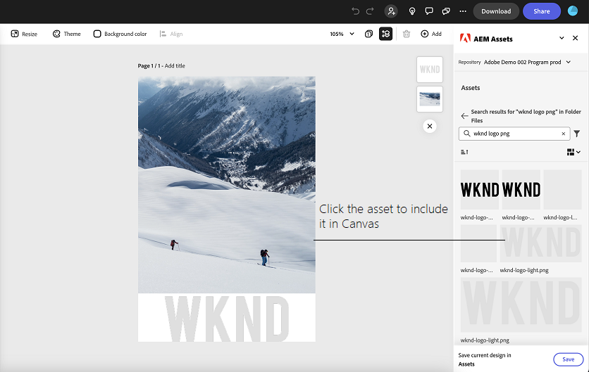

# AEM Assets-invoegtoepassing voor Adobe Express {#assets-addon-adobe-express}

Met de invoegtoepassing AEM Assets voor Adobe Express hebt u rechtstreeks vanuit de gebruikersinterface van de Adobe Express toegang tot de elementen die in AEM Assets zijn opgeslagen. U kunt inhoud die in AEM Assets wordt beheerd, op het Express-canvas plaatsen en vervolgens nieuwe of bewerkte inhoud opslaan in een AEM Assets-opslagplaats. De invoegtoepassing biedt de volgende belangrijke voordelen:

* Groter hergebruik van inhoud door nieuwe elementen te bewerken en op te slaan in AEM

* Minder tijd en moeite in het algemeen om nieuwe elementen te maken of nieuwe versies van bestaande elementen te maken

## Vereisten {#prerequisites}

Rechten op toegang tot Adobe Express en ten minste één omgeving in AEM Assets. De omgeving kan elk van de opslagplaatsen binnen as a Cloud Service activa of Assets Essentials zijn.

## AEM Assets-invoegtoepassing toevoegen aan Adobe Express {#access-assets-addon}

Voer de volgende stappen uit om de AEM Assets-invoegtoepassing aan de Adobe Express toe te voegen:

1. Open de Adobe Express webtoepassing.

1. Open een nieuw leeg canvas door een nieuwe sjabloon of een project te laden of door een element te maken.

1. Klikken **[!UICONTROL Add-ons]** beschikbaar in het linkernavigatiegebied.

1. Opgeven **[!UICONTROL AEM Assets]** in de zoekbalk die beschikbaar is boven aan het dialoogvenster [!UICONTROL Add-ons] en klik op de invoegtoepassing AEM Assets.

   

1. Klik op **[!UICONTROL Add]**. De invoegtoepassing wordt weergegeven in de lijst met **[!UICONTROL Your add-ons]** sectie. Klik opnieuw toe:voegen-op om de inhoud in de juiste navigatieruit te tonen. De invoegtoepassing geeft de lijst weer met opslagplaatsen die u kunt openen, samen met de lijst met elementen en mappen die beschikbaar zijn op hoofdniveau.

   Gebruik de zoekbalk om te zoeken naar elementen die u op het canvas moet gebruiken.

   

   A. Selecteer uw AEM Assets-opslagplaats B. Zoek naar elementen met de zoekbalk C. Sorteer de elementen in oplopende of aflopende volgorde D. De elementen en mappen die beschikbaar zijn op de geselecteerde locatie. E. Sla uw wijzigingen op in AEM Assets

## AEM Assets gebruiken in Adobe Express-editor {#use-aem-assets-in-express}

Nadat u de invoegtoepassing AEM Assets aan de Adobe Express hebt toegevoegd, kunt u PNG- en JPEG-afbeeldingen gebruiken die in de AEM Assets-opslagruimte zijn opgeslagen in het Express-canvas. Navigeer naar de juiste map en klik op het element om het op te nemen in het canvas.

## Adobe Express-projecten opslaan in AEM Assets {#save-express-projects-in-assets}

Nadat u de juiste wijzigingen hebt aangebracht in het Express-canvas, kunt u het opslaan in de AEM Assets-opslagruimte.

1. Klikken **[!UICONTROL Save]** om de **[!UICONTROL Upload]** in.
1. Geef een naam en indeling voor het element op. U kunt de inhoud van het canvas opslaan in de indeling PNG of JPEG.

1. Klik op het mappictogram naast de knop **[!UICONTROL Location]** , navigeer naar de locatie waar u het element wilt opslaan en klik op **[!UICONTROL Select]**. De naam van de map wordt weergegeven in de **[!UICONTROL Location]** veld.

1. Klikken **[!UICONTROL Upload]** om het middel te uploaden naar AEM Assets.

   
