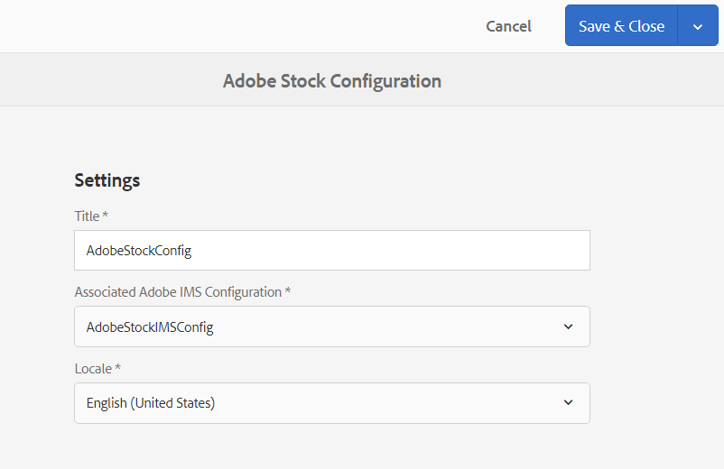

# [!DNL Adobe Stock] -elementen gebruiken in [!DNL Adobe Experience Manager Assets] {#use-adobe-stock-assets-in-aem-assets}

| Versie | Artikelkoppeling |
| -------- | ---------------------------- |
| AEM 6.5 | [ klik hier ](https://experienceleague.adobe.com/docs/experience-manager-65/assets/using/aem-assets-adobe-stock.html?lang=nl-NL) |
| AEM as a Cloud Service | Dit artikel |

[!DNL Adobe Stock] biedt ontwerpers en bedrijven toegang tot miljoenen kwalitatief hoogstaande, gekrulde, royaltyvrije foto&#39;s, vectoren, illustraties, video&#39;s, sjablonen en 3D-middelen voor al hun creatieve projecten.

[!DNL Adobe Stock] voor zakelijke aanbiedingen, die standaard deelrechten voor de hele organisatie bevatten. Zodra een middel door een gebruiker van uw organisatie is vergunning gegeven, kunnen andere gebruikers van uw organisatie, dit middel identificeren downloaden en gebruiken zonder het moeten het opnieuw vergunning geven. Zodra een activa door uw organisatie zijn vergunning gegeven, is het recht om het te gebruiken onvoorwaardelijk.

Organisaties kunnen hun [!DNL Adobe Stock] Enterprise-plan integreren met [!DNL Experience Manager Assets] om ervoor te zorgen dat middelen met licentie breed beschikbaar zijn voor hun creatieve en marketingprojecten, met de krachtige mogelijkheden voor middelenbeheer van [!DNL Experience Manager] . [!DNL Experience Manager] -gebruikers kunnen snel Adobe Stock-elementen zoeken, voorvertonen en in licentie geven die zijn opgeslagen in [!DNL Experience Manager] , zonder de interface van [!DNL Experience Manager] te verlaten.

## Vereisten om te integreren [!DNL Experience Manager] en [!DNL Adobe Stock] {#integrate-aem-and-adobe-stock}

[!DNL Experience Manager Assets] biedt gebruikers de mogelijkheid om [!DNL Adobe Stock] -elementen rechtstreeks vanuit [!DNL Experience Manager] te zoeken, te bekijken, op te slaan en in licentie te geven.

Voldoe aan de volgende vereisten om deze integratie toe te laten:

* Een up-to-run [!DNL Experience Manager Assets] als een [!DNL Cloud Service] -instantie.
* An enterprise [!DNL Adobe Stock] plan.
* Een gebruiker met machtigingen in [!DNL Admin Console] voor het standaardproductprofiel Stock.
* Een gebruiker met machtigingen voor de [!DNL Developer Access profile] voor het maken van integratie in [!DNL Adobe Developer Console] .

An enterprise [!DNL Adobe Stock] plan,

* Biedt productrechten voor [!DNL Adobe Stock] (Voorraden die zijn verbonden met Experience Manager).
* Crediteringen die zijn aangeschaft in de [!DNL Adobe Admin Console] voor uw aandelenrechten.
* Hiermee kunt u de credits en licenties globaal beheren vanuit [!DNL Adobe Admin Console] .

Binnen de machtiging bestaat er een standaardproductprofiel voor [!DNL Adobe Stock] in [!DNL Admin Console] . Er kunnen meerdere profielen worden gemaakt en deze profielen bepalen wie een licentie voor de activa van Stock kan verkrijgen. Een gebruiker die een directe toegang tot het productprofiel heeft kan tot [ https://stock.adobe.com/ ](https://stock.adobe.com/) toegang hebben en de activa van de Beeld van de vergunning. Terwijl er een andere methode is om de Toegang van de Ontwikkelaar te gebruiken om een integratie (API) tot stand te brengen. Deze integratie verifieert de communicatie tussen [!DNL Experience Manager Assets] en [!DNL Adobe Stock].

<!--
### Create an IMS configuration {#create-an-ims-configuration}

1. In the [!DNL Experience Manager] user interface, navigate to **[!UICONTROL Tools]** > **[!UICONTROL Security]** > **[!UICONTROL Adobe IMS Configurations]**. Click **[!UICONTROL Create]** and select **[!UICONTROL Cloud Solution]** > **[!UICONTROL Adobe Stock]**.
1. Either reuse an existing certificate or select **[!UICONTROL Create new certificate]**.
1. Click **[!UICONTROL Create certificate]**. Once created, download the public key. Click **[!UICONTROL Next]**. Leave the [!UICONTROL Adobe IMS Technical Account Configuration] screen open to provide the required values shortly.
1. Access [Adobe Developer Console](https://console.adobe.io). Ensure that your account has administrator permissions for the organization for which the integration is required.
1. Click **[!UICONTROL Create new project]** and click **[!UICONTROL Add API]**. Select **[!UICONTROL Adobe Stock]** from the list of APIs that are available to you. Select [!UICONTROL OAUTH 2.0 Web].
1. Provide **[!UICONTROL Default redirect URI]** and **[!UICONTROL Redirect URI pattern]** values. Click **[!UICONTROL Save configured API]**. Copy the generated ID and secret.
1. In [!UICONTROL Adobe IMS Technical Account Configuration] screen, provide the values in the boxes titled **[!UICONTROL Title]**, **[!UICONTROL Authorization Server]**, **[!UICONTROL API Key]**, **[!UICONTROL Client Secret]**, and **[!UICONTROL Payload]**. For detailed information about these values, see [JWT authentication quick start](https://www.adobe.io/authentication/auth-methods.html#!AdobeDocs/adobeio-auth/master/JWT/JWT.md).
-->

<!-- 
TBD: Update the URL to update the terminology when AIO team updates their documentation URL. Logged issue github.com/AdobeDocs/adobeio-auth/issues/63.
-->

<!--
### Create [!DNL Adobe Stock] configuration in [!DNL Experience Manager] {#create-adobe-stock-configuration-in-aem}

1. In the [!DNL Experience Manager], navigate to **[!UICONTROL Tools]** > **[!UICONTROL Cloud Services]** > **[!UICONTROL Adobe Stock]**.
1. Click **[!UICONTROL Create]** to create a configuration and associate it with your existing IMS Configuration. Select `PROD` as the environment parameter.
1. In **[!UICONTROL Licensed Assets Path]** field, leave a location as is. Do not change the location where you want to store the [!DNL Adobe Stock] assets.
1. Complete creation by adding all the required properties. Click **[!UICONTROL Save & Close]**.
1. Add [!DNL Experience Manager] users or groups, who can license the assets.

>[!NOTE]
>
>If there are multiple [!DNL Adobe Stock] configurations, select the desired configuration in User Preferences panel. To access the panel from Experience Manager home page, click the user icon and then click **[!UICONTROL User Preferences]** > **[!UICONTROL Stock Configuration]**.
-->

## Integeren [!DNL Experience Manager] en [!DNL Adobe Stock] {#integrate-adobe-stock-with-aem-assets}

Als ontwikkelaar voert u de volgende stappen uit om [!DNL Adobe Experience Manager] en [!DNL Adobe Stock] te integreren.

<!--
1. [Obtain public certificate](#public-certificate)
   
   In [!DNL Experience Manager], create an IMS account and generate a public certificate (public key).

1. [Create service account (JWT) connection](#createnewintegration) 
   
   In [!DNL Adobe Developer Console], create a project for your [!DNL Adobe Stock] organization. Under the project, configure an API using the public key to create a service account (JWT) connection. Get the service account credentials and JWT payload information.

1. [Configure IMS account](#create-ims-account-configuration)

   In [!DNL Experience Manager], configure the IMS account using the service account credentials and JWT payload.

1. [Configure cloud service](#configure-the-cloud-service)

   In [!DNL Experience Manager], configure an [!DNL Adobe Stock] cloud service using the IMS account.

### Create an IMS configuration {#create-an-ims-configuration}

The IMS configuration authenticates your [!DNL Experience Manager Assets] author instance with the [!DNL Adobe Stock] entitlement. 

IMS configuration includes two steps:

* [Obtain public certificate](#public-certificate) 
* [Configure IMS account](#create-ims-account-configuration)

### Obtain public certificate {#public-certificate}

The public key (certificate) authenticates your product profile in Adobe Developer Console.

1. Log in to your [!DNL Experience Manager Assets] cloud instance.

1. From the **[!UICONTROL Tools]** panel, navigate to **[!UICONTROL Security]** > **[!UICONTROL Adobe IMS Configurations]**.

1. In Adobe IMS Configurations page, click **[!UICONTROL Create]**. The **[!UICONTROL Adobe IMS Technical Account Configuration]** page opens. 

1. In the **[!UICONTROL Certificate]** tab, select **[!UICONTROL Adobe Stock]** from the **[!UICONTROL Cloud Solution]** drop-down list.  

1. You can create a certificate or reuse an existing certificate for the configuration. 

   To create a certificate, select the **[!UICONTROL Create new certificate]** check box and specify an **alias** for the public key. The alias serves as name of the public key. 

1. Click **[!UICONTROL Create certificate]**. Then, click **[!UICONTROL OK]** to generate the public key.

1. Click the **[!UICONTROL Download Public Key]** icon and save the public key (.crt) file on your machine. The public key is used later to configure API for your Brand Portal tenant and generate service account credentials in Adobe Developer Console.

   Click **[!UICONTROL Next]**.

   

1. In the **Account** tab, Adobe IMS account is created which requires the service account credentials.

   Open a new tab and [create a service account (JWT) connection in Adobe Developer Console](#createnewintegration). 

### Create service account (JWT) connection {#createnewintegration}

In Adobe Developer Console, projects and APIs are configured at organization level. Configuring an API creates a service account (JWT) connection. There are two methods to configure API, by generating a key pair (private and public keys) or by uploading a public key. In this example, the service account credentials are generated by uploading the public key.

To generate the service account credentials and JWT payload:

1. Log in to Adobe Developer Console with system administrator privileges. The default URL is [https://www.adobe.com/go/devs_console_ui](https://www.adobe.com/go/devs_console_ui).

   Ensure that you have selected the correct IMS organization (Stock entitlement) from the drop-down (organization) list.

1. Click **[!UICONTROL Create new project]**. A blank project with a system-generated name is created for your organization. 

   Click **[!UICONTROL Edit project]**. Update the **[!UICONTROL Project Title]** and **[!UICONTROL Description]**, and then click **[!UICONTROL Save]**.
   
1. In the **[!UICONTROL Project overview]** tab, click **[!UICONTROL Add API]**.

1. In the **[!UICONTROL Add an API window]**, select **[!UICONTROL Adobe Stock]**. Click **[!UICONTROL Next]**. 

1. In the **[!UICONTROL Configure API]** window, select **[!UICONTROL Service Account (JWT)]** authentication. Click **[!UICONTROL Next]**.

   

1. Click **[!UICONTROL Upload your public key]**. Click **[!UICONTROL Select a File]** and upload the public key (.crt file) that you have downloaded in the [obtain public certificate](#public-certificate) section. Click **[!UICONTROL Next]**.

1. Verify the public key and click **[!UICONTROL Next]**.

1. Select the default **[!UICONTROL Adobe Stock]** product profile and click **[!UICONTROL Save configured API]**. 

1. Once the API is configured, you are redirected to the API overview page. From the left navigation under **[!UICONTROL Credentials]**, click the **[!UICONTROL Service Account (JWT)]** option. Here, you can view the credentials and perform actions such as generate JWT tokens, copy credential details, and retrieve client secret.

1. From the **[!UICONTROL Client Credentials]** tab, copy the **[!UICONTROL client ID]**. 

   Click **[!UICONTROL Retrieve Client Secret]** and copy the **[!UICONTROL client secret]**.

   

1. Navigate to the **[!UICONTROL Generate JWT]** tab and copy the **[!UICONTROL JWT Payload]** information. 

You can now use the client ID (API key), client secret, and JWT payload to [configure the IMS account](#create-ims-account-configuration) in [!DNL Experience Manager Assets].

### Configure IMS account {#create-ims-account-configuration}

You must have the [certificate](#public-certificate) and [service account (JWT) credentials](#createnewintegration) to configure the IMS account.

To configure the IMS account: 

1. Open the IMS Configuration and navigate to the **[!UICONTROL Account]** tab. You kept the page open while [obtaining the public certificate](#public-certificate).

1. Specify a **[!UICONTROL Title]** for the IMS account.

   In the **[!UICONTROL Authorization Server]** field, enter the URL: [https://ims-na1.adobelogin.com/](https://ims-na1.adobelogin.com/).  

   Enter the client ID in the **[!UICONTROL API key]** field, **[!UICONTROL Client Secret]**, and **[!UICONTROL Payload]** (JWT payload) that you have copied while [creating the service account (JWT) connection](#createnewintegration).

1. Click **[!UICONTROL Create]**. An IMS account configuration is created. 

   
   
1. Select the IMS account configuration and click **[!UICONTROL Check Health]**.

   Click **[!UICONTROL Check]** in the dialog box. On successful configuration, a message appears that the *Token is retrieved successfully*.

   
-->

1. [Een programma instellen in  [!DNL Developer Console]](#set-up-a-program-in-developer-console)
1. [Voeg configuratie in de  [!DNL AEM]  auteursinstantie toe](#add-configuration-in-the-aem-author-instance)

### Een programma instellen in [!DNL Developer Console] {#set-up-a-program-in-developer-console}

Voer de volgende stappen uit om een programma in te stellen in de [!DNL Developer Console] :
1. Navigeer naar [[!DNL Adobe Developer Console] ](https://developer.adobe.com/console/14431/user/servicesandapis) en login aan uw organisatie.
1. Selecteer **[!UICONTROL Create new project]** beschikbaar op het **[!UICONTROL Projects]** -dashboard.
   
1. Klik op **[!UICONTROL Add to project]** en selecteer **[!UICONTROL API]** .
1. Selecteer **[!UICONTROL Adobe Stock]** en klik op **[!UICONTROL Next]** .
1. Geef een **[!UICONTROL Credential name]** op, controleer of **[!UICONTROL OAuth Server-to-Server]** is geselecteerd en klik op **[!UICONTROL Next]** .
1. Selecteer **[!UICONTROL AEM Assets]** **[!UICONTROL Product profile]** en klik op **[!UICONTROL Save Configured API]** . Er wordt een succesbericht weergegeven om te bevestigen dat u een project hebt gemaakt in de [!DNL Developer Console] . Het dashboard van uw project wordt geopend en de projectnaam wordt bovenaan weergegeven, **[!UICONTROL Adobe Stock]** onder **[!UICONTROL APIS]** en **[!UICONTROL AEM Assets]** onder **[!UICONTROL Product profile]** en **[!UICONTROL OAuth Server-to-Server]** de referentiekaart onder **[!UICONTROL Connected credentials]** .
   
1. Selecteer **[!UICONTROL OAuth Server-to-Server]** geloofsbrieven kaart en **[!UICONTROL Credential details]** toont. Gebruik deze [!DNL OAuth Server-to-Server] credentiedetails van uw project zoals **[!UICONTROL Client ID]**, **[!UICONTROL Client Secret]**, **[!UICONTROL Scope]**, **[!UICONTROL Credential Name]**, **[!UICONTROL Technical Account ID]**, **[!UICONTROL Organization ID]** aan [ toevoegen configuratie in de de auteursinstantie van AEM ](#add-configuration-in-the-aem-author-instance).
   

### Configuratie toevoegen in de ontwerpinstantie van [!DNL AEM] {#add-configuration-in-the-aem-author-instance}

Voer de volgende stappen uit om configuratie toe te voegen in uw [!DNL AEM] auteurinstantie:

1. [Opstelling een nieuw  [!DNL Adobe Stock IMS configuration]  in uw  [!DNL AEM]  auteursinstantie](#set-up-adobe-stock-ims-configuration-in-aem-author-instance)
1. [De Cloudinstellingen toevoegen waarmee u verbinding wilt maken  [!DNL Adobe Stock]](#add-cloud-configuration-to-connect-adobe-stock)

#### Nieuwe [!DNL Adobe Stock IMS configuration] instellen in uw [!DNL AEM author] -instantie {#set-up-adobe-stock-ims-configuration-in-aem-author-instance}

Voer de volgende stappen uit om een nieuwe [!DNL Adobe Stock IMS configuration] in uw [!DNL AEM] auteurinstantie in te stellen:
1. Navigeer naar de auteurinstantie van [!DNL AEM] .
1. Klik , selecteer **[!UICONTROL Security]** en selecteer **[!UICONTROL Adobe IMS Configurations]**.
1. Klik op **[!UICONTROL Create]** om een nieuwe IMS-configuratie te maken. Op de pagina **[!UICONTROL Adobe IMS Technical Account Configuration]** worden meerdere velden weergegeven, zoals **[!UICONTROL Cloud Solution]** , **[!UICONTROL Title]** , **[!UICONTROL Authorization Server]** , **[!UICONTROL Client ID]** , **[!UICONTROL Client Secret]** , **[!UICONTROL Scope]** en **[!UICONTROL Org ID]** . Volg deze instructies om de details in deze gebieden te specificeren:
   * **[!UICONTROL Cloud Solution]**: Selecteer **[!UICONTROL Adobe Stock]** .
   * **[!UICONTROL Title]**: geef een naam op voor deze integratie.
   * **[!UICONTROL Authorization Server]**: voeg [ https://ims-na1.adobelogin.com/ ](https://ims-na1.adobelogin.com/) als vergunningsserver toe.
   * **[!UICONTROL Client ID]**: Navigeer aan uw projectdashboard, klik **[!UICONTROL OAuth Server-to-Server]** optie beschikbaar in de linkerruit, selecteer **[!UICONTROL Credential details]**, kopieer **[!UICONTROL Client ID]** en kleef het hier (zie [ stap 7 ](#set-up-a-program-in-developer-console)).

   * **[!UICONTROL Client Secret]**: Navigeer aan uw projectdashboard, klik **[!UICONTROL OAuth Server-to-Server]** optie beschikbaar in de linkerruit, selecteer **[!UICONTROL Credential details]**, klik **[!UICONTROL Retrieve Client Secret]**, kopieer **[!UICONTROL client secret]** en kleef het hier (zie [ stap 7 ](#set-up-a-program-in-developer-console)).

   * **[!UICONTROL Scope]**: Navigeer aan uw projectdashboard, klik **[!UICONTROL OAuth Server-to-Server]** optie beschikbaar in de linkerruit, selecteer **[!UICONTROL Credential details]**, kopieer **[!UICONTROL Scope]** en kleef het hier (zie [ stap 7 ](#set-up-a-program-in-developer-console)).

   * **[!UICONTROL Org ID]**: Navigeer aan uw projectdashboard, klik **[!UICONTROL OAuth Server-to-Server]** optie beschikbaar in de linkerruit, selecteer **[!UICONTROL Credential details]**, kopieer **[!UICONTROL Organization ID]** en kleef het hier (zie [ stap 7 ](#set-up-a-program-in-developer-console)).

     
1. Klik op **[!UICONTROL Create]** , de pagina **[!UICONTROL Adobe IMS Configurations]** wordt geopend en de integratie van [!DNL Adobe Stock] die u hebt gemaakt, wordt weergegeven.

#### De cloudconfiguratie toevoegen waarmee u verbinding wilt maken [!DNL Adobe Stock] {#add-cloud-configuration-to-connect-adobe-stock}

Voer de volgende stappen uit om de wolkenconfiguratie toe te voegen om met [!DNL Adobe Stock] te verbinden:

1. Navigeer naar de instantie [!DNL AEM author] .
1. Klik , selecteer **[!UICONTROL Cloud Services]**, doorblader en selecteer **[!UICONTROL Adobe Stock]**.
   
1. Klik op **[!UICONTROL Create]** en op de pagina **[!UICONTROL Adobe Stock Configuration]** worden meerdere velden weergegeven. Volg deze instructies om de details in deze gebieden te specificeren:
   * **[!UICONTROL Title]**: Navigeer aan de **[!UICONTROL Adobe IMS Technical Account Configuration]** pagina (zie [ stap 3 ](#set-up-adobe-stock-ims-configuration-in-aem-author-instance)), kopieer de titel en kleef het hier.
   * **[!UICONTROL Associated Adobe IMS Configuration]**: selecteer de [!DNL Adobe Stock] -integratie die u hebt gemaakt.
   * **[!UICONTROL Locale]**: Selecteer **[!UICONTROL English (United States)]** .
1. Klik op **[!UICONTROL Save & Close]**.
   

<!--
### Configure cloud service {#configure-the-cloud-service}

To configure the [!DNL Adobe Stock] cloud service:

1. In the [!DNL Experience Manager] user interface, navigate to **[!UICONTROL Tools]** > **[!UICONTROL Cloud Services]** > **[!UICONTROL Adobe Stock]**.

1. In the [!DNL Adobe Stock Configurations] page, click **[!UICONTROL Create]**.

1. Specify a **[!UICONTROL Title]** for the cloud configuration. 

   Select the IMS configuration that you have created while [configuring the IMS account](#create-ims-account-configuration).

   Select your locale from the drop-down list.

   

1. Click **[!UICONTROL Save & Close]**. 
-->
De auteur-instantie [!DNL Experience Manager Assets] is nu geïntegreerd met [!DNL Adobe Stock] . U kunt meerdere [!DNL Adobe Stock] -configuraties maken (bijvoorbeeld configuraties op basis van landinstellingen). U kunt de elementen van [!DNL Adobe Stock] nu openen, zoeken en licentiëren vanuit de gebruikersinterface van [!DNL Experience Manager] .

>[!NOTE]
>
>In deze fase van integratie hebben alleen beheerders toegang tot de [!DNL Adobe Stock] -elementen, kunnen ze de Stock-elementen doorzoeken (met behulp van het besturingssysteem) en een licentie voor de [!DNL Adobe Stock] -elementen verkrijgen.
>
>Beheerders kunnen gebruikers of groepen verder toevoegen aan de [!DNL Adobe Stock] cloud-service en deze gebruikers die geen beheerder zijn in [!DNL Experience Manager] machtigingen geven om toegang te krijgen tot de Stock-configuratie.

1. Als u gebruikers of groepen wilt toevoegen, selecteert u de [!DNL Adobe Stock] wolkenconfiguratie en klikt u op **[!UICONTROL Properties]** .

1. Zoek om de gebruikers of de groepen toe te voegen aan wie u toestemmingen hebt toegewezen om tot de configuratie van Adobe Stock toegang te hebben. Zie [ toestemmingen aan gebruikersgroep ](#assign-permissions-to-group) toewijzen.

## Machtigingen toewijzen aan gebruikersgroep {#assign-permissions-to-group}

Beheerders kunnen gebruikersgroepen maken en bepaalde gebruikers of groepen machtigingen geven om toegang te krijgen tot de cloudservice van [!DNL Adobe Stock] .

Hieronder vindt u de machtigingen die een gebruiker nodig heeft om Adobe Stock-middelen te zoeken en te licentiëren:

* Het pad configureren: `/conf/global/settings/stock`
* Rechten: `jcr:read`
* Machtigingstype: `Allow`

U kunt een gebruikersgroep maken of machtigingen toewijzen aan een bestaande gebruikersgroep. Machtigingen kunnen worden toegewezen via de [!DNL Experience Manager Assets] -interface of vanuit de [!DNL User Admin] -console.

**om toegang tot een gebruikersgroep van [!DNL Experience Manager] te verlenen:**

1. Navigeer in de gebruikersinterface van [!DNL Experience Manager] naar **[!UICONTROL Tools]** > **[!UICONTROL Security]** > **[!UICONTROL Groups]** . Maak een gebruikersgroep voor [!DNL Adobe Stock] .

1. Navigeer naar **[!UICONTROL Tools]** > **[!UICONTROL Security]** > **[!UICONTROL Permissions]** .

1. Zoek naar de gebruikersgroep in het linkerpaneel en voeg nieuw **[!UICONTROL Access Control Entry (ACE)]** voor Adobe Stock toe.

   * Het pad configureren: `/conf/global/settings/stock`
   * Rechten: `jcr:read`
   * Machtigingstype: `Allow`

   Klik op **[!UICONTROL Add]**.

   

1. Ga naar **[!UICONTROL Tools]** > **[!UICONTROL Cloud Services]** > **[!UICONTROL Adobe Stock]**. Selecteer de cloudconfiguratie van [!DNL Adobe Stock] en klik op **[!UICONTROL Properties]** .

1. Voeg de gemaakte gebruikersgroep toe aan de [!DNL Adobe Stock] -configuratie. Klik op **[!UICONTROL Save & Close]**.

    toe

**om toegang tot een gebruiker van [!DNL User Admin Console] te verlenen:**

1. Open de [!DNL Experience Manager] User Admin Console. De standaard-URL is `http://localhost:4502/userdamin` .

1. Zoek in het linkerdeelvenster naar de gebruiker door de waarde `user_id` of `name` in te voeren. Dubbelklik om de gebruikerseigenschappen te openen.

1. Navigeer naar het tabblad **[!UICONTROL Permissions]** en sta `read` machtigingen toe voor de [!DNL Adobe Stock] cloudconfiguratie: `/conf/global/settings/stock` .

   >[!CAUTION]
   >
   >Als de cloudconfiguratie niet is toegestaan, heeft de gebruiker alleen toegang tot **[!UICONTROL Assets]** in de [!DNL Experience Manager] -interface.
   >
   >Als u toegang wilt tot [!UICONTROL Assets] - en [!DNL Adobe Stock] -elementen, moet u ervoor zorgen dat de cloudconfiguratie is toegestaan voor de gebruiker.

1. Klik op **[!UICONTROL Save]** om de machtigingen bij te werken.

   

1. Voeg de gebruiker of de groep toe aan de cloudconfiguratie van [!DNL Adobe Stock] .

## Adobe Stock-middelen openen {#access-stock-assets}

Een gebruiker die geen beheerder is en machtigingen heeft voor de cloudconfiguratie van [!DNL Adobe Stock] , kan de elementen van [!DNL Adobe Stock] zoeken en een licentie verlenen via de interface van [!DNL Experience Manager] .

De gebruiker moet een extra stap uitvoeren om de cloudconfiguratie van [!DNL Adobe Stock] te activeren voordat hij toegang krijgt tot [!DNL Adobe Stock] -elementen. Het is een eenmalige activiteit. Als aan de gebruiker machtigingen worden toegewezen voor meerdere [!DNL Adobe Stock] cloudconfiguraties, kan de gebruiker de gewenste configuratie selecteren in de **[!UICONTROL User Preferences]** .

De cloudconfiguratie van [!DNL Adobe Stock] activeren:

1. Meld u aan bij [!DNL Experience Manager] .

1. Klik op het gebruikerspictogram in de rechterbovenhoek en klik vervolgens op **[!UICONTROL My Preferences]** . Het venster **[!UICONTROL User Preferences]** wordt geopend.

1. Selecteer de gewenste **[!UICONTROL Stock Configuration]** in de vervolgkeuzelijst en klik op **[!UICONTROL Accept]** om de configuratie te activeren.

   

1. Navigeer naar **[!UICONTROL Assets]** > **[!UICONTROL Adobe Stock]** . U kunt nu [!DNL Adobe Stock] -elementen weergeven, zoeken en licentiëren.

In de volgende tabel wordt uitgelegd hoe de gebruikersmachtigingen werken wanneer u de elementen van [!DNL Adobe Stock] opent:

| Gebruiker | Groep | Machtigingen | Stock-configuratie accepteren in de gebruikersvoorkeuren | Toegang tot Assets | Toegang tot Adobe Stock |
| --- | --- | --- | --- | --- | --- |
| admin | NVT | Alles | NVT | Ja | Ja |
| test-doc1 | DAM-gebruiker | /conf/global/settings/stock/cloud-config | Ja | Ja | Ja |
| test-doc1 | DAM-gebruiker | /conf/global/settings/stock/cloud-config | Nee | Fout: kan gegevens niet laden | Nee |
| test-doc1 | DAM-gebruiker | **staat** toe: /conf/global/settings/stock **ontkent**: /cloud-config | De voorraadconfiguratie is niet zichtbaar | Ja | Nee |

## [!DNL Adobe Stock] -elementen gebruiken en beheren in [!DNL Experience Manager] {#usemanage}

Met behulp van deze mogelijkheid kunnen organisaties hun gebruikers toestaan te werken met [!DNL Adobe Stock] -elementen in [!DNL Experience Manager Assets] . Vanuit de gebruikersinterface van [!DNL Experience Manager] kunnen gebruikers zoeken in [!DNL Adobe Stock] -elementen en een licentie voor de vereiste elementen aanschaffen.

Zodra een [!DNL Adobe Stock] -element in [!DNL Experience Manager] in licentie is gegeven, kan het worden gebruikt en beheerd als een typisch element. In [!DNL Experience Manager] kunnen gebruikers de elementen zoeken en voorvertonen, de elementen kopiëren en publiceren, de elementen delen op [!DNL Brand Portal] , de elementen openen en gebruiken via de bureaubladtoepassing van [!DNL Experience Manager] , enzovoort.

![ Onderzoek naar [!DNL Adobe Stock] activa en filterresultaten van uw [!DNL Adobe Experience Manager] werkruimte ](assets/adobe-stock-search-results-workspace.png)

**A.** de activa van het onderzoek gelijkend op de activa waarvan [!DNL Adobe Stock] identiteitskaart wordt verstrekt. **B.** Zoek naar assets die overeenkomen met de vorm of afdrukstand die u hebt geselecteerd. **C.** Onderzoek naar één van meer gesteunde activa types **D.** Open of vouwt de filterruit **E.** Vergunning en sparen het geselecteerde activa in [!DNL Experience Manager] **F.** sparen de activa in [!DNL Experience Manager] met watermerk **G.** Onderzoek activa op [!DNL Adobe Stock] website die aan geselecteerde activa **gelijkaardig zijn H.** Bekijk de geselecteerde activa op [!DNL Adobe Stock] website **I.** Aantal geselecteerde activa van de onderzoeksresultaten **J.** Schakelaar tussen de mening van de Kaart en de mening van de Lijst

### Elementen zoeken {#find-assets}

Uw [!DNL Experience Manager] -gebruikers kunnen zoeken naar elementen in zowel [!DNL Experience Manager] als [!DNL Adobe Stock] . Wanneer de zoeklocatie niet beperkt is tot [!DNL Adobe Stock] , worden de zoekresultaten van [!DNL Experience Manager] en [!DNL Adobe Stock] weergegeven.

* Als u naar [!DNL Adobe Stock] elementen wilt zoeken, klikt u op **[!UICONTROL Navigation]** > **[!UICONTROL Assets]** > **[!UICONTROL Search Adobe Stock]** .

* Om naar activa over [!DNL Adobe Stock] en [!DNL Experience Manager Assets] te zoeken, klik onderzoek .

U kunt ook `Location: Adobe Stock` in de zoekbalk typen om [!DNL Adobe Stock] -elementen te selecteren. [!DNL Experience Manager] biedt geavanceerde filtermogelijkheden voor de gezochte middelen, die gebruikers toestaan om snel nul-binnen op de vereiste activa gebruikend filters toe te staan, zoals types van gesteunde activa, beeldrichtlijn, en vergunning gegeven staat.

>[!NOTE]
>
>Assets die wordt gezocht vanuit [!DNL Adobe Stock] , wordt weergegeven in [!DNL Experience Manager] . [!DNL Adobe Stock] de activa worden opgehaald en in [!DNL Experience Manager] bewaart bewaart slechts na een gebruiker of [ activa ](/help/assets/aem-assets-adobe-stock.md#saveassets) of [ vergunningen opslaat en activa ](/help/assets/aem-assets-adobe-stock.md#licenseassets) opslaat. Assets die al in [!DNL Experience Manager] zijn opgeslagen, worden weergegeven en gemarkeerd voor eenvoudige referentie en toegang. Bovendien worden de elementen van [!DNL Stock] opgeslagen met extra metagegevens om de bron aan te geven als [!DNL Stock] .

![ filters van het Onderzoek in [!DNL Experience Manager] en benadrukte [!DNL Adobe Stock] activa in onderzoeksresultaten ](assets/aem-search-filters2.jpg)

### De vereiste elementen opslaan en weergeven {#saveassets}

Selecteer een element dat u wilt opslaan in [!DNL Experience Manager] . Klik op [!UICONTROL Save] in de werkbalk boven in het scherm en geef de naam en locatie van het element op. De elementen zonder licentie worden lokaal met een watermerk opgeslagen.

De volgende keer dat u naar elementen zoekt, worden de opgeslagen elementen gemarkeerd met een badge om aan te geven dat dergelijke elementen beschikbaar zijn in [!DNL Experience Manager Assets] .

>[!NOTE]
>
>De onlangs toegevoegde elementen geven een nieuwe badge weer in plaats van een badge met licentie.

### Licentie-elementen {#licenseassets}

Gebruikers kunnen een licentie voor [!DNL Adobe Stock] -middelen aanschaffen via het quotum van hun [!DNL Adobe Stock] -ondernemingsplan. Wanneer u een licentie voor een element aanschaft, wordt het zonder watermerk opgeslagen en is het beschikbaar voor zoeken en gebruiken in [!DNL Experience Manager Assets] .

![ Dialoogvenster voor het in licentie geven en opslaan van [!DNL Adobe Stock] -elementen in [!DNL Experience Manager Assets]](assets/aem-stock_licenseandsave.jpg)

### Metagegevens en elementen openen {#access-metadata-and-asset-properties}

Gebruikers kunnen de metagegevens openen en voorvertonen, inclusief de metagegevenseigenschappen [!DNL Adobe Stock] voor de elementen die zijn opgeslagen in [!DNL Experience Manager] , en **[!UICONTROL License References]** toevoegen voor een element. De updates voor de licentieverwijzing worden echter niet gesynchroniseerd tussen de [!DNL Experience Manager] - en [!DNL Adobe Stock] -website.

Gebruikers kunnen de eigenschappen van zowel gelicentieerde als niet-gelicentieerde activa zien.

## Bekende beperkingen {#known-limitations}

* **Functionaliteit om gebruikers van vergunning te beperken werkt niet behoorlijk**: Alle gebruikers die `read` toestemmingen aan de voorraadconfiguratie hebben worden toegestaan om de [!DNL Adobe Stock] activa te zoeken en vergunning te geven.

* **niet-admin gebruikers moeten manueel de [!DNL Adobe Stock] wolkenconfiguratie** activeren: in het **[!UICONTROL User Preferences]** venster, toont **[!UICONTROL Stock Configuration]** de [!DNL Adobe Stock] wolkenconfiguratie zoals toegelaten maar het werkt niet voor een niet-admin gebruiker. De gebruiker moet op de knop **[!UICONTROL Accept]** klikken om de voorraadconfiguratie te activeren. Als deze stap ontbreekt, geeft het systeem een foutbericht weer over de toegang tot **[!UICONTROL Assets]** .

* **de redactionele beeldwaarschuwing wordt niet getoond**: Wanneer het verlenen van een vergunning van een beeld, kunnen de gebruikers niet controleren of een beeld Uitgeeflente slechts van het Gebruik is. Om mogelijk misbruik te voorkomen, kunnen de beheerders de toegang tot redactionele middelen van de Admin Console uitschakelen.

* **Verkeerd licentietype wordt getoond**: Het is mogelijk dat een onjuist licentietype in [!DNL Experience Manager] voor een element wordt getoond. Gebruikers kunnen zich aanmelden bij de [!DNL Adobe Stock] -website om het type licentie te zien.

* **de gebieden en de meta-gegevens van de Verwijzing worden niet gesynchroniseerd**: Wanneer een gebruiker een gebied van de vergunningsverwijzing bijwerkt, wordt de informatie van de vergunningsverwijzing bijgewerkt in [!DNL Experience Manager] maar niet op de [!DNL Adobe Stock] website. Als de gebruiker de referentievelden op de [!DNL Adobe Stock] -website bijwerkt, worden de updates niet gesynchroniseerd in [!DNL Experience Manager] .

<!--
## Use and manage [!DNL Adobe Stock] assets in [!DNL Experience Manager] {#usemanage}

Using this capability, organizations users can work using [!DNL Adobe Stock] assets in [!DNL Experience Manager Assets]. From within the [!DNL Experience Manager] user interface, users can search [!DNL Adobe Stock] assets and license the required assets.

Once an [!DNL Adobe Stock] asset is licensed in [!DNL Experience Manager], it can be used and managed like a typical asset. In [!DNL Experience Manager], the users can search and preview the assets; copy and publish the assets; share the assets on [!DNL Brand Portal]; access and use the assets via [!DNL Experience Manager] desktop app; and so on.
-->

<!--  

*Figure: Search for [!DNL Adobe Stock] assets and filter results from your [!DNL Experience Manager] interface.*

**A.** Search assets similar to the assets whose [!DNL Adobe Stock] ID is provided. **B.** Search assets that match your selection of shape or orientation. **C.** Search for one of more supported asset types **D.** Open or collapse the filters pane **E.** License and save the selected asset in [!DNL Experience Manager] **F.** Save the asset in [!DNL Experience Manager] with watermark **G.** Explore assets on [!DNL Adobe Stock] website that are similar to the selected asset **H.** View the selected assets on [!DNL Adobe Stock] website **I.** Number of selected assets from the search results **J.** Switch between Card view and List view -->

<!--
### Find assets {#find-assets}

Your [!DNL Experience Manager] users, can search for assets in both, [!DNL Experience Manager] and [!DNL Adobe Stock]. When the search location is not limited to [!DNL Adobe Stock], the search results from [!DNL Experience Manager] and [!DNL Adobe Stock] are displayed.

* To search for [!DNL Adobe Stock] assets, click **[!UICONTROL Navigation]** > **[!UICONTROL Assets]** > **[!UICONTROL Search Adobe Stock]**.

* To search for assets across [!DNL Adobe Stock] and [!DNL Experience Manager Assets], click search .

Alternatively, start typing `Location: Adobe Stock` in the search bar to select [!DNL Adobe Stock] assets. [!DNL Experience Manager] offers advanced filtering capabilities on the searched assets, allowing users to quickly zero-in on the required assets using filters, such as types of supported assets, image orientation, and licensed state.

>[!NOTE]
>
>Assets searched from [!DNL Adobe Stock] are just displayed in [!DNL Experience Manager]. [!DNL Adobe Stock] assets are fetched and stored in [!DNL Experience Manager] repository only after a user either [saves an asset](/help/assets/aem-assets-adobe-stock.md#saveassets) or [licenses and saves an asset](/help/assets/aem-assets-adobe-stock.md#licenseassets). Assets that are already stored in [!DNL Experience Manager] are displayed and highlighted for ease of reference and access. Also, the [!DNL Stock] assets are saved with some additional metadata to indicate the source as [!DNL Stock].

*Figure: Search filters in [!DNL Experience Manager] and highlighted [!DNL Adobe Stock] assets in search results.*

### Save and view the required assets {#saveassets}

Select an asset that you want to save in [!DNL Experience Manager]. Click [!UICONTROL Save] in the toolbar at the top and provide the name and location of the asset. The unlicensed assets are saved locally with a watermark.

Next time when you search for assets, the saved assets are highlighted with a badge, to indicate that such assets are available in [!DNL Experience Manager Assets].

>[!NOTE]
>
>The recently added assets display a New badge instead of Licensed badge.

### License assets {#licenseassets}

Users can license [!DNL Adobe Stock] assets by using the quota of their [!DNL Adobe Stock] enterprise plan. When you license an asset, it is saved without a watermark and is available for searching and using in [!DNL Experience Manager Assets].

*Figure: Dialog to license and save [!DNL Adobe Stock] assets in [!DNL Experience Manager Assets].*

### Access metadata and asset properties {#access-metadata-and-asset-properties}

Users can access and preview the metadata, including the [!DNL Adobe Stock] metadata properties for the assets saved in [!DNL Experience Manager], and add **[!UICONTROL License References]** for an asset. However, the updates to license reference are not synced between [!DNL Experience Manager] and [!DNL Adobe Stock] website.

Users can see the properties for both, licensed and unlicensed assets.

*Figure: View and access metadata and license references of saved assets.*

## Known limitations {#known-limitations}

* **Editorial image warning is not displayed**: When licensing an image, users cannot check if an image is Editorial Use Only. To prevent possible misuse, the administrators can turn off the access to editorial assets from the Admin Console.

* **Wrong license type is displayed**: It is possible that an incorrect license type is displayed in [!DNL Experience Manager] for an asset. Users can log into the [!DNL Adobe Stock] website to see the license type.

* **Reference fields and metadata are not synced**: When a user updates a license reference field, the license reference information is updated in [!DNL Experience Manager] but not on the [!DNL Adobe Stock] website. Similarly, if the user updates the reference fields on the [!DNL Adobe Stock] website, the updates are not synchronized in [!DNL Experience Manager].
-->

**zie ook**

* [Assets vertalen](translate-assets.md)
* [ASSETS HTTP API](mac-api-assets.md)
* [Door Assets ondersteunde bestandsindelingen](file-format-support.md)
* [Zoeken in middelen](search-assets.md)
* [Verbonden elementen](use-assets-across-connected-assets-instances.md)
* [Elementen rapporteren](asset-reports.md)
* [Metagegevensschema&#39;s](metadata-schemas.md)
* [Elementen downloaden](download-assets-from-aem.md)
* [Metagegevens beheren](manage-metadata.md)
* [Zoeken in facetten](search-facets.md)
* [Verzamelingen beheren](manage-collections.md)
* [Bulkmetagegevens importeren](metadata-import-export.md)
* [Assets publiceren naar AEM en Dynamic Media](/help/assets/publish-assets-to-aem-and-dm.md)

>[!MORELIKETHIS]
>
>* [ Videozelfstudie bij het gebruiken van de activa van Adobe Stock met Experience Manager Assets ](https://experienceleague.adobe.com/docs/experience-manager-learn/assets/creative-workflows/adobe-stock.html?lang=nl-NL)
>* [ de hulp van het ondernemingsplan van Adobe Stock ](https://helpx.adobe.com/nl/enterprise/using/adobe-stock-enterprise.html)
>* [ Veelgestelde vragen van Adobe Stock ](https://helpx.adobe.com/nl/stock/faq.html)
