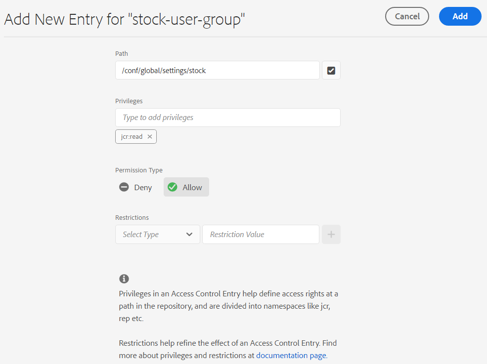

# Gebruiken [!DNL Adobe Stock] activa in [!DNL Adobe Experience Manager Assets] {#use-adobe-stock-assets-in-aem-assets}

| Versie | Artikelkoppeling |
| -------- | ---------------------------- |
| AEM 6,5 | [Klik hier](https://experienceleague.adobe.com/docs/experience-manager-65/assets/using/aem-assets-adobe-stock.html?lang=en) |
| AEM as a Cloud Service | Dit artikel |

[!DNL Adobe Stock] biedt ontwerpers en bedrijven toegang tot miljoenen hoogwaardige, gekrulde, royaltyvrije foto&#39;s, vectoren, illustraties, video&#39;s, sjablonen en 3D-middelen voor al hun creatieve projecten.

[!DNL Adobe Stock] voor het aanbieden van een bedrijf, door gebrek, omvat het delen van rechten over de organisatie. Zodra een middel door een gebruiker van uw organisatie is vergunning gegeven, kunnen andere gebruikers van uw organisatie, dit middel identificeren downloaden en gebruiken zonder het moeten het opnieuw vergunning geven. Zodra een activa door uw organisatie zijn vergunning gegeven, is het recht om het te gebruiken onvoorwaardelijk.

Organisaties kunnen hun bedrijf integreren [!DNL Adobe Stock] plannen met [!DNL Experience Manager Assets] om ervoor te zorgen dat gelicentieerde middelen breed beschikbaar zijn voor hun creatieve en marketingprojecten, met de krachtige mogelijkheden voor middelenbeheer van [!DNL Experience Manager]. [!DNL Experience Manager] gebruikers kunnen snel Adobe Stock-middelen zoeken, voorvertonen en licentiëren die zijn opgeslagen in [!DNL Experience Manager], zonder de [!DNL Experience Manager] interface.

## Integreren [!DNL Experience Manager] en [!DNL Adobe Stock] {#integrate-aem-and-adobe-stock}

[!DNL Experience Manager Assets] biedt gebruikers de mogelijkheid te zoeken, een voorbeeld te bekijken, op te slaan en een licentie te maken [!DNL Adobe Stock] activa rechtstreeks van [!DNL Experience Manager].

**Vereisten**

De integratie vereist:

* Aan de slag [!DNL Experience Manager Assets] als [!DNL Cloud Service] instance
* An [bedrijf [!DNL Adobe Stock] plan](https://stockenterprise.adobe.com/)
* Een gebruiker met machtigingen in Admin Console naar het standaardprofiel voor het product Stock
* Een gebruiker met machtigingen voor het Developer Access-profiel voor het maken van integratie in Adobe Developer Console

Een onderneming [!DNL Adobe Stock] plan,

* Biedt productrechten voor [!DNL Adobe Stock] (Met Experience Manager verbonden voorraden)
* Crediteringen die zijn aangeschaft in de [!DNL Adobe Admin Console] voor je aandelenrecht
* Maakt verificatie voor serviceaccount (JWT) binnen mogelijk [!DNL Adobe Developer Console] voor je aandelenrecht
* Maakt het beheer van de credits en licenties wereldwijd mogelijk vanuit de [!DNL Adobe Admin Console]

Binnen de machtiging wordt een standaardproductprofiel voor [!DNL Adobe Stock] bestaat in [!DNL Admin Console]. Er kunnen meerdere profielen worden gemaakt en deze profielen bepalen wie een licentie voor de activa van Stock kan verkrijgen. Een gebruiker die rechtstreeks toegang heeft tot het productprofiel heeft toegang tot [https://stock.adobe.com/](https://stock.adobe.com/) en de activa van de vergunning van de Voorraad. Terwijl er een andere methode is om de Toegang van de Ontwikkelaar te gebruiken om een integratie (API) tot stand te brengen. Deze integratie verifieert de communicatie tussen [!DNL Experience Manager Assets] en [!DNL Adobe Stock].

>[!NOTE]
>
>De beurswaarde van de &quot;Stock Service Account&quot; (JWT) wordt geleverd met de beurswaarde van de onderneming.
>
>De integratie ondersteunt geen Oauth-authenticatie voor aandelenrechten voor bedrijven.

<!--
### Create an IMS configuration {#create-an-ims-configuration}

1. In the [!DNL Experience Manager] user interface, navigate to **[!UICONTROL Tools]** > **[!UICONTROL Security]** > **[!UICONTROL Adobe IMS Configurations]**. Click **[!UICONTROL Create]** and select **[!UICONTROL Cloud Solution]** > **[!UICONTROL Adobe Stock]**.
1. Either reuse an existing certificate or select **[!UICONTROL Create new certificate]**.
1. Click **[!UICONTROL Create certificate]**. Once created, download the public key. Click **[!UICONTROL Next]**. Leave the [!UICONTROL Adobe IMS Technical Account Configuration] screen open to provide the required values shortly.
1. Access [Adobe Developer Console](https://console.adobe.io). Ensure that your account has administrator permissions for the organization for which the integration is required.
1. Click **[!UICONTROL Create new project]** and click **[!UICONTROL Add API]**. Select **[!UICONTROL Adobe Stock]** from the list of APIs that are available to you. Select [!UICONTROL OAUTH 2.0 Web].
1. Provide **[!UICONTROL Default redirect URI]** and **[!UICONTROL Redirect URI pattern]** values. Click **[!UICONTROL Save configured API]**. Copy the generated ID and secret.
1. In [!UICONTROL Adobe IMS Technical Account Configuration] screen, provide the values in the boxes titled **[!UICONTROL Title]**, **[!UICONTROL Authorization Server]**, **[!UICONTROL API Key]**, **[!UICONTROL Client Secret]**, and **[!UICONTROL Payload]**. For detailed information about these values, see [JWT authentication quick start](https://www.adobe.io/authentication/auth-methods.html#!AdobeDocs/adobeio-auth/master/JWT/JWT.md).

-->
<!-- TBD: Update the URL to update the terminology when AIO team updates their documentation URL. Logged issue github.com/AdobeDocs/adobeio-auth/issues/63.
-->

<!--
### Create [!DNL Adobe Stock] configuration in [!DNL Experience Manager] {#create-adobe-stock-configuration-in-aem}

1. In the [!DNL Experience Manager], navigate to **[!UICONTROL Tools]** > **[!UICONTROL Cloud Services]** > **[!UICONTROL Adobe Stock]**.
1. Click **[!UICONTROL Create]** to create a configuration and associate it with your existing IMS Configuration. Select `PROD` as the environment parameter.
1. In **[!UICONTROL Licensed Assets Path]** field, leave a location as is. Do not change the location where you want to store the [!DNL Adobe Stock] assets.
1. Complete creation by adding all the required properties. Click **[!UICONTROL Save & Close]**.
1. Add [!DNL Experience Manager] users or groups, who can license the assets.

>[!NOTE]
>
>If there are multiple [!DNL Adobe Stock] configurations, select the desired configuration in User Preferences panel. To access the panel from Experience Manager home page, click the user icon and then click **[!UICONTROL User Preferences]** > **[!UICONTROL Stock Configuration]**.

-->

## Stappen om te integreren [!DNL Experience Manager] en [!DNL Adobe Stock] {#integration-steps}

Om te integreren [!DNL Experience Manager] en [!DNL Adobe Stock]voert u de volgende stappen uit in de vermelde reeks:

1. [Openbaar certificaat verkrijgen](#public-certificate)

   In [!DNL Experience Manager], maakt u een IMS-account en genereert u een openbaar certificaat (openbare sleutel).

1. [Verbinding voor serviceaccount (JWT) maken](#createnewintegration)

   In [!DNL Adobe Developer Console], maakt u een project voor uw [!DNL Adobe Stock] organisatie. Onder het project, vorm API gebruikend de openbare sleutel om een verbinding van de de dienstrekening (JWT) tot stand te brengen. Krijg de geloofsbrieven van de de dienstrekening en JWT payload informatie.

1. [IMS-account configureren](#create-ims-account-configuration)

   In [!DNL Experience Manager], configureert u de IMS-account met de gegevens van de serviceaccount en de JWT-payload.

1. [Cloudservice configureren](#configure-the-cloud-service)

   In [!DNL Experience Manager], een [!DNL Adobe Stock] cloudservice met behulp van het IMS-account.

### Een IMS-configuratie maken {#create-an-ims-configuration}

De configuratie IMS verifieert uw [!DNL Experience Manager Assets] auteur instantie met [!DNL Adobe Stock] machtiging.

De IMS-configuratie omvat twee stappen:

* [Openbaar certificaat verkrijgen](#public-certificate)
* [IMS-account configureren](#create-ims-account-configuration)

### Openbaar certificaat verkrijgen {#public-certificate}

Met de openbare sleutel (certificaat) wordt uw productprofiel geverifieerd in Adobe Developer Console.

1. Aanmelden bij uw [!DNL Experience Manager Assets] cloudinstantie.

1. Van de **[!UICONTROL Tools]** deelvenster, navigeren naar **[!UICONTROL Security]** > **[!UICONTROL Adobe IMS Configurations]**.

1. Klik op de pagina Adobe IMS Configurations op **[!UICONTROL Create]**. De **[!UICONTROL Adobe IMS Technical Account Configuration]** pagina wordt geopend.

1. In de **[!UICONTROL Certificate]** tab, selecteert u **[!UICONTROL Adobe Stock]** van de **[!UICONTROL Cloud Solution]** vervolgkeuzelijst.

1. U kunt een certificaat maken of een bestaand certificaat opnieuw gebruiken voor de configuratie.

   Als u een certificaat wilt maken, selecteert u de **[!UICONTROL Create new certificate]** selectievakje en geef een **alias** voor de openbare sleutel. De alias fungeert als naam voor de openbare sleutel.

1. Klik op **[!UICONTROL Create certificate]**. Klik vervolgens op **[!UICONTROL OK]** om de openbare sleutel te produceren.

1. Klik op de knop **[!UICONTROL Download Public Key]** en sla het bestand met de openbare sleutel (.crt) op uw computer op. De openbare sleutel wordt later gebruikt om API voor uw Brand Portal huurder te vormen en de geloofsbrieven van de de dienstrekening in de Console van Adobe Developer te produceren.

   Klik op **[!UICONTROL Next]**.

   

1. In de **Account** wordt een Adobe IMS-account gemaakt waarvoor de gegevens van de serviceaccount zijn vereist.

   Open een nieuw tabblad en [een JWT-verbinding (Service Account) maken in Adobe Developer Console](#createnewintegration).

### Verbinding voor serviceaccount (JWT) maken {#createnewintegration}

In Adobe Developer Console, worden de projecten en APIs gevormd op organisatieniveau. Als u een API configureert, wordt een JWT-verbinding (Service Account) gemaakt. Er zijn twee methodes om API te vormen, door een zeer belangrijk paar (privé en openbare sleutels) te produceren of door een openbare sleutel te uploaden. In dit voorbeeld worden de gegevens van de serviceaccount gegenereerd door de openbare sleutel te uploaden.

Om de geloofsbrieven van de de dienstrekening en JWT lading te produceren:

1. Meld u aan bij de Adobe Developer-console met systeembeheerdersrechten. De standaard-URL is [https://www.adobe.com/go/devs_console_ui](https://www.adobe.com/go/devs_console_ui).

   Controleer of u de juiste IMS-organisatie (Stock Entitlement) hebt geselecteerd in de vervolgkeuzelijst (organisatie).

1. Klik op **[!UICONTROL Create new project]**. Er wordt een leeg project met een door het systeem gegenereerde naam gemaakt voor uw organisatie.

   Klik op **[!UICONTROL Edit project]**. Werk de **[!UICONTROL Project Title]** en **[!UICONTROL Description]** en klik vervolgens op **[!UICONTROL Save]**.

1. In de **[!UICONTROL Project overview]** tabblad, klikt u op **[!UICONTROL Add API]**.

1. In de **[!UICONTROL Add an API window]**, selecteert u **[!UICONTROL Adobe Stock]**. Klik op **[!UICONTROL Next]**.

1. In de **[!UICONTROL Configure API]** venster, selecteert u **[!UICONTROL Service Account (JWT)]** verificatie. Klik op **[!UICONTROL Next]**.

   

1. Klik op **[!UICONTROL Upload your public key]**. Klikken **[!UICONTROL Select a File]** en uploadt u de openbare sleutel (.crt-bestand) die u in het dialoogvenster [openbare verklaring verkrijgen](#public-certificate) sectie. Klik op **[!UICONTROL Next]**.

1. De openbare sleutel controleren en klikken **[!UICONTROL Next]**.

1. De standaardinstelling selecteren **[!UICONTROL Adobe Stock]** productprofiel en klik op **[!UICONTROL Save configured API]**.

1. Nadat de API is geconfigureerd, wordt u omgeleid naar de API-overzichtspagina. Vanaf de linkernavigatie onder **[!UICONTROL Credentials]** klikt u op de knop **[!UICONTROL Service Account (JWT)]** -optie. Hier, kunt u de geloofsbrieven bekijken en acties uitvoeren zoals produceren JWT tokens, exemplaar credentiedetails, en terugwinnen cliëntgeheim.

1. Van de **[!UICONTROL Client Credentials]** -tabblad, kopieert u de **[!UICONTROL client ID]**.

   Klikken **[!UICONTROL Retrieve Client Secret]** en kopieer de **[!UICONTROL client secret]**.

   

1. Ga naar de **[!UICONTROL Generate JWT]** en kopieer de **[!UICONTROL JWT Payload]** informatie.

U kunt nu de client-id (API-sleutel), het clientgeheim en de JWT-payload gebruiken naar [IMS-account configureren](#create-ims-account-configuration) in [!DNL Experience Manager Assets].

### IMS-account configureren {#create-ims-account-configuration}

U moet beschikken over [certificaat](#public-certificate) en [JWT-referenties (Service Account)](#createnewintegration) om de IMS-account te configureren.

De IMS-account configureren:

1. Open de IMS-configuratie en navigeer naar de **[!UICONTROL Account]** tab. U hebt de pagina geopend gehouden terwijl [verkrijgen van het openbare certificaat](#public-certificate).

1. Geef een **[!UICONTROL Title]** op voor het IMS-account.

   In de **[!UICONTROL Authorization Server]** veld, voer de URL in: [https://ims-na1.adobelogin.com/](https://ims-na1.adobelogin.com/).

   Voer de client-id in het dialoogvenster **[!UICONTROL API key]** veld, **[!UICONTROL Client Secret]**, en **[!UICONTROL Payload]** (JWT-lading) die u hebt gekopieerd terwijl [maken van de verbinding van de serviceaccount (JWT)](#createnewintegration).

1. Klik op **[!UICONTROL Create]**. Er wordt een IMS-accountconfiguratie gemaakt.

   

1. Selecteer de IMS-accountconfiguratie en klik op **[!UICONTROL Check Health]**.

   Klikken **[!UICONTROL Check]** in het dialoogvenster. Bij een geslaagde configuratie verschijnt het bericht dat de *Token is opgehaald*.

   

### Cloudservice configureren {#configure-the-cloud-service}

Om te vormen [!DNL Adobe Stock] cloudservice:

1. In de [!DNL Experience Manager] gebruikersinterface, navigeren naar **[!UICONTROL Tools]** > **[!UICONTROL Cloud Services]** > **[!UICONTROL Adobe Stock]**.

1. In de [!DNL Adobe Stock Configurations] pagina, klikt u **[!UICONTROL Create]**.

1. Geef een **[!UICONTROL Title]** voor de cloudconfiguratie.

   Selecteer de IMS-configuratie die u hebt gemaakt terwijl u [configureren van IMS-account](#create-ims-account-configuration).

   Selecteer de landinstelling in de vervolgkeuzelijst.

   

1. Klik op **[!UICONTROL Save & Close]**.

   Uw [!DNL Experience Manager Assets] schrijverinstantie is nu geïntegreerd met [!DNL Adobe Stock]. U kunt meerdere [!DNL Adobe Stock] configuraties (bijvoorbeeld configuraties op basis van landinstellingen). U kunt nu de opdracht [!DNL Adobe Stock] activa van binnen [!DNL Experience Manager] gebruikersinterface.

   

   >[!NOTE]
   >
   >In deze fase van integratie hebben alleen de beheerders toegang tot de [!DNL Adobe Stock] activa, activa van de onderzoeksVoorraad (gebruikend alwetzoekend), en vergunning het [!DNL Adobe Stock] activa.
   >
   >Beheerders kunnen gebruikers of groepen verder toevoegen aan de [!DNL Adobe Stock] cloudservice en geef machtigingen aan deze gebruikers die geen beheerder zijn in [!DNL Experience Manager] om tot de configuratie van de Voorraad toegang te hebben.

1. Als u gebruikers of groepen wilt toevoegen, selecteert u de [!DNL Adobe Stock] cloudconfiguratie en klik op **[!UICONTROL Properties]**.

1. Zoek om de gebruikers of de groepen toe te voegen aan wie u toestemmingen hebt toegewezen om tot de configuratie van Adobe Stock toegang te hebben. Zie [machtigingen toewijzen aan gebruikersgroep](#assign-permissions-to-group).

## Machtigingen toewijzen aan gebruikersgroep {#assign-permissions-to-group}

Beheerders kunnen gebruikersgroepen maken en bepaalde gebruikers of groepen machtigingen geven om toegang te krijgen tot de [!DNL Adobe Stock] cloudservice.

Hieronder vindt u de machtigingen die een gebruiker nodig heeft om Adobe Stock-middelen te zoeken en te licentiëren:

* Vorm de weg: `/conf/global/settings/stock`
* Rechten: `jcr:read`
* Type machtiging: `Allow`

U kunt een gebruikersgroep maken of machtigingen toewijzen aan een bestaande gebruikersgroep. Machtigingen kunnen worden toegewezen via de [!DNL Experience Manager Assets] of van de [!DNL User Admin] Console.

**Om toegang tot een gebruikersgroep van te verlenen [!DNL Experience Manager]:**

1. In de [!DNL Experience Manager] gebruikersinterface, navigeren naar **[!UICONTROL Tools]** > **[!UICONTROL Security]** > **[!UICONTROL Groups]**. Een gebruikersgroep maken voor [!DNL Adobe Stock].

1. Navigeren naar **[!UICONTROL Tools]** > **[!UICONTROL Security]** > **[!UICONTROL Permissions]**.

1. Zoeken naar de gebruikersgroep in het linkerdeelvenster en nieuwe gebruikersgroep toevoegen **[!UICONTROL Access Control Entry (ACE)]** voor Adobe Stock.

   * Vorm de weg: `/conf/global/settings/stock`
   * Rechten: `jcr:read`
   * Type machtiging: `Allow`

   Klik op **[!UICONTROL Add]**.

   

1. Ga naar **[!UICONTROL Tools]** > **[!UICONTROL Cloud Services]** > **[!UICONTROL Adobe Stock]**. Selecteer de [!DNL Adobe Stock] cloudconfiguratie en klik op **[!UICONTROL Properties]**.

1. Voeg de gemaakte gebruikersgroep toe aan de [!DNL Adobe Stock] configuratie. Klik op **[!UICONTROL Save & Close]**.

   

**Om toegang tot een gebruiker van te verlenen [!DNL User Admin Console]:**

1. Open de [!DNL Experience Manager] Admin Console gebruiker. De standaard-URL is `http://localhost:4502/userdamin`.

1. Zoek in het linkerdeelvenster naar de gebruiker door het dialoogvenster `user_id` of `name`. Dubbelklik om de gebruikerseigenschappen te openen.

1. Ga naar de **[!UICONTROL Permissions]** tab en allow `read` machtigingen voor de [!DNL Adobe Stock] cloudconfiguratie: `/conf/global/settings/stock`.

   >[!CAUTION]
   >
   >Als de wolkenconfiguratie niet wordt toegestaan, kan de gebruiker slechts tot **[!UICONTROL Assets]** in de [!DNL Experience Manager] interface.
   >
   >Toegang verlenen tot [!UICONTROL Assets] en [!DNL Adobe Stock] middelen, zorgt u ervoor dat de cloudconfiguratie is toegestaan voor de gebruiker.

1. Klikken **[!UICONTROL Save]** om de machtigingen bij te werken.

   

1. Voeg de gebruiker of de groep toe aan de [!DNL Adobe Stock] cloudconfiguratie.

## Adobe Stock-middelen openen {#access-stock-assets}

Een gebruiker die geen beheerder is en over machtigingen beschikt voor de [!DNL Adobe Stock] de wolkenconfiguratie kan zoeken en vergunning geven [!DNL Adobe Stock] activa van de [!DNL Experience Manager] interface.

De gebruiker moet een extra stap uitvoeren om het [!DNL Adobe Stock] cloudconfiguratie voor toegang tot [!DNL Adobe Stock] activa. Het is een eenmalige activiteit. Als aan de gebruiker machtigingen worden toegewezen voor meerdere [!DNL Adobe Stock] wolkenconfiguraties, kan de gebruiker de gewenste configuratie van de **[!UICONTROL User Preferences]**.

Als u het dialoogvenster [!DNL Adobe Stock] cloudconfiguratie:

1. Aanmelden bij [!DNL Experience Manager].

1. Klik op het gebruikerspictogram in de rechterbovenhoek en klik vervolgens op **[!UICONTROL My Preferences]**. De **[!UICONTROL User Preferences]** wordt geopend.

1. Selecteer het gewenste **[!UICONTROL Stock Configuration]** in de vervolgkeuzelijst en klik op **[!UICONTROL Accept]** de configuratie activeren.

   

1. Navigeren naar **[!UICONTROL Assets]** > **[!UICONTROL Adobe Stock]**. U kunt nu een licentie bekijken, zoeken en licentiëren [!DNL Adobe Stock] activa.

In de volgende tabel wordt uitgelegd hoe de gebruikersmachtigingen werken bij het openen van de [!DNL Adobe Stock] activa:

| Gebruiker | Groep | Machtigingen | Stock-configuratie accepteren in de gebruikersvoorkeuren | Toegangsmiddelen | Toegang tot Adobe Stock |
| --- | --- | --- | --- | --- | --- |
| admin | NVT | Alles | NVT | Ja | Ja |
| test-doc1 | DAM-gebruiker | /conf/global/settings/stock/cloud-config | Ja | Ja | Ja |
| test-doc1 | DAM-gebruiker | /conf/global/settings/stock/cloud-config | Nee | Fout: kan gegevens niet laden | Nee |
| test-doc1 | DAM-gebruiker | **toestaan**: /conf/global/settings/stock **ontkennen**: /cloud-config | De voorraadconfiguratie is niet zichtbaar | Ja | Nee |

## Gebruiken en beheren [!DNL Adobe Stock] activa in [!DNL Experience Manager] {#usemanage}

Met behulp van deze mogelijkheid kunnen organisaties hun gebruikers toestaan te werken met [!DNL Adobe Stock] activa in [!DNL Experience Manager Assets]. Van binnen [!DNL Experience Manager] gebruikersinterface, gebruikers kunnen zoeken [!DNL Adobe Stock] activa en de vereiste activa in licentie geven.

Eenmaal [!DNL Adobe Stock] actief in licentie gegeven [!DNL Experience Manager], kan het als typisch activa worden gebruikt en worden beheerd. In [!DNL Experience Manager], kunnen de gebruikers de elementen zoeken en voorvertonen, de elementen kopiëren en publiceren, de elementen delen op [!DNL Brand Portal]; toegang tot en gebruik van activa via [!DNL Experience Manager] bureaubladtoepassing, enzovoort.

![Zoeken naar [!DNL Adobe Stock] elementen en filterresultaten van uw [!DNL Adobe Experience Manager] werkruimte](assets/adobe-stock-search-results-workspace.png)

**A.** Zoeken naar elementen die vergelijkbaar zijn met de elementen waarvan [!DNL Adobe Stock] ID is opgegeven. **B.** Zoek naar assets die overeenkomen met de vorm of afdrukstand die u hebt geselecteerd. **C.** Een of meer ondersteunde elementtypen zoeken **D.** Het venster Filters openen of samenvouwen **E.** Licentie toewijzen en het geselecteerde element opslaan in [!DNL Experience Manager] **F.** Middel opslaan in [!DNL Experience Manager] met watermerk **G.** Middelen verkennen op [!DNL Adobe Stock] website die vergelijkbaar is met het geselecteerde element **H.** Geselecteerde elementen weergeven op [!DNL Adobe Stock] website **I.** Aantal geselecteerde elementen uit de zoekresultaten **J.** Schakelen tussen de kaartweergave en de lijstweergave

### Elementen zoeken {#find-assets}

Uw [!DNL Experience Manager] gebruikers, naar elementen in beide kunnen zoeken, [!DNL Experience Manager] en [!DNL Adobe Stock]. Wanneer de zoeklocatie niet beperkt is tot [!DNL Adobe Stock], de zoekresultaten van [!DNL Experience Manager] en [!DNL Adobe Stock] worden weergegeven.

* Als u wilt zoeken naar [!DNL Adobe Stock] elementen, klik op **[!UICONTROL Navigation]** > **[!UICONTROL Assets]** > **[!UICONTROL Search Adobe Stock]**.

* Zoeken naar elementen over [!DNL Adobe Stock] en [!DNL Experience Manager Assets], klikt u op Zoeken .

U kunt ook beginnen met typen `Location: Adobe Stock` in de zoekbalk om [!DNL Adobe Stock] activa. [!DNL Experience Manager] biedt geavanceerde filtermogelijkheden voor de gezochte middelen, die gebruikers toestaan om op de vereiste activa snel nul-binnen op de filters te gebruiken, zoals types van gesteunde activa, beeldrichtlijn, en vergunning gegeven staat.

>[!NOTE]
>
>Middelen die zijn doorzocht van [!DNL Adobe Stock] worden weergegeven in [!DNL Experience Manager]. [!DNL Adobe Stock] elementen worden opgehaald en opgeslagen in [!DNL Experience Manager] alleen na een gebruiker [een element opslaan](/help/assets/aem-assets-adobe-stock.md#saveassets) of [licenties en slaat een middel op](/help/assets/aem-assets-adobe-stock.md#licenseassets). Elementen die al zijn opgeslagen in [!DNL Experience Manager] worden weergegeven en gemarkeerd voor eenvoudige referentie en toegang. Ook de [!DNL Stock] elementen worden met enkele aanvullende metagegevens opgeslagen om de bron aan te geven als [!DNL Stock].

![Filters zoeken in [!DNL Experience Manager] en gemarkeerd [!DNL Adobe Stock] elementen in zoekresultaten](assets/aem-search-filters2.jpg)

### De vereiste elementen opslaan en weergeven {#saveassets}

Selecteer een middel waarin u wilt opslaan [!DNL Experience Manager]. Klikken [!UICONTROL Save] in de werkbalk bovenaan en geef de naam en locatie van het element op. De elementen zonder licentie worden lokaal met een watermerk opgeslagen.

De volgende keer dat u naar elementen zoekt, worden de opgeslagen elementen gemarkeerd met een badge om aan te geven dat dergelijke elementen beschikbaar zijn in [!DNL Experience Manager Assets].

>[!NOTE]
>
>De onlangs toegevoegde elementen geven een nieuwe badge weer in plaats van een badge met licentie.

### Licentie-elementen {#licenseassets}

Gebruikers kunnen licenties [!DNL Adobe Stock] activa door gebruik te maken van het quotum van hun [!DNL Adobe Stock] ondernemingsplan. Wanneer u een licentie voor een element aanschaft, wordt het zonder watermerk opgeslagen en is het beschikbaar voor zoeken en gebruiken in [!DNL Experience Manager Assets].

![Dialoogvenster voor licentie en opslaan [!DNL Adobe Stock] activa in [!DNL Experience Manager Assets]](assets/aem-stock_licenseandsave.jpg)

### Metagegevens en elementen openen {#access-metadata-and-asset-properties}

Gebruikers kunnen de metagegevens openen en voorvertonen, inclusief de [!DNL Adobe Stock] eigenschappen van metagegevens voor de elementen die zijn opgeslagen in [!DNL Experience Manager]en toevoegen **[!UICONTROL License References]** voor een actief. De updates voor de licentieverwijzing worden echter niet gesynchroniseerd tussen [!DNL Experience Manager] en [!DNL Adobe Stock] website.

Gebruikers kunnen de eigenschappen van zowel gelicentieerde als niet-gelicentieerde activa zien.

## Bekende beperkingen {#known-limitations}

* **Functies om gebruikers te beperken tot het verlenen van licenties werken niet correct**: Alle gebruikers die `read` machtigingen voor de voorraadconfiguratie mogen de [!DNL Adobe Stock] activa.

* **Gebruikers die geen beheerder zijn, moeten het [!DNL Adobe Stock] cloudconfiguratie**: In de **[!UICONTROL User Preferences]** venster, het **[!UICONTROL Stock Configuration]** toont de [!DNL Adobe Stock] cloudconfiguratie is ingeschakeld, maar werkt niet voor gebruikers die geen beheerder zijn. De gebruiker moet op de knop **[!UICONTROL Accept]** om de voorraadconfiguratie te activeren. Als deze stap ontbreekt, geeft het systeem een foutbericht weer over de toegang tot **[!UICONTROL Assets]**.

* **Waarschuwing voor redactionele afbeelding wordt niet weergegeven**: Wanneer gebruikers een licentie voor een afbeelding verlenen, kunnen ze niet controleren of een afbeelding alleen voor gebruik als redactie is. Om mogelijk misbruik te voorkomen, kunnen de beheerders de toegang tot redactionele activa van de Admin Console uitzetten.

* **Onjuist licentietype wordt weergegeven**: Het is mogelijk dat een onjuist licentietype wordt weergegeven in [!DNL Experience Manager] voor een actief. Gebruikers kunnen zich aanmelden bij de [!DNL Adobe Stock] website om het licentietype te zien.

* **Referentievelden en metagegevens zijn niet gesynchroniseerd**: Wanneer een gebruiker een veld met een licentieverwijzing bijwerkt, wordt de informatie over de licentieverwijzing bijgewerkt in [!DNL Experience Manager] maar niet op de [!DNL Adobe Stock] website. Op dezelfde manier als de gebruiker de verwijzingsgebieden op de [!DNL Adobe Stock] website, worden de updates niet gesynchroniseerd in [!DNL Experience Manager].

<!--
## Use and manage [!DNL Adobe Stock] assets in [!DNL Experience Manager] {#usemanage}

Using this capability, organizations users can work using [!DNL Adobe Stock] assets in [!DNL Experience Manager Assets]. From within the [!DNL Experience Manager] user interface, users can search [!DNL Adobe Stock] assets and license the required assets.

Once an [!DNL Adobe Stock] asset is licensed in [!DNL Experience Manager], it can be used and managed like a typical asset. In [!DNL Experience Manager], the users can search and preview the assets; copy and publish the assets; share the assets on [!DNL Brand Portal]; access and use the assets via [!DNL Experience Manager] desktop app; and so on.
-->

<!--  

*Figure: Search for [!DNL Adobe Stock] assets and filter results from your [!DNL Experience Manager] interface.*

**A.** Search assets similar to the assets whose [!DNL Adobe Stock] ID is provided. **B.** Search assets that match your selection of shape or orientation. **C.** Search for one of more supported asset types **D.** Open or collapse the filters pane **E.** License and save the selected asset in [!DNL Experience Manager] **F.** Save the asset in [!DNL Experience Manager] with watermark **G.** Explore assets on [!DNL Adobe Stock] website that are similar to the selected asset **H.** View the selected assets on [!DNL Adobe Stock] website **I.** Number of selected assets from the search results **J.** Switch between Card view and List view -->

<!--
### Find assets {#find-assets}

Your [!DNL Experience Manager] users, can search for assets in both, [!DNL Experience Manager] and [!DNL Adobe Stock]. When the search location is not limited to [!DNL Adobe Stock], the search results from [!DNL Experience Manager] and [!DNL Adobe Stock] are displayed.

* To search for [!DNL Adobe Stock] assets, click **[!UICONTROL Navigation]** > **[!UICONTROL Assets]** > **[!UICONTROL Search Adobe Stock]**.

* To search for assets across [!DNL Adobe Stock] and [!DNL Experience Manager Assets], click search .

Alternatively, start typing `Location: Adobe Stock` in the search bar to select [!DNL Adobe Stock] assets. [!DNL Experience Manager] offers advanced filtering capabilities on the searched assets, allowing users to quickly zero-in on the required assets using filters, such as types of supported assets, image orientation, and licensed state.

>[!NOTE]
>
>Assets searched from [!DNL Adobe Stock] are just displayed in [!DNL Experience Manager]. [!DNL Adobe Stock] assets are fetched and stored in [!DNL Experience Manager] repository only after a user either [saves an asset](/help/assets/aem-assets-adobe-stock.md#saveassets) or [licenses and saves an asset](/help/assets/aem-assets-adobe-stock.md#licenseassets). Assets that are already stored in [!DNL Experience Manager] are displayed and highlighted for ease of reference and access. Also, the [!DNL Stock] assets are saved with some additional metadata to indicate the source as [!DNL Stock].

*Figure: Search filters in [!DNL Experience Manager] and highlighted [!DNL Adobe Stock] assets in search results.*

### Save and view the required assets {#saveassets}

Select an asset that you want to save in [!DNL Experience Manager]. Click [!UICONTROL Save] in the toolbar at the top and provide the name and location of the asset. The unlicensed assets are saved locally with a watermark.

Next time when you search for assets, the saved assets are highlighted with a badge, to indicate that such assets are available in [!DNL Experience Manager Assets].

>[!NOTE]
>
>The recently added assets display a New badge instead of Licensed badge.

### License assets {#licenseassets}

Users can license [!DNL Adobe Stock] assets by using the quota of their [!DNL Adobe Stock] enterprise plan. When you license an asset, it is saved without a watermark and is available for searching and using in [!DNL Experience Manager Assets].

*Figure: Dialog to license and save [!DNL Adobe Stock] assets in [!DNL Experience Manager Assets].*

### Access metadata and asset properties {#access-metadata-and-asset-properties}

Users can access and preview the metadata, including the [!DNL Adobe Stock] metadata properties for the assets saved in [!DNL Experience Manager], and add **[!UICONTROL License References]** for an asset. However, the updates to license reference are not synced between [!DNL Experience Manager] and [!DNL Adobe Stock] website.

Users can see the properties for both, licensed and unlicensed assets.

*Figure: View and access metadata and license references of saved assets.*

## Known limitations {#known-limitations}

* **Editorial image warning is not displayed**: When licensing an image, users cannot check if an image is Editorial Use Only. To prevent possible misuse, the administrators can turn off the access to editorial assets from the Admin Console.

* **Wrong license type is displayed**: It is possible that an incorrect license type is displayed in [!DNL Experience Manager] for an asset. Users can log into the [!DNL Adobe Stock] website to see the license type.

* **Reference fields and metadata are not synced**: When a user updates a license reference field, the license reference information is updated in [!DNL Experience Manager] but not on the [!DNL Adobe Stock] website. Similarly, if the user updates the reference fields on the [!DNL Adobe Stock] website, the updates are not synchronized in [!DNL Experience Manager].
-->

**Zie ook**

* [Elementen vertalen](translate-assets.md)
* [Elementen HTTP-API](mac-api-assets.md)
* [Ondersteunde bestandsindelingen](file-format-support.md)
* [Zoeken in middelen](search-assets.md)
* [Verbonden elementen](use-assets-across-connected-assets-instances.md)
* [Elementen rapporteren](asset-reports.md)
* [Metagegevensschema&#39;s](metadata-schemas.md)
* [Elementen downloaden](download-assets-from-aem.md)
* [Metagegevens beheren](manage-metadata.md)
* [Zoeken in facetten](search-facets.md)
* [Verzamelingen beheren](manage-collections.md)
* [Bulkmetagegevens importeren](metadata-import-export.md)
* [Middelen publiceren naar AEM en Dynamic Media](/help/assets/publish-assets-to-aem-and-dm.md)

>[!MORELIKETHIS]
>
>* [Videozelfstudie over het gebruik van Adobe Stock-middelen met Experience Manager Assets](https://experienceleague.adobe.com/docs/experience-manager-learn/assets/creative-workflows/adobe-stock.html)
>* [Adobe Stock Enterprise Plan Help](https://helpx.adobe.com/enterprise/using/adobe-stock-enterprise.html)
>* [Veelgestelde vragen over Adobe Stock](https://helpx.adobe.com/stock/faq.html)
