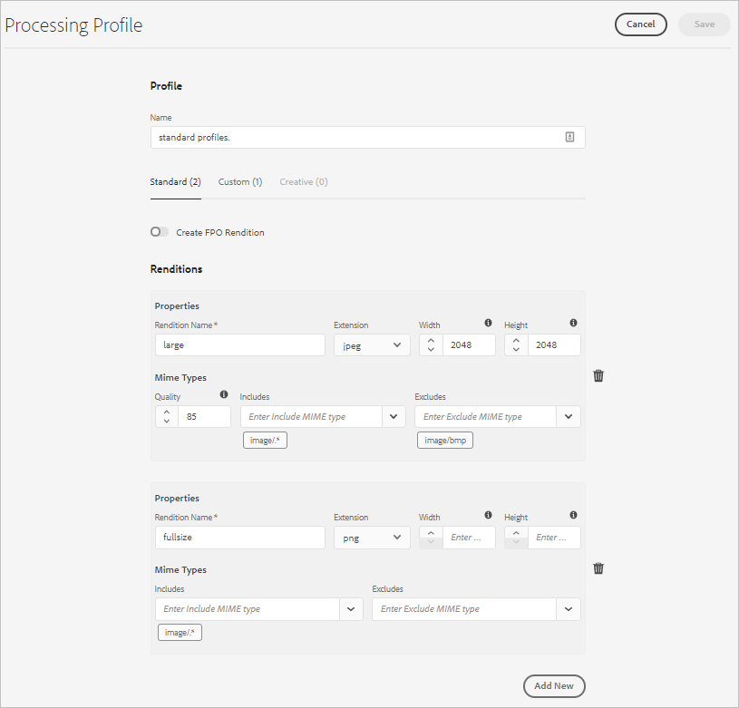
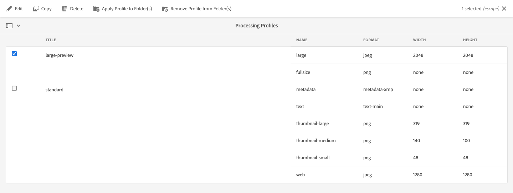

# Aan de slag met microservices voor assets {#get-started-using-asset-microservices}

<!--

* Current capabilities of asset microservices offered. If workers have names then list the names and give a one-liner description. (The feature-set is limited for now and continues to grow. So will this article continue to be updated.)
* How to access the microservices. UI. API. Is extending possible right now?
* Detailed list of what file formats and what processing is supported by which workflows/workers process.
* How/where can admins check what's already configured and provisioned.
* How to create new config or request for new provisioning/purchase.

* [DO NOT COVER?] Exceptions or limitations or link back to lack of parity with AEM 6.5.

-->

Asset microservices bieden een schaalbare en veerkrachtige verwerking van middelen met behulp van cloudservices, die door Adobe worden beheerd voor een optimale verwerking van verschillende typen bedrijfsmiddelen en verwerkingsopties.

De verwerking van activa wordt uitgevoerd gebaseerd op configuratie in de Profielen **[!UICONTROL van de]** Verwerking, die een standaardopstelling verstrekken, en de beheerder toestaan om specifiekere configuratie van de activaverwerking toe te voegen. Om rekbaarheid en volledige aanpassing mogelijk te maken, maakt de verwerking van bedrijfsmiddelen een optionele configuratie van workflows na verwerking mogelijk, die vervolgens door de beheerder worden gemaakt en onderhouden.

Hieronder vindt u een debiet op hoog niveau voor middelenverwerking in Experience Manager als cloudservice.

<!-- Proposed DRAFT diagram for asset microservices flow - see section "asset-microservices-flow.png (asset-microservices-configure-and-use.md)" in the PPTX deck

https://adobe-my.sharepoint.com/personal/gklebus_adobe_com/_layouts/15/guestaccess.aspx?guestaccesstoken=jexDC5ZnepXSt6dTPciH66TzckS1BPEfdaZuSgHugL8%3D&docid=2_1ec37f0bd4cc74354b4f481cd420e07fc&rev=1&e=CdgElS
-->

>[!NOTE]
>
> Voor klanten die een update uitvoeren van eerdere versies van Experience Manager: de in deze sectie beschreven verwerking van middelen vervangt het workflowmodel &quot;DAM Update Asset&quot; dat eerder werd gebruikt voor verwerking van het opnemen van elementen. De meeste stappen voor het genereren van standaardvertoningen en het genereren van metagegevens worden vervangen door de verwerking van de asset microservices. Eventuele resterende stappen kunnen worden vervangen door de configuratie van de workflow na verwerking.

## Aan de slag met middelenverwerking {#get-started}

De verwerking van activa met activa microservices wordt pre-gevormd met een standaardconfiguratie, die ervoor zorgt dat de standaardvertoningen die door het systeem worden vereist beschikbaar zijn. Het zorgt er ook voor dat extractie van metagegevens en tekstextractie beschikbaar zijn. Gebruikers kunnen direct beginnen met het uploaden of bijwerken van elementen en de standaardverwerking is standaard beschikbaar.

Voor specifieke vereisten voor het genereren van vertoningen of het verwerken van elementen kan een AEM-beheerder extra [!UICONTROL verwerkingsprofielen]maken. Gebruikers kunnen een of meer van de beschikbare profielen aan specifieke mappen toewijzen om extra verwerkingstijd te krijgen. U kunt bijvoorbeeld specifieke uitvoeringen voor het web, mobiele apparaten en tablets genereren. In de volgende video ziet u hoe u [!UICONTROL verwerkingsprofielen] maakt en toepast en hoe u toegang krijgt tot de gemaakte uitvoeringen.

>[!VIDEO](https://video.tv.adobe.com/v/29832?quality=9)

Zie [configuraties voor de assetmicroservices](#configure-asset-microservices)voor informatie over het wijzigen van het bestaande profiel.
Zie [nabewerkingsworkflows](#post-processing-workflows)voor informatie over het maken van aangepaste verwerkingsprofielen die specifiek zijn voor uw aangepaste vereisten.

## Configuraties voor assetmicroservices {#configure-asset-microservices}

Om de microservices voor elementen te configureren, kunnen beheerders de gebruikersinterface voor configuratie gebruiken via **[!UICONTROL Gereedschappen > Middelen > Profielen]** verwerken.

### Standaardconfiguratie {#default-config}

Met de standaardconfiguratie, slechts wordt het [!UICONTROL standaardverwerkingsprofiel] gevormd. Het is een ingebouwde en kan niet worden gewijzigd. Deze wordt altijd uitgevoerd om ervoor te zorgen dat alle verwerking die de toepassing vereist, plaatsvindt.

Het standaardverwerkingsprofiel biedt de volgende verwerkingsconfiguratie:

* Standaardminiaturen die worden gebruikt door de gebruikersinterface van Asset (48, 140 en 319 px)
* Grote voorvertoning (webuitvoering, 1280 px)
* Metagegevensextractie
* Tekst extraheren

### Ondersteunde bestandsindelingen {#supported-file-formats}

Middelenmicroservices bieden ondersteuning voor een groot aantal verschillende bestandsindelingen voor het genereren van uitvoeringen of het extraheren van metagegevens. Zie [ondersteunde bestandsindelingen](file-format-support.md) voor de volledige lijst.

### Extra verwerkingsprofielen toevoegen {#processing-profiles}

U kunt extra verwerkingsprofielen toevoegen met de handeling **[!UICONTROL Maken]** .

Elke configuratie met het verwerkingsprofiel bevat een lijst met uitvoeringen. Voor elke vertoning kunt u het volgende opgeven:

* naam van vertoning
* rendition-indeling (JPEG, PNG of GIF worden ondersteund)
* de breedte en hoogte van de vertoning in pixels (indien niet opgegeven, wordt de volledige pixelgrootte van het origineel aangenomen)
* renditiekwaliteit (voor JPEG) in procenten
* Opgenomen en uitgesloten MIME-typen definiëren op welke elementtypen het verwerkingsprofiel van toepassing is

Wanneer een nieuw verwerkingsprofiel wordt opgeslagen, wordt dit toegevoegd aan de lijst met geconfigureerde verwerkingsprofielen. Deze verwerkingsprofielen kunnen vervolgens worden toegepast op mappen in de mappenhiërarchie, zodat ze effectief zijn voor het uploaden van middelen en de middelen die daar zijn gemaakt.

#### Breedte en hoogte van vertoning {#rendition-width-height}

De specificaties voor de uitvoerbreedte en -hoogte bieden maximale grootten van de gegenereerde uitvoerafbeelding. Asset microservice probeert een zo groot mogelijke uitvoering te produceren, waarbij de breedte en hoogte niet groter zijn dan respectievelijk de opgegeven breedte en hoogte. De hoogte-breedteverhouding blijft behouden, dat wil zeggen hetzelfde als het origineel.

Een lege waarde houdt in dat bij de verwerking van elementen de pixelafmetingen van het origineel worden gebruikt.

#### MIME-regels voor typeintegratie {#mime-type-inclusion-rules}

Wanneer een element van een specifiek MIME-type wordt verwerkt, wordt het MIME-type eerst gecontroleerd aan de hand van de waarde van de uitgesloten MIME-typen voor de weergavespecificatie. Als de weergave overeenkomt met die lijst, wordt deze specifieke uitvoering niet gegenereerd voor het actief (&quot;zwarte lijst&quot;).

Anders wordt het MIME-type gecontroleerd op basis van het opgenomen MIME-type en als het overeenkomt met de lijst, wordt de vertoning gegenereerd (&quot;whitelisting&quot;).

#### Speciale FPO-uitvoering {#special-fpo-rendition}

Een verwerkingsprofiel kan een speciale &quot;FPO-uitvoering&quot; bevatten. Deze wordt gebruikt wanneer [Adobe Asset Link](https://helpx.adobe.com/enterprise/using/adobe-asset-link.html) wordt gebruikt met Adobe InDesign om directe koppelingen naar elementen vanuit Experience Manager in InDesign-documenten te plaatsen.

Raadpleeg de [documentatie](https://helpx.adobe.com/nl/enterprise/using/manage-assets-using-adobe-asset-link.html) bij Adobe Asset Link als u deze moet inschakelen voor uw verwerkingsprofiel.

## Middelenmicroservices gebruiken om elementen te verwerken {#use-asset-microservices}

Als er extra verwerkingsprofielen zijn gemaakt, moeten deze worden toegepast op specifieke mappen zodat Experience Manager deze kan gebruiken voor middelenverwerking voor elementen die in deze mappen zijn geüpload of bijgewerkt. Het ingebouwde standaardverwerkingsprofiel wordt altijd uitgevoerd.

Er zijn twee manieren om verwerkingsprofielen toe te passen op mappen:

* Beheerders kunnen een definitie van het verwerkingsprofiel selecteren in **[!UICONTROL Gereedschappen > Middelen > Profielen]** verwerken en de handeling Profiel **[!UICONTROL toepassen op map(pen)]** gebruiken. Er wordt een inhoudbrowser geopend waarmee u naar specifieke mappen kunt navigeren, deze kunt selecteren en de toepassing van het profiel kunt bevestigen.
* Users can select a folder in the Assets user interface, use **[!UICONTROL Properties]** action to open folder properties screen, click on the **[!UICONTROL Processing Profiles]** tab, and in the drop-down, select the right processing profile for that folder. The choice will be save upon **[!UICONTROL Save &amp; Close]** action.

>[!NOTE]
>
>Er kan slechts één verwerkingsprofiel worden toegepast op een specifieke map. Als u meer vertoningen wilt genereren, kunt u meer renditiedefinities aan het verwerkingsprofiel toevoegen.

Nadat een verwerkingsprofiel op een map is toegepast, worden alle nieuwe elementen die in deze map of een van de submappen van deze map zijn geüpload (of bijgewerkt), verwerkt met behulp van het extra verwerkingsprofiel dat is geconfigureerd. Deze extra verwerking is een aanvulling op het standaardprofiel. Als u meerdere profielen toepast op een map, worden de geüploade of bijgewerkte elementen verwerkt met elk van deze profielen.

>[!NOTE]
>
>Wanneer elementen naar een map worden geüpload, controleert Experience Manager de eigenschappen van de bovenliggende map op een verwerkingsprofiel. Als er niets is toegepast, gaat het omhoog in de mappenstructuur totdat er een toegepast verwerkingsprofiel wordt gevonden en wordt het gebruikt voor het element. Dat betekent dat een verwerkingsprofiel dat is toegepast op een map, werkt voor de gehele structuur, maar kan worden overschreven door een ander profiel dat is toegepast op een submap.

Gebruikers kunnen controleren of de verwerking daadwerkelijk heeft plaatsgevonden door een nieuw geüpload element te openen waarvoor de verwerking is voltooid, een voorvertoning van het element te openen en op de weergave **[!UICONTROL Vertoningen]** van het linkerspoor te klikken. De specifieke uitvoeringen in het verwerkingsprofiel, waarvoor het type van het specifieke element overeenkomt met de regels voor het opnemen van het MIME-type, moeten zichtbaar en toegankelijk zijn.

*Figure: Voorbeeld van twee extra vertoningen die worden gegenereerd door een verwerkingsprofiel dat wordt toegepast op de bovenliggende map*

## Nabewerkingsworkflows {#post-processing-workflows}

Voor situaties waarin aanvullende verwerking van activa vereist is die niet met de verwerkingsprofielen kan worden bereikt, kunnen extra naverwerkingsworkflows aan de configuratie worden toegevoegd. Zo kunt u volledig aangepaste verwerking toevoegen bovenop de configureerbare verwerking met behulp van asset microservices.

De workflows na verwerking, indien geconfigureerd, worden automatisch uitgevoerd door AEM nadat de verwerking van de microservices is voltooid. Het is niet nodig om werkstroomlanceerinrichtingen handmatig toe te voegen om ze te activeren.

Voorbeelden zijn:

* aangepaste workflowstappen voor het verwerken van elementen, bijvoorbeeld Java-code om uitvoeringen te genereren op basis van de eigen bestandsindelingen.
* integraties om metagegevens of eigenschappen toe te voegen aan elementen van externe systemen, bijvoorbeeld product- of procesgegevens.
* aanvullende verwerking door externe diensten

Het toevoegen van een workflowconfiguratie na verwerking aan Experience Manager bestaat uit de volgende stappen:

* Een of meer workflowmodellen maken. We noemen ze &#39;workflowmodellen na verwerking&#39;, maar het zijn gewone AEM-workflowmodellen.
* Specifieke workflowstappen toevoegen aan deze modellen. Deze stappen worden uitgevoerd op de elementen die zijn gebaseerd op de configuratie van het workflowmodel.
* De laatste stap van een dergelijk model moet de `DAM Update Asset Workflow Completed Process` stap zijn. Dit is nodig om ervoor te zorgen dat AEM weet dat de verwerking is beëindigd en dat het actief kan worden gemarkeerd als verwerkt (&quot;Nieuw&quot;)
* Het creëren van een configuratie voor de Dienst van de Runner van het Werkschema van de Douane, die voor het vormen van uitvoering van een model van het post-verwerkingswerkschema of door weg (omslagplaats) of regelmatige uitdrukking toestaat

### Workflowmodellen voor naverwerking maken

Workflowmodellen na verwerking zijn gewone AEM-workflowmodellen. Maak verschillende oplossingen als u verschillende verwerkingen nodig hebt voor verschillende opslaglocaties of elementtypen.

Verwerkingsstappen moeten op basis van behoeften worden toegevoegd. U kunt alle ondersteunde stappen gebruiken die beschikbaar zijn, maar ook alle workflowstappen die op maat zijn geïmplementeerd.

De laatste stap van elk van de nabewerkingsworkflows moet de `DAM Update Asset Workflow Completed Process`. Op deze manier zorgt u ervoor dat het element correct is gemarkeerd als &quot;verwerking voltooid&quot;.

### Uitvoering van workflow na verwerking configureren

Om de workflowmodellen na verwerking te configureren die moeten worden uitgevoerd voor elementen die in het systeem zijn geüpload of bijgewerkt nadat de verwerking van de asset microservices is voltooid, moet de Custom Workflow Runner-service worden geconfigureerd.

De dienst van de Runner van het Werkschema van de Douane (`com.adobe.cq.dam.processor.nui.impl.workflow.CustomDamWorkflowRunnerImpl`) is de dienst OSGi en verstrekt twee opties voor configuratie:

* Nabewerkingsworkflows per pad (`postProcWorkflowsByPath`): Meerdere workflowmodellen kunnen worden weergegeven op basis van verschillende repository paden. Paden en modellen moeten worden gescheiden door een dubbele punt. Eenvoudige opslagpaden worden ondersteund en moeten worden toegewezen aan een workflowmodel in het `/var` pad. Bijvoorbeeld: `/content/dam/my-brand:/var/workflow/models/my-workflow`.
* Workflows na verwerking op expressie (`postProcWorkflowsByExpression`): Meerdere workflowmodellen kunnen worden weergegeven op basis van verschillende reguliere expressies. Expressies en modellen moeten worden gescheiden door een dubbele punt. De reguliere expressie moet rechtstreeks naar het knooppunt Asset verwijzen en niet naar een van de uitvoeringen of bestanden. Bijvoorbeeld: `/content/dam(/.*/)(marketing/seasonal)(/.*):/var/workflow/models/my-workflow`.

>[!NOTE]
>
>De configuratie van de Runner van het Werkschema van de Douane is een configuratie van de dienst OSGi. Zie [opstellen aan de Manager](/help/implementing/deploying/overview.md) van de Ervaring voor informatie over hoe te om een configuratie op te stellen OSGi.
> OSGi-webconsole is, in tegenstelling tot on-premise en beheerde services-implementaties van AEM, niet rechtstreeks beschikbaar in de cloudservice-implementaties.

Zie de stappen van de [workflow in de nabewerkingsworkflow](developer-reference-material-apis.md#post-processing-workflows-steps) in de naslagwerkstroom voor meer informatie over welke standaardworkflowstappen kunnen worden gebruikt.
