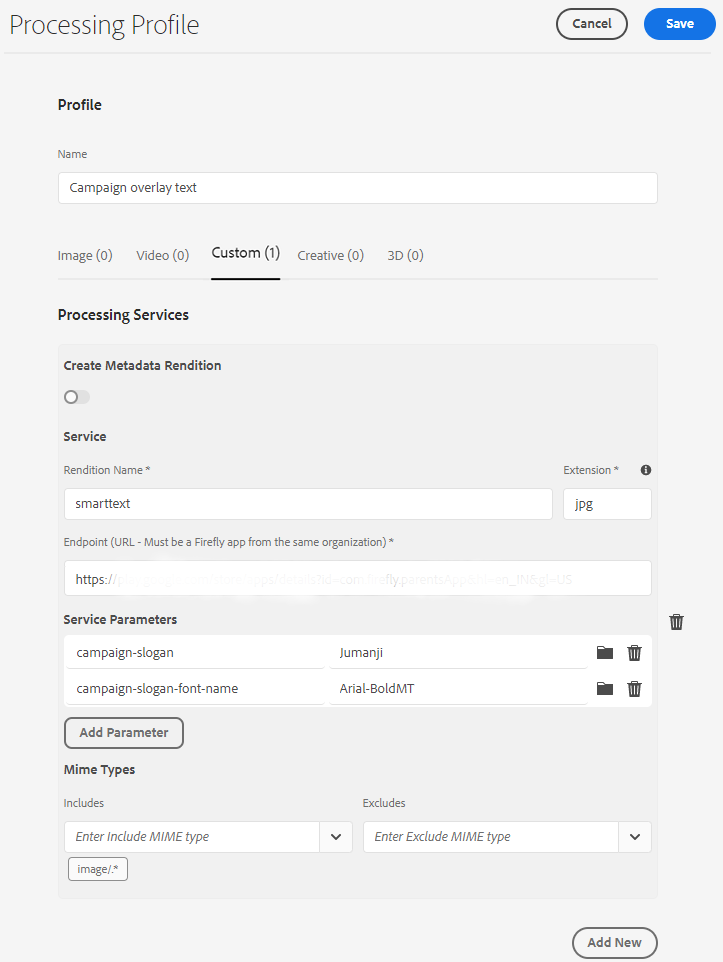

# Middelenmicroservices en verwerkingsprofielen gebruiken {#get-started-using-asset-microservices}

Asset microservices zorgen voor schaalbare en veerkrachtige verwerking van middelen met behulp van cloudnative toepassingen (ook wel workers genoemd). Adobe beheert de services voor een optimale afhandeling van verschillende typen bedrijfsmiddelen en verwerkingsopties.

Met Asset microservices kunt u een [breed scala aan bestandstypen verwerken](/help/assets/file-format-support.md) dat meer indelingen buiten de box behandelt dan mogelijk is met eerdere versies van [!DNL Experience Manager]. Zo is het nu mogelijk miniatuurextractie van PSD- en PSB-indelingen uit te voeren waarvoor eerder oplossingen van derden, zoals ImageMagick, waren vereist.

De verwerking van activa hangt van de configuratie in **[!UICONTROL Processing Profiles]** af. De Experience Manager verstrekt een basisstandaardopstelling en laat beheerders specifiekere configuratie van de activaverwerking toevoegen. Beheerders maken, onderhouden en wijzigen de configuraties van naverwerkingsworkflows, inclusief optionele aanpassing. Door de workflows aan te passen kunnen ontwikkelaars de standaardaanbieding uitbreiden.

<!-- Proposed DRAFT diagram for asset microservices flow - see section "asset-microservices-flow.png (asset-microservices-configure-and-use.md)" in the PPTX deck

https://adobe-my.sharepoint.com/personal/gklebus_adobe_com/_layouts/15/guestaccess.aspx?guestaccesstoken=jexDC5ZnepXSt6dTPciH66TzckS1BPEfdaZuSgHugL8%3D&docid=2_1ec37f0bd4cc74354b4f481cd420e07fc&rev=1&e=CdgElS
-->

>[!NOTE]
>
>De hier beschreven elementverwerking vervangt het `DAM Update Asset` workflowmodel dat in de vorige versies van [!DNL Experience Manager] bestaat. De meeste stappen voor het genereren van standaardvertoningen en het genereren van metagegevens worden vervangen door de verwerking van de asset microservices. Eventuele resterende stappen kunnen worden vervangen door de configuratie van de workflow na verwerking.

## Opties voor middelenverwerking {#get-started} begrijpen

Met Experience Manager kunnen de volgende verwerkingsniveaus worden toegepast.

| Optie | Beschrijving | Gebruikte gevallen |
|---|---|---|
| [Standaardconfiguratie](#default-config) | Het is beschikbaar zoals is en kan niet worden gewijzigd. Deze configuratie biedt de mogelijkheid voor het genereren van zeer eenvoudige vertoningen. | <ul> <li>Standaardminiaturen die worden gebruikt door de gebruikersinterface van [!DNL Assets] (48, 140 en 319 pixels) </li> <li> Grote voorvertoning (webuitvoering, 1280 pixels) </li><li> Metagegevens en tekstextractie.</li></ul> |
| [Aangepaste configuratie](#standard-config) | Gevormd door beheerders via gebruikersinterface. Biedt meer opties voor het genereren van vertoningen door de standaardoptie uit te breiden. De optie voor het uit-van-de-doos uitbreiden voor verschillende indelingen en uitvoeringen. | <ul><li>FPO-uitvoering. </li> <li>Bestandsindeling en resolutie van afbeeldingen wijzigen</li> <li> Voorwaardelijk van toepassing op gevormde dossiertypes. </li> </ul> |
| [Aangepast profiel](#custom-config) | Door beheerders via gebruikersinterface geconfigureerd om aangepaste code te gebruiken via aangepaste toepassingen om [Asset compute Service](https://experienceleague.adobe.com/docs/asset-compute/using/introduction.html) aan te roepen. Ondersteunt complexere vereisten in een cloudnative en schaalbare methode. | Zie [toegestane gebruiksgevallen](#custom-config). |

<!-- To create custom processing profiles specific to your custom requirements, say to integrate with other systems, see [post-processing workflows](#post-processing-workflows).
-->

## Ondersteunde bestandsindelingen {#supported-file-formats}

Asset microservices bieden ondersteuning voor een groot aantal verschillende bestandsindelingen voor het verwerken, genereren en extraheren van metagegevens. Zie [ondersteunde bestandsindelingen](file-format-support.md) voor de volledige lijst met MIME-typen en de ondersteunde functionaliteit voor elk type.

## Standaardconfiguratie {#default-config}

Sommige standaardwaarden zijn vooraf geconfigureerd om ervoor te zorgen dat de standaarduitvoeringen die in Experience Manager worden vereist, beschikbaar zijn. De standaardconfiguratie zorgt er ook voor dat extractie van metagegevens en tekstextractie beschikbaar zijn. Gebruikers kunnen direct beginnen met het uploaden of bijwerken van elementen en de standaardverwerking is standaard beschikbaar.

Met de standaardconfiguratie, slechts wordt het meest basisverwerkingsprofiel gevormd. Een dergelijk verwerkingsprofiel is niet zichtbaar in de gebruikersinterface en u kunt het niet wijzigen. Het wordt altijd uitgevoerd om geüploade elementen te verwerken. Een dergelijk standaardverwerkingsprofiel zorgt ervoor dat de basisverwerking die door [!DNL Experience Manager] wordt vereist op alle activa wordt voltooid.

<!-- 
-->

## Standaardconfiguratie {#standard-config}

[!DNL Experience Manager] bieden mogelijkheden om specifiekere uitvoeringen voor algemene indelingen te genereren naar gelang de behoeften van de gebruiker. Een beheerder kan extra [!UICONTROL Processing Profiles] maken om het maken van dergelijke vertoningen te vergemakkelijken. Gebruikers wijzen vervolgens een of meer van de beschikbare profielen toe aan specifieke mappen om de extra verwerking te voltooien. De extra verwerking kan bijvoorbeeld uitvoeringen genereren voor het web, mobiele apparaten en tablets. De volgende video laat zien hoe u [!UICONTROL Processing Profiles] kunt maken en toepassen en hoe u toegang krijgt tot de gemaakte uitvoeringen.

* **Breedte en hoogte** van vertoning: De specificaties voor de uitvoerbreedte en -hoogte bieden maximale grootten van de gegenereerde uitvoerafbeelding. Middelenmicroservices proberen de grootst mogelijke uitvoering te produceren, waarbij de breedte en hoogte niet groter zijn dan respectievelijk de opgegeven breedte en hoogte. De hoogte-breedteverhouding blijft behouden, dat wil zeggen hetzelfde als het origineel. Een lege waarde houdt in dat bij de verwerking van elementen de pixelafmetingen van het origineel worden gebruikt.

* **MIME-regels voor** typeintegratie: Wanneer een element van een specifiek MIME-type wordt verwerkt, wordt het MIME-type eerst gecontroleerd aan de hand van de waarde van de uitgesloten MIME-typen voor de weergavespecificatie. Als deze overeenkomt met die lijst, wordt deze specifieke uitvoering niet gegenereerd voor het element (lijst van afgewezen personen). Anders wordt het MIME-type gecontroleerd op basis van het opgenomen MIME-type en als het overeenkomt met de lijst, wordt de vertoning gegenereerd (lijst van gewenste personen).

* **Speciale FPO-uitvoering**: Bij het plaatsen van grote activa van  [!DNL Experience Manager] in  [!DNL Adobe InDesign] documenten wacht een creatieve beroeps een lange tijd nadat zij  [activa](https://helpx.adobe.com/indesign/using/placing-graphics.html) plaatsen. Ondertussen wordt de gebruiker geblokkeerd om [!DNL InDesign] te gebruiken. Dit onderbreekt de creatieve stroom en beïnvloedt de gebruikerservaring negatief. Met Adobe kunt u tijdelijk kleine uitvoeringen plaatsen in [!DNL InDesign]-documenten om te beginnen. Deze kunnen later worden vervangen door middelen met volledige resolutie. [!DNL Experience Manager] biedt uitvoeringen die alleen voor plaatsing (FPO) worden gebruikt. Deze FPO-uitvoeringen hebben een kleine bestandsgrootte maar hebben dezelfde hoogte-breedteverhouding.

Het verwerkingsprofiel kan een FPO-uitvoering (alleen voor plaatsing) bevatten. Zie [!DNL Adobe Asset Link] [documentatie](https://helpx.adobe.com/nl/enterprise/using/manage-assets-using-adobe-asset-link.html) om te begrijpen als u het voor uw verwerkingsprofiel moet aanzetten. Zie [Volledige documentatie van Adobe Asset Link voor meer informatie](https://helpx.adobe.com/enterprise/using/adobe-asset-link.html).

### Standaardprofiel {#create-standard-profile} maken

Voer de volgende stappen uit om een standaardverwerkingsprofiel te maken:

1. Beheerders openen **[!UICONTROL Tools]** > **[!UICONTROL Assets]** > **[!UICONTROL Processing Profiles]**. Klik op **[!UICONTROL Create]**.
1. Geef een naam op waarmee u het profiel op unieke wijze kunt identificeren wanneer u het toepast op een map.
1. Schakel **[!UICONTROL Create FPO Rendition]** in op het tabblad **[!UICONTROL Standard]** om FPO-uitvoeringen te genereren. Voer een waarde tussen 1 en 100 in voor **[!UICONTROL Quality]**.
1. Als u andere vertoningen wilt genereren, klikt u op **[!UICONTROL Add New]** en geeft u de volgende informatie op:

   * Bestandsnaam van elke vertoning.
   * Bestandsindeling (PNG, JPEG, GIF of WebP) voor elke uitvoering.
   * Breedte en hoogte in pixels van elke uitvoering. Als de waarden niet worden opgegeven, wordt de volledige pixelgrootte van de oorspronkelijke afbeelding gebruikt.
   * Kwaliteit in procenten van elke JPEG- en WebP-uitvoering.
   * MIME-typen zijn opgenomen en uitgesloten om de toepasbaarheid van een profiel te definiëren.

   

1. Klik op **[!UICONTROL Save]**.

<!-- TBD: Update the video link when a new video is available from Tech Marketing.

The following video demonstrates the usefulness and usage of standard profile.

>[!VIDEO](https://video.tv.adobe.com/v/29832?quality=9)
-->

<!-- This image was removed per cqdoc-15624, as requested by engineering.
  
 -->

## Aangepast profiel en gebruik {#custom-config}

[!DNL Asset Compute Service] steunt een verscheidenheid van gebruiksgevallen zoals standaardverwerking, verwerkend Adobe-specifieke formaten zoals de dossiers van Photoshop, en het uitvoeren van douane of organisatie-specifieke verwerking. De in het verleden vereiste aanpassing van de DAM-updateworkflow voor middelen wordt automatisch of via de configuratie van verwerkingsprofielen afgehandeld. Als deze verwerkingsopties niet aan de bedrijfsbehoeften voldoen, raadt Adobe aan de standaardmogelijkheden te ontwikkelen en te gebruiken. [!DNL Asset Compute Service] Voor een overzicht, zie [uitbreidbaarheid begrijpen en wanneer om het te gebruiken](https://experienceleague.adobe.com/docs/asset-compute/using/extend/understand-extensibility.html).

>[!NOTE]
>
>Adobe raadt u aan een aangepaste toepassing alleen te gebruiken als de zakelijke vereisten niet kunnen worden vervuld met de standaardconfiguraties of het standaardprofiel.

Het kan beeld, video, document, en andere dossierformaten in verschillende vertoningen met inbegrip van duimnagels, gehaalde tekst en meta-gegevens, en archieven omzetten.

Ontwikkelaars kunnen [!DNL Asset Compute Service] aan [gebruiken om douanetoepassingen te creëren](https://experienceleague.adobe.com/docs/asset-compute/using/extend/develop-custom-application.html) die aan de gesteunde gebruiksgevallen behandelen. [!DNL Experience Manager] U kunt deze aangepaste toepassingen vanuit de gebruikersinterface aanroepen met behulp van aangepaste profielen die beheerders configureren. [!DNL Asset Compute Service] steunt de volgende gevallen waarin externe diensten worden opgeroepen:

* Gebruik [!DNL Adobe Photoshop] [ImageCutout API](https://github.com/AdobeDocs/photoshop-api-docs-pre-release#imagecutout) en sla het resultaat op als uitvoering.
* De systemen van de derde vraag om gegevens, bijvoorbeeld, een PIM systeem bij te werken.
* Gebruik de API [!DNL Photoshop] om verschillende uitvoeringen te genereren op basis van de Photoshop-sjabloon.
* Gebruik [Adobe Lightroom API](https://github.com/AdobeDocs/lightroom-api-docs#supported-features) om de opgenomen elementen te optimaliseren en deze als uitvoeringen op te slaan.

>[!NOTE]
>
>U kunt de standaardmetagegevens niet bewerken met de aangepaste toepassingen. U kunt alleen aangepaste metagegevens wijzigen.

### Een aangepast profiel maken {#create-custom-profile}

Ga als volgt te werk om een aangepast profiel te maken:

1. Beheerders hebben toegang tot **[!UICONTROL Tools > Assets > Processing Profiles]**. Klik op **[!UICONTROL Create]**.
1. Klik op het tabblad **[!UICONTROL Custom]**. Klik op **[!UICONTROL Add New]**. Geef de gewenste bestandsnaam van de vertoning op.
1. Geef de volgende informatie op.

   * Bestandsnaam van elke vertoning en een ondersteunde bestandsextensie.
   * [Eindpunt-URL van een Firefly-aangepaste app](https://experienceleague.adobe.com/docs/asset-compute/using/extend/deploy-custom-application.html). De app moet afkomstig zijn van dezelfde organisatie als de Experience Manager-account.
   * Voeg de Parameters van de Dienst aan [geef extra informatie of parameters aan de douanetoepassing ](https://experienceleague.adobe.com/docs/asset-compute/using/extend/develop-custom-application.html#extend) door.
   * MIME-typen zijn opgenomen en uitgesloten om de verwerking te beperken tot een paar specifieke bestandsindelingen.

   Klik op **[!UICONTROL Save]**.

De aangepaste toepassingen hebben geen kop [Project Firefly](https://github.com/AdobeDocs/project-firefly)-toepassingen. De aangepaste toepassing haalt alle beschikbare bestanden op als deze zijn ingesteld met een verwerkingsprofiel. De toepassing moet de bestanden filteren.

>[!CAUTION]
>
>Als de Firefly-app en [!DNL Experience Manager]-account niet van dezelfde organisatie afkomstig zijn, werkt de integratie niet.

### Een voorbeeld van een aangepast profiel {#custom-profile-example}

Als u het gebruik van een aangepast profiel wilt illustreren, kunt u het beste een kwestie-case gebruiken om aangepaste tekst toe te passen op campagneafbeeldingen. U kunt een verwerkingsprofiel maken dat de Photoshop API gebruikt om de afbeeldingen te bewerken.

Dankzij de asset compute Service-integratie kan Experience Manager deze parameters doorgeven aan de aangepaste toepassing met behulp van het veld [!UICONTROL Service Parameters]. De aangepaste toepassing roept vervolgens de Photoshop API aan en geeft deze waarden door aan de API. U kunt bijvoorbeeld lettertypenaam, tekstkleur, tekstdikte en tekstgrootte doorgeven om aangepaste tekst toe te voegen aan campagneafbeeldingen.

*Afbeelding: Het  [!UICONTROL Service Parameters] gebied van het gebruik om toegevoegde informatie tot vooraf bepaalde parameters over te gaan bouwt in de douanetoepassing. In dit voorbeeld worden de afbeeldingen bijgewerkt met `Jumanji` tekst in `Arial-BoldMT` font.*

## Verwerkingsprofielen gebruiken om elementen {#use-profiles} te verwerken

Maak en pas de extra aangepaste verwerkingsprofielen toe op specifieke mappen die Experience Manager kan verwerken voor elementen die zijn geüpload naar of bijgewerkt in deze mappen. Het standaard ingebouwde standaard verwerkingsprofiel wordt altijd uitgevoerd, maar is niet zichtbaar in de gebruikersinterface. Als u een aangepast profiel toevoegt, worden beide profielen gebruikt om de geüploade elementen te verwerken.

Pas verwerkingsprofielen toe op mappen met een van de volgende methoden:

* Beheerders kunnen een definitie van het verwerkingsprofiel selecteren in **[!UICONTROL Tools]** > **[!UICONTROL Assets]** > **[!UICONTROL Processing Profiles]** en **[!UICONTROL Apply Profile to Folder(s)]**-handeling gebruiken. Er wordt een inhoudbrowser geopend waarmee u naar specifieke mappen kunt navigeren, deze kunt selecteren en de toepassing van het profiel kunt bevestigen.
* Gebruikers kunnen een map selecteren in de gebruikersinterface Middelen, de handeling **[!UICONTROL Properties]** gebruiken om het scherm met mapeigenschappen te openen, op het tabblad **[!UICONTROL Processing Profiles]** klikken en in de keuzelijst het juiste verwerkingsprofiel voor die map selecteren. Klik op **[!UICONTROL Save & Close]** om de wijzigingen op te slaan.
   

>[!TIP]
>
>Er kan slechts één verwerkingsprofiel worden toegepast op een map. Als u meer uitvoeringen wilt genereren, voegt u meer renderdefinities toe aan het bestaande verwerkingsprofiel.

Nadat een verwerkingsprofiel op een map is toegepast, worden alle nieuwe elementen die in deze map of een van de submappen van deze map zijn geüpload (of bijgewerkt), verwerkt met behulp van het extra verwerkingsprofiel dat is geconfigureerd. Deze verwerking is een aanvulling op het standaardprofiel.

>[!NOTE]
>
>Een verwerkingsprofiel dat is toegepast op een map, werkt voor de gehele structuur, maar kan worden overschreven door een ander profiel dat is toegepast op een submap. Wanneer middelen aan een omslag worden geupload, controleert de Experience Manager de bevattende omslageigenschappen voor een verwerkingsprofiel. Als er geen toepassing is, wordt gecontroleerd of er een verwerkingsprofiel van toepassing is in een bovenliggende map in de hiërarchie.

Als u wilt controleren of elementen worden verwerkt, bekijkt u een voorvertoning van de gegenereerde uitvoeringen in de weergave [!UICONTROL Renditions] in de linkerrails. Open de voorvertoning van elementen en open de linkerrails voor toegang tot de weergave **[!UICONTROL Renditions]**. De specifieke uitvoeringen in het verwerkingsprofiel, waarvoor het type van het specifieke element overeenkomt met de regels voor het opnemen van het MIME-type, moeten zichtbaar en toegankelijk zijn.

*Afbeelding: Voorbeeld van twee extra vertoningen die worden gegenereerd door een verwerkingsprofiel dat wordt toegepast op de bovenliggende map.*

## Nabewerkingsworkflows {#post-processing-workflows}

Voor situaties waarin aanvullende verwerking van activa vereist is die niet met de verwerkingsprofielen kan worden bereikt, kunnen extra naverwerkingsworkflows aan de configuratie worden toegevoegd. Zo kunt u volledig aangepaste verwerking toevoegen bovenop de configureerbare verwerking met behulp van asset microservices.

Nabewerkingsworkflows worden, indien geconfigureerd, automatisch uitgevoerd door [!DNL Experience Manager] nadat de verwerking van de microservices is voltooid. Het is niet nodig om werkstroomlanceerinrichtingen handmatig toe te voegen om ze te activeren. De voorbeelden zijn:

* Aangepaste workflowstappen om elementen te verwerken.
* Integraties om metagegevens of eigenschappen toe te voegen aan elementen van externe systemen, bijvoorbeeld product- of procesgegevens.
* Aanvullende verwerking door externe services.

Het toevoegen van een workflowconfiguratie na verwerking aan Experience Manager bestaat uit de volgende stappen:

* Maak een of meer workflowmodellen. De documenten noemen het als *postprocessing werkschemamodellen*, maar dat zijn regelmatige modellen van het werkschema van de Experience Manager.
* Voeg specifieke workflowstappen toe aan deze modellen. De stappen worden uitgevoerd op de activa die op een configuratie van het werkschemamodel worden gebaseerd.
* Voeg [!UICONTROL DAM Update Asset Workflow Completed Process] stap aan het einde toe. Als u deze stap toevoegt, weet de Experience Manager wanneer de verwerking eindigt en kan het element worden gemarkeerd als verwerkt. Met andere woorden: *Nieuw* wordt op het element weergegeven.
* Creeer een configuratie voor de Dienst van de Runner van het Werkschema van de Douane die toestaat om uitvoering van een model van het post-verwerkingswerkschema of door een weg (omslagplaats) of door een regelmatige uitdrukking te vormen.

### Workflowmodellen voor naverwerking maken {#create-post-processing-workflow-models}

Workflowmodellen na verwerking zijn standaardworkflowmodellen [!DNL Experience Manager]. Maak verschillende modellen als u verschillende verwerkingen nodig hebt voor verschillende opslaglocaties of elementtypen.

Verwerkingsstappen moeten op basis van behoeften worden toegevoegd. U kunt alle ondersteunde stappen gebruiken die beschikbaar zijn, maar ook alle aangepaste workflowstappen.

Zorg ervoor dat de laatste stap van elke naverwerkingwerkstroom `DAM Update Asset Workflow Completed Process` is. De laatste stap helpt ervoor te zorgen dat de Experience Manager weet wanneer de activaverwerking wordt voltooid.

### Uitvoering van workflow na verwerking {#configure-post-processing-workflow-execution} configureren

Om de workflowmodellen na verwerking te configureren die moeten worden uitgevoerd voor elementen die in het systeem zijn geüpload of bijgewerkt nadat de verwerking van de asset microservices is voltooid, moet de Custom Workflow Runner-service worden geconfigureerd.

De service Custom Workflow Runner (`com.adobe.cq.dam.processor.nui.impl.workflow.CustomDamWorkflowRunnerImpl`) is een OSGi-service en biedt twee opties voor configuratie:

* Nabewerkingsworkflows per pad (`postProcWorkflowsByPath`): Meerdere workflowmodellen kunnen worden weergegeven op basis van verschillende repository paden. Paden en modellen moeten worden gescheiden door een dubbele punt. Eenvoudige opslagpaden worden ondersteund en moeten worden toegewezen aan een workflowmodel in het pad `/var`. Bijvoorbeeld: `/content/dam/my-brand:/var/workflow/models/my-workflow`.
* Workflows na verwerking op expressie (`postProcWorkflowsByExpression`): Meerdere workflowmodellen kunnen worden weergegeven op basis van verschillende reguliere expressies. Expressies en modellen moeten worden gescheiden door een dubbele punt. De reguliere expressie moet rechtstreeks naar het knooppunt Asset verwijzen en niet naar een van de uitvoeringen of bestanden. Bijvoorbeeld: `/content/dam(/.*/)(marketing/seasonal)(/.*):/var/workflow/models/my-workflow`.

>[!NOTE]
>
>De configuratie van de Runner van het Werkschema van de Douane is een configuratie van de dienst OSGi. Zie [opstellen aan Experience Manager](/help/implementing/deploying/overview.md) voor informatie over hoe te om een configuratie op te stellen OSGi.
>OSGi-webconsole is, in tegenstelling tot on-premise en beheerde services-implementaties van [!DNL Experience Manager], niet rechtstreeks beschikbaar in de cloudservice-implementaties.

Zie [workflowstappen in naverwerkingsworkflow](developer-reference-material-apis.md#post-processing-workflows-steps) in de naslaggids voor ontwikkelaars voor meer informatie over de standaardworkflowstap die kan worden gebruikt in de naverwerkingsworkflow.

## Beste werkwijzen en beperkingen {#best-practices-limitations-tips}

* Houd rekening met uw behoeften aan alle typen uitvoeringen wanneer u workflows ontwerpt. Als u in de toekomst geen uitvoering nodig hebt, verwijdert u de aanmaakstap uit de workflow. Uitvoeringen kunnen daarna niet bulksgewijs worden verwijderd. Ongewenste vertoningen kunnen veel opslagruimte innemen na langdurig gebruik van [!DNL Experience Manager]. Voor afzonderlijke elementen kunt u uitvoeringen handmatig uit de gebruikersinterface verwijderen. Voor meerdere elementen kunt u [!DNL Experience Manager] aanpassen om specifieke vertoningen te verwijderen of de elementen verwijderen en deze opnieuw uploaden.
* Momenteel is de ondersteuning beperkt tot het genereren van uitvoeringen. Het genereren van nieuwe elementen wordt niet ondersteund.
* De maximale bestandsgrootte voor het uitnemen van metagegevens is momenteel ongeveer 10 GB. Wanneer u zeer grote elementen uploadt, mislukt het uitnemen van metagegevens soms.

>[!MORELIKETHIS]
>
>* [Inleiding tot Asset compute Service](https://experienceleague.adobe.com/docs/asset-compute/using/introduction.html).
>* [Begrijp uitbreidbaarheid en wanneer om het](https://experienceleague.adobe.com/docs/asset-compute/using/extend/understand-extensibility.html) te gebruiken.
>* [Aangepaste toepassingen](https://experienceleague.adobe.com/docs/asset-compute/using/extend/develop-custom-application.html) maken.
>* [Ondersteunde MIME-typen voor verschillende gebruiksgevallen](/help/assets/file-format-support.md).

<!-- TBD: 
* How/where can admins check what's already configured and provisioned.
* How/where to request for new provisioning/purchase.
-->
