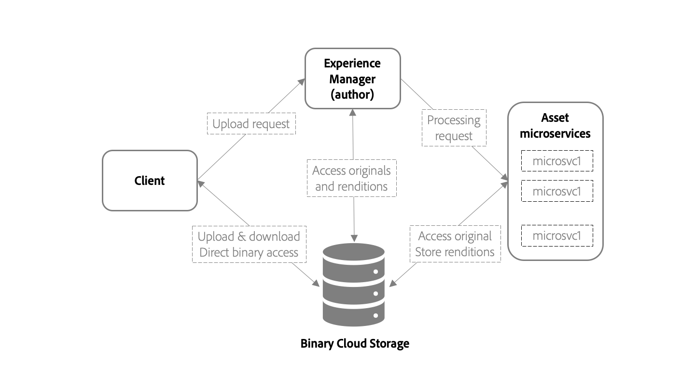

# Overzicht van het opnemen en verwerken van bedrijfsmiddelen met microservices voor bedrijfsmiddelen {#asset-microservices-overview}

<!--
First half of content at https://git.corp.adobe.com/aklimets/project-nui/blob/master/docs/Project-Nui-Asset-Compute-Service.md is useful for this article.
TBD: Post-GA we will provide detailed information at \help\assets\asset-microservices-configure-and-use.md. However, for GA, all information is added, in short, in this article.

-->

Adobe Experience Manager als Cloud Service biedt een in de cloud geïntegreerde manier om toepassingen en mogelijkheden van Experience Manager te gebruiken. Een van de belangrijkste elementen van deze nieuwe architectuur is het opnemen en verwerken van bedrijfsmiddelen, aangedreven door microservices voor bedrijfsmiddelen.

Asset microservices bieden een schaalbare en veerkrachtige verwerking van middelen met behulp van cloudservices, die door Adobe worden beheerd voor een optimale verwerking van verschillende typen bedrijfsmiddelen en verwerkingsopties. Belangrijkste voordelen zijn:

* Schaalbare architectuur die een naadloze verwerking mogelijk maakt voor bronintensieve bewerkingen.
* Efficiënte indexering en tekstextracties die geen invloed hebben op de prestaties van uw Experience Manager-omgevingen.
* Minimaliseer de behoefte aan werkschema&#39;s om activa verwerking in het milieu van de Manager van de Ervaring te behandelen. Hierdoor worden bronnen vrijgemaakt, wordt de belasting op de Experience Manager tot een minimum beperkt en is schaalbaarheid mogelijk.
* Verbeterde veerkracht van de verwerking van bedrijfsmiddelen. Mogelijke problemen bij het verwerken van atypische bestanden, zoals beschadigde bestanden of extreem grote bestanden, hebben geen gevolgen meer voor de prestaties van de implementatie.
* Vereenvoudigde configuratie van middelenverwerking voor beheerders.
* De instellingen voor middelenverwerking worden beheerd en onderhouden door Adobe om de best bekende configuratie te bieden voor de verwerking van uitvoeringen, metagegevens en tekstextractie voor verschillende bestandstypen
* Waar van toepassing worden native Adobe-bestandsverwerkingsservices gebruikt, die garant staan voor hoogwaardige uitvoer en een efficiënte verwerking van door Adobe gegenereerde indelingen.
* Mogelijkheid om een workflow voor naverwerking te configureren om gebruikersspecifieke acties en integratie toe te voegen.

Middelenmicroservices helpen u de behoefte aan renderingtools van derden (zoals ImageMagick) te voorkomen en vereenvoudigen de configuratie van het systeem, terwijl ze tevens functionaliteit bieden die buiten de box valt voor algemene bestandstypen.

## Architectuur op hoog niveau {#asset-microservices-architecture}

Een architectuurdiagram op hoog niveau geeft de belangrijkste elementen weer van het opnemen en verwerken van bedrijfsmiddelen en de stroom van bedrijfsmiddelen in het systeem.

<!-- Proposed DRAFT diagram for asset microservices overview - see section "Asset processing - high-level diagram" in the PPTX deck

https://adobe-my.sharepoint.com/personal/gklebus_adobe_com/_layouts/15/guestaccess.aspx?guestaccesstoken=jexDC5ZnepXSt6dTPciH66TzckS1BPEfdaZuSgHugL8%3D&docid=2_1ec37f0bd4cc74354b4f481cd420e07fc&rev=1&e=CdgElS
-->

De belangrijkste stappen van de opname en verwerking met behulp van asset microservices zijn:

* Clients, zoals webbrowsers of Adobe Asset Link, sturen een aanvraag voor het uploaden naar Experience Manager en beginnen het binaire bestand rechtstreeks te uploaden naar de binaire cloudopslag.
* Wanneer het directe binaire uploaden is voltooid, brengt de client een melding naar Experience Manager.
* De Manager van de ervaring verzendt een verwerkingsverzoek naar activa microservices. De inhoud van de aanvraag is afhankelijk van de configuratie van de verwerkingsprofielen in Experience Manager die bepaalt welke uitvoeringen moeten worden gegenereerd
* De back-end van de microservices van activa ontvangt het verzoek, verzendt het naar één of meerdere microservices die op het verzoek worden gebaseerd. Elke microservice krijgt rechtstreeks vanuit de binaire cloudopslag toegang tot het oorspronkelijke binaire bestand.
* De resultaten van de verwerking, zoals uitvoeringen, worden opgeslagen in de binaire cloudopslag.
* Experience Manager wordt op de hoogte gesteld dat de verwerking compleet is en dat er directe aanwijzers naar de gegenereerde binaire bestanden (uitvoeringen) beschikbaar zijn in Experience Manager voor het geüploade element

Dit is de basisstroom van activa het opnemen en verwerken. Indien dit het geval is, kan de Experience Manager ook het workflowmodel van de klant starten om het middel na de verwerking uit te voeren, bijvoorbeeld om enkele aangepaste stappen uit te voeren die specifiek zijn voor de omgeving van de klant, zoals het ophalen van informatie van de bedrijfssystemen van de klant om het element aan de eigenschappen van het bedrijfsmiddel toe te voegen.

De opname en de verwerkingsstroom tonen een paar zeer belangrijke concepten die door de architectuur van de activa microservices voor de Manager van de Ervaring worden gebruikt:

* **Directe binaire toegang** - de activa worden vervoerd (en geupload) aan de Binaire Opslag van de Wolk zodra gevormd voor de milieu&#39;s van de Manager van de Ervaring, en dan AEM, activa microservices, en tenslotte krijgen de cliënten directe toegang tot hen om hun werk uit te voeren. Dit minimaliseert de lading op netwerken en duplicatie van opgeslagen binaire bestanden
* **Extern verwerken** - de verwerking van bedrijfsmiddelen vindt plaats buiten de AEM-omgeving en bespaart de bronnen (CPU, geheugen) voor het bieden van belangrijke functies voor beheer van digitale bedrijfsmiddelen en het ondersteunen van interactief werk met het systeem voor eindgebruikers

## Middelen uploaden met directe binaire toegang {#asset-upload-with-direct-binary-access}

De cliënten van de manager van de ervaring, die een deel van product aanbieden, allen steun uploaden met directe binaire toegang door gebrek. Hiertoe behoren het uploaden via de webinterface, Adobe Asset Link en de AEM-bureaubladtoepassing.

U kunt aangepaste uploadgereedschappen gebruiken die rechtstreeks werken met AEM HTTP-API&#39;s. U kunt deze APIs direct gebruiken, of de volgende open bronprojecten gebruiken en uitbreiden die het uploadprotocol uitvoeren:

* [Bronuploadbibliotheek openen](https://github.com/adobe/aem-upload)
* [Opdrachtregelgereedschap van bron openen](https://github.com/adobe/aio-cli-plugin-aem)

Zie Elementen [uploaden](add-assets.md)voor meer informatie.

## Aangepaste elementen nabewerken toevoegen {#add-custom-asset-post-processing}

Terwijl de meeste klanten al hun behoeften van de activaverwerking van de configureerbare activa microservices zouden moeten krijgen, zouden sommige extra activa kunnen vereisen verwerkend. Dit geldt met name wanneer activa moeten worden verwerkt op basis van informatie die via integratie van andere systemen afkomstig is. In dergelijke gevallen kunnen aangepaste nabewerkingsworkflows worden gebruikt.

Nabewerkingsworkflows zijn gewone AEM-workflowmodellen die zijn gemaakt en beheerd in de AEM Workflow Editor. Klanten kunnen de workflows configureren om aanvullende verwerkingsstappen uit te voeren op een middel, waaronder het gebruik van beschikbare workflowstappen buiten de box en aangepaste workflows.

Adobe Experience Manager kan zo worden geconfigureerd dat de nabewerkingsworkflows automatisch worden geactiveerd nadat de verwerking van de middelen is voltooid.

<!-- TBD asgupta, Engg: Create some asset-microservices-data-flow-diagram.
-->

>[!MORELIKETHIS]
>
>* [Aan de slag met elementmicroservices](asset-microservices-configure-and-use.md)
>* [Ondersteunde bestandsindelingen](file-format-support.md)
>* [Adobe-elementkoppeling](https://helpx.adobe.com/enterprise/using/adobe-asset-link.html)
>* [AEM-bureaubladtoepassing](https://docs.adobe.com/content/help/en/experience-manager-desktop-app/using/introduction.html)
>* [Apache Oak-documentatie over directe binaire toegang](https://jackrabbit.apache.org/oak/docs/features/direct-binary-access.html)

