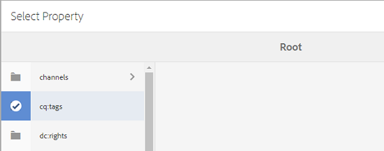
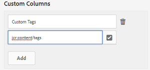

# Elementrapporten {#asset-reports}

Asset Reporting is een belangrijk hulpmiddel om het nut van de implementatie van Adobe Experience Manager (AEM)-middelen te beoordelen. Met AEM Assets kunt u diverse rapporten genereren over uw digitale middelen. De rapporten bevatten nuttige informatie over het gebruik van uw systeem, over de manier waarop gebruikers met elementen werken en over de elementen die worden gedownload en gedeeld.

Gebruik de informatie in de rapporten om zeer belangrijke succesmetriek af te leiden om de goedkeuring van activa AEM binnen uw onderneming en door klanten te meten.

Het rapportagekader voor AEM Assets gebruikt Sling-taken om rapportageaanvragen op geordende wijze asynchroon te verwerken. Het is schaalbaar voor grote opslagruimten. De asynchrone rapportverwerking verhoogt de efficiency en de snelheid waarmee de rapporten worden geproduceerd.

De interface van het rapportbeheer is intuïtief en omvat fijnkorrelige opties en controles om tot gearchiveerde rapporten toegang te hebben en de loopstatussen van het meningsrapport (succes, ontbroken, en een rij gevormd) in werking te stellen.

Wanneer een rapport wordt gegenereerd, ontvangt u een melding via e-mail (optioneel) en een postbusmelding. U kunt een rapport weergeven, downloaden of verwijderen van de pagina met rapportlijsten waarop alle eerder gegenereerde rapporten worden weergegeven.

## Rapporten genereren {#generate-reports}

AEM Assets produceert de volgende standaardrapporten voor u:

* Uploaden
* Downloaden
* Verlopen
* Wijziging
* Publiceren
* Poortpublicatie merk
* Schijfgebruik
* Bestanden
* Delen van koppeling

AEM-beheerders kunnen deze rapporten eenvoudig genereren en aanpassen voor uw implementatie. Een beheerder kan deze stappen volgen om een rapport te produceren:

1. Tik/klik op het AEM-logo en ga naar **[!UICONTROL Gereedschappen]** > **[!UICONTROL Middelen]** > **[!UICONTROL Rapporten]**.

   

1. Tik op of klik op **[!UICONTROL Maken]** op de werkbalk op de pagina Elementrapporten.
1. Kies op de pagina Rapport **** maken het rapport dat u wilt maken en tik op **[!UICONTROL Volgende]**.

   

   >[!NOTE]
   >
   >Voordat u een rapport **[!UICONTROL Asset Downloaded]** kunt genereren, moet u controleren of de service Asset Download is ingeschakeld. Open vanuit de webconsole (`https://[aem_server]:[port]/system/console/configMgr`) de configuratie van de DAM-gebeurtenisrecorder **[!UICONTROL voor]** dagen van CQ en selecteer de optie **[!UICONTROL Gedownloade]** middelen (GEDOWNLOAD)in gebeurtenistypen als deze optie nog niet is geselecteerd.

   >[!NOTE]
   >
   >Standaard worden de Content Fragments en de shares van de koppeling opgenomen in het rapport Gedownloade middelen. Selecteer de aangewezen optie om een rapport van verbindingsaandelen tot stand te brengen of inhoudsfragmenten van het downloadrapport uit te sluiten.

1. Configureer rapportdetails zoals titel, beschrijving, miniatuur en mappad in de CRX-opslagplaats waar het rapport wordt opgeslagen. Standaard is het mappad */content/dam*. U kunt een ander pad opgeven.

   

   Kies het datumbereik voor uw rapport.

   U kunt ervoor kiezen het rapport nu of op een toekomstige datum en tijd te genereren.

   >[!NOTE]
   >
   >Als u ervoor kiest om het rapport op een recentere datum te plannen, zorg ervoor dat u de datum en de tijd op het gebied van de Datum en van de Tijd specificeert. Als u geen waarde specificeert, behandelt de rapportmotor het als een rapport dat onmiddellijk moet worden geproduceerd.

   De gebieden van de configuratie kunnen verschillen gebaseerd op het type van rapport u creeert.

   Het rapport **[!UICONTROL Schijfgebruik]** bevat bijvoorbeeld opties voor het opnemen van elementen bij het berekenen van de schijfruimte die door elementen wordt gebruikt. U kunt ervoor kiezen om elementen in submappen op te nemen of uit te sluiten voor het berekenen van het schijfgebruik.

   >[!NOTE]
   >
   >Het rapport **[!UICONTROL Schijfgebruik]** bevat geen datumbereikvelden omdat het alleen het huidige gebruik van schijfruimte aangeeft.

   

   Wanneer u het rapport **[!UICONTROL Bestanden]** maakt, kunt u submappen opnemen of uitsluiten. U kunt echter geen elementuitvoeringen opnemen voor dit rapport.

   

   In het rapport **[!UICONTROL Koppeling delen]** worden URL&#39;s weergegeven naar elementen die vanuit AEM-elementen worden gedeeld met externe gebruikers. Het bevat e-mailadressen van de gebruiker die de middelen heeft gedeeld, e-mailadressen van gebruikers met wie de middelen worden gedeeld, datum van delen en vervaldatum voor de koppeling. De kolommen kunnen niet worden aangepast.

   Het rapport **[!UICONTROL Koppeling delen]** bevat geen opties voor submappen en uitvoeringen omdat het alleen de gedeelde URL&#39;s publiceert die onder */var/dam/share* worden weergegeven.

   

1. Tik/klik op **[!UICONTROL Volgende]** op de werkbalk.

1. Op de **[!UICONTROL Configure pagina van Kolommen]** , worden sommige kolommen geselecteerd om in het rapport door gebrek te verschijnen. U kunt extra kolommen selecteren. Schakel een geselecteerde kolom uit om deze uit te sluiten in het rapport.

   

   Als u een aangepaste kolomnaam of een aangepast eigenschapspad wilt weergeven, configureert u de eigenschappen voor het element binair onder het knooppunt jcr:content in CRX. U kunt dit ook toevoegen via de padkiezer voor eigenschappen.

   

1. Tik/klik op **[!UICONTROL Maken]** op de werkbalk. Een bericht meldt dat de rapportgeneratie is in werking gesteld.
1. In de pagina van de Rapporten van Activa, is de status van de rapportgeneratie gebaseerd op de huidige staat van de rapportbaan, bijvoorbeeld Succes, Mislukt, In de wachtrij geplaatst, of Gepland. Dezelfde status wordt weergegeven in het postvak meldingen.

   Tik of klik op de rapportkoppeling om de rapportpagina weer te geven. U kunt ook het rapport selecteren en op het pictogram Weergave op de werkbalk tikken of erop klikken.

   

   Tik/klik op het pictogram Downloaden op de werkbalk om het rapport in CSV-indeling te downloaden.

## Aangepaste kolommen toevoegen {#add-custom-columns}

U kunt douanekolommen aan de volgende rapporten toevoegen om meer gegevens voor uw douanevereisten te tonen:

* Uploaden
* Downloaden
* Verlopen
* Wijziging
* Publiceren
* Poortpublicatie merk
* Bestanden

1. Tik/klik op het AEM-logo en ga naar **[!UICONTROL Gereedschappen]** > **[!UICONTROL Middelen]** > **[!UICONTROL Rapporten]**.
1. Tik op of klik op **[!UICONTROL Maken]** op de werkbalk op de pagina Elementrapporten.

1. Kies op de pagina Rapport **** maken het rapport dat u wilt maken en tik op **[!UICONTROL Volgende]**.
1. Configureer rapportdetails zoals titel, beschrijving, miniatuur, mappad, datumbereik enzovoort, al naar gelang van toepassing.

1. Als u een aangepaste kolom wilt weergeven, geeft u de naam van de kolom op onder **[!UICONTROL Aangepaste kolommen]**.

   

1. Voeg het bezitspad onder de `jcr:content` knoop in CRXDE toe gebruikend de plukker van de bezitspad.

   

   U kunt ook het pad typen in het veld Pad eigenschap.

   

   Tik/klik op **[!UICONTROL Toevoegen]** en herhaal stap 5 en 6 om meer aangepaste kolommen toe te voegen.

1. Tik/klik op **[!UICONTROL Maken]** op de werkbalk. Een bericht meldt dat de rapportgeneratie is in werking gesteld.

## De zuiveringsservice configureren {#configure-purging-service}

Om rapporten te verwijderen die u niet meer vereist, vorm de dienst van de Leegmaken van het Rapport DAM van de Webconsole om bestaande rapporten te zuiveren die op hun hoeveelheid en leeftijd worden gebaseerd.

1. Open de webconsole (configuratiemanager) vanuit `https://[aem_server]:[port]/system/console/configMgr`.
1. Open de configuratie van de **[!UICONTROL DAM Report Purge Service]** .
1. Geef de frequentie (tijdsinterval) voor de zuiveringsservice op in het `scheduler.expression.name` veld. U kunt de leeftijd en de kwantitatieve drempel voor rapporten ook vormen.
1. Sla de wijzigingen op.
