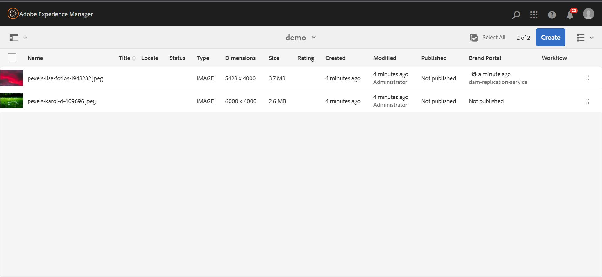

# Elementen rapporteren {#asset-reports}

| [ Beste praktijken van het Onderzoek ](/help/assets/search-best-practices.md) | [ Beste praktijken van Meta-gegevens ](/help/assets/metadata-best-practices.md) | [ Content Hub ](/help/assets/product-overview.md) | [ Dynamic Media met mogelijkheden OpenAPI ](/help/assets/dynamic-media-open-apis-overview.md) | [ de ontwikkelaarsdocumentatie van AEM Assets ](https://developer.adobe.com/experience-cloud/experience-manager-apis/) |
| ------------- | --------------------------- |---------|----|-----|

| Versie | Artikelkoppeling |
| -------- | ---------------------------- |
| AEM 6,5 | [ klik hier ](https://experienceleague.adobe.com/docs/experience-manager-65/assets/administer/asset-reports.html?lang=en) |
| AEM as a Cloud Service | Dit artikel |

Met Asset Reporting kunt u het nut van uw [!DNL Adobe Experience Manager Assets] -implementatie beoordelen. Met [!DNL Assets] kunt u verschillende rapporten genereren voor uw digitale elementen. De rapporten bevatten nuttige informatie over het gebruik van uw systeem, over de manier waarop gebruikers met elementen werken en over de elementen die <!-- downloaded and --> worden gedeeld.

Gebruik de informatie in de rapporten om belangrijke succesmetriek af te leiden om de goedkeuring van [!DNL Assets] binnen uw onderneming en door klanten te meten.

Het [!DNL Assets] -rapportagekader gebruikt [!DNL Sling] -taken asynchroon om rapportageaanvragen op geordende wijze te verwerken. Het is schaalbaar voor grote opslagruimten. De asynchrone rapportverwerking verhoogt de efficiency en de snelheid waarmee de rapporten worden geproduceerd.

De interface van het rapportbeheer is intuïtief en omvat fijnkorrelige opties en controles om tot gearchiveerde rapporten toegang te hebben en de loopstatussen van het meningsrapport (succes, ontbroken, en een rij gevormd) in werking te stellen.

Wanneer een rapport wordt gegenereerd, ontvangt u een melding via <!-- through an email (optional) and --> een postvak-bericht. U kunt een rapport weergeven, downloaden of verwijderen van de pagina met rapportlijsten waarop alle eerder gegenereerde rapporten worden weergegeven.

## Rapporten genereren {#generate-reports}

[!DNL Experience Manager Assets] genereert de volgende standaardrapporten voor u:

* Uploaden
* Downloaden
* Verlopen
* Wijziging
* Publish
* [!DNL Brand Portal] publish
* Schijfgebruik
* Bestanden
* Delen van koppeling

<!-- Removed download report.
* Upload
* Download
* Expiration
* Modification
* Publish
* [!DNL Brand Portal] publish
* Disk Usage
* Files
* Link Share
-->

[!DNL Adobe Experience Manager] -beheerders kunnen deze rapporten eenvoudig voor uw implementatie genereren en aanpassen. Een beheerder kan deze stappen volgen om een rapport te produceren:

1. Klik in de interface [!DNL Experience Manager] op **[!UICONTROL Tools]** > **[!UICONTROL Assets]** > **[!UICONTROL Reports]** .

   

1. Klik op de pagina [!UICONTROL Asset Reports] op **[!UICONTROL Create]** op de werkbalk.
1. Kies op de pagina **[!UICONTROL Create Report]** het rapport dat u wilt maken en klik op **[!UICONTROL Next]** . Entitle zelf aan een **AEM het productprofiel van de Beheerder** om a **download** rapport tot stand te brengen. Zie [ Toewijzend AEM Profielen van het Product ](https://experienceleague.adobe.com/en/docs/experience-manager-cloud-service/content/onboarding/journey/assign-profiles-aem) om zich aan een AEM het productprofiel van de Beheerder te vergunning te geven.

   

1. Configureer rapportdetails, zoals titel, beschrijving, miniatuur en mappad. Standaard is het mappad `/content/dam` . U kunt een andere weg specificeren om het rapport over een specifieke omslag uit te voeren.

   

   Kies het datumbereik voor uw rapport. U kunt ervoor kiezen het rapport nu of op een toekomstige datum en tijd te genereren.

   >[!NOTE]
   >
   >Als u ervoor kiest om het rapport later te plannen, zorg ervoor dat u de datum en de tijd in de gebieden van de Datum en van de Tijd specificeert. Als u geen waarde specificeert, behandelt de rapportmotor het als een rapport dat onmiddellijk moet worden geproduceerd.

   De gebieden van de configuratie kunnen verschillen gebaseerd op het type van rapport u creeert. Het rapport **[!UICONTROL Disk Usage]** bevat bijvoorbeeld opties voor het opnemen van elementen bij het berekenen van de schijfruimte die door elementen wordt gebruikt. U kunt ervoor kiezen om elementen in submappen op te nemen of uit te sluiten voor het berekenen van het schijfgebruik.

   >[!NOTE]
   >
   >Het rapport **[!UICONTROL Disk Usage]** bevat geen datumbereikvelden omdat het alleen het huidige gebruik van schijfruimte aangeeft.

   

   Wanneer u het **[!UICONTROL Files]** -rapport maakt, kunt u submappen opnemen of uitsluiten. U kunt echter geen elementuitvoeringen opnemen voor dit rapport.

   

   Het **[!UICONTROL Link Share]** -rapport geeft URL&#39;s weer naar elementen die vanuit [!DNL Assets] met externe gebruikers worden gedeeld. <!-- It includes email ids of the user who shared the assets, emails ids of users with which the assets are shared, share date, and expiration date for the link. --> De kolommen kunnen niet worden aangepast.

   Het rapport **[!UICONTROL Link Share]** bevat geen opties voor submappen en uitvoeringen omdat het alleen de gedeelde URL&#39;s publiceert die onder `/var/dam/share` worden weergegeven.

   

1. Klik op **[!UICONTROL Next]** op de werkbalk.

1. Op de pagina **[!UICONTROL Configure Columns]** zijn er kolommen geselecteerd die standaard in het rapport worden weergegeven. U kunt meer kolommen selecteren. Annuleer de selectie van een kolom om deze uit te sluiten in het rapport.

   

   Als u een aangepaste kolomnaam of een aangepast eigenschapspad wilt weergeven, configureert u de eigenschappen voor het binaire element onder het knooppunt `jcr:content` in CRX. U kunt het ook toevoegen via een padkiezer voor eigenschappen.

   

1. Klik op **[!UICONTROL Create]** op de werkbalk. Een bericht meldt dat de rapportgeneratie is in werking gesteld.
1. Op de pagina [!UICONTROL Asset Reports] is de status van het genereren van het rapport gebaseerd op de huidige status van de rapporttaak, bijvoorbeeld [!UICONTROL Success] , [!UICONTROL Failed] , [!UICONTROL Queued] of [!UICONTROL Scheduled] . Dezelfde status wordt weergegeven in het postvak meldingen. Klik op de rapportkoppeling om de rapportpagina weer te geven. U kunt ook het rapport selecteren en op **[!UICONTROL View]** op de werkbalk klikken.

   <!---->
   

   Klik op **[!UICONTROL Download]** op de werkbalk om het rapport in de CSV-indeling te downloaden.

   >[!NOTE]
   >
   >U kunt rapporten genereren op basis van de gebeurtenissen die in de afgelopen 360 dagen zijn gegenereerd. Experience Manager bewaart de gegevens van de gebruikers-id 30 dagen.

## Aangepaste kolommen toevoegen aan rapporten {#add-custom-columns}

U kunt douanekolommen aan de volgende rapporten toevoegen om meer gegevens voor uw douanevereisten te tonen:

<!-- Remove download report.
* Upload
* Download
* Expiration
* Modification
* Publish
* [!DNL Brand Portal] publish
* Files
-->

* Uploaden
* Verlopen
* Wijziging
* Publish
* [!DNL Brand Portal] publish
* Bestanden

Ga als volgt te werk om aangepaste kolommen aan deze rapporten toe te voegen:

1. Klik in de [!DNL Manager interface] op **[!UICONTROL Tools]** > **[!UICONTROL Assets]** > **[!UICONTROL Reports]** .
1. Klik op de pagina [!UICONTROL Asset Reports] op **[!UICONTROL Create]** op de werkbalk.

1. Kies op de pagina **[!UICONTROL Create Report]** een rapport dat u wilt maken. Klik op **[!UICONTROL Next]**.

1. Configureer de rapportdetails, zoals titel, beschrijving, miniatuur, mappad en datumbereik. Klik op **[!UICONTROL Next]**.

1. Selecteer de toepasselijke informatie in de lijst met **[!UICONTROL Default Columns]** . Als u een aangepaste kolom wilt weergeven, geeft u de naam van de kolom onder **[!UICONTROL Custom Columns]** op.

   

1. Voeg het eigenschapspad onder het knooppunt `jcr:content` in CRXDE toe met de padkiezer voor eigenschappen. U kunt ook het pad typen in het veld Pad eigenschap.

   

   Als u meer aangepaste kolommen wilt toevoegen, klikt u op **[!UICONTROL Add]** en herhaalt u de bovenstaande stappen.

1. Klik op **[!UICONTROL Create]** op de werkbalk. Een bericht deelt mee dat de rapportgeneratie in werking wordt gesteld.

<!-- TBD: How to configure purge now? Is it using OSGi configurations?

## Configure purging service {#configure-purging-service}

To remove reports that you no longer require, configure the DAM Report Purge service from the web console to purge existing reports based on their quantity and age.

1. Access the web console (configuration manager) from `https://[aem_server]:[port]/system/console/configMgr`.
1. Open the **[!UICONTROL DAM Report Purge Service]** configuration.
1. Specify the frequency (time interval) for the purging service in the `scheduler.expression.name` field. You can also configure the age and the quantity threshold for reports.
1. Save the changes.
-->

## Problemen oplossen {#tips-troubleshoot}

* Als de [!UICONTROL Disk Usage Report] niet genereert en als u [!DNL Dynamic Media] gebruikt, moet u ervoor zorgen dat alle elementen correct worden verwerkt. U lost de problemen op door de elementen opnieuw te verwerken en het rapport opnieuw te genereren.

<!-- These notes were present in generate report section above. Removing commented text from in between the instructions to preserve the numbering of the ordered list.

TBD: How do enable this in CS now? Is it done using some OSGi config now?
   >[!NOTE]
   >
   >Before you can generate an **[!UICONTROL Asset Downloaded]** report, ensure that the Asset Download service is enabled. From the web console (`https://[aem_server]:[port]/system/console/configMgr`), open the **[!UICONTROL Day CQ DAM Event Recorder]** configuration, and select the **[!UICONTROL Asset Downloaded (DOWNLOADED)]** option in Event Types if not already selected.
-->

<!-- Removed download report.
   >[!NOTE]
   >
   >By default, the Content Fragments and link shares are included in the asset [!UICONTROL Download] report. Select the appropriate option to create a report of link shares or to exclude Content Fragments from the download report.

   >[!NOTE]
   >
   >The [!UICONTROL Download] report displays details of only those assets which are downloaded after selecting individually or are downloaded using Quick Action. However, it does not include the details of the assets that are inside a downloaded folder.
-->

**zie ook**

* [Assets vertalen](translate-assets.md)
* [ASSETS HTTP API](mac-api-assets.md)
* [Door Assets ondersteunde bestandsindelingen](file-format-support.md)
* [Zoeken in middelen](search-assets.md)
* [Verbonden elementen](use-assets-across-connected-assets-instances.md)
* [Metagegevensschema&#39;s](metadata-schemas.md)
* [Elementen downloaden](download-assets-from-aem.md)
* [Metagegevens beheren](manage-metadata.md)
* [Zoeken in facetten](search-facets.md)
* [Verzamelingen beheren](manage-collections.md)
* [Bulkmetagegevens importeren](metadata-import-export.md)
* [Publish Assets naar AEM en Dynamic Media](/help/assets/publish-assets-to-aem-and-dm.md)
