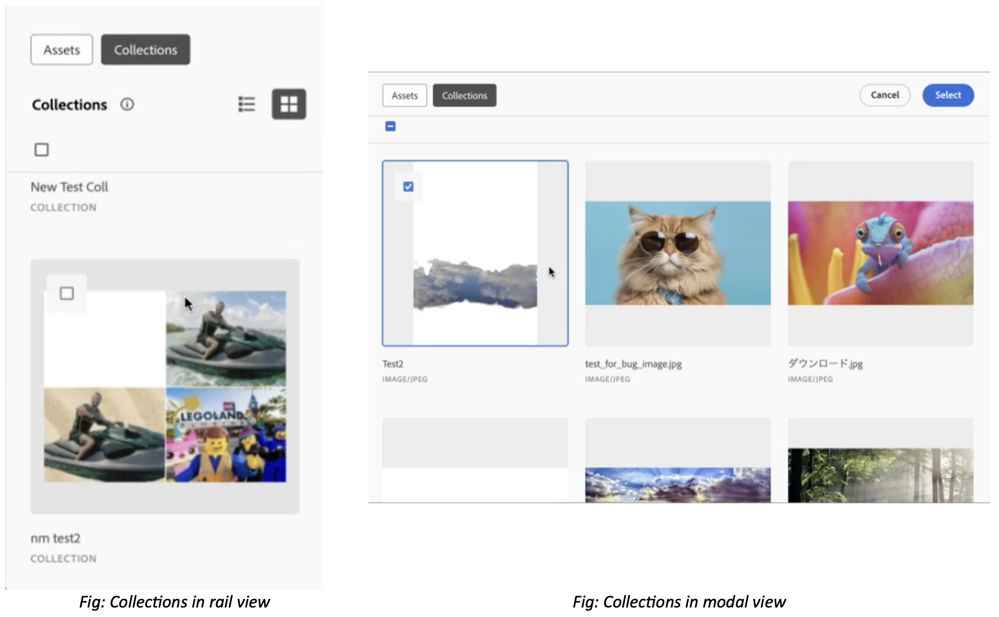

# Verzamelingen voor middelenkiezer {#asset-selector-collections}

| [ Beste praktijken van het Onderzoek ](/help/assets/search-best-practices.md) | [ Beste praktijken van Meta-gegevens ](/help/assets/metadata-best-practices.md) | [ Content Hub ](/help/assets/product-overview.md) | [ Dynamic Media met mogelijkheden OpenAPI ](/help/assets/dynamic-media-open-apis-overview.md) | [ de ontwikkelaarsdocumentatie van AEM Assets ](https://developer.adobe.com/experience-cloud/experience-manager-apis/) |
| ------------- | --------------------------- |---------|----|-----|

Een verzameling is een set elementen, mappen of andere verzamelingen in de functie Asset Selector. Gebruik verzamelingen om elementen tussen gebruikers te delen. In tegenstelling tot mappen kan een verzameling elementen van verschillende locaties bevatten.

De Micro Front-end Collections in Asset Selector is beschikbaar uit de doos in read-only wijze. Er worden elementen en verzamelingen rechtstreeks opgehaald uit de [!DNL Experience Manager Assets] -opslagplaats waartoe u toegang hebt.

>[!NOTE]
>
>Zorg ervoor dat u toestemmingen hebt om tot [!DNL Experience Manager Assets] [ toegang te hebben imsOrg ](/help/assets/asset-selector-properties.md) en Inzamelingen.

De Micro Front-end Collections in Asset Selector is beschikbaar uit de doos in read-only wijze. Het haalt activa en inzamelingen direct van de bewaarplaats van Experience Manager Assets die u toegang tot hebt en erft de eigenschappen van openbare en privé omslagen van uw bewaarplaats van Experience Manager Assets. Zie meer over [ het creëren van een openbare of privé inzameling in de mening van Assets ](/help/assets/manage-collections-assets-view.md#create-collection).

U kunt Verzamelingen in de Kiezer van Activa in zowel spoormening als modale mening bekijken.

<!--
Additionally, you can [customize](/help/assets/asset-selector-customization.md) the `featureSet` property to enable or disable collections in Asset Selector. See [enable or disable Collections tab](#enable-disable-collections-tab).-->

Bovendien kunt u de selectie van elementen ook aanpassen op het tabblad Verzamelingen. U kunt dit doen door het aan te passen met `handleSelection` . Zie [ behandelende selectie van Assets gebruikend het Schema van Objecten ](/help/assets/asset-selector-customization.md#handling-selection).

## Verzamelingen weergeven {#view-collections}

De Selecteur van activa staat u toe om inzamelingen in of a  of de mening van het a  net te bekijken mening. Zie [ types van mening in de Selecteur van Activa ](overview-asset-selector.md#types-of-view).

## Elementen naar verzameling slepen {#collection-drag-and-drop}

U kunt een element rechtstreeks vanuit de weergave [!DNL Assets as a Cloud Service] in de ontwerpomgeving naar verzamelingen slepen. Hiervoor sleept u het element van het tabblad Assets naar het werkgebied Verzamelingen van de toepassing Asset Selector om geavanceerde toepassingen te maken.

>[!NOTE]
>
>* Het slepen en neerzetten van een element is alleen mogelijk in de spoorweergave.
>* U kunt alleen bestanden (elementen) slepen en neerzetten en niet de mappen.

Anderzijds, kunt u ook [ belemmering en daling van activa in de inzamelingen ](asset-selector-customization.md#enable-disable-drag-and-drop) direct toelaten of onbruikbaar maken.

## Selectie van element in verzamelingen uitschakelen {#disable-selection-collection}

Selectie uitschakelen wordt gebruikt om te verbergen of uit te schakelen dat de elementen of mappen kunnen worden geselecteerd. Het selectiekader van de kaart of het element dat u selecteert, wordt verborgen. Hierdoor wordt het selectievakje niet ingeschakeld. Zie [ selectie ](/help/assets/asset-selector-customization.md#disable-selection) onbruikbaar maken.

## Het tabblad Verzamelingen in- of uitschakelen {#enable-disable-collections-tab}

Met Asset Selector kunt u de componenten naar wens en bruikbaarheid aanpassen. Als u het tabblad Verzamelingen in de functie Asset Selector wilt in- of uitschakelen, kunt u de eigenschap `featureSet` op de volgende manier gebruiken:

* **laat Inzamelingen tabel toe:** om inzamelingen tabel toe te laten, moet u `collections` als waarde aan de serie verstrekken. Standaard is het tabblad Verzamelingen buiten het vak voor alle gebruikers ingeschakeld. Bijvoorbeeld: `featureSet:["collections"]`
* **maak Inzamelingen tabel onbruikbaar:** om inzamelingen tabel onbruikbaar te maken, moet u een lege serie als zijn waarde verstrekken. Bijvoorbeeld: `featureSet:[ ]`

>[!MORELIKETHIS]
>
>* [ de aanpassingen van de Selecteur van Activa ](/help/assets/asset-selector-customization.md)
>* [ integreer de Selector van Activa met diverse toepassingen ](/help/assets/integrate-asset-selector.md)
>* [ Eigenschappen van de Selecteur van Activa ](/help/assets/asset-selector-properties.md)

