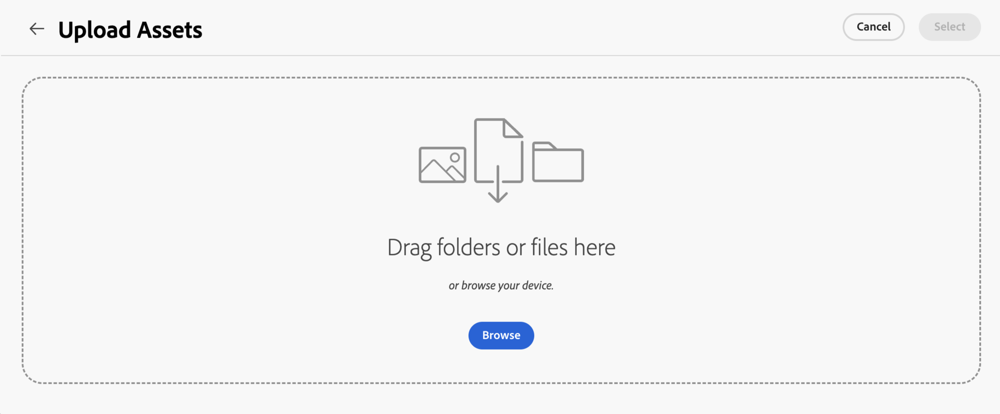
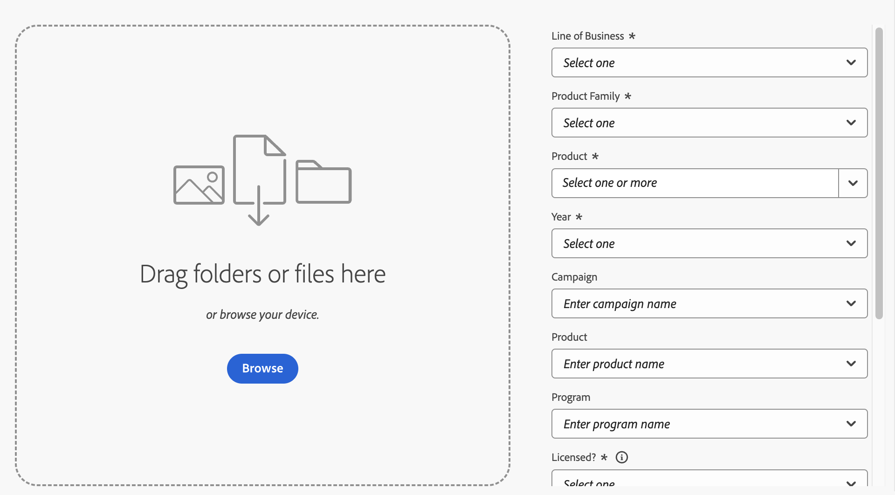

# Bestanden en mappen uploaden naar Asset Selector {#upload-files-folders}

U kunt bestanden of mappen vanuit uw lokale bestandssysteem uploaden naar Asset Selector. Als u bestanden wilt uploaden met het lokale bestandssysteem, moet u doorgaans een upload-functie gebruiken die wordt geleverd door een Asset Selector-microfront-end toepassing.

## Elementen uploaden vanuit een lokaal bestandssysteem {#basic-upload}

Voer de volgende stappen uit om elementen toe te voegen aan Asset Selector:

1. Als u spoormening gebruikt, dan ga naar ellips en klik dan  **[!UICONTROL Upload]**. Anderzijds, klik  **[!UICONTROL Upload]** op top-right in het geval van modale mening. Het scherm [!UICONTROL Upload Assets] wordt weergegeven.

   

   Daarnaast kunt u in de sectie **[!UICONTROL Drag files or folders here]** de elementen slepen van het lokale bestandssysteem of op **[!UICONTROL Browse]** klikken om handmatig bestanden of mappen te selecteren die beschikbaar zijn op het lokale bestandssysteem. Deze lijst met bestanden die deel uitmaken van de upload, is beschikbaar als een lijst.

   

   U kunt geselecteerde afbeeldingen ook voorvertonen met behulp van de miniaturen en op het X-pictogram klikken om een bepaalde afbeelding uit de lijst te verwijderen. Het X-pictogram wordt alleen weergegeven wanneer u de muis boven de naam of grootte van de afbeelding houdt. U kunt ook op **[!UICONTROL Remove all]** klikken om alle items uit de uploadlijst te verwijderen.

1. Klik op **[!UICONTROL Upload]** om het uploadproces te voltooien. Uw geüploade elementen worden weergegeven. Zie [&#x200B; basisupload &#x200B;](/help/assets/asset-selector-customization.md#basic-upload) voor de configureerbare code.

## Elementen uploaden met metagegevens {#upload-assets-with-metadata}

U kunt metagegevens aan de elementen toevoegen terwijl u deze direct in de toepassing uploadt. Metagegevens omvatten diverse velden, zoals de onderwerpregel van het bedrijf, productdetails, campagne enzovoort. Hiervoor wordt de eigenschap `metadataSchema` gebruikt. Ga naar [&#x200B; eigenschappen van de activaselecteur &#x200B;](/help/assets/asset-selector-properties.md) om meer over `metadataSchema` bezit te weten.

Zie [&#x200B; uploaden met meta-gegevens &#x200B;](/help/assets/asset-selector-customization.md#upload-with-metadata) voor het codefragment dat voor de configuratie wordt vereist.

1. Definieer de naam voor het uploaden met behulp van het veld **[!UICONTROL Campaign name]** . U kunt een bestaande naam gebruiken of een nieuwe naam maken. Met de Asset Selector beschikt u over meer opties terwijl u de naam typt.

   Het wordt aanbevolen om bij voorkeur waarden in de overige velden op te geven en een verbeterde zoekervaring voor uw geüploade elementen te maken.

1. Definieer ook waarden voor de velden **[!UICONTROL Keywords]** , **[!UICONTROL Channels]** , **[!UICONTROL Timeframe]** en **[!UICONTROL Region]** . Tags toevoegen en elementen groeperen op trefwoorden, kanalen en locatie stelt iedereen die uw goedgekeurde bedrijfsinhoud gebruikt in staat deze elementen te vinden en te organiseren.

1. Klik op **[!UICONTROL Upload]** om elementen te uploaden naar de Asset Selector. Het bevestigingsvak [!UICONTROL Review details] wordt weergegeven. Klik op [!UICONTROL Continue].

1. Assets begint met uploaden. Klik op [!UICONTROL New Upload] om de uploadprocedure opnieuw te starten. Klik op [!UICONTROL Done] om het uploaden te voltooien.

## Aangepaste upload {#customize-upload}

Met Asset Selector kunt u een aangepast uploadformulier toevoegen. Er zijn verschillende aanpassingen beschikbaar. Bijvoorbeeld staat het [&#x200B; hideUploadButton &#x200B;](/help/assets/asset-selector-properties.md) bezit u toe om uploadt knoop te verbergen die door gebrek in de toepassing wordt getoond. In plaats daarvan, kunt u het aanpassen om buiten de MFE toepassing zoals vereist terug te geven. Zie [&#x200B; aangepaste upload &#x200B;](/help/assets/asset-selector-customization.md#customized-upload) voor de configuratie.

>[!MORELIKETHIS]
>
>* [&#x200B; Voorbeelden van de Selecteur van Activa &#x200B;](/help/assets/asset-selector-examples.md)
>* [&#x200B; integreer de Selector van Activa met diverse toepassingen &#x200B;](/help/assets/integrate-asset-selector.md)
>* [&#x200B; Eigenschappen van de Selecteur van Activa &#x200B;](/help/assets/asset-selector-properties.md)
