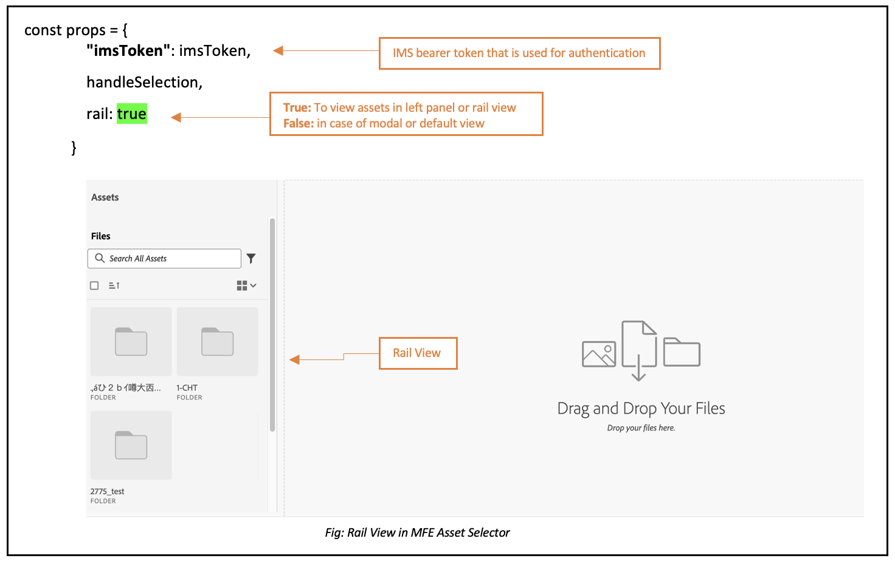
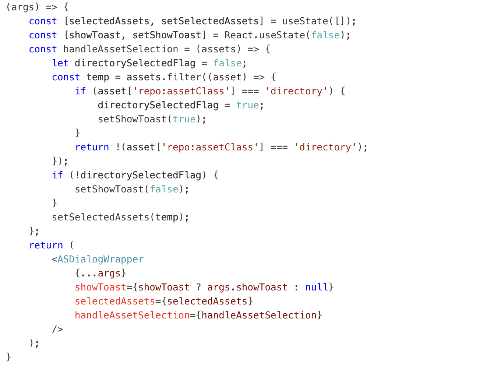
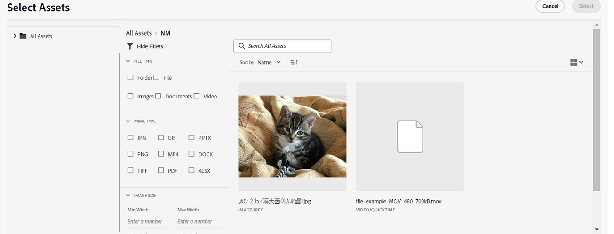

# Micro-Frontend element selecteren {#Overview}

Micro-Frontend Asset Selector biedt een gebruikersinterface die eenvoudig kan worden geïntegreerd met de [!DNL Experience Manager Assets] -opslagplaats, zodat u door de beschikbare digitale middelen in de opslagplaats kunt bladeren of deze kunt zoeken en deze kunt gebruiken in uw ontwerpervaring.

De gebruikersinterface van Micro-Frontend wordt beschikbaar gesteld in uw toepassingservaring gebruikend het pakket van de Selecteur van Activa. Alle updates van het pakket worden automatisch geïmporteerd en de nieuwste versie van Asset Selector wordt automatisch in de toepassing geladen.


Asset Selector biedt vele voordelen, zoals:

* Versnelling van integratie met om het even welke [ Adobe ](#asset-selector-ims) of [ niet-Adobe ](#asset-selector-non-ims) toepassingen die de bibliotheek van JavaScript Vanilla gebruiken.
* Eenvoudig te onderhouden, aangezien updates van het Assets Selector-pakket automatisch worden geïmplementeerd op de Asset Selector die beschikbaar is voor uw toepassing. Uw toepassing hoeft geen updates uit te voeren om de laatste wijzigingen te laden.
* Gemakkelijk aanpassen aangezien er eigenschappen beschikbaar zijn die de vertoning van de Selecteur van Activa binnen uw toepassing controleren.
* In de volledige tekst doorzoeken, uit-van-de-doos, en aangepaste filters om snel aan activa voor gebruik binnen de auteurservaring te navigeren.
* Mogelijkheid om binnen een IMS-organisatie te schakelen tussen opslagruimten voor het selecteren van bedrijfsmiddelen.
* De mogelijkheid om elementen te sorteren op naam, afmetingen en grootte en ze weer te geven in de weergave Lijst, Raster, Galerie of Waterval.

<!--Perform the following tasks to integrate and use Asset Selector with your [!DNL Experience Manager Assets] repository:

1. [Install Asset Selector](#installation)
2. [Integrate Asset Selector using Vanilla JS](#integration-using-vanilla-js)
3. [Use Asset Selector](#using-asset-selector)
-->

<!--
## Setting up Asset Selector {#asset-selector-setup}


-->

## Vereisten{#prereqs}

U moet de volgende communicatiemethoden gebruiken:

* De toepassing wordt uitgevoerd op HTTPS.
* De URL van de toepassing bevindt zich in de lijst van gewenste personen van de IMS-client voor het doorsturen van URL&#39;s.
* De IMS-aanmeldstroom wordt geconfigureerd en weergegeven met een pop-up in de webbrowser. Daarom moeten pop-ups worden ingeschakeld of toegestaan in de doelbrowser.

Gebruik de bovenstaande voorwaarden als u een IMS-verificatieworkflow van de Asset Selector nodig hebt. Als u al bent geverifieerd met de IMS-workflow, kunt u in plaats daarvan de IMS-informatie toevoegen.

>[!IMPORTANT]
>
> Deze opslagplaats is bedoeld als aanvullende documentatie waarin de beschikbare API&#39;s en gebruiksvoorbeelden voor de integratie van Asset Selector worden beschreven. Voordat u de functie Asset Selector gaat installeren of gebruiken, moet u controleren of uw organisatie de toegang tot Asset Selector heeft ingericht als onderdeel van het Experience Manager Assets as a Cloud Service-profiel. Als u niet provisioned bent, kunt u deze componenten niet integreren of gebruiken. Om levering aan te vragen, zou uw programma admin een steunkaartje moeten opheffen duidelijk als P2 van Admin Console en de volgende informatie omvatten:
>
>* Domeinnamen waarbij de integrerende toepassing wordt gehost.
>* Na provisioning ontvangt uw organisatie `imsClientId` , `imsScope` en een `redirectUrl` die overeenkomen met de gevraagde omgevingen die essentieel zijn voor de configuratie van Asset Selector. Zonder deze geldige eigenschappen kunt u de installatiestappen niet uitvoeren.

## Installatie {#installation}

De Selecteur van activa is beschikbaar via zowel ESM CDN (bijvoorbeeld, [ esm.sh ](https://esm.sh/)/[ kabel ](https://www.skypack.dev/)) als [ UMD ](https://github.com/umdjs/umd) versie.

In browsers die {versie 0} gebruiken UMD **(geadviseerd):**

```
<script src="https://experience.adobe.com/solutions/CQ-assets-selectors/static-assets/resources/assets-selectors.js"></script>

<script>
  const { renderAssetSelector } = PureJSSelectors;
</script>
```

In browsers met `import maps` steun gebruikend **versie van ESM CDN**:

```
<script type="module">
  import { AssetSelector } from 'https://experience.adobe.com/solutions/CQ-assets-selectors/static-assets/resources/@assets/selectors/index.js'
</script>
```

In Deno/de Federatie van de Module van het Pakket gebruikend **versie van ESM CDN**:

```
import { AssetSelector } from 'https://experience.adobe.com/solutions/CQ-assets-selectors/static-assets/resources/@assets/selectors/index.js'
```

## Asset Selector integreren met Vanilla JS {#integration-using-vanilla-js}

U kunt elke [!DNL Adobe] -toepassing of niet-Adobe-toepassing integreren in de [!DNL Experience Manager Assets] -opslagplaats en elementen selecteren vanuit de toepassing. Zie [ de Integratie van de Selecteur van Activa met diverse toepassingen ](#asset-selector-integration-with-apps).

De integratie gebeurt door het pakket Asset Selector te importeren en verbinding te maken met de Assets as a Cloud Service via de Vanilla JavaScript-bibliotheek. Bewerk een `index.html` of een ander geschikt bestand in uw toepassing om:

* De verificatiedetails definiëren
* Toegang krijgen tot de Assets as a Cloud Service-opslagplaats
* De weergave-eigenschappen voor de middelenkiezer configureren

U kunt verificatie uitvoeren zonder enkele IMS-eigenschappen te definiëren, als:

* U integreert een [!DNL Adobe] toepassing op [ Verenigde Shell ](https://experienceleague.adobe.com/docs/experience-manager-cloud-service/content/overview/aem-cloud-service-on-unified-shell.html?lang=nl-NL).
* Er is al een IMS-token gegenereerd voor verificatie.

## Asset Selector integreren met verschillende toepassingen {#asset-selector-integration-with-apps}

U kunt Asset Selector integreren met verschillende toepassingen, zoals:

* [Integreer de Selecteur van Activa met een  [!DNL Adobe]  toepassing](#adobe-app-integration-vanilla)
* [Asset Selector integreren met een niet-Adobe-toepassing](#adobe-non-app-integration)
* [Integratie voor dynamische media met OpenAPI-mogelijkheden](#adobe-app-integration-polaris)

>[!BEGINTABS]

<!--Integration with an Adobe application content starts here-->

>[!TAB  Integratie met een toepassing van Adobe ]

### Vereisten{#prereqs-adobe-app}

Gebruik de volgende voorwaarden als u Asset Selector integreert met een [!DNL Adobe] -toepassing:

* [Communicatiemethoden](#prereqs)
* imsOrg
* imsToken
* apikey

### Asset Selector integreren met een [!DNL Adobe] -toepassing {#adobe-app-integration-vanilla}

In het volgende voorbeeld wordt het gebruik van Asset Selector getoond wanneer u een [!DNL Adobe] -toepassing uitvoert onder Unified Shell of wanneer u `imsToken` al hebt gegenereerd voor verificatie.

Omvat het pakket van de Selecteur van Activa in uw code gebruikend de `script` markering, zoals aangetoond in _lijnen 6-15_ van het hieronder voorbeeld. Wanneer het script is geladen, is de algemene variabele `PureJSSelectors` beschikbaar voor gebruik. Bepaal de Eigenschappen van de Selecteur van Activa [&#128279;](#asset-selector-properties) zoals aangetoond in _lijnen 16-23_. De eigenschappen `imsOrg` en `imsToken` zijn beide vereist voor verificatie in een Adobe-toepassing. De eigenschap `handleSelection` wordt gebruikt om de geselecteerde elementen af te handelen. Om de Kiezer van Activa terug te geven, roep de `renderAssetSelector` functie zoals vermeld in _lijn 17_. De selecteur van Activa wordt getoond in het `<div>` containerelement, zoals aangetoond in _lijnen 21 en 22_.

Als u deze stappen uitvoert, kunt u Asset Selector gebruiken met uw [!DNL Adobe] -toepassing.

```html {line-numbers="true"}
<!DOCTYPE html>
<html>
<head>
    <title>Asset Selector</title>
    <script src="https://experience.adobe.com/solutions/CQ-assets-selectors/assets/resources/assets-selectors.js"></script>
    <script>
        // get the container element in which we want to render the AssetSelector component
        const container = document.getElementById('asset-selector-container');
        // imsOrg and imsToken are required for authentication in Adobe application
        const assetSelectorProps = {
            imsOrg: 'example-ims@AdobeOrg',
            imsToken: "example-imsToken",
            apiKey: "example-apiKey-associated-with-imsOrg",
            handleSelection: (assets: SelectedAssetType[]) => {},
        };
        // Call the `renderAssetSelector` available in PureJSSelectors globals to render AssetSelector
        PureJSSelectors.renderAssetSelector(container, assetSelectorProps);
    </script>
</head>

<body>
    <div id="asset-selector-container" style="height: calc(100vh - 80px); width: calc(100vw - 60px); margin: -20px;">
    </div>
</body>

</html>
```

<!--For detailed example, visit [Asset Selector Code Example](https://github.com/adobe/aem-assets-selectors-mfe-examples).-->

+++**ImsAuthProps**
De `ImsAuthProps` -eigenschappen definiëren de verificatiegegevens en de stroom die de Asset Selector gebruikt om een `imsToken` -element te verkrijgen. Door deze eigenschappen te plaatsen, kunt u controleren hoe de authentificatiestroom zich zou moeten gedragen en luisteraars voor diverse authentificatiegebeurtenissen registreren.

| Eigenschapnaam | Beschrijving |
|---|---|
| `imsClientId` | Een tekenreekswaarde die de IMS client-id vertegenwoordigt die voor verificatiedoeleinden wordt gebruikt. Deze waarde wordt geleverd door Adobe en is specifiek voor uw Adobe AEM CS-organisatie. |
| `imsScope` | Beschrijft het werkingsgebied dat in authentificatie wordt gebruikt. Het werkingsgebied bepaalt het niveau van toegang dat de toepassing aan uw organisatiemiddelen heeft. Meerdere bereiken kunnen worden gescheiden door komma&#39;s. |
| `redirectUrl` | Geeft de URL aan waar de gebruiker na verificatie opnieuw wordt omgeleid. Deze waarde wordt doorgaans ingesteld op de huidige URL van de toepassing. Als een `redirectUrl` niet wordt opgegeven, gebruikt `ImsAuthService` de redirectUrl die wordt gebruikt om de `imsClientId` te registreren |
| `modalMode` | Een Booleaanse waarde die aangeeft of de verificatiestroom al dan niet moet worden weergegeven in een modaal (pop-upmenu). Indien ingesteld op `true` , wordt de verificatiestroom weergegeven in een pop-up. Indien ingesteld op `false` , wordt de verificatiestroom weergegeven in een volledige pagina die opnieuw wordt geladen. _Nota :_voor betere UX, kunt u deze waarde dynamisch controleren als de gebruiker browser pop-up gehandicapt heeft. |
| `onImsServiceInitialized` | Een callback-functie die wordt aangeroepen wanneer de Adobe IMS-verificatieservice wordt geïnitialiseerd. Deze functie heeft één parameter, `service` , die een object is dat de Adobe IMS-service vertegenwoordigt. Zie [`ImsAuthService`](#imsauthservice-ims-auth-service) voor meer informatie. |
| `onAccessTokenReceived` | Een callback-functie die wordt aangeroepen wanneer een `imsToken` wordt ontvangen van de Adobe IMS-verificatieservice. Deze functie heeft één parameter, `imsToken`, die een tekenreeks is die het toegangstoken vertegenwoordigt. |
| `onAccessTokenExpired` | Een callback functie die wordt geroepen wanneer een toegangstoken is verlopen. Deze functie wordt typisch gebruikt om een nieuwe authentificatiestroom teweeg te brengen om een nieuw toegangstoken te verkrijgen. |
| `onErrorReceived` | Een callback functie die wordt geroepen wanneer een fout tijdens authentificatie voorkomt. Deze functie heeft twee parameters: het fouttype en het foutbericht. Het fouttype is een tekenreeks die het type fout vertegenwoordigt en het foutbericht is een tekenreeks die het foutbericht vertegenwoordigt. |

+++

+++**ImsAuthService**
De `ImsAuthService` -klasse handelt de verificatiestroom voor de Asset Selector af. Het is verantwoordelijk voor het verkrijgen van een `imsToken` van de Adobe IMS-verificatieservice. De `imsToken` wordt gebruikt om de gebruiker te verifiëren en toegang tot de [!DNL Adobe Experience Manager] toe te staan als een [!DNL Cloud Service] Assets-opslagplaats. ImsAuthService gebruikt de `ImsAuthProps` eigenschappen om de authentificatiestroom te controleren en luisteraars voor diverse authentificatiegebeurtenissen te registreren. U kunt de geschikte [`registerAssetsSelectorsAuthService`](#purejsselectorsregisterassetsselectorsauthservice) functie gebruiken om de _ImsAuthService_ instantie met de Selecteur van Activa te registreren. De volgende functies zijn beschikbaar voor de `ImsAuthService` -klasse. Nochtans, als u de _registerAssetsSelectorsAuthService_ functie gebruikt, te hoeven u deze functies niet direct te roepen.

| Functienaam | Beschrijving |
|---|---|
| `isSignedInUser` | Bepaalt of de gebruiker momenteel binnen aan de dienst wordt ondertekend en een booleaanse waarde dienovereenkomstig terugkeert. |
| `getImsToken` | Haalt de verificatie `imsToken` op voor de momenteel aangemelde gebruiker, die kan worden gebruikt om aanvragen voor andere services, zoals het genereren van asset_rendition, te verifiëren. |
| `signIn` | Hiermee wordt het aanmeldingsproces voor de gebruiker gestart. Deze functie gebruikt `ImsAuthProps` om verificatie weer te geven in een pop-up of een volledige pagina die opnieuw wordt geladen |
| `signOut` | Signs the user out of the service, invalidating their authentication token and require them to sign in again to access protected resources. Als u deze functie aanroept, wordt de huidige pagina opnieuw geladen. |
| `refreshToken` | Verfrist het authentificatietoken voor de momenteel ondertekende gebruiker, verhinderend het en ononderbroken toegang tot beschermde middelen te verzekeren. Keert een nieuw authentificatietoken terug dat voor verdere verzoeken kan worden gebruikt. |

+++

+++**Bevestiging met verstrekt teken IMS**

```
<script>
    const apiToken="<valid IMS token>";
    function handleSelection(selection) {
    console.log("Selected asset: ", selection);
    };
    function renderAssetSelectorInline() {
    console.log("initializing Asset Selector");
    const props = {
    "repositoryId": "delivery-p64502-e544757.adobeaemcloud.com",
    "apiKey": "ngdm_test_client",
    "imsOrg": "<IMS org>",
    "imsToken": apiToken,
    handleSelection,
    hideTreeNav: true
    }
    const container = document.getElementById('asset-selector-container');
    PureJSSelectors.renderAssetSelector(container, props);
    }
    $(document).ready(function() {
    renderAssetSelectorInline();
    });
</script>
```

+++

+++**callbacks van het Register aan dienst IMS**

```
// object `imsProps` to be defined as below 
let imsProps = {
    imsClientId: <IMS Client Id>,
        imsScope: "openid",
        redirectUrl: window.location.href,
        modalMode: true,
        adobeImsOptions: {
            modalSettings: {
            allowOrigin: window.location.origin,
},
        useLocalStorage: true,
},
onImsServiceInitialized: (service) => {
            console.log("onImsServiceInitialized", service);
},
onAccessTokenReceived: (token) => {
            console.log("onAccessTokenReceived", token);
},
onAccessTokenExpired: () => {
            console.log("onAccessTokenError");
// re-trigger sign-in flow
},
onErrorReceived: (type, msg) => {
            console.log("onErrorReceived", type, msg);
},
}
```

+++

<!--Integration with non-Adobe application content starts here-->

>[!TAB  Integratie met een toepassing niet-Adobe ]

<!--### Integrate Asset Selector with a [!DNL non-Adobe] application {#adobe-non-app-integration}-->

### Vereisten {#prereqs-non-adobe-app}

Gebruik de volgende voorwaarden als u Asset Selector integreert met een niet-Adobe-toepassing:

* [Communicatiemethoden](#prereqs)
* imsClientId
* imsScope
* redirectUrl
* imsOrg
* apikey

Asset Selector ondersteunt verificatie naar de [!DNL Experience Manager Assets] repository met behulp van Identity Management System (IMS)-eigenschappen zoals `imsScope` of `imsClientID` wanneer u deze integreert met een niet-Adobe-toepassing.

+++**vorm de Selector van Activa voor een toepassing niet-Adobe**
Als u Asset Selector wilt configureren voor een niet-Adobe-toepassing, moet u eerst een ondersteuningsticket voor provisioning registreren, gevolgd door de integratiestappen.

**Logging een steunkaartje**
Stappen om een steunkaartje via Admin Console te registreren:

1. Voeg **de Selecteur van Activa met AEM Assets** in de titel van het kaartje toe.

1. Geef in de beschrijving de volgende gegevens op:

   * [!DNL Experience Manager Assets] als een [!DNL Cloud Service] URL (programma-id en milieu-id).
   * Domeinnamen waarbij de niet-Adobe webtoepassing wordt gehost.
+++

+++**de stappen van de Integratie**
Gebruik dit voorbeeldbestand `index.html` voor verificatie terwijl Asset Selector wordt geïntegreerd met een niet-Adobe-toepassing.

Heb toegang tot het pakket van de Selecteur van Activa gebruikend de `Script` Markering, zoals aangetoond in *lijn 9* aan *lijn 11* van het voorbeeld `index.html` dossier.

*Lijn 14* aan *lijn 38* van het voorbeeld beschrijft de IMS stroomeigenschappen, zoals `imsClientId`, `imsScope`, en `redirectURL`. De functie vereist dat u ten minste een van de eigenschappen `imsClientId` en `imsScope` definieert. Als u geen waarde definieert voor `redirectURL` , wordt de geregistreerde omleidings-URL voor de client-id gebruikt.

Aangezien u geen `imsToken` hebt geproduceerd, gebruik de `registerAssetsSelectorsAuthService` en `renderAssetSelectorWithAuthFlow` functies, zoals aangetoond in lijn 40 tot lijn 50 van het voorbeeld `index.html` dossier. Gebruik de functie `registerAssetsSelectorsAuthService` voor `renderAssetSelectorWithAuthFlow` om de `imsToken` bij de functie Asset Selector te registreren. [!DNL Adobe] raadt aan `registerAssetsSelectorsAuthService` aan te roepen wanneer u de component instantieert.

Bepaal de authentificatie en andere Assets as a Cloud Service op toegang betrekking hebbende eigenschappen in de `const props` sectie, zoals aangetoond in *lijn 54* aan *lijn 60* van het voorbeeld `index.html` dossier.

De `PureJSSelectors` globale variabele, die in *wordt vermeld lijn 65*, wordt gebruikt om de Selecteur van Activa in Webbrowser terug te geven.

De Selecteur van activa wordt teruggegeven op het `<div>` containerelement, zoals vermeld in *lijn 74* aan *lijn 81*. In het voorbeeld wordt een dialoogvenster gebruikt om de Asset Selector weer te geven.

```html {line-numbers="true"}
<!DOCTYPE html>
<html>

<head>
    <meta http-equiv="X-UA-Compatible" content="IE=edge">
    <meta charset="utf-8">
    <title>Asset Selectors</title>
    <link rel="stylesheet" href="index.css">
    <script id="asset-selector"
        src="https://experience.adobe.com/solutions/CQ-assets-selectors/assets/resources/asset-selectors.js"></script>
    <script>

        const imsProps = {
            imsClientId: "<obtained from IMS team>",
            imsScope: "openid, <other scopes>",
            redirectUrl: window.location.href,
            modalMode: true, // false to open in a full page reload flow
            onImsServiceInitialized: (service) => {
                // invoked when the ims service is initialized and is ready
                console.log("onImsServiceInitialized", service);
            },
            onAccessTokenReceived: (token) => {
                console.log("onAccessTokenReceived", token);
            },
            onAccessTokenExpired: () => {
                console.log("onAccessTokenError");
                // re-trigger sign-in flow
            },
            onErrorReceived: (type, msg) => {
                console.log("onErrorReceived", type, msg);
            },
        }

        function load() {
            const registeredTokenService = PureJSSelectors.registerAssetsSelectorsAuthService(imsProps);
            imsInstance = registeredTokenService;
        };

        // initialize the IMS flow before attempting to render the asset selector
        load();
        

        //function that will render the asset selector
            const otherProps = {
            // any other props supported by asset selector
            }
            const assetSelectorProps = {
                "imsOrg": "imsorg",
                ...otherProps
            }
             // container element on which you want to render the AssetSelector/DestinationSelector component
            const container = document.getElementById('asset-selector');

            /// Use the PureJSSelectors in globals to render the AssetSelector/DestinationSelector component
            PureJSSelectors.renderAssetSelectorWithAuthFlow(container, assetSelectorProps, () => {
                const assetSelectorDialog = document.getElementById('asset-selector-dialog');
                assetSelectorDialog.showModal();
            });
        }
    </script>

</head>
<body class="asset-selectors">
    <div>
        <button onclick="renderAssetSelectorWithAuthFlowFlow()">Asset Selector - Select Assets with Ims Flow</button>
    </div>
        <dialog id="asset-selector-dialog">
            <div id="asset-selector" style="height: calc(100vh - 80px); width: calc(100vw - 60px); margin: -20px;">
            </div>
        </dialog>
    </div>
</body>

</html>
```

+++

+++**Onbekwaam om tot leveringsbewaarplaats** toegang te hebben

>[!TIP]
>
>Als u Asset Selector hebt geïntegreerd met de workflow Aanmelden maar nog steeds geen toegang hebt tot de gegevensopslagruimte, moet u ervoor zorgen dat browsercookies worden opgeschoond. Anders krijgt u de fout `invalid_credentials All session cookies are empty` in de console.

+++

<!--Integration with Polaris application content starts here-->

>[!TAB  Integratie voor Dynamische Media met mogelijkheden OpenAPI ]

### Vereisten {#prereqs-polaris}

Gebruik de volgende voorwaarden als u Asset Selector integreert met Dynamic Media met OpenAPI-mogelijkheden:

* [Communicatiemethoden](#prereqs)
* Voor toegang tot Dynamic Media met OpenAPI-mogelijkheden hebt u licenties nodig voor:
   * Assets repository (bijvoorbeeld Experience Manager Assets as a Cloud Service).
   * AEM Dynamic Media.
* Slechts [ goedgekeurde activa ](#approved-assets.md) zijn beschikbaar voor gebruik die merkconsistentie verzekeren.

### Integratie voor dynamische media met OpenAPI-mogelijkheden{#adobe-app-integration-polaris}

De integratie van Asset Selector met Dynamic Media OpenAPI-proces omvat verschillende stappen, zoals het maken van een aangepaste dynamische media-URL of het kiezen van de URL voor dynamische media, enz.

+++**integreer de Selector van Activa voor Dynamische Media met mogelijkheden OpenAPI**

De eigenschappen `rootPath` en `path` mogen geen deel uitmaken van de Dynamic Media met OpenAPI-mogelijkheden. In plaats daarvan kunt u de eigenschap `aemTierType` configureren. Hier volgt de syntaxis van de configuratie:

```
aemTierType:[1: "delivery"]
```

Met deze configuratie kunt u alle goedgekeurde elementen weergeven zonder mappen of als een platte structuur. Voor meer informatie, navigeer aan `aemTierType` bezit onder [ de eigenschappen van de Selecteur van Activa ](#asset-selector-properties)

+++

+++**creeer een Dynamische Levering URL van goedgekeurde activa**
Nadat u Asset Selector hebt ingesteld, wordt een objectschema gebruikt om een URL voor dynamische levering te maken van de geselecteerde elementen.
Bijvoorbeeld een schema van één object van een array met objecten die wordt ontvangen bij de selectie van een element:

```
{
"dc:format": "image/jpeg",
"repo:assetId": "urn:aaid:aem:xxxxxxxx-xxxx-xxxx-xxxx-xxxxxxxxxxxx",
"repo:name": "image-7.jpg",
"repo:repositoryId": "delivery-pxxxx-exxxxxx.adobe.com",
...
}
```

Alle geselecteerde elementen worden gedragen door de functie `handleSelection` die als een JSON-object fungeert. Bijvoorbeeld `JsonObj` . De dynamische leverings-URL wordt gemaakt door de onderstaande dragers te combineren:

| Object | JSON |
|---|---|
| Host | `assetJsonObj["repo:repositoryId"]` |
| API-hoofdmap | `/adobe/assets` |
| asset-id | `assetJsonObj["repo:assetId"]` |
| seo-name | `assetJsonObj["repo:name"].split(".").slice(0,-1).join(".")` |
| format | `.jpg` |

**Goedgekeurde API specificatie van de middelenlevering**

URL-indeling:
`https://<delivery-api-host>/adobe/assets/<asset-id>/as/<seo-name>.<format>?<image-modification-query-parameters>`

Wanneer

* Host is `https://delivery-pxxxxx-exxxxxx.adobe.com`
* API-hoofdmap is `"/adobe/assets"`
* `<asset-id>` is element-id
* `as` is het constante onderdeel van de open API-specificatie die aangeeft waarnaar het element moet worden verwezen
* `<seo-name>` is de naam van een element
* `<format>` is de uitvoerindeling
* `<image modification query parameters>` als ondersteuning door de API-specificatie voor levering van goedgekeurde middelen

**Goedgekeurde activa oorspronkelijke levering API van de vertoningen**

De dynamische leverings-URL heeft de volgende syntaxis:
`https://<delivery-api-host>/adobe/assets/<asset-id>/original/as/<seo-name>` , waarbij:

* Host is `https://delivery-pxxxxx-exxxxxx.adobe.com`
* API-hoofdmap voor originele uitvoering is `"/adobe/assets"`
* `<asset-id>` is element-id
* `/original/as` is het constante onderdeel van de open API-specificatie die aangeeft naar welke oorspronkelijke vertoning moet worden verwezen.
* `<seo-name>` is naam van de activa die al dan niet een uitbreiding kunnen hebben

+++

+++**Klaar om dynamische levering URL** te kiezen
Alle geselecteerde elementen worden gedragen door de functie `handleSelection` die als een JSON-object fungeert. Bijvoorbeeld `JsonObj` . De dynamische leverings-URL wordt gemaakt door de onderstaande dragers te combineren:

| Object | JSON |
|---|---|
| Host | `assetJsonObj["repo:repositoryId"]` |
| API-hoofdmap | `/adobe/assets/deliver` |
| asset-id | `assetJsonObj["repo:assetId"]` |
| seo-name | `assetJsonObj["repo:name"]` |

Hieronder ziet u de twee manieren waarop u het JSON-object kunt doorlopen:


* **Duimnagel:** de duimnagels kunnen beelden zijn en de activa zijn PDF, video, beelden, etc. Hoewel u de hoogte- en breedtekenmerken van de miniatuur van een element kunt gebruiken als de dynamische uitvoering van het element.
De volgende set uitvoeringen kan worden gebruikt voor de PDF-elementen:
Als er eenmaal een PDF is geselecteerd in sidekick, wordt in de selectiecontext de onderstaande informatie weergegeven. Hieronder ziet u de manier waarop u het JSON-object kunt doorlopen:

  <!---->

  U kunt naar `selection[0].....selection[4]` verwijzen voor de array van vertoningskoppelingen uit de bovenstaande schermafbeelding. De belangrijkste eigenschappen van een van de miniatuuruitvoeringen zijn bijvoorbeeld:

  ```
  { 
      "height": 319, 
      "width": 319, 
      "href": "https://delivery-pxxxxx-exxxxx.adobeaemcloud.com/adobe/assets/urn:aaid:aem:8560f3a1-d9cf-429d-a8b8-d81084a42d41/as/algorithm design.jpg?width=319&height=319", 
      "type": "image/webp" 
  } 
  ```

In de bovenstaande schermafbeelding moet de bezorgings-URL van de oorspronkelijke PDF-uitvoering worden opgenomen in de doelervaring als PDF vereist is en niet de bijbehorende miniatuur. Bijvoorbeeld: `https://delivery-pxxxxx-exxxxx-cmstg.adobeaemcloud.com/adobe/assets/urn:aaid:aem:8560f3a1-d9cf-429d-a8b8-d81084a42d41/original/as/algorithm design.pdf`

* **Video:** u videospeler URL voor de videotypeactiva kunt gebruiken die ingebedde iFrame gebruiken. U kunt de volgende arrayuitvoeringen gebruiken in de doelervaring:
  <!---->

  ```
  { 
      "height": 319, 
      "width": 319, 
      "href": "https://delivery-pxxxxx-exxxxx.adobeaemcloud.com/adobe/assets/urn:aaid:aem:2fdef732-a452-45a8-b58b-09df1a5173cd/as/asDragDrop.2.jpg?width=319&height=319", 
      "type": "image/webp" 
  } 
  ```

  U kunt naar `selection[0].....selection[4]` verwijzen voor de array van vertoningskoppelingen uit de bovenstaande schermafbeelding. De belangrijkste eigenschappen van een van de miniatuuruitvoeringen zijn bijvoorbeeld:

  Het codefragment in de bovenstaande schermafbeelding is een voorbeeld van een video-element. De array met uitvoeringen bevat koppelingen. `selection[5]` in het fragment is het voorbeeld van een afbeeldingsminiatuur die kan worden gebruikt als tijdelijke aanduiding voor een videominiatuur in de doelervaring. De `selection[5]` in de array van uitvoeringen is voor de videospeler. Dit dient een HTML en kan worden ingesteld als `src` van het iframe. De functie ondersteunt adaptieve bitsnelheidstreaming, dat wil zeggen, voor het web geoptimaliseerde levering van de video.

  In het bovenstaande voorbeeld is de URL van de videospeler `https://delivery-pxxxxx-exxxxx.adobeaemcloud.com/adobe/assets/urn:aaid:aem:2fdef732-a452-45a8-b58b-09df1a5173cd/play`

+++**de gebruikersinterface van de Selecteur van Activa voor Dynamische Media met mogelijkheden OpenAPI**

Na de integratie met de Adobe Micro-Frontend Asset Selector kunt u de structuur van alle goedgekeurde middelen alleen zien in de gegevensopslagruimte van Experience Manager.


* **A**: [ verberg/toon paneel ](#hide-show-panel)
* **B**: [ Assets ](#repository)
* **C**: [ Sorterend ](#sorting)
* **D**: [ Filters ](#filters)
* **E**: [ bar van het Onderzoek ](#search-bar)
* **F**: [ Sorterend in het stijgen of dalende orde ](#sorting)
* **G**: Cancel Selectie
* **H**: Selecteer enige of veelvoudige activa

+++

+++**vorm douanefilters**
Met Asset Selector for Dynamic Media met OpenAPI-mogelijkheden kunt u aangepaste eigenschappen en de filters configureren op basis van deze eigenschappen. De eigenschap `filterSchema` wordt gebruikt om dergelijke eigenschappen te configureren. De aanpassing kan worden weergegeven als `metadata.<metadata bucket>.<property name>.` waartegen de filters kunnen worden geconfigureerd, waarbij:

* `metadata` is de informatie van een element
* `embedded` de statische parameter is die voor configuratie wordt gebruikt, en
* `<propertyname>` is de filternaam die u configureert

Voor de configuratie worden eigenschappen die op `jcr:content/metadata/` niveau worden bepaald blootgesteld als `metadata.<metadata bucket>.<property name>.` voor de filters die u wilt vormen.

In Asset Selector for Dynamic Media met OpenAPI-mogelijkheden wordt bijvoorbeeld een eigenschap op `asset jcr:content/metadata/client_name:market` omgezet in `metadata.embedded.client_name:market` voor filterconfiguratie.

Voor het ophalen van de naam moet een eenmalige activiteit worden uitgevoerd. Maak een onderzoek API vraag naar de activa, en krijg de bezitsnaam (de emmer, hoofdzakelijk).

+++

>[!ENDTABS]

## Eigenschappen van Asset Selector {#asset-selector-properties}

U kunt de eigenschappen van de Asset Selector gebruiken om de manier aan te passen waarop de Asset Selector wordt weergegeven. In de volgende tabel worden de eigenschappen weergegeven die u kunt gebruiken om de functie Asset Selector aan te passen en te gebruiken.

| Eigenschap | Type | Vereist | Standaard | Beschrijving |
|---|---|---|---|---|
| *spoorstaaf* | Boolean | Nee | Onwaar | Indien gemarkeerd `true` , wordt Asset Selector weergegeven in een linkerspoorweergave. Als deze is gemarkeerd met `false` , wordt de Asset Selector weergegeven in de modale weergave. |
| *imsOrg* | String | Ja | | Adobe Identity Management System (IMS)-id die tijdens de provisioning [!DNL Adobe Experience Manager] is toegewezen als een [!DNL Cloud Service] voor uw organisatie. De `imsOrg` -toets is vereist om te verifiëren of de organisatie waartoe u toegang hebt, onder Adobe IMS valt of niet. |
| *imsToken* | String | Nee | | IMS-token voor toonder die wordt gebruikt voor verificatie. `imsToken` is vereist als u een [!DNL Adobe] -toepassing voor de integratie gebruikt. |
| *apiKey* | String | Nee | | API-sleutel voor toegang tot de AEM Discovery-service. `apiKey` is vereist als u een [!DNL Adobe] -toepassingsintegratie gebruikt. |
| *filterSchema* | Array | Nee | | Model dat wordt gebruikt om filtereigenschappen te vormen. Dit is handig wanneer u bepaalde filteropties in de Asset Selector wilt beperken. |
| *filterFormProps* | Object | Nee | | Geef de filtereigenschappen op die u nodig hebt om de zoekopdracht te verfijnen. Voor! Voorbeeld: MIME-type JPG, PNG, GIF. |
| *selectedAssets* | Array `<Object>` | Nee |                 | Geef de geselecteerde Assets op wanneer de Asset Selector wordt weergegeven. Een array van objecten is vereist die een id-eigenschap van de elementen bevat. `[{id: 'urn:234}, {id: 'urn:555'}]` Een element moet bijvoorbeeld beschikbaar zijn in de huidige map. Als u een andere map moet gebruiken, geeft u ook een waarde op voor de eigenschap `path` . |
| *acvConfig* | Object | Nee | | De bezit van de Mening van de Inzameling van activa dat voorwerp bevat dat douaneconfiguratie bevat om gebreken met voeten te treden. Deze eigenschap wordt ook gebruikt met de eigenschap `rail` om de weergave per spoor van de viewer voor elementen in te schakelen. |
| *i18nSymbols* | `Object<{ id?: string, defaultMessage?: string, description?: string}>` | Nee |                 | Als de OOTB-vertalingen onvoldoende zijn voor de behoeften van uw toepassing, kunt u een interface beschikbaar maken waarmee u uw eigen gelokaliseerde waarden kunt doorgeven via de `i18nSymbols` -proxy. Als u een waarde door deze interface doorgeeft, overschrijft u de standaardvertalingen die worden geleverd en gebruikt u in plaats daarvan uw eigen vertaling. Om de opheffing uit te voeren, moet u een geldig [ voorwerp van de Beschrijver van het Bericht ](https://formatjs.io/docs/react-intl/api/#message-descriptor) tot de sleutel van `i18nSymbols` overgaan die u wilt met voeten treden. |
| *intl* | Object | Nee | | Asset Selector biedt standaard OTB-vertalingen. U kunt de vertaaltaal selecteren door een geldige tekenreeks voor de landinstelling op te geven via de eigenschap `intl.locale` . Bijvoorbeeld: `intl={{ locale: "es-es" }}` </br></br> de gesteunde scènekoorden volgen [ ISO 639 - Codes ](https://www.iso.org/iso-639-language-codes.html) voor de vertegenwoordiging van namen van taalnormen. </br></br> Lijst met ondersteunde landinstellingen: Engels - &#39;en-us&#39; (standaard) Spaans - &#39;es-es&#39; Duits - &#39;de-de&#39; Frans - &#39;fr-fr&#39; Italiaans - &#39;it-it&#39; Japans - &#39;ja-jp&#39; Koreaans - &#39;ko-kr&#39; Portugees - &#39;pt-br&#39; Chinees (traditioneel) - &#39;zh-cn&#39; Chinees (Taiwan) - &#39;zh-tw&#39; |
| *repositoryId* | String | Nee | &#39;&#39; | Opslagplaats waar de inhoud wordt geladen door de Asset Selector. |
| *additionalAemSolutions* | `Array<string>` | Nee | [ ] | Hiermee kunt u een lijst met extra AEM-opslagplaatsen toevoegen. Als deze eigenschap geen informatie bevat, worden alleen mediawisselaars of AEM Assets-opslagruimten in aanmerking genomen. |
| *hideTreeNav* | Boolean | Nee |  | Hiermee geeft u op of de zijbalk met boomnavigatie met elementen moet worden weergegeven of verborgen. Het wordt alleen in modale zin gebruikt en daarom heeft dit onroerend goed geen effect in de spoorwegen. |
| *onDrop* | Functie | Nee | | Met de eigenschap kan een element worden neergezet. |
| *dropOptions* | `{allowList?: Object}` | Nee | | Vormt dalingsopties gebruikend &quot;lijst van gewenste personen&quot;. |
| *colorScheme* | String | Nee | | Configureer het thema (`light` of `dark` ) voor de Asset Selector. |
| *handleSelection* | Functie | Nee | | Wordt aangeroepen met een array van elementen wanneer elementen worden geselecteerd en op de knop `Select` op het modale object wordt geklikt. Deze functie wordt alleen aangeroepen in de modale weergave. Gebruik voor de rasterweergave de functies `handleAssetSelection` of `onDrop` . Voorbeeld: <pre>handleSelection=(assets: Asset[])=> {...}</pre> Zie [ Geselecteerd Type van Activa ](#selected-asset-type) voor details. |
| *handleAssetSelection* | Functie | Nee | | Wordt aangeroepen met een array van items wanneer de elementen worden geselecteerd of niet geselecteerd. Dit is handig wanneer u naar elementen wilt luisteren terwijl de gebruiker deze selecteert. Voorbeeld: <pre>handleSelection=(assets: Asset[])=> {...}</pre> Zie [ Geselecteerd Type van Activa ](#selected-asset-type) voor details. |
| *onClose* | Functie | Nee | | Wordt aangeroepen wanneer op de knop `Close` in de modale weergave wordt gedrukt. Dit wordt alleen aangeroepen in de `modal` -weergave en wordt in `rail` -weergave genegeerd. |
| *onFilterSubmit* | Functie | Nee | | Wordt aangeroepen met filteritems wanneer de gebruiker andere filtercriteria wijzigt. |
| *selectionType* | String | Nee | Enkel | Configuratie voor `single` of `multiple` selectie van elementen tegelijk. |
| *dragOptions.lijst van gewenste personen* | boolean | Nee | | De eigenschap wordt gebruikt om het slepen van elementen die niet kunnen worden geselecteerd toe te staan of te weigeren. |
| *nameTierType* | String | Nee |  | Hiermee kunt u selecteren of u elementen uit de leveringslaag, de auteurslaag of beide wilt weergeven. <br><br> Syntaxis: `aemTierType:[0]: "author" 1: "delivery"` <br><br> Als bijvoorbeeld beide `["author","delivery"]` worden gebruikt, worden opties voor zowel auteur als levering weergegeven door de repository switch. |
| *handleNavigateToAsset* | Functie | Nee | | Het is een callback functie om selectie van activa te behandelen. |
| *noWrap* | Boolean | Nee | | Het *noWrap* bezit helpt teruggevend de Selecteur van Activa in het paneel van de zijspoorstaaf. Als dit bezit niet wordt vermeld, geeft het de *mening van de Dialoog* door gebrek terug. |
| *dialogSize* | overnemen op klein, middelgroot, groot, volledig scherm of volledig scherm | String | Optioneel | U kunt de lay-out bepalen door zijn grootte te specificeren gebruikend de bepaalde opties. |
| *colorScheme* | Licht of donker | Nee | | Deze eigenschap wordt gebruikt om het thema van een toepassing Asset Selector in te stellen. U kunt kiezen tussen licht of donker thema. |
| *filterRepoList* | Functie | Nee |  | U kunt de callback-functie `filterRepoList` gebruiken die een Experience Manager-opslagplaats aanroept en een gefilterde lijst met opslagplaatsen retourneert. |
| *endOptions* | Functie | | | U kunt tussen de volgende twee eigenschappen gebruiken: **getExpiryStatus** die status van een verlopen activa verstrekt. De functie retourneert `EXPIRED` , `EXPIRING_SOON` of `NOT_EXPIRED` op basis van de vervaldatum van een element dat u opgeeft. Zie [ verlopen activa ](#customize-expired-assets) aanpassen. Bovendien, kunt u **allowSelectionAndDrag** gebruiken waarin de waarde van de functie of `true` of `false` kan zijn. Wanneer de waarde is ingesteld op `false` , kan het verlopen element niet worden geselecteerd of gesleept op het canvas. |
| *showToast* | | Nee | | Hierdoor kan de Asset Selector een aangepast pop-upbericht weergeven voor het verlopen element. |

<!--
| *rootPath* | String | No | /content/dam/ | Folder path from which Asset Selector displays your assets. `rootPath` can also be used in the form of encapsulation. For example, given the following path, `/content/dam/marketing/subfolder/`, Asset Selector does not allow you to traverse through any parent folder, but only displays the children folders. |
| *path* | String | No | | Path that is used to navigate to a specific directory of assets when the Asset Selector is rendered. |
| *expirationDate* | Function | No | | This function is used to set the usability period of an asset. |
| *disableDefaultBehaviour* | Boolean | No | False | It is a function that is used to enable or disable the selection of an expired asset. You can customize the default behavior of an asset that is set to expire. See [customize expired assets](#customize-expired-assets). |
-->

## Voorbeelden voor het gebruik van de eigenschappen van Asset Selector {#usage-examples}

U kunt de Eigenschappen van de Selecteur van Activa [&#128279;](#asset-selector-properties) in het `index.html` dossier bepalen om de vertoning van de Selecteur van Activa binnen uw toepassing aan te passen.

### Voorbeeld 1: Kiezer voor bedrijfsmiddelen in spoorwegweergave



Als de waarde van de AssetSelector `rail` is ingesteld op `false` of niet wordt vermeld in de eigenschappen, wordt de functie Asset Selector standaard weergegeven in de modale weergave. Met de eigenschap `acvConfig` kunt u bepaalde diepgaande configuraties gebruiken, zoals Slepen en neerzetten. Bezoek [ laat of maak belemmering en daling ](#enable-disable-drag-and-drop) toe onbruikbaar om het gebruik van `acvConfig` bezit te begrijpen.

<!--
### Example 2: Use selectedAssets property in addition to the path property

Use the `path` property to define the folder name that displays automatically when the Asset Selector is rendered. In addition, use the `selectedAssets` property to define the IDs for the assets that you need to select within the folder. Moreover, when you want to display assets that are pre-defined within the folder, you can use selectedAssets property.

   
-->

### Voorbeeld 2: popover-metagegevens

Gebruik verschillende eigenschappen om de metagegevens te definiëren van een element dat u wilt weergeven met een info-pictogram. De info popover verstrekt de inzameling van informatie over activa of de omslag met inbegrip van titel, afmetingen, datum van wijziging, plaats, en beschrijving van activa. In het onderstaande voorbeeld worden verschillende eigenschappen gebruikt om metagegevens van een element weer te geven. Met de eigenschap `repo:path` wordt bijvoorbeeld de locatie van een element opgegeven. <!--`repo` represents the repository from where the asset is showing, whereas, `path` represents the route from where the asset or folder is rendered.-->


### Voorbeeld 3: Aangepaste filtereigenschap in de rasterweergave

Naast de beperkte zoekopdracht kunt u met Assets Selector verschillende kenmerken aanpassen om uw zoekopdracht te verfijnen van [!DNL Adobe Experience Manager] als een [!DNL Cloud Service] -toepassing. Voeg de volgende code toe om aangepaste zoekfilters in uw toepassing toe te voegen. In het onderstaande voorbeeld zoekt u in `Type Filter` het elementtype tussen Afbeeldingen, Documenten of Video&#39;s of het filtertype dat u voor de zoekopdracht hebt toegevoegd.


<!--

## Customization after integrating Asset Selector 

### Custom metadata

Assets display panel shows the out of the box metadata that can be displayed in the info of the asset. In addition to this, [!DNL Adobe Experience Manager] as a [!DNL Cloud Service] application allows configuration of the asset selector by adding custom metadata that is shown in info panel of the asset.
-->

## Codefragmenten voor functionele setup{#code-snippets}

Definieer de voorwaarden in het `index.html` -bestand of een vergelijkbaar bestand in de implementatie van de toepassing om de verificatiegegevens voor toegang tot de [!DNL Experience Manager Assets] -opslagplaats te definiëren. Als u klaar bent, kunt u naar wens codefragmenten toevoegen.

### Deelvenster Filter aanpassen {#customize-filter-panel}

U kunt het volgende codefragment toevoegen in het object `assetSelectorProps` om het filterdeelvenster aan te passen:

```
filterSchema: [
    {
    header: 'File Type',
    groupKey: 'TopGroup',
    fields: [
    {
    element: 'checkbox',
    name: 'type',
    options: [
    {
    label: 'Images',
    value: '<comma separated mimetypes, without space, that denote all images, for e.g., image/>',
    },
    {
    label: 'Videos',
    value: '<comma separated mimetypes, without space, that denote all videos for e.g., video/,model/vnd.mts,application/mxf>'
    }
    ]
    }
    ]
    },
    {
    fields: [
    {
    element: 'checkbox',
    name: 'type',
    options: [
    { label: 'JPG', value: 'image/jpeg' },
    { label: 'PNG', value: 'image/png' },
    { label: 'TIFF', value: 'image/tiff' },
    { label: 'GIF', value: 'image/gif' },
    { label: 'MP4', value: 'video/mp4' }
    ],
    columns: 3,
    },
    ],
    header: 'Mime Types',
    groupKey: 'MimeTypeGroup',
    }},
    {
    fields: [
    {
    element: 'checkbox',
    name: 'property=metadata.application.xcm:keywords.value',
    options: [
    { label: 'Fruits', value: 'fruits' },
    { label: 'Vegetables', value: 'vegetables'}
    ],
    columns: 3,
    },
    ],
    header: 'Food Category',
    groupKey: 'FoodCategoryGroup',
    }
],
```

### Informatie aanpassen in de modale weergave {#customize-info-in-modal-view}

U kunt de detailmening van activa aanpassen wanneer u het  pictogram klikt. Voer de onderstaande code uit:

```
// Create an object infoPopoverMap and set the property `infoPopoverMap` with it in assetSelectorProps
const infoPopoverMap = (map) => {
// for example, to skip `path` from the info popover view
let defaultPopoverData = PureJSSelectors.getDefaultInfoPopoverData(map);
return defaultPopoverData.filter((i) => i.label !== 'Path'
};
assetSelectorProps.infoPopoverMap = infoPopoverMap;
```

### Slepen en neerzetten in- of uitschakelen {#enable-disable-drag-and-drop}

Voeg de volgende eigenschappen toe aan `assetSelectorProp` om slepen en neerzetten in te schakelen. Als u slepen en neerzetten wilt uitschakelen, vervangt u de parameter `true` door `false` .

```
rail: true,
acvConfig: {
dragOptions: {
allowList: {
'*': true,
},
},
selectionType: 'multiple'
}

// the drop handler to be implemented
function drop(e) {
e.preventDefault();
// following helps you get the selected assets – an array of objects.
const data = JSON.parse(e.dataTransfer.getData('collectionviewdata'));
}
```

### Selectie van Assets {#selection-of-assets}

Het geselecteerde elementtype is een array met objecten die de elementinformatie bevat wanneer de functies `handleSelection` , `handleAssetSelection` en `onDrop` worden gebruikt.

Voer de volgende stappen uit om de selectie van één of meerdere activa te vormen:

```
acvConfig: {
selectionType: 'multiple' // 'single' for single selection
}
// the `handleSelection` callback, always gets you the array of selected assets
```

**Syntaxis van het Schema**

```
interface SelectedAsset {
    'repo:id': string;
    'repo:name': string;
    'repo:path': string;
    'repo:size': number;
    'repo:createdBy': string;
    'repo:createDate': string;
    'repo:modifiedBy': string; 
    'repo:modifyDate': string; 
    'dc:format': string; 
    'tiff:imageWidth': number;
    'tiff:imageLength': number;
    'repo:state': string;
    computedMetadata: Record<string, any>;
    _links: {
        'https://ns.adobe.com/adobecloud/rel/rendition': Array<{
            href: string;
            type: string;
            'repo:size': number;
            width: number;
            height: number;
            [others: string]: any;
        }>;
    };
}
```

In de volgende tabel worden enkele belangrijke eigenschappen van het object Selected Asset beschreven.

| Eigenschap | Type | Beschrijving |
|---|---|---|
| *repo:repositoryId* | string | Unieke id voor de gegevensopslagruimte waar het middel is opgeslagen. |
| *repo:id* | string | Unieke id voor het element. |
| *repo:assetClass* | string | De classificatie van het element (bijvoorbeeld afbeelding, video, document). |
| *repo:name* | string | De naam van het element, inclusief de bestandsextensie. |
| *repo:size* | getal | De grootte van het element in bytes. |
| *repo:path* | string | De locatie van het middel in de opslagplaats. |
| *repo:ancestors* | `Array<string>` | Een array van bovenliggende items voor het middel in de repository. |
| *repo:state* | string | Huidige status van het middel in de repository (bijvoorbeeld actief, verwijderd enzovoort). |
| *repo:createdBy* | string | De gebruiker of het systeem dat het element heeft gemaakt. |
| *repo:createDate* | string | De datum en tijd waarop het element is gemaakt. |
| *repo:modifiedBy* | string | De gebruiker of het systeem dat het element als laatste heeft gewijzigd. |
| *repo:modifyDate* | string | De datum en het tijdstip waarop het element voor het laatst is gewijzigd. |
| *dc:format* | string | De indeling van het element, zoals het bestandstype (bijvoorbeeld JPEG, PNG, enzovoort). |
| *tiff:imageWidth* | getal | De breedte van een element. |
| *tiff:imageLength* | getal | De hoogte van een element. |
| *computedMetadata* | `Record<string, any>` | Een object dat een emmertje vertegenwoordigt voor alle soorten metagegevens van het element (gegevensopslagruimte, toepassing of ingesloten metagegevens). |
| *_links* | `Record<string, any>` | Hypermediakoppelingen voor het bijbehorende element. Bevat koppelingen voor bronnen zoals metagegevens en uitvoeringen. |
| *_links.<https://ns.adobe.com/adobecloud/rel/rendition>* | `Array<Object>` | Array met objecten die informatie bevatten over uitvoeringen van het element. |
| *_links.<https://ns.adobe.com/adobecloud/rel/rendition[].href>* | string | De URI naar de vertoning. |
| *_links.<https://ns.adobe.com/adobecloud/rel/rendition[].type>* | string | Het MIME-type van de vertoning. |
| *_links.<https://ns.adobe.com/adobecloud/rel/rendition[].repo:size> &quot;* | getal | De grootte van de vertoning in bytes. |
| *_links.<https://ns.adobe.com/adobecloud/rel/rendition[].width>* | getal | De breedte van de vertoning. |
| *_links.<https://ns.adobe.com/adobecloud/rel/rendition[].height>* | getal | De hoogte van de vertoning. |

<!--For a complete list of properties and detailed example, visit [Asset Selector Code Example](https://github.com/adobe/aem-assets-selectors-mfe-examples).-->

### Verlopen elementen aanpassen {#customize-expired-assets}

Met Asset Selector kunt u het gebruik van een verlopen element beheren. U kunt het verlopen activa met een **aanpassen die spoedig** badge vervalt die u kan helpen van tevoren over de activa weten die binnen 30 dagen van de huidige datum zullen verlopen. Bovendien kan dit worden aangepast aan de vereisten. U kunt ook de selectie van een verlopen element op het canvas toestaan of andersom. De aanpassing van een verlopen element kan op verschillende manieren worden gedaan gebruikend sommige codefragmenten:

<!--{
    getExpiryStatus: function, // to control Expired/Expiring soon badges of the asset
    allowSelectionAndDrag: boolean, // set true to allow the selection of expired assets on canvas, set false, otherwise.
}-->

```
expiryOptions: {
    getExpiryStatus: getExpiryStatus;
}
```

#### Selectie van een verlopen element {#selection-of-expired-asset}

U kunt het gebruik van een verlopen element aanpassen om het selecteerbaar of niet-selecteerbaar te maken. U kunt aanpassen of u het slepen en neerzetten van een verlopen element op het canvas Asset Selector wilt toestaan of niet. Hiervoor gebruikt u de volgende parameters om een element op het canvas niet-selecteerbaar te maken:

```
expiryOptions:{
    allowSelectionAndDrop: false;
}
```

<!--
Additionally, To do this, navigate to **[!UICONTROL Disable default expiry behavior]** under the [!UICONTROL Controls] tab and set the boolean value to `true` or `false` as per the requirement. If `true` is selected, you can see the select box over the expired asset, otherwise it remains unselected. You can hover to the info icon of an asset to know the details of an expired asset. 

-->

#### De duur van een verlopen element instellen {#set-duration-of-expired-asset}

Het volgende codefragment helpt u **het Verlopen Soon** badge voor de activa plaatsen die binnen volgende vijf dagen verlopen: <!--The `expirationDate` property is used to set the expiration duration of an asset. Refer to the code snippet below:-->

```
/**
  const getExpiryStatus = async (asset) => {
  if (!asset.expirationDate) {
    return null;
  }
  const currentDate = new Date();
  const millisecondsInDay = 1000 * 60 * 60 * 24;
  const fiveDaysFromNow = new Date(value: currentDate.getTime() + 5 * millisecondsInDay);
  const expirationDate = new Date(asset.expirationDate);
  if (expirationDate.getTime() < currentDate.getTime()) {
    return 'EXPIRED';
  } else if (expirationDate.getTime() < fiveDaysFromNow.getTime()) {
    return 'EXPIRING_SOON';
  } else {
    return 'NOT_EXPIRED';
  }
};
```

<!--In the above code snippet, the `getExpiryStatus` function is used to show the **Expiring soon** badge that have expiration date stored in `customExpirationDate`. Additionally, it sets the expiration date of an asset to five days from the current date. The `millisecondsInDay` helps you set expiry of an asset by specifying the time range in milliseconds. You can replace milliseconds with hours directly or customize function as per the requirement. Whereas, the `getTime()` function returns the number of milliseconds for the mentioned date. See [properties](#asset-selector-properties) to know about `expirationDate` property.-->

Raadpleeg het volgende voorbeeld om te begrijpen hoe de eigenschap werkt om de huidige datum en tijd op te halen:

```
const currentData = new Date();
currentData.getTime(),
```

keert `1718779013959` terug die volgens datumformaat 2024-06-19T06 :36: 53.959Z is.

#### Het pop-upbericht van een verlopen element aanpassen {#customize-toast-message}

De eigenschap `showToast` wordt gebruikt om het pop-upbericht aan te passen dat u op een verlopen element wilt weergeven.

Syntaxis:

```
{
    type: 'ERROR', 'NEUTRAL', 'INFO', 'SUCCESS',
    message: '<message to be shown>',
    timeout: optional,
}
```

De standaardtime-out is 500 milliseconden. U kunt deze desgewenst wijzigen. Als u de waarde `timeout: 0` doorgeeft, blijft de toast geopend totdat u op de kruisknop klikt.

Hieronder ziet u een voorbeeld voor het weergeven van een pop-upbericht als u een map niet wilt selecteren en een bijbehorend bericht wilt weergeven:

```
const showToast = {
    type: 'ERROR',
    message: 'Folder cannot be selected',
    timeout: 5000,
}
```

Gebruik het volgende codefragment om pop-upbericht voor het gebruik van een verlopen element weer te geven:



### Contextafhankelijke aanroepfilter{#contextual-invocation-filter}

Met Asset Selector kunt u een tagkiezerfilter toevoegen. De tag wordt ondersteund door een taggroep waarin alle relevante tags worden gecombineerd met een bepaalde taggroep. Bovendien kunt u extra tags selecteren die overeenkomen met het element dat u zoekt. Bovendien kunt u de standaardtaggroepen onder het contextafhankelijke aanroepingsfilter die meestal door u worden gebruikt, ook instellen zodat ze onderweg toegankelijk zijn voor u.

>
>
> * U moet een codefragment voor contextafhankelijke aanroepcode toevoegen om een tagfilter in de zoekopdracht in te schakelen.
> * Het is verplicht de eigenschap name te gebruiken die overeenkomt met het type taggroep `(property=xcm:keywords.id=)` .

Syntaxis:

```
const filterSchema=useMemo(() => {
    return: [
        {
            element: 'taggroup',
            name: 'property=xcm:keywords.id='
        },
    ];
}, []);
```

Als u labelgroepen wilt toevoegen aan het deelvenster Filters, is het verplicht ten minste één taggroep als standaardgroep toe te voegen. Bovendien kunt u met het codefragment eronder de standaardtags toevoegen die vooraf zijn geselecteerd in de taggroep.

```
export const WithAssetTags = (props) = {
const [selectedTags, setSelectedTags] = useState (
new Set(['orientation', 'color', 'facebook', 'experience-fragments:', 'dam', 'monochrome'])
const handleSelectTags = (selected) => {
setSelectedTags (new Set (selected)) ;
};
const filterSchema = useMemo ((); => {
    return {
        schema: [
            ｛
                fields: [
                    {
                    element: 'checkbox', 
                    name: 'property=xcm:keywords=', 
                    defaultValue: Array. from(selectedTags), 
                    options: assetTags, 
                    orientation: 'vertical',
                    },
                ],
    header: 'Asset Tags', 
    groupkey: 'AssetTagsGroup',
        ],
    },
｝；
}, [selectedTags]);
```


## Selectie van Assets afhandelen met behulp van objectschema {#handling-selection}

De eigenschap `handleSelection` wordt gebruikt om één of meerdere selecties van Assets in Assets Selector af te handelen. In het onderstaande voorbeeld wordt de gebruikssyntaxis van `handleSelection` weergegeven.


## Selectie van Assets uitschakelen {#disable-selection}

Selectie uitschakelen wordt gebruikt om te verbergen of uit te schakelen dat de elementen of mappen kunnen worden geselecteerd. Het selectiekader van de kaart of het element dat u selecteert, wordt verborgen. Hierdoor wordt het selectievakje niet ingeschakeld. Als u deze functie wilt gebruiken, kunt u de positie opgeven van een element of map die u in een array wilt uitschakelen. Als u bijvoorbeeld de selectie van een map op de eerste positie wilt uitschakelen, kunt u de volgende code toevoegen:
`disableSelection: [0]:folder`

U kunt een lijst met MIME-typen (zoals afbeeldingen, mappen, bestanden of andere MIME-typen, bijvoorbeeld afbeeldingen/jpeg) opgeven die u wilt uitschakelen. De mime-typen die u declareert, worden toegewezen aan `data-card-type` - en `data-card-mimetype` -kenmerken van een element.

Bovendien kan Assets met uitgeschakelde selectie worden versleept. Als u het slepen en neerzetten van een bepaald elementtype wilt uitschakelen, kunt u de eigenschap `dragOptions.allowList` gebruiken.

De syntaxis voor het uitschakelen van selectie is als volgt:

```
(args)=> {
    return(
        <ASDialogWrapper
            {...args}
            disableSelection={args.disableSelection}
            handleAssetSelection={action('handleAssetSelection')}
            handleSelection={action('handleSelection')}
            selectionType={args.selectionType}
        />
    );
}
```

>[!NOTE]
>
> In het geval van een element is het selectievakje Selecteren verborgen, terwijl in het geval van een map de map niet kan worden geselecteerd, maar de navigatie van de vermelde map nog steeds wordt weergegeven.

## Elementkiezer gebruiken {#using-asset-selector}

Nadat de Asset Selector is ingesteld en u bent gemachtigd om Asset Selector te gebruiken in uw [!DNL Adobe Experience Manager] -toepassing als [!DNL Cloud Service] -toepassing, kunt u elementen selecteren of verschillende andere bewerkingen uitvoeren om te zoeken naar uw elementen in de opslagplaats.


* **A**: [ verberg/toon paneel ](#hide-show-panel)
* **B**: [ de schakelaar van de Bewaarplaats ](#repository-switcher)
* **C**: [ Assets ](#repository)
* **D**: [ Filters ](#filters)
* **E**: [ bar van het Onderzoek ](#search-bar)
* **F**: [ Sorterend ](#sorting)
* **G**: [ Sorterend in het stijgen of dalende orde ](#sorting)
* **H**: [ Mening ](#types-of-view)

### Deelvenster verbergen/tonen {#hide-show-panel}

Als u mappen in de linkernavigatie wilt verbergen, klikt u op het pictogram **[!UICONTROL Hide folders]** . Als u de wijzigingen ongedaan wilt maken, klikt u nogmaals op het pictogram **[!UICONTROL Hide folders]** .

### Repository-switch {#repository-switcher}

Met Asset Selector kunt u ook schakelen tussen opslagruimten voor middelenselectie. U kunt de opslagplaats van uw keus van drop-down selecteren beschikbaar in het linkerpaneel. De opslagruimteopties in de vervolgkeuzelijst zijn gebaseerd op de eigenschap `repositoryId` die is gedefinieerd in het `index.html` -bestand. Het is gebaseerd op de omgeving van de geselecteerde IMS-org die wordt benaderd door de aangemelde gebruiker. Consumenten kunnen een voorkeur `repositoryID` doorgeven en in dat geval stopt de Asset Selector met het renderen van de repo-switch en renderen van alleen de gegeven opslagplaats.

### Assets-opslagplaats

Het is een verzameling mappen met elementen die u kunt gebruiken om bewerkingen uit te voeren.

### Buiten-de-box filters {#filters}

De Kiezer van activa verstrekt ook uit-van-de-doos filteropties om uw onderzoeksresultaten te verfijnen. De volgende filters zijn beschikbaar:

* **[!UICONTROL Status]:** bevat de huidige status van het element tussen `all` , `approved`, `rejected` of `no status` .
* **[!UICONTROL File type]:** includes `folder`, `file`, `images`, `documents` of `video` .
* **[!UICONTROL Expiration status]:** verwijst naar de elementen op basis van de vervalduur. U kunt het selectievakje `[!UICONTROL Expired]` inschakelen om verlopen elementen te filteren, of u kunt `[!UICONTROL Expiration Duration]` van een element instellen om elementen weer te geven op basis van de vervaldatum. Wanneer een element al is verlopen of bijna is verlopen, wordt hetzelfde symbool weergegeven. Bovendien kunt u bepalen of u het gebruik (of slepen en neerzetten) van een verlopen element wilt toestaan. Zie meer over [ verlopen activa ](#customize-expired-assets) aanpassen. Door gebrek, wordt het **Verlopen Soon** badge getoond voor activa die in volgende 30 dagen verlopen. U kunt de vervaldatum echter configureren met de eigenschap `expirationDate` .

  >[!TIP]
  >
  > Als u elementen wilt weergeven of filteren op basis van de vervaldatum in de toekomst, geeft u het datumbereik voor de toekomst op in het veld `[!UICONTROL Expiration Duration]` . Het toont de activa met **die spoedig** badge op hen verlopen.

* **[!UICONTROL MIME type]:** includes `JPG`, `GIF`, `PPTX`, `PNG`, `MP4`, `DOCX`, `TIFF`, `PDF`, `XLSX`.
* **[!UICONTROL Image Size]:** omvat minimum/maximumbreedte, minimum/maximumhoogte van beeld.

  

### Aangepaste zoekopdracht

Met Asset Selector kunt u naast de zoekopdracht in volledige tekst ook elementen in bestanden zoeken met behulp van een aangepaste zoekopdracht. U kunt aangepaste zoekfilters gebruiken in zowel de modusweergave als de spoorweergave.


U kunt ook een standaardzoekfilter maken om de velden op te slaan waarnaar u vaak zoekt en deze later te gebruiken. Als u een aangepaste zoekopdracht naar uw elementen wilt maken, kunt u de eigenschap `filterSchema` gebruiken.

### Zoekbalk {#search-bar}

Met Asset Selector kunt u zoeken naar elementen in de geselecteerde opslagplaats in volledige tekst. Als u bijvoorbeeld het trefwoord `wave` in de zoekbalk typt, worden alle elementen met het trefwoord `wave` dat in een van de metagegevenseigenschappen wordt vermeld, weergegeven.

### Sorteren {#sorting}

U kunt elementen in de Asset Selector sorteren op naam, afmetingen of grootte van een element. U kunt de elementen ook in oplopende of aflopende volgorde sorteren.

### Weergavetypen {#types-of-view}

Met Asset Selector kunt u het element in vier verschillende weergaven weergeven:

* ** [!UICONTROL List View]** de lijstmening toont scrollable dossiers en omslagen in één enkele kolom.
* ** [!UICONTROL Grid View]** de netmening toont scrollable dossiers en omslagen in een net van rijen en kolommen.
* ** [!UICONTROL Gallery View]** de de vertoningendossiers of omslagen van de galeriemening in een centrum-gesloten horizontale lijst.
* ** [!UICONTROL Waterfall View]** De watervalmening toont dossiers of omslagen in de vorm van een Bridge.

<!--
### Modes to view Asset Selector

Asset Selector supports two types of out of the box views:

**  Modal view or Inline view:** The modal view or inline view is the default view of Asset Selector that represents Assets folders in the front area. The modal view allows users to view assets in a full screen to ease the selection of multiple assets for import. Use `<AssetSelector rail={false}>` to enable modal view.

    

**  Rail view:** The rail view represents Assets folders in a left panel. The drag and drop of assets can be performed in this view. Use `<AssetSelector rail={true}>` to enable rail view.

    
-->
<!--

### Application Integration

Asset Selector is flexible and can be integrated within your existing [!DNL Adobe Experience Manager] as a [!DNL Cloud Service] application. It is accessible and localized to add, search, and select assets in your application. With Asset Selector you can:
*   **Configure** You can configure the files/folders that you want to show at the upfront. The assets that are chosen to view can be of any supported formats, for example, JPEG. It lets you control the display of various text or symbols as per your choice.
*   **Perfect fit** Asset selector easily fits in your existing [!DNL Adobe Experience Manager] as a [!DNL Cloud Service] application and choose the way you want to view. The mode of view can be inline, rail, or modal view.
*   **Accessible** With Asset Selector, you can reach the desired asset in an easy manner.
*   **Localize** Assets can be availed for the various locales available as per Adobe's localization standards.
-->
<!--

### Support for multiple instances

The micro front-end design supports the display of multiple instances of Asset Selector on a single screen.


-->

<!--

### Controlled selection with multi-select

You can make default multi-selection of assets by specifying the assets to the component using `selectedAssets` property. You should specify an array of asset IDs. For example, `[{id: 'urn:234}, {id: 'urn:555'}].`
-->
<!--

### Action buttons

When you customize your application with Asset Selector based on ReactJS, you are provided with the following action buttons to perform various actions:
*   **Open in media library** Lets you open the asset in media library.
*   **Upload** Lets you upload an asset directly.
*   **Download** Downloads the asset in [!DNL Adobe Experience Manager] as a [!DNL Cloud Service].
-->
<!--

### Status of an asset

Asset Selector lets you know the status of your uploaded assets. The status can be `Approved`, `Rejected`, or `Expired` of the asset. 
-->
<!--

### Localization

The integration of Asset Selector with [!DNL Adobe Experience Manager] as a [!DNL Cloud Service] allows localized content appear in your application.
-->


<!--Best Practice-->
<!--
+++**Control default selection of the filter**
You can make the selection of filter default by implementing the following code snippet:

```
"defaultValue": [
    "image/*",
    "application/*"
],

{
    "label": "Documents",
    "value": "application/*"
}
```

+++
-->
