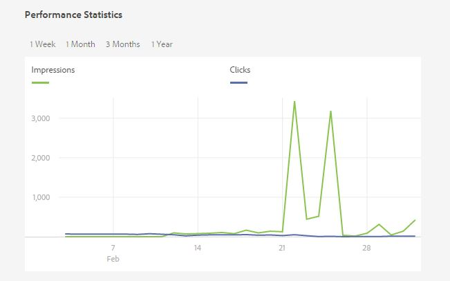

# Asset Insights {#asset-insights}

<!-- TBD: Add uicontrol tags  -->

Met de functie Asset Insights kunt u gebruikersbeoordelingen en gebruiksstatistieken bijhouden van afbeeldingen die worden gebruikt in websites van derden, marketingcampagnes en creatieve oplossingen van Adobe. Het helpt inzichten betreffende hun prestaties en populariteit af te leiden.

Met Elementinzichten worden gegevens over gebruikersactiviteit vastgelegd, zoals het aantal keer dat een afbeelding wordt beoordeeld, geklikt en afbeeldingen worden afgedrukt (het aantal keer dat een afbeelding op de website wordt geladen). Er worden scores toegewezen aan afbeeldingen op basis van deze statistieken. U kunt de scores en de prestatiesstatistieken gebruiken om populaire beelden voor opneming in catalogi, marketing campagnes, etc. te selecteren. U kunt zelfs archiverings en vergunningsvernieuwing beleid formuleren dat op deze statistieken wordt gebaseerd.

Als u met behulp van Assets gebruiksstatistieken wilt vastleggen voor afbeeldingen van een website, moet u de insluitcode voor de afbeelding opnemen in de websitecode.

Als u het gebruik van bedrijfsgegevens voor elementen wilt laten weergeven, configureert u eerst de functie voor het ophalen van rapportgegevens van Adobe Analytics. Zie [Elementinzichten](#configure-asset-insights)configureren voor meer informatie.

>[!NOTE]
>
>Inzichten worden alleen ondersteund en opgegeven voor afbeeldingen.

## Statistieken voor een afbeelding weergeven {#viewing-statistics-for-an-image}

U kunt de Asset Insights-scores van de metagegevenspagina weergeven.

1. Selecteer de afbeelding in de gebruikersinterface Elementen (UI) en tik vervolgens op **[!UICONTROL Eigenschappen]** op de werkbalk.
1. Tik op de pagina Eigenschappen op **[!UICONTROL Inzichten]**.
1. Controleer de gebruiksdetails voor het element op het tabblad **[!UICONTROL Inzichten]** . In de sectie **[!UICONTROL Score]** worden het totale gebruik en de prestatiesbronnen van een element beschreven.

   De score van het gebruik beschrijft het aantal tijden activa wordt gebruikt in diverse oplossingen.

   De **[!UICONTROL score Impressions]** is het aantal keren dat het element op de website wordt geladen. Het getal dat onder **[!UICONTROL Klikken]** wordt weergegeven, is het aantal keren dat op het element wordt geklikt.

1. Controleer de sectie **[!UICONTROL Gebruiksstatistieken]** om te weten bij welke entiteiten het element hoort en welke creatieve oplossingen het onlangs hebben gebruikt. Hoe hoger het gebruik, hoe groter de kans dat het middel populair is bij gebruikers. Gebruiksgegevens worden onder de volgende koppen weergegeven:

   * **Element**: Het aantal keren dat het actief deel uitmaakte van een collectie of samengesteld actief
   * **Web en mobiel**: Het aantal keren dat het middel deel uitmaakte van websites en apps
   * **Sociaal**: Het aantal keren dat het middel is gebruikt in oplossingen, zoals Adobe Social en Adobe Campaign
   * **E-mail**: Het aantal keren dat het middel in e-mailcampagnes is gebruikt
   

   >[!NOTE]
   >
   >Omdat de functie Asset Insights de gegevens van Oplossingen gewoonlijk periodiek ophaalt van Adobe Analytics, wordt de meeste recente gegevens mogelijk niet weergegeven in de sectie Oplossingen. De tijdspanne waarvoor de gegevens worden getoond hangt het programma van de haalverrichting af die de Inzichten van Activa loopt om de gegevens van de Analyse terug te winnen.

1. Om prestatiestatistieken voor de asset grafisch over een periode te bekijken selecteert u de periode in de sectie **[!UICONTROL Prestatiestatistieken]**. De details, inclusief klikken en impressies, worden getoond als trendlijnen van een grafiek.

   

   >[!NOTE]
   >
   >In tegenstelling tot de gegevens in de sectie van Oplossingen, toont de sectie van de Statistieken van Prestaties de meest recente gegevens.

1. Tik op de **[!UICONTROL knop Insluitcode]** ophalen onder de elementminiatuur om de insluitcode te verkrijgen voor het element dat u in websites opneemt om prestatiegegevens op te halen. <!-- For more information on how to include your Embed code in third-party web pages, see [Using Page Tracker and Embed code in web pages](/help/assets/use-page-tracker.md). -->

   

## Samengevoegde statistieken voor afbeeldingen weergeven {#viewing-aggregate-statistics-for-images}

U kunt tegelijk scores van alle assets in een map weergeven met de **[!UICONTROL Insights-weergave]**.

1. Navigeer in de interface Elementen naar de map met de elementen waarvoor u inzichten wilt weergeven.
1. Tik/klik op het pictogram Lay-out op de werkbalk en kies vervolgens **[!UICONTROL Inzichtsweergave]**.
1. Op de pagina worden gebruiksscores voor de elementen weergegeven. Vergelijk de ratings van de verschillende activa en teken inzichten.

## Achtergrondtaak plannen {#scheduling-background-job}

Asset Insights haalt op periodieke wijze gebruiksgegevens voor middelen op uit Adobe Analytics-rapportreeksen. Door gebrek, stelt de Inzichten van Activa een achtergrondbaan om de 24 uur bij 2 AM aan de ophaalgegevens in werking. U kunt echter zowel de frequentie als de tijd aanpassen door de **[!UICONTROL Adobe CQ DAM Asset Performance Report Sync Job]** Service via de webconsole te configureren.

1. Tik op het AEM-logo en ga naar **[!UICONTROL Gereedschappen]** > **[!UICONTROL Bewerkingen]** > **[!UICONTROL Webconsole]**.
1. Open de configuratie van de **[!UICONTROL Adobe CQ DAM Asset Performance Report Sync Job]** Service.

   

1. Specificeer de gewenste plannerfrequentie en de begintijd voor de baan in de uitdrukking van de bezitsplanner. Sla de wijzigingen op.

## Elementinzichten configureren {#configure-asset-insights}

Met Adobe Experience Manager (AEM) worden gebruiksgegevens opgehaald van AEM-elementen die door websites van derden worden gebruikt met Adobe Analytics. Als u Asset Insights wilt inschakelen om deze gegevens op te halen en inzichten te genereren, moet u eerst de functie configureren voor integratie met Adobe Analytics.

>[!NOTE]
>
>Inzichten worden alleen ondersteund en opgegeven voor afbeeldingen.

1. Klik in AEM op **[!UICONTROL Gereedschappen]** > **[!UICONTROL Assets]**.

   

1. Klik op de **[!UICONTROL Insights-configuratiekaart]**.
1. Selecteer een datacenter in de wizard en geef uw referenties op, inclusief de naam van uw organisatie, gebruikersnaam en gedeeld geheim.

   
   *Afbeelding: Adobe Analytics voor Assets Insights configureren in AEM*

1. Klik of tik op **[!UICONTROL Verifiëren]**. Nadat AEM uw gegevens heeft geverifieerd, kiest u in de lijst **[!UICONTROL Report Suite]** een Adobe Analytics-rapportsuite waaruit u gegevens wilt ophalen met behulp van Asset Insights. Click **[!UICONTROL Add]**.
1. Tik op **[!UICONTROL Gereed]** nadat AEM uw rapportsuite heeft ingesteld.

### Paginanummering {#page-tracker}

Nadat u uw Adobe Analytics-account hebt geconfigureerd, wordt de code van Paginanummer voor u gegenereerd. Als u Assets Insights wilt inschakelen om AEM-elementen die worden gebruikt op websites van derden bij te houden, neemt u de paginacontrackercode op in de websitecode. Gebruik het hulpprogramma Paginanummering in AEM Assets om de code van de paginacontracker te genereren. <!--  For more information on how to include your Page Tracker code in third-party web pages, see [Using Page Tracker and Embed code in web pages](/help/assets/use-page-tracker.md). -->

1. Klik in AEM op **[!UICONTROL Gereedschappen]** > **[!UICONTROL Assets]**.

   

1. Klik op de pagina **[!UICONTROL Navigatie]** op de kaart voor **[!UICONTROL Insights-paginatracering]**.
1. Klik op **[!UICONTROL Downloaden]** om de code van de paginacontracker te downloaden.

<!--

## Using demo package for Asset Insights {#using-demo-package-for-asset-insights}

Using the demo package, you can enable Adobe Asset Insights to capture data from and generate insights for a sample web page.

1. Configure Asset Insights using the instructions in [Configure Asset Insights](#configure-asset-insights).
1. Download the sample AEM Assets package from below and install the package from CRXDE package manager.

   [Get File](assets/insightsdemo.zip)

1. Download the ZIP file containing the sample web page from below and extract on your local file system.

   [Get File](assets/demosite.zip)

1. Click the web page to open it in the web browser.

   >[!CAUTION]
   >
   >Web Page is configured to load asset from the localhost server . In case your server is running somewhere else change server address from localhost to server address in the HTML content of the web page.

   >[!NOTE]
   >
   >The external web page can be in AEM itself.

-->
