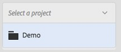
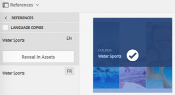

# Assets Insights {#asset-insights}

| Versie | Artikelkoppeling |
| -------- | ---------------------------- |
| AEM 6.5 | [&#x200B; klik hier &#x200B;](https://experienceleague.adobe.com/docs/experience-manager-65/assets/managing/asset-insights.html?lang=nl-NL) |
| AEM as a Cloud Service | Dit artikel |

Met de functie Assets Insights kunt u gebruikersbeoordelingen en gebruiksstatistieken bijhouden van afbeeldingen die worden gebruikt in websites van derden, marketingcampagnes en creatieve Adobe-oplossingen. Hierdoor krijgt u meer inzicht in de prestaties en de populariteit van de afbeeldingen.

Met Assets Insights worden details van gebruikersactiviteit vastgelegd, zoals het aantal malen dat een afbeelding wordt beoordeeld, geklikt en afbeeldingen worden afgedrukt (het aantal keer dat een afbeelding op de website wordt geladen). Er worden scores toegewezen aan afbeeldingen op basis van deze statistieken. U kunt de scores en de prestatiesstatistieken gebruiken om populaire beelden voor opneming in catalogi, marketing campagnes, etc. te selecteren. U kunt zelfs archiverings en vergunningsvernieuwing beleid formuleren dat op deze statistieken wordt gebaseerd.

Assets Insights kan alleen gebruiksstatistieken vastleggen voor afbeeldingen van een website als u de insluitcode voor de afbeelding opneemt in de websitecode.

Om Assets Insights gebruiksstatistieken voor middelen te laten weergeven, configureert u eerst de functie om rapportgegevens op te halen uit [!DNL Adobe Analytics] . Voor details, zie [&#x200B; de Inzichten van Assets &#x200B;](#configure-asset-insights) vormen. Als u deze functie wilt gebruiken, moet u de licentie voor [!DNL Adobe Analytics] afzonderlijk kopen.

>[!NOTE]
>
>Inzichten worden ondersteund en alleen voor afbeeldingen verstrekt.

## Statistieken voor een afbeelding weergeven {#viewing-statistics-for-an-image}

U kunt de Assets Insights-scores bekijken op de metagegevenspagina.

1. Selecteer de afbeelding in de Assets-gebruikersinterface en klik op **[!UICONTROL Properties]** op de werkbalk.
1. Klik op **[!UICONTROL Insights]** op de pagina Eigenschappen.
1. Controleer de gebruiksdetails voor het element op het tabblad **[!UICONTROL Insights]** . In de sectie **[!UICONTROL Score]** worden het totale gebruik en de prestatiesbronnen van een element beschreven.

   De score van het gebruik beschrijft het aantal tijden activa wordt gebruikt in diverse oplossingen.

   De **[!UICONTROL Impressions]** score is het aantal keren dat het element op de website wordt geladen. Het getal dat onder **[!UICONTROL Clicks]** wordt weergegeven, is het aantal keren dat op het element wordt geklikt.

1. Controleer de sectie **[!UICONTROL Usage Statistics]** om te weten van welke entiteiten het element deel uitmaakte en welke creatieve oplossingen het onlangs hebben gebruikt. Hoe hoger het gebruik, hoe groter de kans dat het middel populair is bij gebruikers. Gebruiksgegevens worden onder de volgende koppen weergegeven:

   * **[!UICONTROL Asset]**: Het aantal keren dat het element deel uitmaakte van een verzameling of samengesteld element.
   * **[!UICONTROL Web & Mobile]**: Het aantal keren dat het middel deel uitmaakte van websites en apps.
   * **[!UICONTROL Social]**: Het aantal keren dat het element is gebruikt in andere oplossingen, zoals een [!DNL Adobe Campaign] .
   * **[!UICONTROL Email]**: Het aantal keren dat het middel in e-mailcampagnes is gebruikt.

   

   >[!NOTE]
   >
   >Omdat de functie Assets Insights de gegevens van Oplossingen doorgaans periodiek van [!DNL Adobe Analytics] ophaalt, wordt in de sectie Oplossingen mogelijk niet de meest recente gegevens weergegeven. De tijdsperiode waarvoor de gegevens worden weergegeven, is afhankelijk van het schema van de ophaalbewerking die Assets Insights uitvoert om analysegegevens op te halen.

1. Als u de prestatiestatistieken voor het element gedurende een bepaalde periode grafisch wilt weergeven, selecteert u een punt in de sectie **[!UICONTROL Performance Statistics]** . De details, inclusief klikken en impressies, worden getoond als trendlijnen van een grafiek.

   

   >[!NOTE]
   >
   >In tegenstelling tot de gegevens in de sectie van Oplossingen, toont de sectie van de Statistieken van Prestaties de meest recente gegevens.

1. Klik op **[!UICONTROL Get Embed Code]** onder de elementminiatuur om de insluitcode te verkrijgen voor het element dat u in websites opneemt om prestatiegegevens op te halen. <!-- For more information on how to include your Embed code in third-party web pages, see [Using Page Tracker and Embed code in web pages](/help/assets/use-page-tracker.md). -->

   

## Samengevoegde statistieken voor afbeeldingen weergeven {#viewing-aggregate-statistics-for-images}

U kunt scores van alle elementen in een map tegelijk weergeven met **[!UICONTROL Insights View]** .

1. Navigeer in de Assets-gebruikersinterface naar de map met de elementen waarvoor u inzichten wilt weergeven.
1. Klik op de optie **[!UICONTROL Layout]** op de werkbalk en kies vervolgens **[!UICONTROL Insights View]** .
1. Op de pagina worden gebruiksscores voor de elementen weergegeven. Vergelijk de ratings van de verschillende activa en teken inzichten.

<!-- TBD: Commenting as Web Console is not available. Document the appropriate OSGi config method if available in CS.

## Schedule background job {#scheduling-background-job}

Assets Insights fetches usage data for assets from Adobe Analytics report suites in a periodic manner. By default, Assets Insights runs a background job every 24 hours at 2 AM to the fetch data. However, you can modify both the frequency and the time by configuring the **[!UICONTROL Adobe CQ DAM Asset Performance Report Sync Job]** service from the web console.

1. Click the [!DNL Experience Manager] logo, and go to **[!UICONTROL Tools]** > **[!UICONTROL Operations]** > **[!UICONTROL Web Console]**.
1. Open the **[!UICONTROL Adobe CQ DAM Asset Performance Report Sync Job]** service configuration.

   

1. Specify the desired scheduler frequency and the start time for the job in the property scheduler expression. Save the changes.
-->

## Assets Insights configureren {#configure-asset-insights}

[!DNL Experience Manager Assets] haalt gebruiksgegevens op over digitale elementen die door websites van derden worden gebruikt vanuit [!DNL Adobe Analytics] . Als u Assets Insights in staat wilt stellen deze gegevens op te halen en inzichten te genereren, moet u eerst de functie configureren voor integratie met [!DNL Adobe Analytics] .

>[!NOTE]
>
>Inzichten worden alleen ondersteund en opgegeven voor afbeeldingen.

1. Klik in [!DNL Experience Manager] op **[!UICONTROL Tools]** > **[!UICONTROL Assets]** .

   

1. Klik op de **[!UICONTROL Insights Configuration]** -kaart.

1. Ga naar **[!UICONTROL Analytics]** > **[!UICONTROL Admin]** > **[!UICONTROL Admin Tools]** > **[!UICONTROL Company Settings]** > **[!UICONTROL Web Services]** en kopieer de **[!UICONTROL Shared Secret]** -toets voor de toegangsgegevens van de Analytics-webservice.

   Selecteer de **[!UICONTROL Data Center]** in de wizard, geef de weergavenaam van de **[!UICONTROL Company]** webservices **[!UICONTROL Username]** op en plak de **[!UICONTROL Shared Secret]** -toets.

   Klik op **[!UICONTROL Authenticate]**.

   ![&#x200B; Adobe Analytics for Assets Insights configureren in [!DNL Experience Manager]](assets/analytics-insight-config.png)

   *Cijfer: Vorm Adobe Analytics for Assets Insights in[!DNL Experience Manager]*

1. Bij succesvolle authentificatie, zult u de Reeksen van het Rapport krijgen die in drop-down worden vermeld. Selecteer de Adobe Analytics **[!UICONTROL Report Suite]** van waar u Assets Insights wilt ophalen. Klik op **[!UICONTROL Add]**.

1. Klik op **[!UICONTROL Done]** nadat [!DNL Experience Manager] de rapportsuite heeft ingesteld.

Voor meer informatie, zie {de Diensten van het Web van 0} Adobe Analytics [&#128279;](https://experienceleague.adobe.com/docs/analytics/admin/company-settings/web-services-admin.html?lang=nl-NL#api-access-information).

### Paginanummer {#page-tracker}

Nadat u uw Adobe Analytics-account hebt geconfigureerd, wordt de code van Paginanummer voor u gegenereerd. Als u wilt dat Assets Insights de [!DNL Experience Manager] -elementen kan bijhouden die in websites van derden worden gebruikt, neemt u de paginacontrackercode op in de websitecode. Gebruik het hulpprogramma Paginanummering in Assets om de code van de paginatracker te genereren. <!--  For more information on how to include your Page Tracker code in third-party web pages, see [Using Page Tracker and Embed code in web pages](/help/assets/use-page-tracker.md). -->

1. Klik in [!DNL Experience Manager] op **[!UICONTROL Tools]** > **[!UICONTROL Assets]** .

   

1. Klik op de **[!UICONTROL Navigation]** -pagina op de **[!UICONTROL Insights Page Tracker]** -kaart.
1. Klik op **[!UICONTROL Download]** om de code van de paginacontracker te downloaden.

<!--
Add page tracker code, CQDOC-18045, 30/07/2021
-->
In het volgende voorbeeldcodefragment wordt de code van Paginanummer weergegeven die in een voorbeeldwebpagina is opgenomen:

```xml
 <head>
            <script type="text/javascript" src="http://localhost:4502/xxxx/etc.clientlibs/dam/clientlibs/sitecatalyst/appmeasurement.js"></script>
            <script type="text/javascript" src="http://localhost:4502/xxxx/etc.clientlibs/dam/clientlibs/foundation/assetinsights/pagetracker.js"></script>
            <script type="text/javascript">
                                assetAnalytics.attrTrackable = 'trackable';
                assetAnalytics.defaultTrackable = false;
                assetAnalytics.attrAssetID = 'aem-asset-id';
                assetAnalytics.assetImpressionPollInterval = 200; // interval in millis
                assetAnalytics.charsLimitForGET = 2000; // bytes
                assetAnalytics.dispatcher.init("assetstesting","abc.net","bee","list1","eVar3","event8","event7");
            </script>

 </head>
```


<!--

## Using demo package for Assets Insights {#using-demo-package-for-asset-insights}

Using the demo package, you can enable Adobe Assets Insights to capture data from and generate insights for a sample web page.

1. Configure Assets Insights using the instructions in [Configure Assets Insights](#configure-asset-insights).
1. Download the sample [!DNL Experience Manager Assets] package from below and install the package from CRXDE package manager.

   [Get File](assets/insightsdemo.zip)

1. Download the ZIP file containing the sample web page from below and extract on your local file system.

   [Get File](assets/demosite.zip)

1. Click the web page to open it in the web browser.

   >[!CAUTION]
   >
   >Web Page is configured to load asset from the localhost server . In case your server is running somewhere else change server address from localhost to server address in the HTML content of the web page.

   >[!NOTE]
   >
   >The external web page can be in [!DNL Experience Manager] itself.

-->

**zie ook**

* [Assets vertalen](translate-assets.md)
* [ASSETS HTTP API](mac-api-assets.md)
* [Door Assets ondersteunde bestandsindelingen](file-format-support.md)
* [Zoeken in middelen](search-assets.md)
* [Verbonden elementen](use-assets-across-connected-assets-instances.md)
* [Elementen rapporteren](asset-reports.md)
* [Metagegevensschema&#39;s](metadata-schemas.md)
* [Elementen downloaden](download-assets-from-aem.md)
* [Metagegevens beheren](manage-metadata.md)
* [Zoeken in facetten](search-facets.md)
* [Verzamelingen beheren](manage-collections.md)
* [Bulkmetagegevens importeren](metadata-import-export.md)
* [Assets publiceren naar AEM en Dynamic Media](/help/assets/publish-assets-to-aem-and-dm.md)
