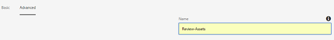
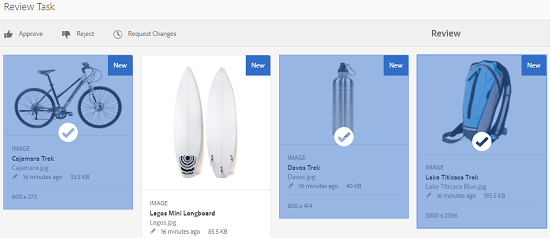
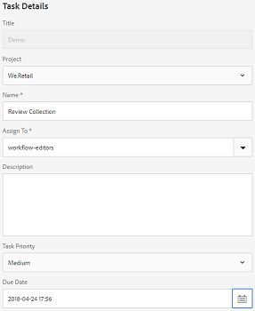

# Elementen in mappen en verzamelingen controleren {#review-folder-assets-and-collections}

Met AEM-middelen (Adobe Experience Manager) kunt u workflows voor ad-hocrevisies instellen voor elementen in een map of een verzameling. U kunt deze delen met revisoren of creatieve partners om hun feedback te vragen. U kunt een revisiewerkstroom aan een project koppelen of een onafhankelijke revisietaak maken.

Nadat u de middelen hebt gedeeld, kunnen revisoren deze goedkeuren of afwijzen. Meldingen worden in verschillende fasen van de workflow verzonden om beoogde ontvangers op de hoogte te stellen van de voltooiing van verschillende taken. Als u bijvoorbeeld een map of verzameling deelt, ontvangt de controleur een melding dat een map of verzameling is gedeeld voor revisie.

Nadat de controleur de controle heeft voltooid (activa goedkeurt of verwerpt), ontvangt u een bericht van de revisievoltooiing.

## Een revisietaak voor mappen maken {#creating-a-review-task-for-folders}

1. Selecteer in de gebruikersinterface Middelen de map waarvoor u een revisietaak wilt maken.
1. Tik op of klik op het pictogram Revisietaak **** maken op de werkbalk om de pagina **[!UICONTROL Revisietaak]** te openen. Als u het pictogram niet ziet op de werkbalk, tikt u op **[!UICONTROL Meer]** of klikt u op het pictogram.

   

1. (Optioneel) Selecteer in de lijst **[!UICONTROL Project]** het project waaraan u de revisietaak wilt koppelen. Standaard is de optie **[!UICONTROL Geen]** geselecteerd. Als u geen project aan de overzichtstaak wilt associëren, behoud deze selectie.

   >[!NOTE]
   >
   >Slechts zijn de projecten waarvoor u de (of hogere) toestemmingen op het niveau van de Redacteur hebt zichtbaar in de lijst van **[!UICONTROL Projecten]** .

1. Voer een naam in voor de revisietaak en selecteer een fiatteur in de lijst **[!UICONTROL Toewijzen aan]** .

   >[!NOTE]
   >
   >De leden/groepen van het geselecteerde project zijn beschikbaar als fiatteurs in de lijst **[!UICONTROL Toewijzen aan]** .

1. Voer een beschrijving, de prioriteit van de taak en de vervaldatum voor de controletaak in.

   

1. Voer op het tabblad Geavanceerd een label in dat u wilt gebruiken om de URI te maken.

   

1. Tik/klik op **[!UICONTROL Verzenden]** en tik/klik op **[!UICONTROL Gereed]** om het bevestigingsbericht te sluiten. Een bericht voor de nieuwe taak wordt verzonden naar de fiatteur.
1. Meld u aan bij AEM Assets als fiatteur en navigeer naar de interface Middelen. Als u middelen wilt goedkeuren, klikt u op het pictogram **[!UICONTROL Meldingen]** of tikt u op dit pictogram en selecteert u de revisietaak in de lijst.

   

1. Controleer op de pagina **[!UICONTROL Revisietaak]** de details van de revisietaak en tik op **[!UICONTROL Revisie]**.
1. Selecteer op de pagina Taak **** Reviseren de gewenste elementen en tik op het pictogram **[!UICONTROL Goedkeuren/Afwijzen]** of klik op deze knop om het bestand goed te keuren of af te wijzen.

   

1. Tik/klik op het pictogram **[!UICONTROL Voltooien]** op de werkbalk. Voer in het dialoogvenster een opmerking in en tik op **[!UICONTROL Voltooien]** of klik op Bevestigen.
1. Navigeer naar de interface Middelen en open de map. De pictogrammen voor de goedkeuringsstatus van de elementen worden weergegeven in zowel de Kaart- als lijstweergave.

   **Kaartweergave**

   

   **Lijstweergave**

   

## Een revisietaak voor verzamelingen maken {#creating-a-review-task-for-collections}

1. Selecteer op de pagina Verzamelingen de verzameling waarvoor u een revisietaak wilt maken.
1. Tik op of klik op het pictogram Revisietaak **** maken op de werkbalk om de pagina **[!UICONTROL Revisietaak]** te openen. Als u het pictogram niet ziet op de werkbalk, tikt u op **[!UICONTROL Meer]** of klikt u op het pictogram.

   

1. (Optioneel) Selecteer in de lijst **[!UICONTROL Project]** het project waaraan u de revisietaak wilt koppelen. Standaard is de optie **[!UICONTROL Geen]** geselecteerd. Als u geen project aan de overzichtstaak wilt associëren, behoud deze selectie.

   >[!NOTE]
   >
   >Slechts zijn de projecten waarvoor u de (of hogere) toestemmingen op het niveau van de Redacteur hebt zichtbaar in de lijst van **[!UICONTROL Projecten]** .

1. Voer een naam in voor de revisietaak en selecteer een fiatteur in de lijst **[!UICONTROL Toewijzen aan]** .

   >[!NOTE]
   >
   >De leden/groepen van het geselecteerde project zijn beschikbaar als fiatteurs in de lijst **[!UICONTROL Toewijzen aan]** .

1. Voer een beschrijving, de prioriteit van de taak en de vervaldatum voor de controletaak in.

   

1. Tik/klik op **[!UICONTROL Verzenden]** en tik/klik op **[!UICONTROL Gereed]** om het bevestigingsbericht te sluiten. Een bericht voor de nieuwe taak wordt verzonden naar de fiatteur.
1. Meld u aan bij AEM Assets als fiatteur en navigeer naar de middelenconsole. Tik op het pictogram **[!UICONTROL Meldingen]** of klik op het pictogram om elementen goed te keuren en selecteer vervolgens de revisietaak in de lijst.
1. Controleer op de pagina **[!UICONTROL Revisietaak]** de details van de revisietaak en tik op **[!UICONTROL Revisie]**.
1. Alle elementen in de verzameling zijn zichtbaar op de overzichtspagina. Selecteer de elementen en tik/klik op het pictogram **[!UICONTROL Goedkeuren/Afwijzen]** om de elementen goed te keuren of af te wijzen.

   

1. Tik/klik op het pictogram **[!UICONTROL Voltooien]** op de werkbalk. Voer in het dialoogvenster een opmerking in en tik op **[!UICONTROL Voltooien]** of klik op Bevestigen.
1. Navigeer naar de verzamelingsconsole en open de verzameling. De pictogrammen voor de goedkeuringsstatus van de elementen worden weergegeven in zowel de Kaart- als lijstweergave.

   **Kaartweergave**

   

   **Lijstweergave**

   

