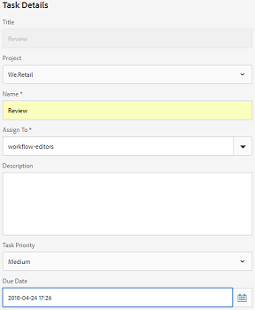

# Elementen in mappen en verzamelingen controleren {#review-folder-assets-and-collections}

| Versie | Artikelkoppeling |
| -------- | ---------------------------- |
| AEM 6,5 | [Klik hier](https://experienceleague.adobe.com/docs/experience-manager-65/assets/using/bulk-approval.html?lang=en) |
| AEM as a Cloud Service | Dit artikel |

Met Adobe Experience Manager Assets kunt u werkstromen voor ad-hocrevisies instellen voor elementen in een map of een verzameling. U kunt deze delen met revisoren of creatieve partners om hun feedback te vragen. U kunt een revisiewerkstroom aan een project koppelen of een onafhankelijke revisietaak maken.

Nadat u de middelen hebt gedeeld, kunnen revisoren deze goedkeuren of afwijzen. Meldingen worden in verschillende fasen van de workflow verzonden om beoogde ontvangers op de hoogte te stellen van de voltooiing van verschillende taken. Als u bijvoorbeeld een map of verzameling deelt, ontvangt de controleur een melding dat een map of verzameling is gedeeld voor revisie.

Nadat de controleur de revisie heeft voltooid (activa goedkeurt of verwerpt), ontvangt u een bericht dat de revisie is voltooid.

## Een revisietaak voor mappen maken {#creating-a-review-task-for-folders}

1. Selecteer in de gebruikersinterface Middelen de map waarvoor u een revisietaak wilt maken.
1. Selecteer in de werkbalk de optie **[!UICONTROL Create Review Task]** pictogram om het **[!UICONTROL Review Task]** pagina. Als het pictogram niet wordt weergegeven op de werkbalk, selecteert u **[!UICONTROL More]** en selecteer vervolgens het pictogram.

   

1. (Optioneel) Van de **[!UICONTROL Project]** selecteert u het project waaraan u de revisietaak wilt koppelen. Standaard worden de **[!UICONTROL None]** is geselecteerd. Als u geen project aan de overzichtstaak wilt associëren, behoud deze selectie.

   >[!NOTE]
   >
   >Slechts zijn de projecten waarvoor u de (of hogere) toestemmingen op het niveau van de Redacteur hebt zichtbaar in **[!UICONTROL Projects]** lijst.

1. Voer een naam in voor de revisietaak en selecteer een fiatteur in het menu **[!UICONTROL Assign To]** lijst.

   >[!NOTE]
   >
   >De leden/groepen van het geselecteerde project zijn beschikbaar als fiatteurs in **[!UICONTROL Assign To]** lijst.

1. Voer een beschrijving, de prioriteit van de taak en de vervaldatum voor de controletaak in.

   

1. Voer op het tabblad Geavanceerd een label in dat u wilt gebruiken om de URI te maken.

   

1. Selecteren **[!UICONTROL Submit]** en selecteer vervolgens **[!UICONTROL Done]** om het bevestigingsbericht te sluiten. Er wordt een bericht voor de nieuwe taak naar de goedkeurder verzonden.
1. Aanmelden bij [!DNL Experience Manager Assets] als fiatteur en navigeer naar de interface Middelen. Selecteer de optie **[!UICONTROL Notifications]** en selecteert u vervolgens de revisietaak in de lijst.

   

1. In de **[!UICONTROL Review Task]** pagina, onderzoekt u de details van de revisietaak en selecteert u **[!UICONTROL Review]**.
1. In de **[!UICONTROL Review Task]** pagina, selecteert u elementen en selecteert u de **[!UICONTROL Approve/Reject]** pictogram om goed te keuren of af te wijzen, al naar het geval.

   

1. Selecteer de **[!UICONTROL Complete]** op de werkbalk. Voer in het dialoogvenster een opmerking in en selecteer  **[!UICONTROL Complete]** ter bevestiging.
1. Navigeer naar de interface Middelen en open de map. De pictogrammen voor de goedkeuringsstatus van de elementen worden weergegeven in zowel de Kaart- als lijstweergave.

   **Kaartweergave**

   

   **Lijstweergave**

   

## Een revisietaak voor verzamelingen maken {#creating-a-review-task-for-collections}

1. Selecteer op de pagina Verzamelingen de verzameling waarvoor u een revisietaak wilt maken.
1. Selecteer in de werkbalk de optie **[!UICONTROL Create Review Task]** pictogram om het **[!UICONTROL Review Task]** pagina. Als het pictogram niet wordt weergegeven op de werkbalk, selecteert u **[!UICONTROL More]** en selecteer vervolgens het pictogram.

   

1. (Optioneel) Van de **[!UICONTROL Project]** selecteert u het project waaraan u de revisietaak wilt koppelen. Standaard worden de **[!UICONTROL None]** is geselecteerd. Als u geen project aan de overzichtstaak wilt associëren, behoud deze selectie.

   >[!NOTE]
   >
   >Slechts zijn de projecten waarvoor u de (of hogere) toestemmingen op het niveau van de Redacteur hebt zichtbaar in **[!UICONTROL Projects]** lijst.

1. Voer een naam in voor de revisietaak en selecteer een fiatteur in het menu **[!UICONTROL Assign To]** lijst.

   >[!NOTE]
   >
   >De leden/groepen van het geselecteerde project zijn beschikbaar als fiatteurs in **[!UICONTROL Assign To]** lijst.

1. Voer een beschrijving, de prioriteit van de taak en de vervaldatum voor de controletaak in.

   

1. Selecteren **[!UICONTROL Submit]** en selecteer vervolgens **[!UICONTROL Done]** om het bevestigingsbericht te sluiten. Er wordt een bericht voor de nieuwe taak naar de goedkeurder verzonden.
1. Aanmelden bij [!DNL Experience Manager Assets] als Approver en navigeer aan de console van Activa. Selecteer de optie **[!UICONTROL Notifications]** en selecteert u vervolgens de revisietaak in de lijst.
1. In de **[!UICONTROL Review Task]** pagina, onderzoekt u de details van de revisietaak en selecteert u **[!UICONTROL Review]**.
1. Alle elementen in de verzameling zijn zichtbaar op de controlepagina. Selecteer de elementen en selecteer de **[!UICONTROL Approve/Reject]** pictogram om elementen goed te keuren of af te wijzen, al naar het geval.

   

1. Selecteer de **[!UICONTROL Complete]** op de werkbalk. Voer in het dialoogvenster een opmerking in en selecteer **[!UICONTROL Complete]** ter bevestiging.
1. Navigeer naar de verzamelingsconsole en open de verzameling. De pictogrammen voor de goedkeuringsstatus van de elementen worden weergegeven in zowel de Kaart- als lijstweergave.

   **Kaartweergave**

   

   **Lijstweergave**

   

**Zie ook**

* [Elementen vertalen](translate-assets.md)
* [Elementen HTTP-API](mac-api-assets.md)
* [Ondersteunde bestandsindelingen](file-format-support.md)
* [Zoeken in middelen](search-assets.md)
* [Verbonden elementen](use-assets-across-connected-assets-instances.md)
* [Elementen rapporteren](asset-reports.md)
* [Metagegevensschema&#39;s](metadata-schemas.md)
* [Elementen downloaden](download-assets-from-aem.md)
* [Metagegevens beheren](manage-metadata.md)
* [Zoeken in facetten](search-facets.md)
* [Verzamelingen beheren](manage-collections.md)
* [Bulkmetagegevens importeren](metadata-import-export.md)
* [Middelen publiceren naar AEM en Dynamic Media](/help/assets/publish-assets-to-aem-and-dm.md)
