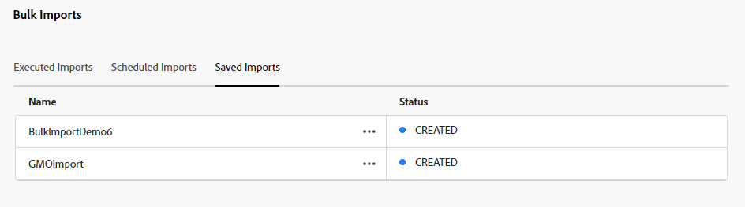

# Bulkimportelementen met middelenweergave  {#bulk-import-assets-view}

Bulkimport in de weergave AEM Assets biedt beheerders de mogelijkheid om een groot aantal elementen uit een gegevensbron te importeren in AEM Assets. De beheerders hoeven geen afzonderlijke elementen of mappen meer te uploaden naar AEM Assets.

>[!NOTE]
>
>In de overzichtsweergave van de middelenweergave wordt dezelfde achtergrond gebruikt als in de bulkimportmodule van de Admin-weergave. Het biedt echter meer gegevensbronnen om uit te importeren en een gestroomlijnde gebruikerservaring.

U kunt elementen importeren uit de volgende gegevensbronnen:

* Azure
* AWS
* Google Cloud
* Dropbox

## Vereisten {#prerequisites}

| Gegevensbron | Vereisten |
|-----|------|
| Azure | <ul> <li>Azure Storage Account </li> <li> Azure Blob Container <li> Azure Access Key of SAS Token op basis van de verificatiemodus </li></ul> |
| AWS | <ul> <li>AWS Region </li> <li> AWS Bucket <li> AWS Access Key </li><li> AWS Access-geheim </li></ul> |
| Google Cloud | <ul> <li>GCP-emmertje </li> <li> GCP-serviceaccount-e-mail <li> persoonlijke sleutel GCP-serviceaccount</li></ul> |
| Dropbox | <ul> <li>Client-id Dropbox </li> <li> Dropbox Client Secret</li></ul> |

Naast deze vereisten op basis van de gegevensbron, moet u zich bewust zijn van de naam van de bronmap in uw gegevensbron die alle elementen bevat die naar AEM Assets moeten worden geïmporteerd.

## Configuratie voor bulkimport maken {#create-bulk-import-configuration}

Voer de volgende stappen uit om een bulkimportconfiguratie tot stand te brengen:

1. Navigeren naar **[!UICONTROL Settings]** > **[!UICONTROL Bulk Import]** en klik op **[!UICONTROL Create Import]**.
1. Selecteer de gegevensbron. Tot de beschikbare opties behoren Azure, AWS, Google Cloud en Dropbox.
1. Geef een naam op voor de configuratie voor bulkimport in het dialoogvenster **[!UICONTROL Name]** veld.
1. Geef de specifieke gegevens voor de gegevensbron op, zoals vermeld in [Vereisten](#prerequisites).
1. Geef de naam op van de hoofdmap die elementen bevat in de gegevensbron in het dialoogvenster **[!UICONTROL Source Folder]** veld.
1. (Optioneel) Selecteer de optie **[!UICONTROL Delete source file after import]** als u de oorspronkelijke bestanden uit de opslagplaats van brongegevens wilt verwijderen nadat de bestanden in Experience Manager Assets zijn geïmporteerd.
1. Selecteer de **[!UICONTROL Import Mode]**. Selecteren **[!UICONTROL Skip]**, **[!UICONTROL Replace]**, of **[!UICONTROL Create Version]**. De modus Overslaan is de standaardinstelling en in deze modus slaat de functie Instantor over om een element te importeren als dit al bestaat.
   

1. (Optioneel) Geef het metagegevensbestand op dat u wilt importeren, in CSV-indeling, in het veld Metagegevensbestand en klik op **[!UICONTROL Next]** om te navigeren naar **[!UICONTROL Location & Filters]**.
1. Om een plaats in DAM te bepalen waar de activa moeten worden ingevoerd gebruikend **[!UICONTROL Assets Target Folder]** veld, geeft u een pad op. Bijvoorbeeld, `/content/dam/imported_assets`.
1. (Optioneel) In het dialoogvenster **[!UICONTROL Choose Filters]** de minimale bestandsgrootte van elementen opgeven in MB om deze op te nemen in het innameproces in het dialoogvenster **[!UICONTROL Filter by Min Size]** veld.
1. (Optioneel) Geef de maximale bestandsgrootte van elementen op in MB om ze op te nemen in het innameproces in het dialoogvenster **[!UICONTROL Filter by Max Size]** veld.
1. (Optioneel) Selecteer de MIME-typen die u in het innameproces wilt opnemen met behulp van het **[!UICONTROL Include MIME Type]** veld. U kunt meerdere MIME-typen selecteren in dit veld. Als u geen waarde definieert, worden alle MIME-typen opgenomen in het innameproces.

1. (Optioneel) Selecteer de MIME-typen die u wilt uitsluiten in het innameproces met behulp van het **[!UICONTROL Exclude MIME Type]** veld. U kunt meerdere MIME-typen selecteren in dit veld. Als u geen waarde definieert, worden alle MIME-typen opgenomen in het innameproces.

   

1. Klik op **[!UICONTROL Next]**. Selecteren **[!UICONTROL Save & run import]** om de configuratie op te slaan en de bulkimport uit te voeren. Selecteren **[!UICONTROL Save import]** om de configuratie voor nu op te slaan zodat u het later kunt in werking stellen.

   

1. Klikken **[!UICONTROL Save]** om de geselecteerde optie uit te voeren.

### Bestandsnamen verwerken tijdens bulkimport {#filename-handling-bulkimport-assets-view}

Wanneer u elementen of mappen in bulk importeert, [!DNL Experience Manager Assets] importeert de gehele structuur van wat er in de invoerbron bestaat. [!DNL Experience Manager] volgt de ingebouwde regels voor speciale tekens in de naam van het element en de map. Deze bestandsnamen moeten daarom worden ontsmet. Voor zowel de mapnaam als de elementnaam blijft de door de gebruiker gedefinieerde titel ongewijzigd en wordt deze opgeslagen in `jcr:title`.

Tijdens de bulkinvoer [!DNL Experience Manager] zoekt u naar de bestaande mappen om te voorkomen dat de elementen en mappen opnieuw worden geïmporteerd, en controleert u ook de ontsmettingsregels die zijn toegepast in de bovenliggende map waar het importeren plaatsvindt. Als de ontsmettingsregels worden toegepast in de bovenliggende map, worden dezelfde regels toegepast op de importbron. Voor nieuwe importbewerkingen worden de volgende ontsmettingsregels toegepast om de bestandsnamen van elementen en mappen te beheren.

Voor meer informatie over niet-toegestane namen, het verwerken van namen van elementen en het verwerken van mapnamen tijdens het importeren van grote hoeveelheden raadpleegt u [Bestandsnamen verwerken tijdens het bulkimporteren in de beheerweergave](add-assets.md##filename-handling-bulkimport).

## Bestaande configuraties voor bulkimport weergeven {#view-import-configuration}

Als u ervoor kiest om de configuratie op te slaan nadat u deze hebt gemaakt, wordt de configuratie weergegeven in het dialoogvenster **[!UICONTROL Saved Imports]** tab.

Als u het importeren opslaat en uitvoert, wordt de configuratie voor importeren weergegeven in het dialoogvenster **[!UICONTROL Executed Imports]** tab.

Als u een importbewerking plant, wordt deze weergegeven in het dialoogvenster **[!UICONTROL Scheduled Imports]** tab.

## Configuratie voor bulkimport bewerken {#edit-import-configuration}

Als u de configuratiedetails wilt bewerken, klikt u op ... voor de configuratienaam en klikt u op **[!UICONTROL Edit]**. U kunt de titel van de configuratie en de gegevensbron van het voer niet uitgeven terwijl het uitvoeren van geeft verrichting uit. U kunt de configuratie bewerken met de tabbladen Uitgevoerde, Geplande of Opgeslagen importbestanden.

## Eenmalige of herhaalde invoer plannen {#schedule-imports}

Voer de volgende stappen uit om een eenmalige of terugkerende bulkimport te plannen:

1. klik ... overeenkomstig de configuratienaam beschikbaar in **[!UICONTROL Executed Imports]** of **[!UICONTROL Saved Imports]** en klik op **[!UICONTROL Schedule]**. U kunt een bestaande geplande import ook opnieuw plannen door naar **[!UICONTROL Scheduled Imports]** tabblad en klikken **[!UICONTROL Schedule]**.

1. Stel een eenmalige opname in of voer een uur-, dag- of wekelijks schema in. Klik op **[!UICONTROL Submit]**.

   

## Een health check voor importeren uitvoeren {#import-health-check}

Als u de verbinding met de gegevensbron wilt valideren, klikt u op ... voor de configuratienaam en klikt u vervolgens op **[!UICONTROL Check]**. Als de verbinding tot stand is gebracht, geeft Experience Manager Assets het volgende bericht weer:

## Een droge run uitvoeren voordat het importeren wordt uitgevoerd {#dry-run-bulk-import}

Klik op ... voor de configuratienaam en klik op **[!UICONTROL Dry Run]** om een testlooppas voor de BulkTaak van de Invoer aan te halen. Experience Manager Assets geeft de volgende gegevens weer over de Bulk Import-taak:

## Een bulkimport uitvoeren {#run-bulk-import}

Als u het importeren hebt opgeslagen tijdens het maken van de configuratie, kunt u naar het tabblad Opgeslagen importbestanden navigeren, op ... klikken voor de configuratie en op **[!UICONTROL Run]**.

En als u een reeds uitgevoerde import moet uitvoeren, navigeert u naar het tabblad Uitgevoerde import. Klik op ... voor de configuratienaam en klik op **[!UICONTROL Run]**.

## Doorlopende import stoppen of plannen {#schedule-stop-ongoing-report}

U kunt een actieve bulkimport plannen of stoppen met behulp van het statusdialoogvenster voor bulkimport dat tijdens het importeren wordt weergegeven op de introductiepagina Bulk.

U kunt ook de elementen weergeven die in de doelmap zijn geïmporteerd door op **[!UICONTROL View Assets]**.

## Een configuratie voor bulkimport verwijderen {#delete-bulk-import-configuration}

Klik op ... voor de configuratienaam in **[!UICONTROL Executed Imports]**, **[!UICONTROL Scheduled Imports]**, of **[!UICONTROL Saved Imports]** tabs en klikken **[!UICONTROL Delete]** om de configuratie van de Invoer van het Bulk te schrappen.

## Navigeren naar elementen nadat bulkimport is uitgevoerd {#view-assets-after-bulk-import}

Als u de doellocatie voor middelen wilt weergeven waar de elementen worden geïmporteerd nadat de Bulkimporttaak is uitgevoerd, klikt u op ... voor de configuratienaam en klikt u vervolgens op **[!UICONTROL View Assets]**.

