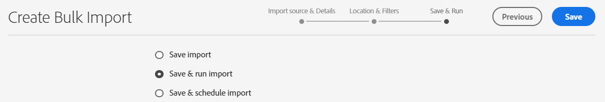
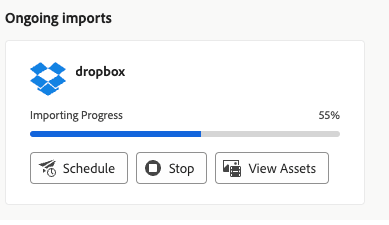

# Bulkimportelementen met gebruik van de Assets-weergave  {#bulk-import-assets-view}

Bulkimport in de weergave AEM Assets biedt beheerders de mogelijkheid om een groot aantal elementen uit een gegevensbron te importeren in AEM Assets. De beheerders hoeven geen afzonderlijke elementen of mappen meer te uploaden naar AEM Assets.

>[!NOTE]
>
>De Assets-weergave bulkimporteur gebruikt dezelfde back-end als de SLV-weergave voor bulkimporteurs. Het biedt echter meer gegevensbronnen om uit te importeren en een gestroomlijnde gebruikerservaring.

U kunt elementen importeren uit de volgende gegevensbronnen:

* Azure
* AWS
* Google Cloud
* Dropbox
* OneDrive

>[!VIDEO](https://video.tv.adobe.com/v/3426857/?learn=on){transcript=true}

## Vereisten {#prerequisites}

| Data Source | Vereisten |
|-----|------|
| Azure | <ul> <li>Azure Storage Account </li> <li> Azure Blob Container <li> Azure Access Key of SAS Token op basis van de verificatiemodus </li></ul> |
| AWS | <ul> <li>AWS Region </li> <li> AWS Bucket <li> AWS Access Key </li><li> AWS Access-geheim </li></ul> |
| Google Cloud | <ul> <li>GCP-emmertje </li> <li> GCP-serviceaccount-e-mail <li> persoonlijke sleutel GCP-serviceaccount</li></ul> |
| Dropbox | <ul> <li>Dropbox Client ID (App-toets) </li> <li> Dropbox Client Secret (App-geheim)</li></ul> |
| OneDrive | <ul> <li>OneDrive-TENant-id  </li> <li> OneDrive-client-id</li><li> OneDrive-clientgeheim</li></ul> |

Naast deze vereisten op basis van de gegevensbron, moet u zich bewust zijn van de naam van de bronmap in uw gegevensbron die alle elementen bevat die naar AEM Assets moeten worden geïmporteerd.

## De Dropbox-toepassing voor ontwikkelaars configureren {#dropbox-developer-application}

Maak en configureer de Dropbox-ontwikkelaarstoepassing voordat u elementen van uw Dropbox-account naar AEM Assets importeert.

Voer de volgende stappen uit:

1. Teken binnen aan uw [&#x200B; rekening van Dropbox &#x200B;](https://www.dropbox.com/developers) en klik **[!UICONTROL Create apps]**.   als u een rekening van de Onderneming Dropbox gebruikt, moet u toegang tot de rol van Admin van de Inhoud hebben.

1. Selecteer in de sectie **[!UICONTROL Choose an API]** het enige beschikbare keuzerondje.

1. Selecteer in de sectie **[!UICONTROL Choose the type of access you need]** een van de volgende opties:

   * Selecteer **[!UICONTROL App folder]** als u toegang nodig hebt tot één map die in uw toepassing in uw Dropbox-account is gemaakt.

   * Selecteer **[!UICONTROL Full Dropbox]** als u toegang wilt tot alle bestanden en mappen in uw Dropbox-account.

1. Geef een naam voor de toepassing op en klik op **[!UICONTROL Create app]** .

1. Voeg https://experience.adobe.com toe aan de sectie **[!UICONTROL Settings]** op het tabblad **[!UICONTROL Redirect URIs]** van de toepassing.

1. Kopieer de waarden voor de velden **[!UICONTROL App key]** en **[!UICONTROL App secret]** . De waarden zijn vereist tijdens het configureren van het bulkimportprogramma in AEM Assets.

1. Voeg op het tabblad **[!UICONTROL Permissions]** de volgende machtigingen toe in de sectie **[!UICONTROL Individual scopes]** .

   * account_info.read

   * files.metadata.read

   * files.content.read

   * files.content.write

1. Klik op **[!UICONTROL Submit]** om de wijzigingen op te slaan.

## De OneDrive-ontwikkelaarstoepassing configureren {#onedrive-developer-application}

Voordat u middelen van uw OneDrive-account naar AEM Assets importeert, moet u eerst de OneDrive-ontwikkeltoepassing maken en configureren.

### Een toepassing maken

1. Teken binnen aan uw [&#x200B; rekening OneDrive &#x200B;](https://portal.azure.com/#view/Microsoft_AAD_RegisteredApps/ApplicationsListBlade) en klik **[!UICONTROL New registration]**.

1. Geef een naam voor de toepassing op en selecteer **[!UICONTROL Accounts in this organizational directory only (Adobe only - Single tenant)]** in **[!UICONTROL Supported account types]** .

1. Voer de volgende stappen uit om omleidings URIs toe te voegen:

   1. Selecteer **[!UICONTROL Select a platform]** in het vervolgkeuzemenu **[!UICONTROL Web]** .

   1. Voeg https://experience.adobe.com toe aan de sectie **[!UICONTROL Redirect URIs]** .
   <!-- Add the first URI and click **[!UICONTROL Configure]** to add it. You can add more by clicking **[!UICONTROL Add URI]** option available in the **[!UICONTROL Web]** section on the **[!UICONTROL Authentication]** page. -->

1. Klik op **[!UICONTROL Register]**. De toepassing is gemaakt.

1. Kopieer de waarden voor de velden **[!UICONTROL Application (client) ID]** en **[!UICONTROL Directory (tenant) ID]** . De waarden zijn vereist tijdens het configureren van het bulkimportprogramma in AEM Assets.

1. Klik op **[!UICONTROL Add a certificate or secret]** voor de optie **[!UICONTROL Client credentials]** .

1. Klik op **[!UICONTROL New client secret]** , geef een beschrijving van het clientgeheim op en klik op **[!UICONTROL Add]** .

1. Kopieer het veld **[!UICONTROL Value]** nadat u het clientgeheim hebt gemaakt (kopieer het veld Geheime id niet). Dit is vereist tijdens het configureren van bulkimport in AEM Assets.

### API-machtigingen toevoegen

Voer de volgende stappen uit om API-machtigingen voor de toepassing toe te voegen:

1. Klik op **[!UICONTROL API permissions]** in het linkervenster en klik op **[!UICONTROL Add a permission]** .
1. Klik op **[!UICONTROL Microsoft Graph]** > **[!UICONTROL Delegated permissions]** . In de sectie **[!UICONTROL Select Permission]** worden de beschikbare machtigingen weergegeven.
1. Selecteer `offline_access` machtiging van `OpenId permissions` en `Files.ReadWrite.All` van `Files` .
1. Klik op **[!UICONTROL Add permissions]** om de updates op te slaan.

## Configuratie voor bulkimport maken {#create-bulk-import-configuration}

Voer de volgende stappen uit om een configuratie voor bulkimport te maken in de [!DNL Experience Manager Assets] :

1. Klik op **[!UICONTROL Bulk Import]** in het linkervenster en klik op **[!UICONTROL Create Import]** .
1. Selecteer de gegevensbron. De beschikbare opties zijn **[!UICONTROL Azure]** , **[!UICONTROL AWS]** , **[!UICONTROL Google Cloud]** , **[!UICONTROL Dropbox]** en **[!UICONTROL OneDrive]** .
1. Geef een naam op voor de configuratie voor bulkimport in het veld **[!UICONTROL Name]** .
1. Specificeer de gegevensbron specifieke geloofsbrieven, zoals die in [&#x200B; Vereisten &#x200B;](#prerequisites) worden vermeld.
1. Geef een naam op van de hoofdmap die elementen bevat in de gegevensbron in het veld **[!UICONTROL Source Folder]** .

   >[!NOTE]
   >
   >Als u Dropbox als gegevensbron gebruikt, geeft u het pad van de bronmap op op basis van de volgende regels:
   >* Als u **Volledige Dropbox** terwijl het creëren van de toepassing van Dropbox en de omslag selecteert die de activa bevat bestaat bij `https://www.dropbox.com/home/bulkimport-assets`, dan specificeer `bulkimport-assets` op het **[!UICONTROL Source Folder]** gebied.
   >* Als u **omslag van de App** terwijl het creëren van de toepassing van Dropbox en de omslag selecteert die de activa bevat bestaat bij `https://www.dropbox.com/home/Apps/BulkImportAppFolderScope/bulkimport-assets`, dan specificeer `bulkimport-assets` in het **[!UICONTROL Source Folder]** gebied, waar `BulkImportAppFolderScope` naar de naam van de toepassing verwijst. `Apps` wordt in dit geval automatisch toegevoegd na `home` .

   >[!NOTE]
   >
   >Als u OneDrive als gegevensbron gebruikt, geeft u het pad van de bronmap op op basis van de volgende regels:
   >* Geef alleen de naam van de hoofdmap op, zonder het domein. Als het volledige URL-pad van de map `https://my.sharepoint.com/my?id=/personal/user/Documents/Importfolder/` is, geeft u `/Importfolder/` op in het veld **[!UICONTROL Source Folder]** .
   >* Als de mapnaam meerdere woorden bevat, gescheiden door spaties, geeft u de naam op met de spaties in de configuratie Bulk importeren.
   >* De bronmap moet zich in de hoofdmap van de map bevinden. Mappaden worden niet ondersteund.

1. (Optioneel) Selecteer de optie **[!UICONTROL Delete source file after import]** om de oorspronkelijke bestanden uit de opslagplaats voor brongegevens te verwijderen nadat de bestanden in Experience Manager Assets zijn geïmporteerd.
1. Selecteer de **[!UICONTROL Import Mode]** . Selecteer **[!UICONTROL Skip]**, **[!UICONTROL Replace]** of **[!UICONTROL Create Version]** . De modus Overslaan is de standaardinstelling en in deze modus slaat de functie Instantor over om een element te importeren als dit al bestaat.
   

1. (Optioneel) Geef het metagegevensbestand op dat u wilt importeren, in CSV-indeling, in het veld **[!UICONTROL Metadata File]** . Het bronbestand voor metagegevens moet zich in de bronmap bevinden. Klik op **[!UICONTROL Next]** om naar **[!UICONTROL Location & Filters]** te navigeren.

   >[!NOTE]
   >
   >Afhankelijk van de beveiligingsregels van uw organisatie is het mogelijk dat u beheerderstoestemming voor deze toepassing nodig hebt om verbinding te maken met het gereedschap Bulk importeren. Als dit wordt vereist, moet de beheerder toestemming verstrekken alvorens de bulkinvoerconfiguratie kan worden bewaard.

1. Als u een locatie in DAM wilt definiëren waar elementen moeten worden geïmporteerd met het veld **[!UICONTROL Assets Target Folder]** , geeft u een pad op. Bijvoorbeeld `/content/dam/imported_assets` .
1. (Optioneel) Geef in de sectie **[!UICONTROL Choose Filters]** de minimale bestandsgrootte van elementen op in MB om deze op te nemen in het innameproces in het veld **[!UICONTROL Filter by Min Size]** .
1. (Optioneel) Geef de maximale bestandsgrootte van elementen op in MB om ze op te nemen in het innameproces in het veld **[!UICONTROL Filter by Max Size]** .
1. (Optioneel) Selecteer met het veld **[!UICONTROL Include MIME Type]** de MIME-typen die u wilt opnemen in het invoerproces. U kunt meerdere MIME-typen selecteren in dit veld. Als u geen waarde definieert, worden alle MIME-typen opgenomen in het innameproces.

1. (Optioneel) Selecteer de MIME-typen die u wilt uitsluiten in het invoerproces met behulp van het veld **[!UICONTROL Exclude MIME Type]** . U kunt meerdere MIME-typen selecteren in dit veld. Als u geen waarde definieert, worden alle MIME-typen opgenomen in het innameproces.

   

1. Klik op **[!UICONTROL Next]**. Selecteer een van de volgende opties naar wens:

   * **[!UICONTROL Save import]** om de configuratie voor nu op te slaan zodat u deze later kunt uitvoeren.
   * **[!UICONTROL Save & run import]** om de configuratie op te slaan en de bulkimport uit te voeren.
   * **[!UICONTROL Save & schedule import]** om de configuratie op te slaan en de bulkimport voor een later tijdstip te plannen. U kunt de frequentie van het bulkimporteren kiezen en de datum en tijd voor het importeren instellen. De bulkimport wordt uitgevoerd op de ingestelde datum en tijd in de gekozen frequentie.

   

1. Klik op **[!UICONTROL Save]** om de geselecteerde optie uit te voeren.

### Bestandsnamen verwerken tijdens bulkimport {#filename-handling-bulkimport-assets-view}

Wanneer u elementen of mappen bulksgewijs importeert, importeert [!DNL Experience Manager Assets] de volledige structuur van wat er in de importbron bestaat. [!DNL Experience Manager] volgt de ingebouwde regels voor speciale tekens in de naam van het element en de map. Deze bestandsnamen moeten daarom worden ontsmet. Voor zowel de mapnaam als de elementnaam blijft de door de gebruiker gedefinieerde titel ongewijzigd en wordt deze opgeslagen in `jcr:title` .

Tijdens het bulkimporteren zoekt [!DNL Experience Manager] naar de bestaande mappen om te voorkomen dat de elementen en mappen opnieuw worden geïmporteerd en controleert het tevens de ontsmettingsregels die zijn toegepast in de bovenliggende map waar het importeren plaatsvindt. Als de ontsmettingsregels worden toegepast in de bovenliggende map, worden dezelfde regels toegepast op de importbron. Voor nieuwe importbewerkingen worden de volgende ontsmettingsregels toegepast om de bestandsnamen van elementen en mappen te beheren.

Voor meer informatie over verboden namen, behandelend activanamen, en behandelend omslagnamen tijdens bulkinvoer, zie [&#x200B; Behandelend filenames tijdens bulkinvoer in mening Admin &#x200B;](add-assets.md##filename-handling-bulkimport).

## Bestaande configuraties voor bulkimport weergeven {#view-import-configuration}

Als u de bestaande bulkimport wilt weergeven, selecteert u de optie **[!UICONTROL Bulk Imports]** in het linkerdeelvenster. De pagina voor bulkimport wordt weergegeven met de lijst **[!UICONTROL Executed Imports]** .  
U kunt de **[!UICONTROL Saved Imports]** en **[!UICONTROL Scheduled Imports]** ook weergeven via de vervolgkeuzelijst.

## Configuratie voor bulkimport bewerken {#edit-import-configuration}

Om de configuratiedetails uit te geven, klik  die aan de configuratienaam beantwoorden en klik **[!UICONTROL Edit]**. U kunt de titel van de configuratie en de gegevensbron van het voer niet uitgeven terwijl het uitvoeren van geeft verrichting uit. U kunt de configuratie bewerken met de tabbladen Uitgevoerde, Geplande of Opgeslagen importbestanden.

 uit

## Eenmalige of herhaalde invoer plannen {#schedule-imports}

Voer de volgende stappen uit om een eenmalige of terugkerende bulkimport te plannen:

1. Klik  die aan de configuratienaam beschikbaar in **[!UICONTROL Executed Imports]** of **[!UICONTROL Saved Imports]** tabel beantwoordt en **[!UICONTROL Schedule]** klikt. U kunt een bestaande geplande importbewerking ook opnieuw plannen door naar de tab **[!UICONTROL Scheduled Imports]** te navigeren en op **[!UICONTROL Schedule]** te klikken.

1. Stel een eenmalige opname in of voer een uur-, dag- of wekelijks schema in. Klik op **[!UICONTROL Submit]**.

   

## Een health check voor importeren uitvoeren {#import-health-check}

Om de verbinding aan de gegevensbron te bevestigen, klik  die aan de configuratienaam beantwoorden, en klik dan **[!UICONTROL Check]**. Als de verbinding tot stand is gebracht, geeft Experience Manager Assets het volgende bericht weer:

## Een droge run uitvoeren voordat het importeren wordt uitgevoerd {#dry-run-bulk-import}

Klik  die aan de configuratienaam beantwoordt en **[!UICONTROL Dry Run]** klikt om een testlooppas voor de BulkTaak van de Invoer aan te halen. Experience Manager Assets geeft de volgende gegevens weer over de Bulk Import-taak:

## Een bulkimport uitvoeren {#run-bulk-import}

Als u de invoer terwijl het creëren van de configuratie hebt bewaard, kunt u aan het Bewaarde lusje van de Invoer navigeren,  klikken dat aan de configuratie beantwoordt en **[!UICONTROL Run]** klikt.

Op dezelfde manier als u reeds uitgevoerde invoer moet uitvoeren, navigeer aan het Uitvoerde lusje van Invoer, klik  die aan de configuratienaam beantwoorden en klik **[!UICONTROL Run]**.

## Doorlopende import stoppen of plannen {#schedule-stop-ongoing-report}

U kunt een actieve bulkimport plannen of stoppen met behulp van het statusdialoogvenster voor bulkimport dat tijdens het importeren wordt weergegeven op de introductiepagina Bulk.

U kunt ook de elementen weergeven die in de doelmap zijn geïmporteerd door op **[!UICONTROL View Assets]** te klikken.

## Een configuratie voor bulkimport verwijderen {#delete-bulk-import-configuration}

Klik  die aan de configuratienaam beantwoordt die in **[!UICONTROL Executed Imports]**, **[!UICONTROL Scheduled Imports]**, of **[!UICONTROL Saved Imports]** lusjes bestaat en klik **[!UICONTROL Delete]** om de Bulk configuratie van de Invoer te schrappen.

## Navigeren naar elementen nadat bulkimport is uitgevoerd {#view-assets-after-bulk-import}

Om de het doelplaats van Assets te bekijken waar de activa na het in werking stellen van de BulkTaak van de Invoer worden ingevoerd, klik  die aan de configuratienaam beantwoorden, en klik dan **[!UICONTROL View Assets]**.
