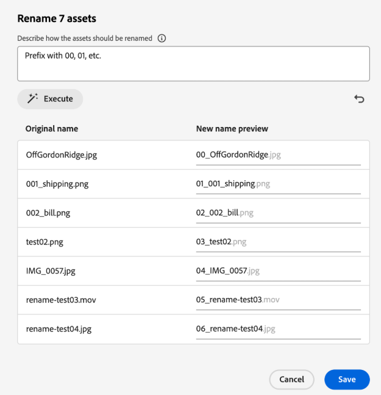

# Naam van middel of map wijzigen in [!DNL Assets view] {#rename-single-asset-or-folder}

Renaming kan u helpen elementen beter te ordenen, te categoriseren en te identificeren zonder de inhoud of locatie te wijzigen. In [!DNL Assets view] kunt u de naam van het geselecteerde element of de geselecteerde map wijzigen.

Voer de onderstaande stappen uit om de naam van een element of map te wijzigen:

1. Zoek het element of de map waarvan u de naam wilt wijzigen.

1. Gebruik een van de volgende manieren om de naam van een element of map te wijzigen:

   * Selecteer de activa of de omslag en klik  **[!UICONTROL Rename]** van het hoogste menu.
   * Klik op meer opties `...` in het element of de map en selecteer **[!UICONTROL Rename]** .
   * Klik op de titel van een element of map om de naam ervan te wijzigen. Vermelding de nieuwe tekst in **anders noemt Activa** textbox en klikt **sparen**. Deze mogelijkheid is beschikbaar in de raster-, galerie-, waterval- en lijstweergaven.

## De bulknaam van door AI aangedreven activa {#rename-bulk-assets-using-ai}

Met [!DNL Assets view] kunt u de naam van meerdere elementen tegelijk wijzigen met behulp van AI. De functie Namen van AI-bulknamen kan alleen worden toegepast op bestanden, niet op mappen. U kunt meerdere bestanden tegelijk selecteren en de naam van alle bestanden tegelijk wijzigen.

Voer de onderstaande stappen uit om de naam van het grootste deel van de elementen tegelijk te wijzigen met door AI gegenereerde aanwijzingen:

1. Selecteer meerdere elementen en klik op **[!UICONTROL Bulk Rename]** in het bovenste menu.

1. Voeg de vraag toe die beschrijft hoe u de geselecteerde activa wilt anders noemen. Verwijs naar [ sommige voorbeelden die AI Bulk illustreren anders noemen ](#examples-ai-bulk-rename).

1. Klik op **[!UICONTROL Execute]** als u wilt dat AI de naam van elementen kan wijzigen zoals wordt vermeld in de vraag.

1. [ Facultatieve ] klik  om de laatste actie terug te keren of te annuleren u uitvoerde.

1. Controleer de wijzigingen in de kolom [!UICONTROL New name preview] en klik op **[!UICONTROL Save]** .

   

## Enkele voorbeelden ter illustratie van gewijzigde naam voor AI-bulknamen {#examples-ai-bulk-rename}

Hieronder volgen enkele voorbeelden waarmee u AI kunt gebruiken om de naam van activa in bulk te wijzigen op basis van een AI-prompt:

* Voorvoegsel met 00, 01, enzovoort en achtervoegsel met huidige datum.
* Wijzig alle bestanden in Mijn bestand en voeg een oplopend getal toe.
* Verwijder het voor- en achtervoegsel en zorg dat u het middelste gedeelte van de naam behoudt.
* Plaats een voorvoegsel voor de bestanden tussen 001, 002, enz. en vertalen in het Engels.

>[!VIDEO](https://video.tv.adobe.com/v/3440975)

>[!NOTE]
>
> * U kunt emojis niet omzetten in tekst.
> * Gebruik een unieke naam om waarschuwingsberichten te voorkomen bij het wijzigen van de naam van elementen. U kunt het echter opnieuw proberen met een nieuwe naam.
> * U kunt ook Unicode- of niet-alfanumerieke tekens omzetten in tekst.

## Volgende stappen {#next-steps}

* [ bekijk een video om meta-gegevensvormen in de mening van Assets te beheren ](https://experienceleague.adobe.com/docs/experience-manager-learn/assets-essentials/configuring/metadata-forms.html?lang=nl-NL)

* Feedback geven op het product met de optie [!UICONTROL Feedback] die beschikbaar is in de gebruikersinterface van de Assets-weergave

* Verstrek documentatie terugkoppelt gebruikend [!UICONTROL Edit this page]  of [!UICONTROL Log an issue]  beschikbaar op juiste sidebar

* De Zorg van de Klant van het contact [&#128279;](https://experienceleague.adobe.com/nl?support-solution=General#support)
