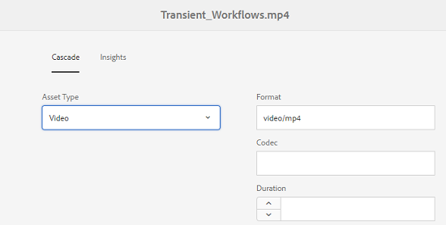

# Trapsgewijze metagegevens {#cascading-metadata}

Wanneer gebruikers de metagegevens van een element vastleggen, verschaffen ze informatie in de verschillende beschikbare velden. U kunt specifieke metagegevensvelden of veldwaarden weergeven die afhankelijk zijn van de opties die in de andere velden zijn geselecteerd. Een dergelijke voorwaardelijke weergave van metagegevens wordt trapsgewijze metagegevens genoemd. Met andere woorden, u kunt een afhankelijkheid maken tussen een bepaald metagegevensveld/een bepaalde waarde en een of meer velden en/of hun waarden.

Gebruik schema&#39;s voor metagegevens om regels voor de weergave van trapsgewijze metagegevens te definiëren. Als uw metagegevensschema bijvoorbeeld een elementtypeveld bevat, kunt u een relevante set velden definiëren die moet worden weergegeven op basis van het type element dat de gebruiker selecteert.

Hier volgen enkele gebruiksgevallen waarvoor u trapsgewijze metagegevens kunt definiëren:

* Indien een gebruikerslocatie is vereist, relevante plaatsnaam weergeven op basis van de keuze van het land en de staat van de gebruiker.
* Laad relevante merknamen in een lijst op basis van de door de gebruiker gekozen productcategorie.
* Schakel de zichtbaarheid van een bepaald veld in of uit op basis van de waarde die in een ander veld is opgegeven. Geef bijvoorbeeld afzonderlijke velden voor het verzendadres weer als de gebruiker de verzending op een ander adres wil laten uitvoeren.
* Wijs een veld aan als verplicht op basis van de waarde die in een ander veld is opgegeven.
* Opties wijzigen die voor een bepaald veld worden weergegeven op basis van de waarde die in een ander veld is opgegeven.
* Stel de standaardwaarde voor metagegevens in een bepaald veld in op basis van de waarde die in een ander veld is opgegeven.

## Metagegevens met trapsgewijze opmaak configureren in AEM {#configure-cascading-metadata-in-aem}

Overweeg een scenario waarin u trapsgewijze metagegevens wilt weergeven op basis van het geselecteerde type element. Enkele voorbeelden

* Geef voor een video toepasselijke velden weer, zoals indeling, codec, duur, enzovoort.
* Voor een Word- of PDF-document geeft u velden weer, zoals het aantal pagina&#39;s, de auteur, enzovoort.

Geef de copyrightinformatie, ongeacht het gekozen elementtype, weer als een verplicht veld.

1. Tik/klik op het AEM-logo en ga naar **[!UICONTROL Gereedschappen]** > **[!UICONTROL Middelen]** > **[!UICONTROL Metagegevensschema&#39;s]**.
1. Selecteer op de pagina **[!UICONTROL Schema-formulieren]** een schema en tik op **[!UICONTROL Bewerken]** of klik op Bewerken op de werkbalk om het schema te bewerken.

   

1. (Optioneel) Maak in de Schema-editor voor metagegevens een nieuw veld dat u wilt conditionaliseren. Geef een naam- en eigenschappenpad op het tabblad **[!UICONTROL Instellingen]** .

   Als u een nieuw tabblad wilt maken, tikt u of klikt u `+` om een tabblad toe te voegen en voegt u vervolgens een metagegevensveld toe.

   

1. Voeg een vervolgkeuzeveld toe voor het elementtype. Geef een naam- en eigenschappenpad op het tabblad **[!UICONTROL Instellingen]** . Voeg een optionele beschrijving toe.

   

1. Sleutelwaardeparen zijn de opties die aan een gebruiker van een formulier worden verstrekt. U kunt de sleutel-waardeparen of manueel of van een JSON- dossier verstrekken.

   * Als u de waarden handmatig wilt opgeven, selecteert u Handmatig **** toevoegen en tikt u op Keuze **** toevoegen en geeft u de optietekst en -waarde op. Geef bijvoorbeeld de elementtypen Video, PDF, Word en Afbeelding op.

   * Als u de waarden van een JSON-bestand dynamisch wilt ophalen, selecteert u **[!UICONTROL Toevoegen via JSON-pad]** en geeft u het pad van het JSON-bestand op. AEM haalt de sleutel-waarde paren in real time op wanneer het formulier aan de gebruiker wordt gepresenteerd.
   Beide opties sluiten elkaar uit. U kunt de opties niet importeren uit een JSON-bestand en handmatig bewerken.

   

   >[!NOTE]
   >
   >Wanneer u een JSON-bestand toevoegt, worden de sleutel-waardeparen niet weergegeven in de Schema-editor voor metagegevens, maar wel in het gepubliceerde formulier.

   >[!NOTE]
   >
   >Als u keuzen toevoegt en op het pop-upveld klikt, wordt de interface vervormd en werkt het verwijderpictogram voor de keuzen niet meer. Klik niet op het vervolgkeuzemenu totdat u de wijzigingen opslaat. Sla het schema op en open het opnieuw om door te gaan met bewerken als dit probleem zich voordoet.

1. (Optioneel) Voeg de andere vereiste velden toe. U kunt bijvoorbeeld de indeling, codec en duur van de video met het elementtype opgeven.

   Op dezelfde manier voegt u afhankelijke velden toe voor andere elementtypen. Voeg bijvoorbeeld het aantal pagina&#39;s en de auteur van velden toe voor documentelementen, zoals PDF- en Word-bestanden.

   

1. Als u een afhankelijkheid wilt maken tussen het elementtypeveld en andere velden, kiest u het afhankelijke veld en opent u het tabblad **[!UICONTROL Regels]** .

   

1. Kies onder **[!UICONTROL Vereiste]** de optie **[!UICONTROL Vereist op basis van de optie Nieuwe regel]** .
1. Tik/klik op **[!UICONTROL Regel]** toevoegen en kies het veld **[!UICONTROL Elementtype]** om een afhankelijkheid te maken. Kies ook de veldwaarde waarop u de afhankelijkheid wilt maken. Kies in dit geval **[!UICONTROL Video]**. Tik/klik op **[!UICONTROL Gereed]** om de wijzigingen op te slaan.

   

   >[!NOTE]
   >
   >U kunt regels gebruiken voor vervolgkeuzelijsten met handmatig vooraf gedefinieerde waarden. Vervolgkeuzemenu&#39;s met geconfigureerd JSON-pad kunnen niet worden gebruikt met regels die vooraf gedefinieerde waarden gebruiken om voorwaarden toe te passen. Als de waarden bij uitvoering vanuit JSON worden geladen, is het niet mogelijk een vooraf gedefinieerde regel toe te passen.

1. Kies onder **[!UICONTROL Zichtbaarheid]** de optie **[!UICONTROL Zichtbaar op basis van de nieuwe regeloptie]** .

1. Tik/klik op **[!UICONTROL Regel]** toevoegen en kies het veld **[!UICONTROL Elementtype]** om een afhankelijkheid te maken. Kies ook de veldwaarde waarop u de afhankelijkheid wilt maken. Kies in dit geval **[!UICONTROL Video]**. Tik/klik op **[!UICONTROL Gereed]** om de wijzigingen op te slaan.

   

   >[!CAUTION]
   >
   >Als u de waarden opnieuw wilt instellen, klikt of tikt u op witruimte of op een willekeurige plaats in de interface, behalve op de waarden. Als de waarden opnieuw zijn ingesteld, selecteert u de waarden opnieuw.

   >[!NOTE]
   >
   >U kunt **[!UICONTROL Vereiste]** - en **[!UICONTROL Zichtbaarheidsvoorwaarde]** onafhankelijk van elkaar toepassen.

1. Op dezelfde manier creeer een gebiedsdeel tussen de waarde Video op het gebied van het Type van Activa en andere gebieden, zoals Codec en Duur.
1. Herhaal de stappen om documentelementen (PDF en Word) afhankelijk te maken in het veld [!UICONTROL Elementtype] en velden zoals Aantal  pagina&#39;s en [!UICONTROL Auteur].
1. Click **[!UICONTROL Save]**. Pas het metagegevensschema toe op een map.

1. Navigeer naar de map waarop u het metagegevensschema hebt toegepast en open de pagina met eigenschappen van een element. Afhankelijk van uw keuze in het veld Type element worden relevante trapsgewijze metagegevensvelden weergegeven.

   
   *Afbeelding:Trapsgewijze metagegevens voor video-elementen*

   
   *Afbeelding:Trapsgewijze metagegevens voor documentelementen*
