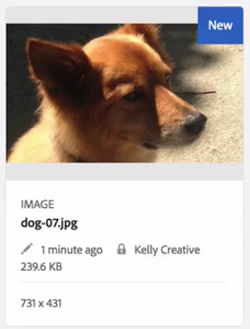

# Bestanden in Elementen inchecken en uitchecken {#check-in-and-check-out-files-in-assets}

Met Adobe Experience Manager (AEM) Assets kunt u elementen uitchecken en deze opnieuw inchecken nadat u alle wijzigingen hebt aangebracht. Nadat u een element hebt uitgecheckt, kunt u het element alleen bewerken, annoteren, publiceren, verplaatsen of verwijderen. Als u een element uitcheckt, vergrendelt u het element. Andere gebruikers kunnen geen van deze bewerkingen op het element uitvoeren totdat u het element weer incheckt bij AEM Assets. Ze kunnen echter wel de metagegevens van het vergrendelde element wijzigen.

Om activa te kunnen uitchecken/inchecken, hebt u schrijftoegang op hen nodig.

Met deze functie voorkomt u dat andere gebruikers de wijzigingen overschrijven die door een auteur zijn aangebracht en waarbij meerdere gebruikers samenwerken aan het bewerken van workflows in verschillende teams.

## Elementen {#checking-out-assets} uitchecken

1. Selecteer in de interface Elementen het element dat u wilt uitchecken. U kunt ook meerdere elementen selecteren om uit te checken.

   

1. Klik/tik op het pictogram **[!UICONTROL Checkout]** op de werkbalk.

   

   Merk op dat het **[!UICONTROL Checkout]** pictogram aan het **[!UICONTROL Checkin]** pictogram met open slot van een knevel voorziet.

   

   Meld u aan als een andere gebruiker om te controleren of andere gebruikers het uitgecheckte element kunnen bewerken. Er verschijnt een vergrendelingspictogram op de miniatuur van het element dat u hebt uitgecheckt.

   

   Selecteer het element. Op de werkbalk worden geen opties weergegeven waarmee u elementen kunt bewerken, notities kunt aanbrengen, kunt publiceren of verwijderen.

   

   U kunt echter op het pictogram **[!UICONTROL View Properties]** klikken of erop tikken om de metagegevens voor het vergrendelde element te bewerken.

1. Klik of tik op het pictogram Bewerken om het element in de bewerkingsmodus te openen.

   

1. Bewerk het element en sla de wijzigingen op. Snijd bijvoorbeeld de afbeelding bij en sla deze op.

   

   U kunt er ook voor kiezen om het element te annoteren of te publiceren.

1. Selecteer de bewerkte asset in de asset-interface en klik of tik op het pictogram **[!UICONTROL Checkin]** op de werkbalk.

   

   Het gewijzigde element is ingecheckt in AEM Assets en is beschikbaar voor andere gebruikers voor bewerking.

## Geforceerde inchecken {#forced-check-in}

Beheerders kunnen elementen inchecken die door andere gebruikers zijn uitgecheckt.

1. Meld u als beheerder aan bij AEM Assets.
1. Selecteer in de interface Elementen een of meer elementen die door andere gebruikers zijn uitgecheckt.

   

1. Klik/tik op het pictogram **[!UICONTROL Release Lock]** op de werkbalk. Het element is ingecheckt en kan worden bewerkt aan andere gebruikers.

   