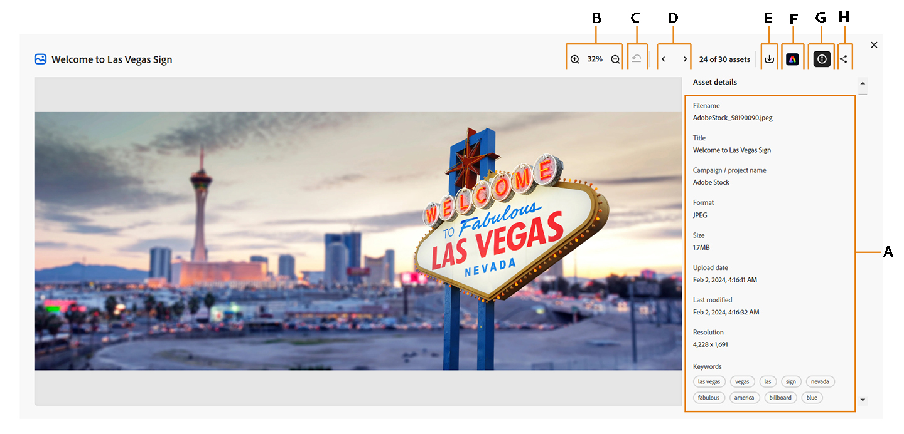
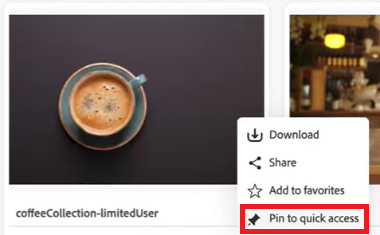
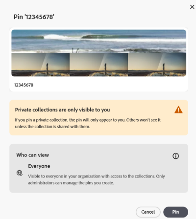
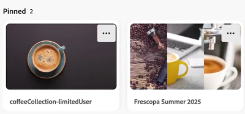

# Verzamelingen beheren in [!DNL Content Hub] {#manage-collections}

<!--  -->

Een verzameling verwijst naar een set elementen die onder gebruikers kunnen worden gedeeld. Een verzameling kan elementen van verschillende locaties bevatten, terwijl de referentiële integriteit ervan behouden blijft.

Met [!DNL Content Hub] kunt u openbare verzamelingen maken. Deze verzamelingen zijn toegankelijk voor alle gemachtigde gebruikers, zodat een gedeelde ruimte ontstaat waar meerdere gebruikers op efficiënte wijze toegang hebben tot inhoud en deze kunnen gebruiken. Verzamelingen bevorderen gezamenlijk gebruik van bronnen voor meer efficiëntie en gemak. Binnen de inzameling doorbladert pagina, kunt u:

* **creeer**: Creeer één of meerdere inzamelingen.
* **Mening**: Bekijk de activa en hun eigenschappen.
* **Aandeel**: De activa van het aandeel als verbinding met anderen.
* **Download**: Download de activa.
* **verwijder**: Verwijder specifieke activa uit een inzameling.
* **Schrapping**: Schrap de volledige inzameling.
* **Vastzetten/speld**: Vastzet of speld inzameling los.
* **Favoriet**: De inzameling van het teken als favoriet.

Hiermee kunnen gebruikers eenvoudig toegang krijgen tot de verschillende middelen die beschikbaar zijn in [!DNL Content Hub] en deze beheren.

## Vereisten {#prerequisites}

[&#x200B; de gebruikers van Content Hub &#x200B;](deploy-content-hub.md#onboard-content-hub-users) kunnen de acties uitvoeren die in dit artikel worden vermeld.

## Verzamelingen maken{#create-collections}

U kunt verkiezen om een nieuwe inzameling [&#x200B; tot stand te brengen of &#x200B;](#create-new-collection) activa aan een bestaande inzameling [&#x200B; toe te voegen terwijl het beheren van bestuur.](#add-assets-to-existing-collection)

### Een nieuwe verzameling maken{#create-new-collection}

Voer de onderstaande stappen uit om de toegang te beheren terwijl u verzamelingen maakt:

1. Ga naar **[!DNL Collections]** en klik op **[!UICONTROL Create Collection]** . Er wordt een nieuw venster Verzameling weergegeven.

1. Voeg **[!UICONTROL Title]** en **[!UICONTROL Description]** toe voor de verzameling.

   

1. Selecteer onder **[!UICONTROL Who can access]** dropdown > het type van toegangsbeheer. De volgende opties zijn beschikbaar:

   | Toegangsmethode | Toegangstype | Beschrijving |
   |---|---|---|
   | **slechts u en de beheerders kunnen uitgeven** | Persoonlijk | Alleen de maker en de beheerders kunnen deze verzameling bewerken en openen. |
   | **iedereen kan** bekijken | Openbaar | Iedereen kan tot deze inzameling toegang hebben, maar slechts kunnen de schepper en de Beheerders uitgeven. |
   | **iedereen kan** bekijken en uitgeven | Openbaar | Deze verzameling is toegankelijk voor iedereen, met volledige toegang en bewerkingsmachtigingen die zonder beperkingen zijn verleend. |

   >[!NOTE]
   >
   > [!DNL Content Hub] de beheerder kan alle opties bekijken beschikbaar onder **[!UICONTROL Who can access]** dropdown, terwijl voor regelmatige gebruikers, u [&#x200B; moet specificeren en &#x200B;](configure-content-hub-ui-options.md) vormen welke opties zij kunnen toegang hebben.

1. Klik op **[!UICONTROL Create]**. Zodra gedaan, kunt u activa [&#x200B; toevoegen aan de inzameling &#x200B;](#add-assets-to-existing-collection).

>[!VIDEO](https://video.tv.adobe.com/v/3463336)

<!--
>[!NOTE]
>
>Collections governance is a limited availability feature. You can get it enabled  by creating a support ticket. Once enabled, you need to [Configure Collections in Content Hub](configure-content-hub-ui-options.md#configure-collections-content-hub).-->

<!--To create a new collection, navigate to the **[!UICONTROL Collections]** tab and click **[!UICONTROL Create new collection]**. Enter the **[!UICONTROL Title]** and provide an optional **[!UICONTROL Description]** for the assets. Click **[!UICONTROL Create]**.
          
-->

### Elementen toevoegen aan een bestaande verzameling{#add-assets-to-existing-collection}

Als u elementen aan een bestaande verzameling wilt toevoegen, selecteert u de elementen die u aan de verzameling wilt toevoegen. Klik op **[!UICONTROL Add to collection]**. U wordt gevraagd de verzameling te selecteren.

Kies de verzameling waar u het element wilt toevoegen. U kunt de bestaande verzameling ook doorzoeken met de zoekbalk.   selecteer de inzameling(s) waaraan u de activa moet toevoegen en **[!UICONTROL Add to collection]** klikken.

## Verzamelingen weergeven{#view-collections}

Navigeer naar het tabblad **[!UICONTROL Collections]** en zoek naar de naam van de verzameling. Met filters kunt u de zoekresultaten verfijnen door specifieke criteria te selecteren, zodat u snel de meest relevante verzamelingen kunt vinden.

Klik op de naam van de verzameling als u de lijst met elementen die beschikbaar zijn in een verzameling wilt weergeven. U kunt filters ook toepassen binnen een verzameling om de resultaten van de elementen te beperken. Klik op het element dat u wilt weergeven in een verzameling. [!DNL Content Hub] geeft de gedetailleerde weergave van het element weer. [&#x200B; zie activa details &#x200B;](asset-properties-content-hub.md).

### Weergave Filterverzamelingen {#filter-collections-view}

Met Content Hub kunt u de weergave Verzamelingen filteren, zodat u gemakkelijk kunt terugvinden wat u zoekt door de opties te verkleinen op basis van uw voorkeuren. Verzeker de [&#x200B; configuratie van Inzamelingen in Content Hub &#x200B;](configure-content-hub-ui-options.md#configure-collections-content-hub).

Ga naar de tab **[!DNL Collections]** en navigeer naar de vervolgkeuzelijst Verzamelingen om de weergave Verzamelingen te filteren. Kies een van de volgende opties:

* **[!UICONTROL All Collections]:** selecteer deze optie om alle inzamelingen, met inbegrip van die te bekijken en uit te geven die privé of met u worden gedeeld.
* **[!UICONTROL Only me]:** selecteer deze optie om inzamelingen te bekijken die voor u toegankelijk zijn.
* **[!UICONTROL Anyone can view]:** deze optie laat u inzamelingen filtreren die voor iedereen toegankelijk maar editable slechts door de schepper zijn.
* **[!UICONTROL Anyone can edit]:** selecteer deze optie aan filterinzamelingen die zowel toegankelijk als editable door iedereen zijn.

  

Als u bovendien de weergave voor verzamelingen wilt filteren op basis van toegangsmachtigingen, gaat u naar het tabblad **[!DNL Collections]** en navigeert u naar een van de volgende opties:

* **[!UICONTROL Created by anyone]:** dit filter beperkt u tot meningsinzamelingen die door om het even welke gebruiker worden gecreeerd.

* **[!UICONTROL Created by me]:** dit filter beperkt u tot meningsinzamelingen die door u worden gecreeerd.

  

<!--

* **A**: Details and metadata of the asset 
* **B**: Zoom In or Zoom Out the asset 
* **C**: Reset Zoom view 
* **D**: View the previous or next asset 
* **E**: Download the asset 
* **F**: Open the asset in Adobe Express 
* **G**: Hide the metadata of the asset 
* **H**: Share the asset as a link 
-->

## Elementen downloaden die beschikbaar zijn in een verzameling{#download-assets-within-collection}

Navigeer naar het tabblad **[!UICONTROL Collections]** als u elementen die beschikbaar zijn in een verzameling wilt downloaden.\
Klik  pictogram op de inzamelingskaart.

Alle elementen in de verzameling worden gedownload.

U kunt de verzameling ook openen om de elementen afzonderlijk te downloaden. Klik op de verzameling met de elementen die u wilt downloaden. Selecteer de elementen en klik op **[!UICONTROL Download]** .

Leer hoe te om [&#x200B; activa van  [!DNL Content Hub]](download-assets-content-hub.md) te downloaden.

## Elementen delen die beschikbaar zijn in een verzameling {#share-assets-available-within-collection}

U kunt ook de elementen delen die beschikbaar zijn in een verzameling. Zorg ervoor om [&#x200B; openbaar verbinding toe te laten delend in Content Hub &#x200B;](configure-content-hub-ui-options.md#enable-public-link-sharing). Navigeer naar de tab **[!UICONTROL Collections]** . Selecteer het  pictogram op de inzamelingskaart. De koppeling voor delen wordt gekopieerd. U kunt de gekopieerde koppeling delen met de ontvanger. Leer meer over [&#x200B; delend activa in  [!DNL Content Hub]](share-assets-content-hub.md).

Content Hub Collections biedt uitgebreide governancegereedschappen voor effectief middelenbeheer, waaronder aanpasbare deelmachtigingen en samenwerkingsfuncties. Van read-only toegang tot volledige administratieve controle, steunen deze montages fijn bestuur over activadistributie. Wanneer het delen van activa of individueel of als deel van een inzameling, wordt het werkingsgebied van toegang bepaald door het huidige toegangsniveau van de inzameling dat aan de gebruiker wordt toegewezen. U kunt ook geen privéverzameling delen.

## Details van een verzameling bewerken {#edit-details-of-collection}

Om **[!UICONTROL Title]** en **[!UICONTROL Description]** van een inzameling uit te geven, klik de inzamelingsnaam en klik dan het  pictogram. [!UICONTROL Collection Details] wordt weergegeven, zodat u de **[!UICONTROL Title]** en **[!UICONTROL Description]** van een verzameling kunt bewerken. Klik op **[!UICONTROL Save Changes]** om de wijzigingen te bevestigen. Bovendien kunt u de toegang tot de inzameling door de Edit dialoog van de Inzameling, afhankelijk van de configuratie bijwerken.

## Elementen uit een verzameling verwijderen{#remove-assets-from-a-collection}

De volgende gebruikers kunnen een of meer elementen uit een verzameling verwijderen:

* Beheerder
* Een eigenaar van de collectie
* Een gebruiker die geen beheerder is met de bewerkingsrechten

Als u elementen uit een verzameling wilt verwijderen, klikt u op de verzameling waaruit u elementen wilt verwijderen, selecteert u de elementen en klikt u op **[!UICONTROL Remove from collection]** .

U wordt gevraagd de verwijdering van het element te bevestigen. Klik op **[!UICONTROL Remove]**.\
De geselecteerde elementen worden uit de verzameling verwijderd.

## Een verzameling verwijderen{#delete-collection}

Alleen beheerders en makers kunnen een verzameling verwijderen. Als u een verzameling wilt verwijderen, navigeert u naar het tabblad **[!UICONTROL Collections]** en klikt u op de verzameling die u wilt verwijderen. Klik  pictogram om de inzameling te schrappen.

## Verzameling vastzetten of vastzetten {#pin-unpin-collection}

Content Hub-beheerders kunnen verzamelingen in Content Hub vastzetten, zodat ze snel toegankelijk zijn. Vastgezette verzamelingen worden weergegeven in een speciale sectie Vastgezet op de startpagina van Verzamelingen, zodat belangrijke verzamelingen gemakkelijker binnen bereik blijven. Voor snelle toegang, kunt u een inzameling vastzetten of losmaken door de hieronder stappen uit te voeren:

1. Blader naar de verzamelingen die u wilt vastzetten of waarvan u de speld wilt vrijmaken.

1. Klik **[!UICONTROL More actions]**  en selecteer **[!UICONTROL Pin to quick access]**. Er verschijnt een bevestigingsvak.

   

1. Klik op **[!UICONTROL Pin]** om te bevestigen. Het waarschuwingsbericht wordt weergegeven wanneer u een privéverzameling vastzet.

   

   De vastgezette verzamelingen worden bovenaan weergegeven, zodat u ze snel kunt gebruiken. Alternatief, om de inzameling los te maken, klik **[!UICONTROL More actions]**  en selecteer **[!UICONTROL Unpin]**.

   

## Verzamelingen markeren als favoriet {#favorite-collection}

In Content Hub kunt u verzamelingen als favoriet markeren, zodat u ze eenvoudiger kunt organiseren en ophalen. Als je je favoriete verzamelingen hebt toegevoegd, kun je ze gemakkelijk vinden op het tabblad Favorieten op de startpagina van Content Hub. Daarnaast kunt u zoeken in elementen in Favoriete verzamelingen. Ga als volgt te werk als u verzamelingen als favorieten wilt markeren:

1. Blader naar de verzamelingen die u wilt vastzetten of waarvan u de speld wilt vrijmaken.

1. Klik **[!UICONTROL More actions]**  en selecteer **[!UICONTROL Add to Favorites]** om inzameling als Favoriet te merken.

   

   Verzamelingen die als Favoriet zijn gemarkeerd, worden nu onder het tabblad **[!UICONTROL My Favorites]** weergegeven. U kunt de verzamelingen ook verwijderen uit **[!UICONTROL My Favorites]** . Om dit te doen, klik **[!UICONTROL More actions]**  en selecteer **[!UICONTROL Remove from Favorites]**.

   

>[!NOTE]
>
>[&#x200B; Vastzetten of de inzameling van de speld &#x200B;](#pin-unpin-collection) en [&#x200B; Verzamelingen van het Teken als Favorieten &#x200B;](#favorite-collection) zijn beperkte beschikbaarheidseigenschappen. U kunt [&#x200B; een geval van de Steun van de Klant van Adobe tot stand brengen en voorleggen om hen voor uw plaatsing toe te laten.](https://helpx.adobe.com/enterprise/using/support-for-experience-cloud.html)

