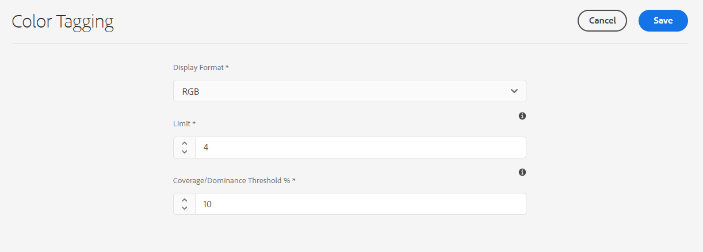

# Kleurlabels voor afbeeldingen {#color-tag-images}

Adobe Experience Manager (AEM) Assets maakt gebruik van Adobe Sensei AI-mogelijkheden om kleuren in een afbeelding te onderscheiden en deze als tags automatisch toe te passen bij opname. Deze tags maken een verbeterde zoekervaring mogelijk op basis van de compositie van de afbeeldingskleur.

U kunt het aantal kleuren binnen een bereik van 1 tot 40 configureren dat aan een afbeelding is gelabeld, zodat u later kunt zoeken naar afbeeldingen op basis van die kleuren. Experience Manager Assets past de labels toe op basis van de kleurdekking in een afbeelding. U kunt ook de weergave-indeling voor een kleurtag configureren.

In de volgende afbeelding ziet u de volgorde van taken die u uitvoert voor het configureren en beheren van kleurlabels voor afbeeldingen in Experience Manager Assets:

## Ondersteunde bestandsindelingen {#supported-file-formats-color-tags}

| Bestandsindeling | Extensie | MIME-type | Invoerkleurruimte | Maximale ondersteunde bronbestandsgrootte | Maximaal ondersteunde resolutie voor bestandsgrootte |
|---|---|---|---|---|---|
| JPEG | .jpg en .jpeg | image/jpeg | sRGB | 15 GB | 20000 × 20000 pixels |
| PNG | .png | image/png | sRGB | 15 GB | 20000 × 20000 pixels |
| TIFF | .tif en .tiff | image/tiff | sRGB | 4 GB (beperkt door indelingsspecificaties) | 20000 × 20000 pixels |
| PSD | .psd | image/vnd.adobe.photoshop | sRGB | 2 GB (beperkt door indelingsspecificaties) | 20000 × 20000 pixels |
| GIF | .gif | image/gif | sRGB | 15 GB | 20000 × 20000 pixels |
| BMP | .bmp | image/bmp | sRGB | 4 GB (beperkt door indelingsspecificaties) | 20000 × 20000 pixels |

## Kleurtageigenschappen beheren {#manage-color-tagging-properties}

De eigenschappen voor kleurlabels voor afbeeldingen beheren:

1. Navigeren naar **[!UICONTROL Tools > Assets > Color Tagging]**.

   

1. Geef een indeling op voor de weergave van de kleurtag in het dialoogvenster **[!UICONTROL Display Format]** veld. Mogelijke opties zijn de kleurnaam, de RGB- of de HEX-indeling.

1. Geef het aantal kleuren op dat u wilt labelen voor de afbeeldingen in het dialoogvenster **[!UICONTROL Limit]** veld. Deze kleuren worden weergegeven wanneer u de eigenschappen van een afbeelding bekijkt. U kunt een getal tussen 1 en 40 definiëren in dit veld. De standaardwaarde voor dit veld is tien kleuren.

1. Geef het minimale percentage voor kleurdekking op om een kleurcode op te nemen in de zoekresultaten in het dialoogvenster **[!UICONTROL Coverage/Dominance Threshold %]** veld. Als de dekking van de rode kleur in een afbeelding bijvoorbeeld tien procent is en u in dit veld negen procent definieert, wordt de afbeelding opgenomen wanneer u naar afbeeldingen met rode kleur zoekt. Als de dekking van de rode kleur in een afbeelding echter tien procent is en u in dit veld 11 procent definieert, wordt de afbeelding niet opgenomen wanneer u naar afbeeldingen met rode kleur zoekt.

   U kunt een willekeurig getal tussen vijf en 100 opgeven in dit veld. De standaardwaarde is 11.

   >[!NOTE]
   >
   >Adobe raadt u aan een waarde te gebruiken die dicht bij de standaardwaarde in dit veld ligt. Als u een hoge getalwaarde instelt voor dit veld (bijvoorbeeld hoger dan 25), worden mogelijk weinig zoekresultaten geretourneerd. Als u een lage getalwaarde instelt (bijvoorbeeld lager dan 6), worden mogelijk te veel zoekresultaten geretourneerd. Dit is mogelijk niet nuttig.

1. Klik op **[!UICONTROL Save]**.

   >[!VIDEO](https://video.tv.adobe.com/v/340108)

### Kleurlabels uitschakelen {#disable-color-tagging}

Kleurlabels voor afbeeldingen zijn standaard ingeschakeld. U kunt kleurlabeling op mapniveau uitschakelen. Alle onderliggende mappen overerven de eigenschappen voor kleurlabels van de bovenliggende map.

Kleurlabelen op mapniveau uitschakelen:

1. Navigeren naar **[!UICONTROL Adobe Experience Manager > Assets > Files]**.

1. Selecteer de map en klik op **[!UICONTROL Properties]**.

1. In de **[!UICONTROL Asset Processing]** tabblad, navigeert u naar de **[!UICONTROL Color Tags for images]** map. Selecteer een van de volgende waarden in de vervolgkeuzelijst:

   * Overgenomen - De map neemt de opties voor in- of uitschakelen over van de bovenliggende map.

   * Inschakelen - Schakelt kleurlabeling in voor de geselecteerde map.

   * Uitschakelen - Schakelt kleurcodering voor de geselecteerde map uit.

   

## Metagegevensschema configureren om component voor slimme kleurcodes toe te voegen {#configure-metadata-schema}

Metagegevensschema&#39;s bevatten specifieke velden waarin specifieke informatie moet worden ingevuld. Het bevat ook lay-outinformatie om meta-gegevensgebieden op een gebruikersvriendelijke manier te tonen. Metagegevenseigenschappen zijn onder andere titel, beschrijving, MIME-typen, tags en meer. U kunt de [!UICONTROL Metadata Schema Forms] editor om de bestaande schema&#39;s te wijzigen of aangepaste schema&#39;s voor metagegevens toe te voegen.

>[!NOTE]
>
>Het veld Slimme kleur is beschikbaar in het standaardmetagegevensschema. Als u een aangepast metagegevensschema gebruikt, configureert u het schema zodanig dat een veld voor een slimme-kleurtag wordt toegevoegd.

U voegt als volgt de component Slimme kleurcodes toe aan de formuliereditor voor het metagegevensschema:

1. Navigeren naar **[!UICONTROL Tools > Assets > Metadata Schemas]**.

1. Selecteer de schemanaam en klik **[!UICONTROL Edit]**.

1. Slepen **[!UICONTROL Smart Color Tags]** van de **[!UICONTROL Build Form]** aan de **[!UICONTROL Metadata Schema Form Editor]**.

1. Klik op de knop **[!UICONTROL Smart Color Tag Field]** in de **[!UICONTROL Metadata Schema Form Editor]**.

1. Geef een geschikte waarde op in het dialoogvenster **[!UICONTROL Field Label]** in het veld **[!UICONTROL Settings]**  tab.

1. Klik op **[!UICONTROL Save]**.

   >[!VIDEO](https://video.tv.adobe.com/v/340124)

## Kleurlabels voor bestaande afbeeldingen in DAM {#color-tags-existing-images}

De bestaande afbeeldingen in DAM hebben niet automatisch een kleurlabel. [!UICONTROL Reprocess Assets] handmatig om er kleurcodes voor te genereren.

Voer de volgende stappen uit als u afbeeldingen met kleurcodes of mappen (inclusief submappen) van elementen in de opslagplaats voor elementen wilt kleuren:

1. Selecteer de [!DNL Adobe Experience Manager] logo en selecteer vervolgens elementen in het [!UICONTROL Navigation] pagina.

1. Selecteren [!UICONTROL Files].

1. Navigeer in de interface Middelen naar de map waarop u kleurcodes wilt toepassen.

1. Selecteer de volledige map of specifieke afbeeldingen.

1. Selecteren  [!UICONTROL Reprocess Assets] en selecteert u de [!UICONTROL Full Process] -optie.

Wanneer het proces is voltooid, navigeert u naar de [!UICONTROL Properties] pagina van om het even welke beeld binnen de omslag. De automatisch toegevoegde tags worden weergegeven in het dialoogvenster [!UICONTROL Smart Color Tags] in de [!UICONTROL Basic] tab.

## Slimme-kleurtags voor afbeeldingen weergeven {#view-color-tags}

Slimme-kleurtags voor afbeeldingen weergeven:

1. Navigeren naar **[!UICONTROL Adobe Experience Manager > Assets > Files]**.

1. Klik op de juiste map en selecteer de afbeelding.

1. Selecteren **[!UICONTROL Properties]** en bekijk de tags in het dialoogvenster **[!UICONTROL Smart Color Tags]** veld.

   

   Houd de muis boven een kleurtag zodat u de **[!UICONTROL Coverage/Dominance Threshold %]** van een kleur in een afbeelding.

## AEM Assets-kleurvoorspelling configureren {#configure-search-predicate}

U kunt een zoekfilter configureren voor afbeeldingen. Vervolgens kunt u de zoekcriteria baseren op een specifieke kleur om de resultaten te filteren.

>[!NOTE]
>
>Configureer de AEM Assets-kleurvoorspelling alleen als u het standaardzoekformulier niet gebruikt.

Als u het zoekfilter wilt configureren, maakt u een voorspelling van de elementkleur met behulp van de zoekfunctie voor middelenbeheer.

U configureert als volgt het zoekfilter:

1. Navigeren naar **[!UICONTROL Tools > General > Search Forms]**.

1. Selecteren **[!UICONTROL Assets Admin Search Rail]** en klik op **[!UICONTROL Edit]**.

1. Slepen **[!UICONTROL Asset Color Predicate]** van de **[!UICONTROL Select Predicate]** aan de **[!UICONTROL Search Form Editor]**.

1. Geef een geschikte waarde op in het dialoogvenster **[!UICONTROL Field Label]** in het veld **[!UICONTROL Settings]**  tab.

1. Klikken **[!UICONTROL Done]** om de instellingen op te slaan.

   >[!VIDEO](https://video.tv.adobe.com/v/340110)

## Afbeeldingen zoeken op basis van kleuren {#search-images-based-on-colors}

>[!VIDEO](https://video.tv.adobe.com/v/340761)

Na het configureren van alle eigenschappen voor kleurlabels en [configureren van de middelenkleurvoorspelling](#search-images-based-on-colors), kunt u afbeeldingen op basis van een kleur zoeken als een filter.

Zo zoekt u afbeeldingen op basis van kleuren:

1. Navigeren naar **[!UICONTROL Assets > Files]**.

1. Selecteren **[!UICONTROL Filter]** in de vervolgkeuzelijst.
   

1. Selecteer de [AEM Assets-kleurvoorspelling](#configure-search-predicate).

1. Sleep de kleurkiezer om de gewenste kleur te selecteren. De geselecteerde kleur wordt weergegeven in het alleen-lezen veld dat beschikbaar is onder de kleurkiezer. U kunt RGB of HEX selecteren als de weergave-indeling voor de kleur.

   

   U kunt afbeeldingen filteren op basis van de selectie van één kleur. De afbeeldingen met de geselecteerde kleur als een van de slimme-kleurtags en boven de [Dekking/Dominantiedrempel %](#manage-color-tagging-settings) in het rechterdeelvenster.

1. Wis de filter door X in de bar van het Onderzoek te klikken.

**Zie ook**

* [Elementen vertalen](translate-assets.md)
* [Elementen HTTP-API](mac-api-assets.md)
* [Ondersteunde bestandsindelingen](file-format-support.md)
* [Zoeken in middelen](search-assets.md)
* [Verbonden elementen](use-assets-across-connected-assets-instances.md)
* [Elementen rapporteren](asset-reports.md)
* [Metagegevensschema&#39;s](metadata-schemas.md)
* [Elementen downloaden](download-assets-from-aem.md)
* [Metagegevens beheren](manage-metadata.md)
* [Zoeken in facetten](search-facets.md)
* [Verzamelingen beheren](manage-collections.md)
* [Bulkmetagegevens importeren](metadata-import-export.md)
* [Middelen publiceren naar AEM en Dynamic Media](/help/assets/publish-assets-to-aem-and-dm.md)
