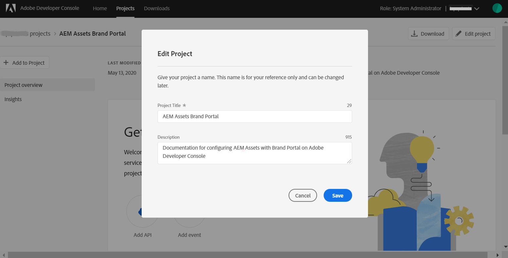
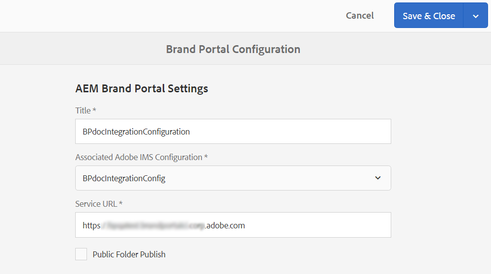

# AEM Assets configureren met Brand Portal {#configure-aem-assets-with-brand-portal}

Adobe Experience Manager-middelen (AEM) worden geconfigureerd met Brand Portal via Adobe Developer Console, die een IMS-token aanschaft voor goedkeuring van uw Brand Portal-huurder.

**Hoe werkt de configuratie?**

Het configureren van een AEM Assets cloud-instantie met uw Brand Portal-huurder (organisatie) is een proces dat uit meerdere stappen bestaat en dat configuraties vereist in zowel de AEM Assets-cloudinstantie als in de Adobe Developer Console.

1. Maak in de cloud-instantie van AEM Assets een IMS-account en genereer een openbaar certificaat (openbare sleutel).
1. In de Console van de Ontwikkelaar van Adobe, creeer een project voor uw Poorthuurder van het Merk (organisatie).
1. Onder het project, vorm API gebruikend de openbare sleutel om een verbinding van de de dienstrekening (JWT) tot stand te brengen.
1. Krijg de geloofsbrieven van de de dienstrekening en JWT payload informatie.
1. Configureer in de AEM Assets-cloud-instantie de IMS-account met behulp van de gegevens van de serviceaccount en de JWT-payload.
1. Configureer in de AEM Assets-cloudinstantie de Brand Portal-cloudservice met behulp van het IMS-account en het Brand Portal-eindpunt (organisatie-URL).
1. Test de configuratie door een middel van de cloudinstantie van AEM Assets naar Brand Portal te publiceren.

>[!NOTE]
>>Een Poorthuurder voor merken mag slechts met één AEM Assets cloud-instantie worden geconfigureerd.
>>Configureer geen Brand Portal-gebruiker met meerdere AEM Assets-wolkenvarianten.
>

## Vereisten {#prerequisites}

U hebt het volgende nodig om AEM Assets te configureren met Brand Portal:

* Een actieve en werkende AEM Assets-cloudinstantie.
* URL van Brand Portal-tenant.
* Een gebruiker met systeembeheerdersbevoegdheden op de IMS-organisatie van de Brand Portal-tenant.

**Neem contact op met de klantenservice** voor meer vragen.

## Configuratie maken {#create-new-configuration}

Voer de volgende stappen in de opgegeven reeks uit om AEM Assets cloud-instantie te configureren met Brand Portal.

1. [Openbaar certificaat verkrijgen](#public-certificate)
1. [Verbinding voor serviceaccount (JWT) maken](#createnewintegration)
1. [IMS-account configureren](#create-ims-account-configuration)
1. [Cloudservice configureren](#configure-the-cloud-service)
1. [Configuratie testen](#test-configuration)

### IMS-configuratie maken {#create-ims-configuration}

IMS-configuratie verifieert uw Brand Portal-tenant met de AEM Assets-auteurinstantie.

De IMS-configuratie omvat twee stappen:

* [Openbaar certificaat verkrijgen](#public-certificate)
* [IMS-account configureren](#create-ims-account-configuration)

### Openbaar certificaat verkrijgen {#public-certificate}

Met een openbaar certificaat kunt u uw profiel verifiëren op Adobe Developer Console.

1. Meld u aan bij uw AEM Assets Cloud Instance.

1. Ga vanuit het deelvenster **Tools**  naar **[!UICONTROL Security]** > **[!UICONTROL Adobe IMS Configurations]**.

   

1. Klik op de pagina Adobe IMS Configurations **[!UICONTROL Create]**.

1. U wordt omgeleid naar de **[!UICONTROL Adobe IMS Technical Account Configuration]** pagina. By default, the **Certificate** tab opens.

   Selecteer de cloudoplossing **[!UICONTROL Adobe Brand Portal]**.

1. Schakel het selectievakje **[!UICONTROL Create new certificate]** in en geef een **alias** op voor het certificaat. De alias fungeert als naam voor het dialoogvenster.

1. Klik op **[!UICONTROL Create certificate]**. Klik vervolgens **[!UICONTROL OK]** in het dialoogvenster om het openbare certificaat te genereren.

   

1. Click **[!UICONTROL Download Public Key]** and save the certificate (.crt) file on your machine.

   Het certificaatbestand wordt in verdere stappen gebruikt om de API voor uw Brand Portal-gebruiker te configureren en de referenties van de serviceaccount te genereren in Adobe Developer Console.

   

1. Klik op **[!UICONTROL Next]**.

   Op het tabblad **Account** maakt u de Adobe IMS-account, maar hiervoor hebt u de verificatiegegevens van de serviceaccount nodig die zijn gegenereerd in Adobe Developer Console. Laat deze pagina voorlopig open.

   Open een nieuw tabblad en [maak een JWT-verbinding (Service Account) in Adobe Developer Console](#createnewintegration) om de referenties en JWT-lading voor het configureren van de IMS-account op te halen.

### Verbinding voor serviceaccount (JWT) maken {#createnewintegration}

In de Console van de Ontwikkelaar van Adobe, worden de projecten en APIs gevormd op organisatie (de huurder van het Portaal van het Merk) niveau. Als u een API configureert, wordt er een JWT-verbinding (Service Account) gemaakt in de Adobe Developer Console. Er zijn twee methodes om API te vormen, door een zeer belangrijk paar (privé en openbare sleutels) te produceren of door een openbare sleutel te uploaden. Als u een AEM Assets-cloudinstantie wilt configureren met Brand Portal, moet u een openbaar certificaat (openbare sleutel) genereren in de AEM Assets-cloudinstantie en referenties maken in Adobe Developer Console door de openbare sleutel te uploaden. Deze openbare sleutel wordt gebruikt om API voor de geselecteerde organisatie van het Portaal van het Merk te vormen en produceert de geloofsbrieven en JWT nuttige lading voor de de dienstrekening. Deze gegevens worden verder gebruikt om de IMS-account in de AEM Assets-cloudinstantie te configureren. Zodra de IMS-account is geconfigureerd, kunt u de Brand Portal-cloudservice configureren in AEM Assets-cloudinstantie.

Voer de volgende stappen uit om de geloofsbrieven van de de dienstrekening en lading van JWT te produceren:

1. Meld u aan bij de Adobe Developer Console met systeembeheerdersrechten voor de IMS-organisatie (Brand Portal-gebruiker). De standaard-URL is

   [https://www.adobe.com/go/devs_console_ui](https://www.adobe.com/go/devs_console_ui)

   >[!NOTE]
   >
   >Zorg ervoor dat u de juiste IMS-organisatie (Brand Portal-huurder) hebt geselecteerd in het vervolgkeuzemenu (organisatielijst) in de rechterbovenhoek.

1. Klik op **[!UICONTROL Create new project]**. Er wordt een leeg project gemaakt voor uw organisatie.

   Klik **[!UICONTROL Edit project]** om de pagina bij te werken **[!UICONTROL Project Title]** , **[!UICONTROL Description]** en klik **[!UICONTROL Save]**.

   

1. Klik op het tabblad Projectoverzicht op **[!UICONTROL Add API]**.

   

1. Selecteer in het venster Een API toevoegen de optie **[!UICONTROL AEM Brand Portal]** en klik **[!UICONTROL Next]**.

   Zorg ervoor dat u toegang hebt tot de AEM Brand Portal-service.

1. Klik in het venster API configureren op **[!UICONTROL Upload your public key]**. Klik vervolgens op het openbare certificaat (.crt-bestand) dat u hebt gedownload in de **[!UICONTROL Select a File]** sectie voor het verkrijgen van het openbare certificaat  en upload deze.

   Klik op **[!UICONTROL Next]**.

   

1. Controleer het openbare certificaat en klik op **[!UICONTROL Next]**.

1. In het Portaal van het Merk, wordt een standaardprofiel gecreeerd voor elke organisatie. De profielen van het Product worden gecreeerd in admin console voor het toewijzen van gebruikers aan groepen (die op de rollen en de toestemmingen worden gebaseerd). Voor configuratie met het Portaal van het Merk, wordt het token OAuth gecreeerd op organisatieniveau. Daarom moet u het standaardprofiel van het Product voor uw organisatie vormen.

   Selecteer het standaardproductprofiel **[!UICONTROL Assets Brand Portal]**.

   

1. Als de API is geconfigureerd, wordt u omgeleid naar het API-overzicht. Klik in de linkernavigatie onder **[!UICONTROL Credentials]** op **[!UICONTROL Service Account (JWT)]**.

   >[!NOTE]
   >
   >U kunt de geloofsbrieven bekijken en andere acties uitvoeren (produceert tokens JWT, kopieert credentiedetails, wint cliëntgeheimen terug, etc.) zoals nodig.

1. Kopieer het **[!UICONTROL Client Credentials]** tabblad **[!UICONTROL client ID]**.

   Klik **[!UICONTROL Retrieve Client Secret]** en kopieer het **[!UICONTROL client secret]**.

   

1. Navigate to the **[!UICONTROL Generate JWT]** tab and copy the **[!UICONTROL JWT Payload]**.

U kunt nu de client-id (API-sleutel), het clientgeheim en de JWT-payload gebruiken om de IMS-account [te](#create-ims-account-configuration) configureren in de cloudinstantie van AEM Assets.

<!--
1. Click **[!UICONTROL Create Integration]**.

1. Select **[!UICONTROL Access an API]**, and click **[!UICONTROL Continue]**.

   

1. Create a new integration page opens. 
   
   Select your organization from the drop-down list.

   In **[!UICONTROL Experience Cloud]**, Select **[!UICONTROL AEM Brand Portal]** and click **[!UICONTROL Continue]**. 

   If the Brand Portal option is disabled for you, ensure that you have selected correct organization from the drop-down box above the **[!UICONTROL Adobe Services]** option. If you do not know your organization, contact your administrator.

   

1. Specify a name and description for the integration. Click **[!UICONTROL Select a File from your computer]** and upload the `AEM-Adobe-IMS.crt` file downloaded in the [obtain public certificates](#public-certificate) section.

1. Select the profile of your organization. 

   Or, select the default profile **[!UICONTROL Assets Brand Portal]** and click **[!UICONTROL Create Integration]**. The integration is created.

1. Click **[!UICONTROL Continue to integration details]** to view the integration information. 

   Copy the **[!UICONTROL API Key]** 
   
   Click **[!UICONTROL Retrieve Client Secret]** and copy the Client Secret key.

   

1. Navigate to **[!UICONTROL JWT]** tab, and copy the **[!UICONTROL JWT payload]**.

   The API Key, Client Secret key, and JWT payload information will be used to create IMS account configuration.

-->

### IMS-account configureren {#create-ims-account-configuration}

Controleer of u de volgende stappen hebt uitgevoerd:

* [Openbaar certificaat verkrijgen](#public-certificate)
* [Verbinding voor serviceaccount (JWT) maken](#createnewintegration)

Voer de volgende stappen uit om de rekening te vormen IMS die u in [verkrijgen openbaar certificaat](#public-certificate)hebt gecreeerd.

1. Open de IMS-configuratie en navigeer naar het **[!UICONTROL Accounts]** tabblad. U hebt de pagina geopend gehouden tijdens het [verkrijgen van het openbare certificaat](#public-certificate).

1. Geef een **[!UICONTROL Title]** op voor het IMS-account.

   Voer in **[!UICONTROL Authorization Server]** de volgende URL in: [https://ims-na1.adobelogin.com/](https://ims-na1.adobelogin.com/)

   Plak de client-id in de API-sleutel, het clientgeheim en de JWT-payload die u hebt gekopieerd tijdens het [maken van de JWT-verbinding](#createnewintegration).

   Klik op **[!UICONTROL Create]**.

   De IMS-account is geconfigureerd.

   

1. Select the IMS account configuration and click **[!UICONTROL Check Health]**.

   Klik **[!UICONTROL Check]** in het dialoogvenster. Bij een geslaagde configuratie wordt het bericht weergegeven dat het *token is opgehaald*.

   

>[!CAUTION]
>
>U kunt slechts één IMS-configuratie hebben. Maak geen meerdere IMS-configuraties.
>
>Zorg ervoor dat de IMS-configuratie slaagt voor de statuscontrole. Als de configuratie niet slaagt voor de statuscontrole, is deze ongeldig. U moet deze dan verwijderen en een nieuwe, geldige configuratie maken.

### Cloudservice configureren {#configure-the-cloud-service}

Voer de volgende stappen uit om de merkportalcloudservice te configureren:

1. Meld u aan bij uw AEM Assets Cloud Instance.

1. Ga vanuit het deelvenster **Tools**  naar **[!UICONTROL Cloud Services]** > **[!UICONTROL AEM Brand Portal]**.

1. Klik op de pagina Merkorportaalconfiguraties **[!UICONTROL Create]**.

1. Geef een **[!UICONTROL Title]** op voor de configuratie.

   Selecteer de IMS-configuratie die u hebt gemaakt tijdens het [configureren van de IMS-account](#create-ims-account-configuration).

   In the **[!UICONTROL Service URL]**, enter your Brand Portal tenant (organization URL).

   

1. Klik op **[!UICONTROL Save and Close]**. De cloudconfiguratie wordt gemaakt. Uw AEM Assets-cloudinstantie is nu geconfigureerd met de Brand Portal-tenant.

### Configuratie testen {#test-configuration}

Voer de volgende stappen uit om de configuratie te valideren:

1. Meld u aan bij uw AEM Assets Cloud Instance.

1. Ga vanuit het deelvenster **Tools**  naar **[!UICONTROL Deployment]** > **[!UICONTROL Distribution]**.

   

1. In de pagina van de Distributie, kunt u zien dat een agent van de de distributie van het Portaal van het Merk voor `bpdistributionagent0` wordt gecreeerd **[!UICONTROL Publish to Brand Portal]**.

   Klik op **[!UICONTROL Publish to Brand Portal]**.

   

   >[!NOTE]
   >
   >Standaard wordt één distributieagent gemaakt voor een Brand Portal-tenant.

1. In de pagina van de distributieagent, kunt u de distributielijsten onder het **[!UICONTROL Status]** lusje zien.

   Een distributieagent bevat twee wachtrijen:
   * **verwerkingswachtrij**: voor de distributie van assets naar Brand Portal.

   * **foutenwachtrij**: voor de assets waarvoor de distributie is mislukt.
   >[!NOTE]
   >
   >Het wordt aanbevolen om de fouten te controleren en de **foutenwachtrij** regelmatig te wissen.

   

1. Klik op **[!UICONTROL Test Connection]** om de verbinding tussen AEM Assets en Brand Portal te controleren.

   

   Onder aan de pagina wordt een bericht weergegeven dat het testpakket is geleverd.

   >[!NOTE]
   >
   >Schakel de distributieagent niet uit, want dit kan de distributie van de assets (die actief zijn in de wachtrij) doen mislukken.

De AEM Assets-cloudinstantie is geconfigureerd met het Brand Portal. U kunt nu:

* [Assets publiceren van AEM Assets naar Brand Portal](publish-to-brand-portal.md)
* [Mappen publiceren van AEM Assets naar Brand Portal](publish-to-brand-portal.md#publish-folders-to-brand-portal)
* [Verzamelingen publiceren van AEM Assets naar Brand Portal](publish-to-brand-portal.md#publish-collections-to-brand-portal)

Naast het bovenstaande kunt u ook schema&#39;s voor metadata, voorinstellingen voor afbeeldingen, zoekfacetten en tags van AEM Assets naar Brand Portal publiceren.

* [Voorinstellingen, schema&#39;s en facetten publiceren naar Brand Portal](https://docs.adobe.com/content/help/en/experience-manager-brand-portal/using/publish/publish-schema-search-facets-presets.html)
* [Tags publiceren naar Brand Portal](https://docs.adobe.com/content/help/en/experience-manager-brand-portal/using/publish/brand-portal-publish-tags.html)

Raadpleeg de [Brand Portal-documentatie](https://docs.adobe.com/content/help/en/experience-manager-brand-portal/using/home.html) voor meer informatie.

## Distributielogboeken {#distribution-logs}

U kunt de logboeken voor gedetailleerde informatie over de acties controleren die door de verdeler worden uitgevoerd.

We hebben bijvoorbeeld een middel van AEM Assets naar Brand Portal gepubliceerd om de configuratie te valideren.

1. Follow the steps (from 1 to 4) as shown in **[!UICONTROL Test Connection]** and navigate to the distribution agent page.

1. Klik op **[!UICONTROL Logs]** om de distributielogboeken te bekijken. Hier ziet u de logboeken voor verwerking en fouten.

   

De distributieagent genereert de volgende logboeken:

* INFO: dit is een door het systeem gegenereerd logboek dat wordt geactiveerd bij een succesvolle configuratie waardoor de distributieagent wordt ingeschakeld.
* DSTRQ1 (aanvraag 1): geactiveerd tijdens testverbinding.

Bij het publiceren van de asset worden de volgende aanvraag- en antwoordlogboeken gegenereerd:

**Aanvraag van distributieagent**:
* DSTRQ2 (aanvraag 2): de aanvraag voor het publiceren van de asset wordt geactiveerd.
* DSTRQ3 (aanvraag 3): het systeem activeert nog een aanvraag om de map met de asset te publiceren en repliceert de map in Brand Portal.

**Antwoord van distributieagent**:
* queue-bpdistributionagent0 (DSTRQ2): de asset wordt gepubliceerd naar Brand Portal.
* queue-bpdistributionagent0 (DSTRQ3): het systeem repliceert de map met de asset in Brand Portal.

In het bovenstaande voorbeeld worden een aanvullende aanvraag en een aanvullend antwoord geactiveerd. Het systeem kan de bovenliggende map (ook wel Pad toevoegen genaamd) niet vinden in Brand Portal, omdat de asset voor het eerst is gepubliceerd. Daarom wordt een extra aanvraag geactiveerd om een bovenliggende map met dezelfde naam te maken in Brand Portal waar de asset wordt gepubliceerd.

>[!NOTE]
>
>Er wordt een aanvullende aanvraag gegenereerd als de bovenliggende map niet bestaat in Brand Portal (in het bovenstaande voorbeeld) of als de bovenliggende map is gewijzigd in AEM Assets.

<!--

## Additional information {#additional-information}

Go to `/system/console/slingmetrics` for statistics related to the distributed content:

1. **Counter metrics**
   * sling: `mac_sync_request_failure`
   * sling: `mac_sync_request_received`
   * sling: `mac_sync_request_success`

1. **Time metrics**
   * sling: `mac_sync_distribution_duration`
   * sling: `mac_sync_enqueue_package_duration`
   * sling: `mac_sync_setup_request_duration`

-->

<!--
   Comment Type: draft

   <li> </li>
   -->

<!--
   Comment Type: draft

   <li>Step text</li>
   -->
