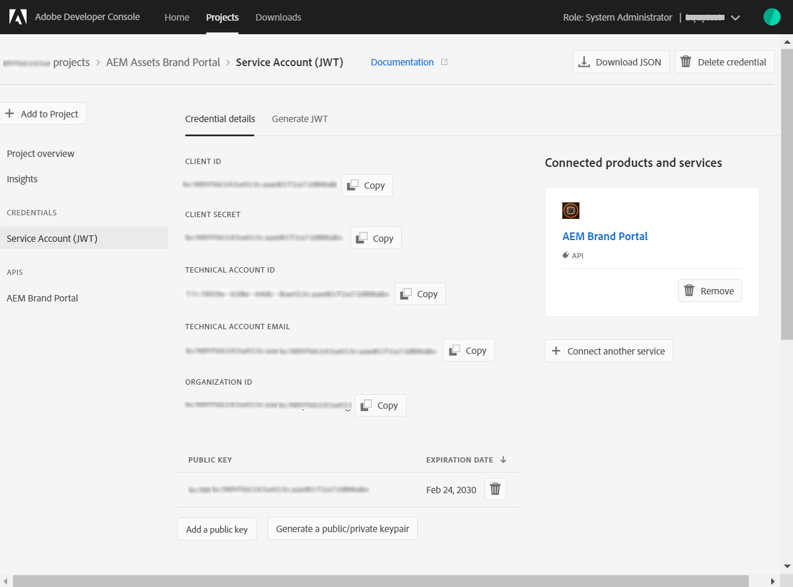

# Experience Manager Assets configureren met Brand Portal {#configure-aem-assets-with-brand-portal}

| Versie | Artikelkoppeling |
| -------- | ---------------------------- |
| AEM 6,5 | [Klik hier](https://experienceleague.adobe.com/docs/experience-manager-65/assets/brandportal/configure-aem-assets-with-brand-portal.html?lang=en) |
| AEM as a Cloud Service | Dit artikel |

Als u Adobe Experience Manager Assets Brand Portal configureert, kunt u goedgekeurde merkmiddelen van Adobe Experience Manager Assets publiceren als een [!DNL Cloud Service] -instantie naar Brand Portal te sturen en deze naar de Brand Portal-gebruikers te sturen.

## Brand Portal activeren met Cloud Manager {#activate-brand-portal}

De gebruiker van Cloud Manager activeert Brand Portal voor een Experience Manager Assets als een [!DNL Cloud Service] -instantie. De activeringsworkflow maakt de vereiste configuraties (machtigingstoken, IMS-configuratie en Brand Portal-cloudservice) op de achtergrond en geeft de status van de Brand Portal-huurder in Cloud Manager weer. Als u Brand Portal activeert, kunnen Experience Manager Assets-gebruikers elementen publiceren naar Brand Portal en deze verspreiden onder Brand Portal-gebruikers.

**Vereisten**

U hebt het volgende nodig om Brand Portal op uw Experience Manager Assets als een [!DNL Cloud Service] -instantie:

* Een Experience Manager Assets als [!DNL Cloud Service] -instantie.
* Een gebruiker die toegang heeft tot Cloud Manager en die is toegewezen aan profielen van het product van Cloud Manager. Zie [Cloud Manager openen](https://experienceleague.adobe.com/docs/experience-manager-cloud-service/security/ims-support.html#accessing-cloud-manager) voor meer informatie .

>[!NOTE]
>
>Een geconfigureerde productieomgeving is als een [!DNL Cloud Service] -instantie om verbinding te maken met Brand Portal-gebruiker.

**Stappen om Brand Portal te activeren**

U kunt Brand Portal activeren terwijl u de productieomgevingen voor uw Experience Manager Assets maakt als een [!DNL Cloud Service] of afzonderlijk. Laten we ervan uitgaan dat de omgeving al tot stand is gekomen en dat u nu Brand Portal moet activeren.

1. Aanmelden bij Adobe Cloud Manager en navigeren naar **[!UICONTROL Environments]**.

   De **[!UICONTROL Environments]** op de pagina wordt de lijst met alle bestaande omgevingen weergegeven.

1. Selecteer de omgevingen (een voor een) in de lijst om de omgevingsdetails weer te geven.

   Brand Portal heeft recht op een van de beschikbare omgevingen en wordt weerspiegeld in de **[!UICONTROL Environment Information]**.

   Als u de omgeving van Brand Portal hebt gevonden, klikt u op de knop **[!UICONTROL Activate Brand Portal]** om de activeringsworkflow te starten.

   

1. Het duurt slechts een paar minuten om de Brand Portal-gebruiker te activeren, aangezien de activeringsworkflow de vereiste configuraties op de achtergrond maakt. Zodra de Brand Portal-huurder is geactiveerd, verandert de status in Geactiveerd.

   

>[!NOTE]
>
>Brand Portal moet op dezelfde IMS org als de Experience Manager Assets worden geactiveerd als een [!DNL Cloud Service] -instantie.
>
>Als u een bestaande Brand Portal-cloudconfiguratie hebt ([handmatig geconfigureerd met Adobe Developer Console](#manual-configuration)) voor een IMS org (org1-bestaand) en uw Experience Manager Assets als een [!DNL Cloud Service] -instantie is geconfigureerd voor een andere IMS-org (org2-new). Als u Brand Portal activeert vanuit Cloud Manager, wordt de Brand Portal IMS-org opnieuw ingesteld op `org2-new`. Hoewel de manueel gevormde wolkenconfiguratie op `org1-existing` wordt weergegeven in de auteur van Experience Manager Assets, maar wordt niet meer gebruikt nadat u Brand Portal hebt geactiveerd via Cloud Manager.
>
>Als de bestaande Brand Portal-cloudconfiguratie en Experience Manager Assets als een [!DNL Cloud Service] -instantie dezelfde IMS org (org1) gebruikt, hoeft u Brand Portal alleen te activeren via Cloud Manager.
>
>Wijzig geen automatisch gegenereerde instellingen.

**Zie ook**:

* [Gebruikers en rollen toevoegen in as a Cloud Service Experience Manager Assets](https://experienceleague.adobe.com/docs/experience-manager-cloud-manager/using/requirements/setting-up-users-and-roles.html)

* [Omgevingen beheren in Cloud Manager](https://experienceleague.adobe.com/docs/experience-manager-cloud-service/implementing/using-cloud-manager/manage-environments.html#adding-environments)

**Aanmelden bij uw Brand Portal-huurder**:

Nadat u de Brand Portal-huurder hebt geactiveerd in Cloud Manager, kunt u zich vanuit Admin Console aanmelden bij Brand Portal of rechtstreeks de URL van de huurder gebruiken.

De standaard-URL van de Brand Portal-gebruiker is: `https://<tenant-id>.brand-portal.adobe.com/`.

Daar is de Tenant-id de IMS org.

Voer de volgende stappen uit als u niet zeker bent van de Brand Portal-URL:

1. Aanmelden bij [Admin Console](https://adminconsole.adobe.com/) en navigeer naar **[!UICONTROL Products]**.
1. Selecteer in het linkerdeelvenster de optie **[!UICONTROL Adobe Experience Manager Brand Portal – Brand Portal]**.
1. Klikken **[!UICONTROL Go to Brand Portal]** om Brand Portal rechtstreeks in de browser te openen.

   Of kopieer de URL van de Brand Portal-huurder vanuit de **[!UICONTROL Go to Brand Portal]** koppelen en plakken in uw browser om de Brand Portal-interface te openen.

   

**Verbinding testen**

Voer de volgende stappen uit om de verbinding tussen uw Experience Manager Assets als een [!DNL Cloud Service] instance en Brand Portal-huurder:

1. Aanmelden bij Experience Manager Assets.

1. Van de **Gereedschappen** deelvenster, navigeren naar **[!UICONTROL Deployment]** > **[!UICONTROL Distribution]**.

   

   Een Brand Portal-distributieagent (**[!UICONTROL bpdistributionagent0]**) is gemaakt onder **[!UICONTROL Publish to Brand Portal]**.

   

1. Klikken **[!UICONTROL Publish to Brand Portal]** om de distributieagent te openen.

   U kunt de distributielijnen onder de **[!UICONTROL Status]** tab.

   Een distributieagent bevat twee wachtrijen:
   * **verwerkingswachtrij**: voor de distributie van assets naar Brand Portal.

   * **foutenwachtrij**: voor de assets waarvoor de distributie is mislukt.

   >[!NOTE]
   >
   >Het wordt aanbevolen om de fouten te controleren en de **foutenwachtrij** regelmatig te wissen.

   

1. De verbinding tussen Experience Manager Assets als een [!DNL Cloud Service] en Brand Portal klikt u op de knop **[!UICONTROL Test Connection]** pictogram.

   

   Er verschijnt een bericht dat uw *testpakket is geleverd*.

   >[!NOTE]
   >
   >Schakel de distributieagent niet uit, want dit kan de distributie van de assets (die actief zijn in de wachtrij) doen mislukken.

Om de verbinding tussen uw Experience Manager Assets als a te verifiëren [!DNL Cloud Service] -exemplaar en Brand Portal-huurder, publiceer een middel van Experience Manager Assets naar Brand Portal. Als de verbinding is gelukt, is het gepubliceerde element zichtbaar in de Brand Portal-interface.

U kunt nu het volgende doen:

* [Elementen publiceren van Experience Manager Assets naar Brand Portal](publish-to-brand-portal.md)
* [Mappen publiceren van Experience Manager Assets naar Brand Portal](publish-to-brand-portal.md#publish-folders-to-brand-portal)
* [Verzamelingen van Experience Manager Assets naar Brand Portal publiceren](publish-to-brand-portal.md#publish-collections-to-brand-portal)
* [Elementen publiceren van Brand Portal naar Experience Manager Assets](https://experienceleague.adobe.com/docs/experience-manager-brand-portal/using/asset-sourcing-in-brand-portal/brand-portal-asset-sourcing.html) - Asset Souring in Brand Portal
* [Voorinstellingen, schema&#39;s en facetten publiceren naar Brand Portal](https://experienceleague.adobe.com/docs/experience-manager-brand-portal/using/publish/publish-schema-search-facets-presets.html)
* [Tags publiceren naar Brand Portal](https://experienceleague.adobe.com/docs/experience-manager-brand-portal/using/publish/brand-portal-publish-tags.html)

Zie [Brand Portal-documentatie](https://experienceleague.adobe.com/docs/experience-manager-brand-portal/using/home.html) voor meer informatie .

**Distributielogboeken**

U kunt de logboeken van de distributieagent voor de activa het publiceren werkschema controleren.

Laten we nu een middel van Experience Manager Assets naar Brand Portal publiceren en de logboeken bekijken.

1. Voer de stappen uit (van 1 tot en met 4) die in het dialoogvenster **Verbinding testen** en navigeer aan de pagina van de distributiegagent.
1. Klikken **[!UICONTROL Logs]** om de logbestanden met de verwerking en fouten weer te geven.

   

De distributieagent heeft de volgende logboeken geproduceerd:

* INFO: Het is een systeem-geproduceerd logboek dat op succesvolle configuratie van de verdelingsagent teweegbrengt.
* DSTRQ1 (aanvraag 1): geactiveerd tijdens testverbinding.

Bij het publiceren van de asset worden de volgende aanvraag- en antwoordlogboeken gegenereerd:

**Aanvraag van distributieagent**:

* DSTRQ2 (aanvraag 2): de aanvraag voor het publiceren van de asset wordt geactiveerd.
* DSTRQ3 (verzoek 3): Het systeem activeert een andere aanvraag om de Experience Manager Assets-map (waarin het element bestaat) te publiceren en repliceert de map in Brand Portal.

**Antwoord van distributieagent**:

* queue-bpdistributionagent0 (DSTRQ2): de asset wordt gepubliceerd naar Brand Portal.
* queue-bpdistributionagent0 (DSTRQ3): het systeem dupliceert de Experience Manager Assets-map (die het element bevat) in Brand Portal.

In het bovenstaande voorbeeld worden een aanvullende aanvraag en een aanvullend antwoord geactiveerd. Het systeem kan de bovenliggende map (Pad toevoegen) niet vinden in Brand Portal omdat het element voor de eerste keer is gepubliceerd. Daarom heeft het een extra aanvraag gestart om een bovenliggende map met dezelfde naam te maken in Brand Portal waar het element wordt gepubliceerd.

>[!NOTE]
>
>Er wordt een extra aanvraag gegenereerd als de bovenliggende map niet bestaat in Brand Portal of is gewijzigd in Experience Manager Assets.

Samen met de automatiseringsworkflow om Brand Portal op Experience Manager Assets te activeren [!DNL Cloud Service], bestaat er een andere methode om Experience Manager Assets handmatig als een [!DNL Cloud Service] met Brand Portal. Adobe Developer Console wordt niet meer aanbevolen.

>[!NOTE]
>
>Neem contact op met de Klantenondersteuning als u problemen ondervindt tijdens het activeren van uw Brand Portal-medewerker.

## Handmatige configuratie met Adobe Developer Console {#manual-configuration}

In de volgende sectie wordt beschreven hoe u Experience Manager Assets handmatig als een [!DNL Cloud Service] met Brand Portal met Adobe Developer Console.

Eerder, Experience Manager Assets als [!DNL Cloud Service] handmatig geconfigureerd met Brand Portal via Adobe Developer Console, die een Adobe Identity Management Services (IMS)-accounttoken aanschaft voor toestemming van de Brand Portal-huurder. Hiervoor zijn configuraties vereist in zowel Experience Manager Assets als Adobe Developer Console.

1. Maak in Experience Manager Assets een IMS-account en genereer een openbare sleutel (certificaat).
1. Maak in Adobe Developer Console een project voor uw Brand Portal-huurder (organisatie).
1. Onder het project, vorm API gebruikend de openbare sleutel om een verbinding van de de dienstrekening tot stand te brengen.
1. Krijg de geloofsbrieven van de de dienstrekening en JSON Web Token (JWT) nuttige ladingsinformatie.
1. In Experience Manager Assets configureert u de IMS-account met de gegevens van de serviceaccount en de JWT-payload.
1. In Experience Manager Assets configureert u de Brand Portal-cloudservice met behulp van het IMS-account en het Brand Portal-eindpunt (organisatie-URL).
1. Test uw configuratie door middelen van Experience Manager Assets aan Brand Portal te publiceren.

>[!NOTE]
>
>Een Experience Manager Assets als [!DNL Cloud Service] instantie wordt slechts met één Brand Portal-huurder geconfigureerd.

**Vereisten**

U hebt het volgende nodig om Experience Manager Assets met Brand Portal te configureren:

* Een Experience Manager Assets als [!DNL Cloud Service] instance
* URL Brand Portal-gebruiker
* Een gebruiker met systeembeheerdersrechten voor de IMS-organisatie van de Brand Portal-huurder

## Configuratie maken {#create-new-configuration}

Voer de volgende stappen in de opgegeven reeks uit om Experience Manager Assets met Brand Portal te configureren.

1. [Openbaar certificaat verkrijgen](#public-certificate)
1. [Verbinding voor serviceaccount (JWT) maken](#createnewintegration)
1. [IMS-account configureren](#create-ims-account-configuration)
1. [Cloudservice configureren](#configure-the-cloud-service)

### IMS-configuratie maken {#create-ims-configuration}

De IMS-configuratie verifieert uw Experience Manager Assets als een [!DNL Cloud Service] instantie met de Brand Portal-huurder.

De IMS-configuratie omvat twee stappen:

* [Openbaar certificaat verkrijgen](#public-certificate)
* [IMS-account configureren](#create-ims-account-configuration)

### Openbaar certificaat verkrijgen {#public-certificate}

Met de openbare sleutel (certificaat) wordt uw profiel geverifieerd op Adobe Developer Console.

1. Aanmelden bij Experience Manager Assets.
1. Van de **Gereedschappen** deelvenster, navigeren naar **[!UICONTROL Security]** > **[!UICONTROL Adobe IMS Configurations]**.
1. Klik op de pagina Adobe IMS Configurations op **[!UICONTROL Create]**. Het zal worden omgeleid naar de **[!UICONTROL Adobe IMS Technical Account Configuration]** pagina. Standaard worden de **Certificaat** wordt geopend.
1. Selecteren **[!UICONTROL Adobe Brand Portal]** in de **[!UICONTROL Cloud Solution]** vervolgkeuzelijst.
1. Selecteer de **[!UICONTROL Create new certificate]** selectievakje en geef een **alias** voor de openbare sleutel. De alias fungeert als naam voor de openbare sleutel.
1. Klik op **[!UICONTROL Create certificate]**. Klik vervolgens op **[!UICONTROL OK]** om de openbare sleutel te produceren.

   

1. Klik op de knop **[!UICONTROL Download Public Key]** en sla het CRT-bestand (Public Key) op uw computer op.

   De openbare sleutel wordt later gebruikt om API voor uw Brand Portal huurder te vormen en de geloofsbrieven van de de dienstrekening in de Console van Adobe Developer te produceren.

   

1. Klik op **[!UICONTROL Next]**.

   In de **Account** wordt een Adobe IMS-account gemaakt waarvoor de referenties van de serviceaccount zijn vereist die in Adobe Developer Console worden gegenereerd. Laat deze pagina voorlopig open.

   Open een nieuw tabblad en [een JWT-verbinding (Service Account) maken in Adobe Developer Console](#createnewintegration) om de referenties en JWT-lading op te halen voor het configureren van de IMS-account.

### Verbinding voor serviceaccount (JWT) maken {#createnewintegration}

In de Console van Adobe Developer, worden de projecten en APIs gevormd op het niveau van de huurder van Brand Portal (organisatie). Als u een API configureert, wordt een JWT-verbinding (Service Account) gemaakt. Er zijn twee methodes om API te vormen, door een zeer belangrijk paar (privé en openbare sleutels) te produceren of door een openbare sleutel te uploaden. Als u Experience Manager Assets wilt configureren met Brand Portal, moet u een openbare sleutel (certificaat) genereren in Experience Manager Assets en referenties maken in Adobe Developer Console door de openbare sleutel te uploaden. Deze gegevens zijn vereist om de IMS-account in Experience Manager Assets te configureren. Zodra de IMS-account is geconfigureerd, kunt u de Brand Portal-cloudservice in Experience Manager Assets configureren.

Voer de volgende stappen uit om de geloofsbrieven van de de dienstrekening en lading van JWT te produceren:

1. Meld u aan bij Adobe Developer Console met systeembeheerdersrechten voor de IMS-organisatie (Brand Portal-huurder). De standaard-URL is [https://www.adobe.com/go/devs_console_ui](https://www.adobe.com/go/devs_console_ui).

   >[!NOTE]
   >
   >Zorg ervoor dat u de correcte organisatie IMS (Brand Portal huurder) van de drop-down (organisatie) lijst hebt geselecteerd die bij de hoger-juiste hoek wordt gevestigd.

1. Klik op **[!UICONTROL Create new project]**. Er wordt een leeg project met een door het systeem gegenereerde naam gemaakt voor uw organisatie.

   Klikken **[!UICONTROL Edit project]** om de **[!UICONTROL Project Title]** en **[!UICONTROL Description]** en klik op **[!UICONTROL Save]**.

1. In de **[!UICONTROL Project overview]** tabblad, klikt u op **[!UICONTROL Add API]**.

1. In de **[!UICONTROL Add an API window]**, selecteert u **[!UICONTROL AEM Brand Portal]** en klik op **[!UICONTROL Next]**.

   Zorg ervoor dat u toegang hebt tot de Experience Manager Brand Portal-service.

1. In de **[!UICONTROL Configure API]** venster, klikt u op **[!UICONTROL Upload your public key]**. Klik vervolgens op **[!UICONTROL Select a File]** en uploadt u de openbare sleutel (.crt-bestand) die u in het dialoogvenster [openbare verklaring verkrijgen](#public-certificate) sectie.

   Klik op **[!UICONTROL Next]**.

   

1. De openbare sleutel controleren en klikken **[!UICONTROL Next]**.

1. Selecteren **[!UICONTROL Assets Brand Portal]** als het standaardproductprofiel en klik op **[!UICONTROL Save configured API]**.

   

1. Nadat de API is geconfigureerd, wordt u omgeleid naar de API-overzichtspagina. Vanaf de linkernavigatie onder **[!UICONTROL Credentials]** klikt u op de knop **[!UICONTROL Service Account (JWT)]** -optie.

   >[!NOTE]
   >
   >* U kunt de geloofsbrieven bekijken en acties uitvoeren zoals produceren JWT tokens, exemplaar credentiedetails, terugwinnen cliëntgeheim, etc.
   >* Momenteel wordt alleen het JWT-verificatietype (Developer Console Service Account) van de Adobe ondersteund. Gebruik de `OAuth Server-to-Server` referentietype tot dit medio april wordt ondersteund. Lees meer op [JWT Credentials Deprection in Adobe Developer Console](https://experienceleague.adobe.com/docs/experience-manager-cloud-service/content/security/jwt-credentials-deprecation-in-adobe-developer-console.html).

1. Van de **[!UICONTROL Client Credentials]** -tabblad, kopieert u de **[!UICONTROL client ID]**.

   Klikken **[!UICONTROL Retrieve Client Secret]** en kopieer de **[!UICONTROL client secret]**.

   

1. Ga naar de **[!UICONTROL Generate JWT]** en kopieer de **[!UICONTROL JWT Payload]** informatie.

U kunt nu de client-id (API-sleutel), het clientgeheim en de JWT-payload gebruiken naar [IMS-account configureren](#create-ims-account-configuration) in Experience Manager Assets.

<!--
1. Click **[!UICONTROL Create Integration]**.

1. Select **[!UICONTROL Access an API]**, and click **[!UICONTROL Continue]**.

   

1. Create an integration page. 
   
   Select your organization from the drop-down list.

   In **[!UICONTROL Experience Cloud]**, Select **[!UICONTROL AEM Brand Portal]** and click **[!UICONTROL Continue]**. 

   If the Brand Portal option is disabled for you, ensure that you have selected correct organization from the drop-down box above the **[!UICONTROL Adobe Services]** option. If you do not know your organization, contact your administrator.

   

1. Specify a name and description for the integration. Click **[!UICONTROL Select a File from your computer]** and upload the `AEM-Adobe-IMS.crt` file downloaded in the [obtain public certificates](#public-certificate) section.

1. Select the profile of your organization. 

   Or, select the default profile **[!UICONTROL Assets Brand Portal]** and click **[!UICONTROL Create Integration]**. The integration is created.

1. Click **[!UICONTROL Continue to integration details]** to view the integration information. 

   Copy the **[!UICONTROL API Key]** 
   
   Click **[!UICONTROL Retrieve Client Secret]** and copy the Client Secret key.

   

1. Navigate to **[!UICONTROL JWT]** tab, and copy the **[!UICONTROL JWT payload]**.

   The API Key, Client Secret key, and JWT payload information is used to create IMS account configuration.

-->

### IMS-account configureren {#create-ims-account-configuration}

Controleer of u de volgende stappen hebt uitgevoerd:

* [Openbaar certificaat verkrijgen](#public-certificate)
* [Verbinding voor serviceaccount (JWT) maken](#createnewintegration)

Voer de volgende stappen uit om de IMS-account te configureren.

1. Open de IMS-configuratie en navigeer naar de **[!UICONTROL Account]** tab. U hebt de pagina geopend gehouden terwijl [verkrijgen van het openbare certificaat](#public-certificate).

1. Geef een **[!UICONTROL Title]** op voor het IMS-account.

   In de **[!UICONTROL Authorization Server]** -veld, geeft u de URL op: [https://ims-na1.adobelogin.com/](https://ims-na1.adobelogin.com/)

   Client-id opgeven in het dialoogvenster **[!UICONTROL API key]** veld, **[!UICONTROL Client Secret]**, en **[!UICONTROL Payload]** (JWT-lading) die u hebt gekopieerd terwijl [maken van de verbinding van de serviceaccount (JWT)](#createnewintegration).

   Klik op **[!UICONTROL Create]**.

   De IMS-account is geconfigureerd.

   

1. Selecteer de IMS-accountconfiguratie en klik op **[!UICONTROL Check Health]**.

   Klikken **[!UICONTROL Check]** in het dialoogvenster. Bij een geslaagde configuratie verschijnt het bericht dat de *Token is opgehaald*.

   

>[!CAUTION]
>
>U moet slechts één configuratie IMS hebben.
>
>Zorg ervoor dat de IMS-configuratie slaagt voor de statuscontrole. Als de configuratie niet slaagt voor de statuscontrole, is deze ongeldig. U moet het schrappen en een andere geldige configuratie tot stand brengen.

### Cloudservice configureren {#configure-the-cloud-service}

Voer de volgende stappen uit om de Brand Portal-cloudservice te configureren:

1. Aanmelden bij Experience Manager Assets.

1. Van de **Gereedschappen** deelvenster, navigeren naar **[!UICONTROL Cloud Services]** > **[!UICONTROL AEM Brand Portal]**.

1. Klik op de pagina Brand Portal Configurations op **[!UICONTROL Create]**.

1. Geef een **[!UICONTROL Title]** op voor de configuratie.

   Selecteer de IMS-configuratie die u hebt gemaakt toen [configureren van IMS-account](#create-ims-account-configuration).

   In de **[!UICONTROL Service URL]** -veld, geeft u de URL van uw Brand Portal-huurder (organisatie) op.

   

1. Klik op **[!UICONTROL Save & Close]**. De cloudconfiguratie wordt gemaakt.

   Je Experience Manager Assets als [!DNL Cloud Service] -instantie is nu geconfigureerd met de Brand Portal-gebruiker.

U kunt de configuratie nu testen door de distributieagent te controleren en elementen naar Brand Portal te publiceren.

**IPs van de Lijst van gewenste personen van de Afbraak in SPS als veilige voorproef toegelaten**
Als u Dynamic Media-Scene7 gebruikt met [beveiligde voorvertoning ingeschakeld](#https://experienceleague.adobe.com/docs/dynamic-media-classic/using/upload-publish/testing-assets-making-them-public.html?lang=en) voor een bedrijf), dan wordt het geadviseerd dat de beheerder van het bedrijf van Scene7 [lijst van gewenste personen de openbare uitgang IPs](#https://experienceleague.adobe.com/docs/dynamic-media-classic/using/upload-publish/testing-assets-making-them-public.html?lang=en#testing-the-secure-testing-service) voor de respectieve gebieden die SPS (het Uitgevers Systeem van Scene7) gebruiken flits UI.
De IP&#39;s van de uitgang zijn als volgt:

| **Regio** | **IP van de uitgang** |
|--- |--- |
| NA | 130.248.160.68, 20.94.203.130 |
| EMEA | 51.132.146.75, 130.248.244.202, 130.248.244.203, 130.248.244.204, 130.2 48.244.210, 130.248.244.211, 13.248.244.212 |
| APAC | 63 140 44 54 |

<!--
### Test configuration {#test-configuration}

Perform the following steps to validate the configuration:

1. Login to AEM Assets.

1. From the **Tools** panel, navigate to **[!UICONTROL Deployment]** > **[!UICONTROL Distribution]**.

    

   A Brand Portal distribution agent (**[!UICONTROL bpdistributionagent0]**) is created under **[!UICONTROL Publish to Brand Portal]**.

   

1. Click **[!UICONTROL Publish to Brand Portal]** to open the distribution agent. 

   You can see the distribution queues under the **[!UICONTROL Status]** tab. 
   
   A distribution agent contains two queues: 
   * **processing-queue**: for the distribution of assets to Brand Portal. 

   * **error-queue**: for the assets where distribution has failed. 
   
   >[!NOTE]
   >
   >It is recommended to review the failures and  clear the **error-queue** periodically.  

   

1. To verify the connection between AEM Assets as a [!DNL Cloud Service] and Brand Portal, click the **[!UICONTROL Test Connection]** icon.

   

   A message appears that your *test package is successfully delivered*.

   >[!NOTE]
   >
   >Avoid disabling the distribution agent, as it can cause the distribution of the assets (running-in-queue) to fail.

You can now:

* [Publish assets from AEM Assets to Brand Portal](publish-to-brand-portal.md)
* [Publish folders from AEM Assets to Brand Portal](publish-to-brand-portal.md#publish-folders-to-brand-portal)
* [Publish collections from AEM Assets to Brand Portal](publish-to-brand-portal.md#publish-collections-to-brand-portal)
* [Publish assets from Brand Portal to AEM Assets](https://experienceleague.adobe.com/docs/experience-manager-brand-portal/using/asset-sourcing-in-brand-portal/brand-portal-asset-sourcing.html) - Asset Sourcing in Brand Portal
* [Publish presets, schemas, and facets to Brand Portal](https://experienceleague.adobe.com/docs/experience-manager-brand-portal/using/publish/publish-schema-search-facets-presets.html)
* [Publish tags to Brand Portal](https://experienceleague.adobe.com/docs/experience-manager-brand-portal/using/publish/brand-portal-publish-tags.html)

See [Brand Portal documentation](https://experienceleague.adobe.com/docs/experience-manager-brand-portal/using/home.html) for more information.

## Distribution logs {#distribution-logs}

You can monitor the distribution agent logs for the asset publishing workflow. 

For example, we have published an asset from AEM Assets to Brand Portal to validate the configuration. 

1. Follow the steps (from 1 to 4) as shown in the [Test Configuration](#test-configuration) section and navigate to the distribution agent page.
1. Click **[!UICONTROL Logs]** to view the processing and error logs.

   

The distribution agent has generated the following logs:

* INFO: This is a system-generated log that triggers on successful configuration of the distribution agent. 
* DSTRQ1 (Request 1): Triggers on test connection.

On publishing the asset, the following request and response logs are generated:

**Distribution agent request**:

* DSTRQ2 (Request 2): The asset publishing request is triggered.
* DSTRQ3 (Request 3): The system triggers another request to publish the AEM Assets folder (in which the asset exists) and replicates the folder in Brand Portal.

**Distribution agent response**:

* queue-bpdistributionagent0 (DSTRQ2): The asset is published to Brand Portal.
* queue-bpdistributionagent0 (DSTRQ3): The system replicates the AEM Assets folder (containing the asset) in Brand Portal.

In the above example, an additional request and response is triggered. The system could not find the parent folder (Add Path) in Brand Portal because the asset was published for the first time, therefore, it triggered an additional request to create a parent folder with the same name in Brand Portal where the asset is published.  

>[!NOTE]
>
>Additional request is generated in case the parent folder does not exist in Brand Portal or has been modified in AEM Assets. 
-->

<!--

## Additional information {#additional-information}

Go to `/system/console/slingmetrics` for statistics related to the distributed content:

1. **Counter metrics**
   * sling: `mac_sync_request_failure`
   * sling: `mac_sync_request_received`
   * sling: `mac_sync_request_success`

1. **Time metrics**
   * sling: `mac_sync_distribution_duration`
   * sling: `mac_sync_enqueue_package_duration`
   * sling: `mac_sync_setup_request_duration`

-->

<!--
   Comment Type: draft

   <li> </li>
   -->

<!--
   Comment Type: draft

   <li>Step text</li>
-->

**Zie ook**

* [Elementen vertalen](translate-assets.md)
* [Elementen HTTP-API](mac-api-assets.md)
* [Ondersteunde bestandsindelingen](file-format-support.md)
* [Zoeken in middelen](search-assets.md)
* [Verbonden elementen](use-assets-across-connected-assets-instances.md)
* [Elementen rapporteren](asset-reports.md)
* [Metagegevensschema&#39;s](metadata-schemas.md)
* [Elementen downloaden](download-assets-from-aem.md)
* [Metagegevens beheren](manage-metadata.md)
* [Zoeken in facetten](search-facets.md)
* [Verzamelingen beheren](manage-collections.md)
* [Bulkmetagegevens importeren](metadata-import-export.md)
* [Middelen publiceren naar AEM en Dynamic Media](/help/assets/publish-assets-to-aem-and-dm.md)
