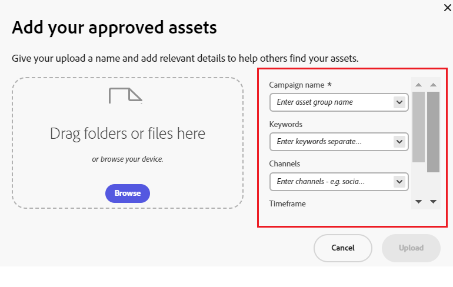

# Content Hub-gebruikersinterface configureren {#configure-content-hub-user-interface}

<table>
    <tr>
        <td>
            <i> Nieuwe </i> <a href="/help/assets/dynamic-media/dm-prime-ultimate.md"><b> Dynamische Media Prime en Ultimate </b></a>
        </td>
        <td>
            <i> Nieuwe </i> <a href="/help/assets/assets-ultimate-overview.md"><b> AEM Assets Ultimate </b></a>
        </td>
        <td>
            <i> Nieuwe </i> <a href="/help/assets/integrate-aem-assets-edge-delivery-services.md"><b> integratie van AEM Assets met Edge Delivery Services </b></a>
        </td>
        <td>
            <i> Nieuwe </i> <a href="/help/assets/aem-assets-view-ui-extensibility.md"><b> Uitbreidbaarheid UI </b></a>
        </td>
          <td>
            <i> Nieuw </i> <a href="/help/assets/dynamic-media/enable-dynamic-media-prime-and-ultimate.md"><b> laat Dynamische Media Prime en Ultimate </b></a> toe
        </td>
    </tr>
    <tr>
        <td>
            <a href="/help/assets/search-best-practices.md"><b> Beste praktijken van het Onderzoek </b></a>
        </td>
        <td>
            <a href="/help/assets/metadata-best-practices.md"><b> Beste praktijken van Meta-gegevens </b></a>
        </td>
        <td>
            <a href="/help/assets/product-overview.md"><b> Content Hub </b></a>
        </td>
        <td>
            <a href="/help/assets/dynamic-media-open-apis-overview.md"><b> Dynamische Media met mogelijkheden OpenAPI </b></a>
        </td>
        <td>
            <a href="https://developer.adobe.com/experience-cloud/experience-manager-apis/"><b> de ontwikkelaarsdocumentatie van AEM Assets </b></a>
        </td>
    </tr>
</table>

>[!CONTEXTUALHELP]
>id="configure_content_hub"
>title="Content Hub-gebruikersinterface configureren"
>abstract="Met Experience Manager Assets kunnen beheerders de opties configureren die beschikbaar zijn in de Content Hub-gebruikersinterface. Op basis van de configuratieopties die door de beheerders zijn geselecteerd, kunnen de Content Hub-gebruikers velden weergeven op Content Hub. De configuratieopties omvatten meta-gegevens terwijl het invoeren van activa, filters, activa eigenschappen, meta-gegevens terwijl het zoeken van activa, gepersonaliseerde branding, en om het even welke douaneverbindingen."
>additional-url="https://images-tv.adobe.com/mpcv3/4477/74a81d1c-0cfe-41f4-8a06-18ff70604e45_1732023385.854x480at800_h264.mp4" text="Video bekijken"

<!--  -->

>[!AVAILABILITY]
>
>Content Hub-gids is nu beschikbaar in PDF-indeling. Download de volledige handleiding en gebruik Adobe Acrobat AI Assistant om je vragen te beantwoorden.
>
>[!BADGE &#x200B; de Gids PDF van Content Hub &#x200B;]{type=Informative url="https://helpx.adobe.com/content/dam/help/en/experience-manager/aem-assets/content-hub.pdf"}

Met Experience Manager Assets kunnen beheerders de opties configureren die beschikbaar zijn in de Content Hub-gebruikersinterface. Op basis van de configuratieopties die door de beheerders zijn geselecteerd, kunnen de Content Hub-gebruikers velden weergeven op Content Hub. De configuratieopties omvatten:

* Filters die beschikbaar zijn voor gebruikers tijdens het zoeken naar elementen.

* De gegevens of eigenschappen van het element die beschikbaar zijn voor elk element.

* Metagegevensvelden die beschikbaar zijn voor gebruikers wanneer ze elementen toevoegen aan Content Hub.

* Veld voor metagegevens van middelen die beschikbaar zijn voor zoekopdrachten op Content Hub.

* Inhoud markeren die u voor uw organisatie moet weergeven.

* Aangepaste koppelingen die u op Content Hub moet opnemen, naast elementen, verzamelingen en inzichten.

## Vereisten {#prerequisites-configuration-ui}

[ de beheerders van Content Hub ](/help/assets/deploy-content-hub.md#step-3-onboard-content-hub-administrator) kunnen de configuratieopties voor andere gebruikers binnen uw organisatie plaatsen.

## Toegang tot configuratieopties op Content Hub {#access-configuration-options-content-hub}

Configuratieopties openen op Content Hub:

1. Klik op het gebruikerspictogram in het rechterdeelvenster.

1. Selecteer **[!UICONTROL Configurations]** in de sectie **[!UICONTROL Product Settings]** .

   

## Configuratieopties beheren in Content Hub {#manage-configuration-options}

Als beheerder, beheer de volgende configuratieopties voor uw gebruikers:

* [Importeren](#configure-import-options-content-hub)

* [Filters](#configure-filters-content-hub)

* [Gegevens van element](#configure-asset-details-content-hub)
* [Asset Card](#asset-card)

* [Zoeken](#configure-metadata-search-content-hub)

* [Branding](#configure-branding-content-hub)

* [Verlopen Assets](#expired-assets-content-hub)

* [Uitvoeringen](#renditions-content-hub)

* [Aangepaste koppelingen](#configure-custom-links-content-hub)

### Importeren {#configure-import-options-content-hub}

U kunt de meta-gegevensgebieden vormen die aan de gebruikers tijdens het uploaden van of het invoeren van activa aan het portaal van Content Hub, zoals de Naam van de Campagne, Sleutelwoorden, Kanalen, Tijdkader, Gebied, etc. tonen. Voer daartoe de volgende stappen uit:

1. Voor het [ gebruikersinterface van Configuraties ](#access-configuration-options-content-hub), klik **[!UICONTROL Import]**.

1. Klik op **[!UICONTROL Add metadata]**.

1. Geef een label voor de eigenschap op, wijs deze toe aan een eigenschap met behulp van het veld **[!UICONTROL Metadata]** en selecteer het invoertype voor de nieuwe metagegevens van het element.

1. Klik op de schakeloptie **[!UICONTROL Required field]** om het nieuwe metagegevensveld verplicht te maken voor gebruikers tijdens het uploaden van nieuwe elementen.

1. Klik op **[!UICONTROL Confirm]**. De nieuwe metagegevens worden weergegeven in de lijst met bestaande eigenschappen van elementen.

1. Klik op **[!UICONTROL Save]** om de wijzigingen toe te passen.

Op dezelfde manier kunt u  uit, beschikbaar naast elk beschikbaar bezit, om de etiketten uit te geven, deze gebieden verplicht of niet-verplicht te maken aan gebruikers terwijl het uploaden van activa gebruikend de **[!UICONTROL Required field]** knevel, of het pictogram van de Schrapping te klikken om het even welk meta-gegevensbezit te schrappen.

Klik op de schakeloptie **[!UICONTROL Auto-approval]** als u alle elementen die u toevoegt aan de Experience Manager Assets-opslagplaats automatisch wilt laten goedkeuren, zodat ze direct beschikbaar zijn in Content Hub. Anders moeten DAM-auteurs of -beheerders de elementen handmatig goedkeuren om deze beschikbaar te maken op Content Hub. De schakeloptie is standaard ingesteld op Uit.

Klik op **[!UICONTROL Save]** nadat u alle wijzigingen hebt aangebracht om de wijzigingen toe te passen.

Metagegevens die zijn ingeschakeld op de gebruikersinterfaceweergave van de configuratie op de pagina voor het uploaden van elementen:

### Filters {#configure-filters-content-hub}

Met Content Hub kunnen beheerders filters configureren die worden weergegeven terwijl ze naar elementen zoeken. Voer de volgende stappen uit om een nieuw filter toe te voegen:

1. Voor het [ gebruikersinterface van Configuraties ](#access-configuration-options-content-hub), klik **[!UICONTROL Filters]**.

1. Klik op **[!UICONTROL Add filters]**.

1. Geef een label voor het filter op, wijs het filter toe aan een eigenschap met behulp van het veld **[!UICONTROL Metadata]** en selecteer het invoertype voor het nieuwe filter.
1. Klik op **[!UICONTROL Confirm]**. Het nieuwe filter wordt weergegeven in de lijst met bestaande filters.

1. Klik op **[!UICONTROL Save]** om de wijzigingen toe te passen, zodat het nieuwe filter op de pagina Zoeken wordt weergegeven tijdens het filteren van elementen.

   >[!NOTE]
   >
   >Het nieuwe filter wordt alleen op de zoekpagina weergegeven als er in de opslagplaats ten minste één element aanwezig is dat aan de filtercriteria voldoet.

Op dezelfde manier kunt u  uit, beschikbaar naast elke beschikbare filter, om de etiketten uit te geven of het schrappingspictogram te klikken om het even welk bestaand filter te schrappen. Klik op **[!UICONTROL Save]** nadat u alle wijzigingen hebt aangebracht om de wijzigingen toe te passen.

De filters die op de vertoning van het Gebruikersinterface van de Configuratie op de pagina van het Onderzoek worden toegelaten:

### Gegevens van element {#configure-asset-details-content-hub}

U kunt ook de elementeigenschappen configureren die voor elk element worden weergegeven, zoals de bestandsnaam, titel, indeling, grootte, enzovoort. Voer daartoe de volgende stappen uit:

1. Voor het [ gebruikersinterface van Configuraties ](#access-configuration-options-content-hub), klik **[!UICONTROL Asset details]**.

1. Klik op **[!UICONTROL Add metadata]**.

1. Geef een label voor de eigenschap op, wijs deze toe aan een eigenschap met behulp van het veld **[!UICONTROL Metadata]** en selecteer het invoertype voor de nieuwe metagegevens van het element.
1. Klik op **[!UICONTROL Confirm]**. De nieuwe metagegevens worden weergegeven in de lijst met bestaande eigenschappen van elementen.

1. Klik op **[!UICONTROL Save]** om de wijzigingen toe te passen, zodat de nieuwe eigenschap wordt weergegeven op de pagina met elementdetails.

Op dezelfde manier kunt u  uit, beschikbaar naast elk beschikbaar bezit, om de etiketten uit te geven of het schrappingspictogram te klikken om het even welk bestaand activadetail te schrappen. Klik op **[!UICONTROL Save]** nadat u alle wijzigingen hebt aangebracht om de wijzigingen toe te passen.

De eigenschappen die op de vertoning van het Gebruikersinterface van de Configuratie op de pagina van de Details van Activa worden toegelaten:

### Asset Card {#asset-card}

U kunt de zeer belangrijke meta-gegevensgebieden ook vormen die u op de **Kaart van Activa** tot een maximum van 6 gebieden moet tonen. Voer daartoe de volgende stappen uit:

1. Op het [ gebruikersinterface van Configuraties ](#access-configuration-options-content-hub), klik **Kaart van Activa**.
2. Klik **toevoegen meta-gegevens**. **voegt de meta-gegevens van de activakaart** vertoningen van de dialoogdoos toe.
3. Specificeer de meta-gegevensnaam op het **gebied van het Etiket** en selecteer een meta-gegevensbezit op het **Meta-gegevens** gebied.
4. Klik **bevestigen** en klik dan **sparen** om de veranderingen toe te passen zodat de nieuwe bezitsvertoning op de pagina van activadetails.
   

Op dezelfde manier geeft de klik  uit die naast elk beschikbaar bezit beschikbaar is, om het even welke vereiste wijzigingen te maken of  te klikken om het even welk bestaand meta-gegevensbezit te schrappen. Klik **sparen** na het aanbrengen van alle wijzigingen om de veranderingen toe te passen.

### Zoeken {#configure-metadata-search-content-hub}

Beheerders kunnen de metagegevensvelden definiëren die worden doorzocht wanneer een gebruiker een zoekcriterium opgeeft op Content Hub. Voer de volgende stappen uit:

1. Voor het [ gebruikersinterface van Configuraties ](#access-configuration-options-content-hub), klik **[!UICONTROL Add metadata]**.

1. Geef het metagegevensveld op en klik op **[!UICONTROL Confirm]** .

1. Klik op **[!UICONTROL Save]** om de wijzigingen toe te passen, zodat de nieuwe eigenschap metadata wordt weergegeven in de lijst met metagegevensvelden.

Op dezelfde manier kunt u  uit, beschikbaar naast elk beschikbaar meta-gegevensbezit, om het bezit uit te geven of het schrappingspictogram te klikken om het even welk bestaand bezit te schrappen. Klik op **[!UICONTROL Save]** nadat u alle wijzigingen hebt aangebracht om de wijzigingen toe te passen.

### Branding {#configure-branding-content-hub}

Beheerders kunnen de titel en de tekst van de tekst op de banner van het Content Hub-portaal ook aanpassen aan uw vereisten voor branding. Voer daartoe de volgende stappen uit:

1. Voor het [ gebruikersinterface van Configuraties ](#access-configuration-options-content-hub), klik **[!UICONTROL Branding]**.

1. Geef tekst op in **[!UICONTROL Title text on banner]** - en **[!UICONTROL Body text on banner]** -velden.

1. Klik op **[!UICONTROL Save]** om de wijzigingen toe te passen.

De brandingsupdates die op de vertoning van het Gebruikersinterface van de Configuratie op de portaalbanner van Content Hub worden toegelaten:

### Verlopen activa{#expired-assets-content-hub}

Beheerders kunnen bepalen of verlopen elementen zichtbaar moeten zijn op Content Hub. Als de verlopen elementen zichtbaar worden gemaakt, kunnen ze ook definiëren of gebruikers ze kunnen downloaden.

Verlopen elementen worden standaard niet weergegeven in Content Hub.

Voer daartoe de volgende stappen uit:

1. Voor het [ gebruikersinterface van Configuraties ](#access-configuration-options-content-hub), klik **[!UICONTROL Expired Assets]**.

1. Schakel in de sectie **[!UICONTROL Visible]** de schakeloptie **[!UICONTROL Allow users to view expired assets]** in om alle verlopen elementen zichtbaar te maken op Content Hub.

1. Nadat u de zichtbaarheid van elementen hebt ingeschakeld, kunt u de mogelijkheid om verlopen elementen te downloaden in- of uitschakelen met de schakeloptie **[!UICONTROL Allow users to download expired assets]** .

1. Klik op **[!UICONTROL Save]** om de wijzigingen toe te passen.

   

Nadat u de zichtbaarheid van elementen hebt ingeschakeld, kunt u de verlopen elementen op Content Hub weergeven, zoals in de volgende afbeelding wordt getoond:

Als de beheerder downloaden heeft ingeschakeld, kunnen de Content Hub-gebruikers deze ook downloaden, zoals in de afbeelding is aangegeven.

Als de zichtbaarheid van verlopen elementen is ingeschakeld, markeert Content Hub ook elementen die binnen de komende 15 dagen verlopen met behulp van het `Expiring in n days` -bericht op de Asset Card.

### Uitvoeringen {#renditions-content-hub}

Uitvoeringen zijn aangepaste versies van digitale elementen, zoals afbeeldingen, documenten, enzovoort, die zijn ontworpen voor verschillende apparaten en platforms, voor optimale prestaties. Zie meer over [ vertoningen in Adobe Experience Manager Assets ](https://experienceleague.adobe.com/nl/docs/experience-manager-cloud-service/content/assets/assets-view/renditions).

Voer daartoe de volgende stappen uit:

Voor het [ gebruikersinterface van Configuraties ](#access-configuration-options-content-hub), klik **[!UICONTROL Renditions]**. De volgende opties zijn beschikbaar:

* Schakel de schakeloptie [!UICONTROL Enable availability of renditions] in om alle uitvoeringen zichtbaar te maken op Content Hub.

* Schakel **[!UICONTROL Allow users to download original assets]** in of uit om te bepalen of de oorspronkelijke elementen kunnen worden gedownload.

  

Voor informatie over hoe te om vertoningen in Content Hub te bekijken en te downloaden, zie [ downloadactiva in Content Hub ](/help/assets/download-assets-content-hub.md).

### Aangepaste koppelingen {#configure-custom-links-content-hub}

U kunt ook aangepaste tabbladen toevoegen naast de standaardtabbladen **[!UICONTROL All Assets]** , **[!UICONTROL Collections]** en **[!UICONTROL Insights]** op de Content Hub-portal net onder de banner. Voer daartoe de volgende stappen uit:

1. Voor het [ gebruikersinterface van Configuraties ](#access-configuration-options-content-hub), klik **[!UICONTROL Custom Links]**.

1. Klik op **[!UICONTROL Add link]**.

1. Geef tekst op in **[!UICONTROL Label]** - en **[!UICONTROL URL]** -velden. Het label dat u definieert, wordt weergegeven als een tab en wanneer u op het label klikt, navigeert u naar de URL die is gedefinieerd in het veld **[!UICONTROL URL]** .

1. Klik op **[!UICONTROL Confirm]**.

1. Klik op **[!UICONTROL Save]** om de wijzigingen toe te passen.

Op dezelfde manier kunt u  uit, beschikbaar naast elke URL, om de verbindingen uit te geven of het schrappingspictogram te klikken om het even welke bestaande URL te schrappen. Klik op **[!UICONTROL Save]** nadat u alle wijzigingen hebt aangebracht om de wijzigingen toe te passen.

De aangepaste koppeling wordt weergegeven als een nieuw tabblad naast het tabblad Inzichten op de startpagina van Content Hub.

