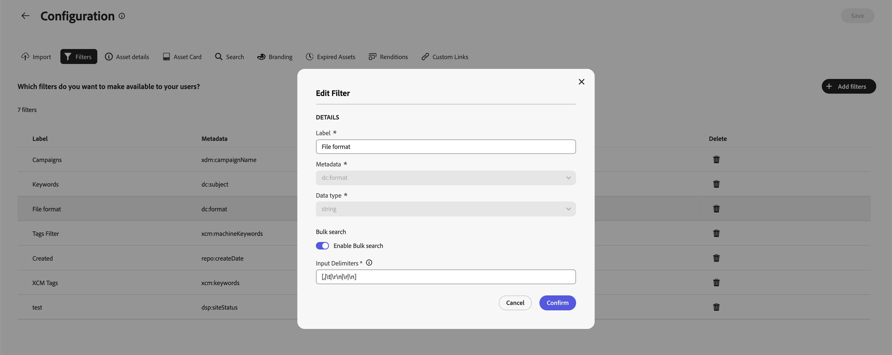

# Content Hub-gebruikersinterface configureren {#configure-content-hub-user-interface}

>[!CONTEXTUALHELP]
>id="configure_content_hub"
>title="Content Hub-gebruikersinterface configureren"
>abstract="Met Experience Manager Assets kunnen beheerders de opties configureren die beschikbaar zijn in de Content Hub-gebruikersinterface. Op basis van de configuratieopties die door de beheerders zijn geselecteerd, kunnen de Content Hub-gebruikers velden weergeven op Content Hub. De configuratieopties omvatten meta-gegevens terwijl het invoeren van activa, filters, activa eigenschappen, meta-gegevens terwijl het zoeken van activa, gepersonaliseerde branding, en om het even welke douaneverbindingen."
>additional-url="https://images-tv.adobe.com/mpcv3/4477/74a81d1c-0cfe-41f4-8a06-18ff70604e45_1732023385.854x480at800_h264.mp4" text="Video bekijken"

<!--  -->

Met Experience Manager Assets kunnen beheerders de opties configureren die beschikbaar zijn in de Content Hub-gebruikersinterface. Op basis van de configuratieopties die door de beheerders zijn geselecteerd, kunnen de Content Hub-gebruikers velden weergeven op Content Hub. De configuratieopties omvatten:

* Filters die beschikbaar zijn voor gebruikers tijdens het zoeken naar elementen.

* De gegevens of eigenschappen van het element die beschikbaar zijn voor elk element.

* Metagegevensvelden die beschikbaar zijn voor gebruikers wanneer ze elementen toevoegen aan Content Hub.

* Veld voor metagegevens van middelen die beschikbaar zijn voor zoekopdrachten op Content Hub.

* Inhoud markeren die u voor uw organisatie moet weergeven.

* Aangepaste koppelingen die u op Content Hub moet opnemen, naast elementen, verzamelingen en inzichten.

>[!VIDEO](https://video.tv.adobe.com/v/3472917/?learn=on&enablevpops){transcript=true}

## Vereisten {#prerequisites-configuration-ui}

[&#x200B; de beheerders van Content Hub &#x200B;](/help/assets/deploy-content-hub.md#step-3-onboard-content-hub-administrator) kunnen de configuratieopties voor andere gebruikers binnen uw organisatie plaatsen.

## Toegang tot configuratieopties op Content Hub {#access-configuration-options-content-hub}

Configuratieopties openen op Content Hub:

1. Klik op het gebruikerspictogram in het rechterdeelvenster.

1. Selecteer **[!UICONTROL Product Settings]** in de sectie **[!UICONTROL Configurations]** .

   

## Configuratieopties beheren in Content Hub {#manage-configuration-options}

Als beheerder, beheer de volgende configuratieopties voor uw gebruikers:

* [Importeren](#configure-import-options-content-hub)

* [Filters](#configure-filters-content-hub)

* [Gegevens van element](#configure-asset-details-content-hub)
* [Asset Card](#asset-card)

* [Zoeken](#configure-metadata-search-content-hub)

* [Branding](#configure-branding-content-hub)

* [Verlopen Assets](#expired-assets-content-hub)

* [Uitvoeringen](#renditions-content-hub)

* [Aangepaste koppelingen](#configure-custom-links-content-hub)

* [Verzamelingen en delen](#configure-collections-content-hub)

<!--* [Enable public link sharing](#enable-public-link-sharing)-->

### Importeren {#configure-import-options-content-hub}

U kunt de meta-gegevensgebieden vormen die aan de gebruikers tijdens het uploaden van of het invoeren van activa aan het portaal van Content Hub, zoals de Naam van de Campagne, Sleutelwoorden, Kanalen, Tijdkader, Gebied, etc. tonen. Voer daartoe de volgende stappen uit:

1. Voor het [&#x200B; gebruikersinterface van Configuraties &#x200B;](#access-configuration-options-content-hub), klik **[!UICONTROL Import]**.

1. Klik op **[!UICONTROL Add metadata]**.

1. Geef een label voor de eigenschap op, wijs deze toe aan een eigenschap met behulp van het veld **[!UICONTROL Metadata]** en selecteer het invoertype voor de nieuwe metagegevens van het element.

1. Klik op de schakeloptie **[!UICONTROL Required field]** om het nieuwe metagegevensveld verplicht te maken voor gebruikers tijdens het uploaden van nieuwe elementen.

1. Klik op **[!UICONTROL Confirm]**. De nieuwe metagegevens worden weergegeven in de lijst met bestaande eigenschappen van elementen.

1. Klik op **[!UICONTROL Save]** om de wijzigingen toe te passen.

Op dezelfde manier kunt u  beschikbaar naast elk beschikbaar bezit uit, om de etiketten uit te geven, deze gebieden verplicht of niet-verplicht te maken aan gebruikers terwijl het uploaden van activa gebruikend de **[!UICONTROL Required field]** knevel, of het pictogram van de Schrapping te klikken om het even welk meta-gegevensbezit te schrappen.

Klik op de schakeloptie **[!UICONTROL Auto-approval]** als u alle elementen die u toevoegt aan de Experience Manager Assets-opslagplaats automatisch wilt laten goedkeuren, zodat ze direct beschikbaar zijn in Content Hub. Anders moeten DAM-auteurs of -beheerders de elementen handmatig goedkeuren om deze beschikbaar te maken op Content Hub. De schakeloptie is standaard ingesteld op Uit.

Klik op **[!UICONTROL Save]** nadat u alle wijzigingen hebt aangebracht om de wijzigingen toe te passen.

Metagegevens die zijn ingeschakeld op de gebruikersinterfaceweergave van de configuratie op de pagina voor het uploaden van elementen:

### Filters {#configure-filters-content-hub}

Met Content Hub kunnen beheerders filters configureren die worden weergegeven terwijl ze naar elementen zoeken. Voer de volgende stappen uit om een nieuw filter toe te voegen:

1. Voor het [&#x200B; gebruikersinterface van Configuraties &#x200B;](#access-configuration-options-content-hub), klik **[!UICONTROL Filters]**.

1. Klik op **[!UICONTROL Add filters]**.

1. Geef een label voor het filter op, wijs het filter toe aan een eigenschap met behulp van het veld **[!UICONTROL Metadata]** en selecteer het invoertype voor het nieuwe filter.
1. Klik op **[!UICONTROL Confirm]**. Het nieuwe filter wordt weergegeven in de lijst met bestaande filters.

1. Klik op **[!UICONTROL Save]** om de wijzigingen toe te passen, zodat het nieuwe filter op de pagina Zoeken wordt weergegeven tijdens het filteren van elementen.

   >[!NOTE]
   >
   >Het nieuwe filter wordt alleen op de zoekpagina weergegeven als er ten minste één element in de opslagplaats aanwezig is dat voldoet aan de filtercriteria.

Op dezelfde manier kunt u  uit, beschikbaar naast elke beschikbare filter, om de etiketten uit te geven of het schrappingspictogram te klikken om het even welk bestaand filter te schrappen. Klik op **[!UICONTROL Save]** nadat u alle wijzigingen hebt aangebracht om de wijzigingen toe te passen.

De filters die op de vertoning van het Gebruikersinterface van de Configuratie op de pagina van het Onderzoek worden toegelaten:

#### Bulkzoekopdracht {#bulk-search-configuration}

Voer de onderstaande stappen uit om het doorzoeken van meerdere elementen tegelijk in [!DNL Content Hub] in te schakelen:

1. Voor het [&#x200B; gebruikersinterface van Configuraties &#x200B;](#access-configuration-options-content-hub), klik **[!UICONTROL Filters]**.

1. Klik  beschikbaar naast elke beschikbare filter.

1. Schakel **[!UICONTROL Bulk Search]** in. De standaardscheidingstekens `[ , | \t | \r\n | \r | \n ]` worden automatisch weergegeven. Bovendien kunt u ook extra scheidingstekens toevoegen. Hiervoor geeft u scheidingstekens op in het invoervak, gescheiden door een `pipe symbol (|)` .

   

1. Klik op **[!UICONTROL Confirm]** om de wijzigingen op te slaan. Zie [&#x200B; BulkOnderzoek in Content Hub &#x200B;](search-assets-content-hub.md#bulk-search) in actie.

### Gegevens van element {#configure-asset-details-content-hub}

U kunt ook de elementeigenschappen configureren die voor elk element worden weergegeven, zoals de bestandsnaam, titel, indeling, grootte, enzovoort. Voer daartoe de volgende stappen uit:

1. Voor het [&#x200B; gebruikersinterface van Configuraties &#x200B;](#access-configuration-options-content-hub), klik **[!UICONTROL Asset details]**.

1. Klik op **[!UICONTROL Add metadata]**.

1. Geef een label voor de eigenschap op, wijs deze toe aan een eigenschap met behulp van het veld **[!UICONTROL Metadata]** en selecteer het invoertype voor de nieuwe metagegevens van het element.
1. Klik op **[!UICONTROL Confirm]**. De nieuwe metagegevens worden weergegeven in de lijst met bestaande eigenschappen van elementen.

1. Klik op **[!UICONTROL Save]** om de wijzigingen toe te passen, zodat de nieuwe eigenschap wordt weergegeven op de pagina met elementdetails.

Op dezelfde manier kunt u  uit, beschikbaar naast elk beschikbaar bezit, om de etiketten uit te geven of het schrappingspictogram te klikken om het even welk bestaand activadetail te schrappen. Klik op **[!UICONTROL Save]** nadat u alle wijzigingen hebt aangebracht om de wijzigingen toe te passen.

De eigenschappen die op de vertoning van het Gebruikersinterface van de Configuratie op de pagina van de Details van Activa worden toegelaten:

### Asset Card {#asset-card}

U kunt de zeer belangrijke meta-gegevenseigenschappen ook vormen die u op de **Kaart van Activa** tot een maximum van 6 gebieden moet tonen.

Voer de volgende stappen uit om de eigenschappen van meta-gegevens te vormen om hen op **[!UICONTROL Asset card]** te tonen:

1. Op het [&#x200B; gebruikersinterface van Configuraties &#x200B;](#access-configuration-options-content-hub), klik **Kaart van Activa**.
2. Klik **toevoegen meta-gegevens**. **voegt de meta-gegevens van de activakaart** vertoningen van de dialoogdoos toe.
3. Specificeer de meta-gegevensnaam op het **gebied van het Etiket** en selecteer een meta-gegevensbezit op het **Meta-gegevens** gebied.
4. Klik **bevestigen** en klik dan **sparen** om de veranderingen toe te passen zodat de nieuwe bezitsvertoning op de pagina van activadetails.
   
Op dezelfde manier geeft de klik  dat naast elk beschikbaar bezit beschikbaar is, om het even welke vereiste wijzigingen te maken of  te klikken om het even welk bestaand meta-gegevensbezit te schrappen. Klik **sparen** na het aanbrengen van alle wijzigingen om de veranderingen toe te passen.

### Zoeken {#configure-metadata-search-content-hub}

Beheerders kunnen de metagegevensvelden definiëren die worden doorzocht wanneer een gebruiker een zoekcriterium opgeeft op Content Hub. Voer de volgende stappen uit:

1. Voor het [&#x200B; gebruikersinterface van Configuraties &#x200B;](#access-configuration-options-content-hub), klik **[!UICONTROL Add metadata]**.

1. Geef het metagegevensveld op en klik op **[!UICONTROL Confirm]** .

1. Klik op **[!UICONTROL Save]** om de wijzigingen toe te passen, zodat de nieuwe eigenschap metadata wordt weergegeven in de lijst met metagegevensvelden.

Op dezelfde manier kunt u  uit, beschikbaar naast elk beschikbaar meta-gegevensbezit, om het bezit uit te geven of het schrappingspictogram te klikken om het even welk bestaand bezit te schrappen. Klik op **[!UICONTROL Save]** nadat u alle wijzigingen hebt aangebracht om de wijzigingen toe te passen.

### Branding {#configure-branding-content-hub}

Als beheerder past u uw [!DNL Content Hub] -portal aan uw vereisten voor branding aan.

Voor  **[!UICONTROL Branding]** paginanummer gebruikt **[!UICONTROL Banner]**, **[!UICONTROL Colors]** en **[!UICONTROL Banner image]** secties om de volgende aanpassingen uit te voeren:

1. [De afbeelding van het logo wijzigen vanuit de sectie [!UICONTROL Logo image]](#Change-the-logo-image)
1. [De bannerafbeelding wijzigen vanuit de sectie [!UICONTROL Banner image]](#Change-the-banner-image)
1. [Werk de titel en de platte tekst op de banner bij en wijzig de tekstkleur vanuit de sectie [!UICONTROL Banner] .](#Add-title-and-body-text-to-your-banner-and-change-the-text-color)
1. [&#x200B; verander de primaire en secundaire kleur van de [!UICONTROL Colors] sectie om een kleurenregeling toe te passen die zich op het thema van uw merk &#x200B;](#Change-the-primary-and-secondary-color) richt

Selecteer de optie **[!UICONTROL Reset Defaults]** om uw wijzigingen terug te draaien en het standaardthema te herstellen.

#### De afbeelding van het logo wijzigen{#change-the-logo-image}

Voor de  **[!UICONTROL Branding]** pagina, voer de volgende stappen uit om het embleembeeld van uw [!DNL Content Hub] plaatsing te veranderen:

1. Klik  **[!UICONTROL Select Image]** om een embleembeeld te selecteren gebruikend de doos van de activaselecteur. De elementenkiezer geeft alleen goedgekeurde afbeeldingen weer.
1. Selecteer de afbeelding, klik op **[!UICONTROL Select]** en klik vervolgens op **[!UICONTROL Save]** om deze weer te geven als de logoafbeelding van uw [!DNL Content Hub] -implementatie.
   

#### De bannerafbeelding wijzigen{#Change-the-banner-image}

Voor de  **[!UICONTROL Branding]** pagina, voer de volgende stappen uit om het bannerbeeld van uw [!DNL Content Hub] plaatsing te veranderen:

1. Klik  **[!UICONTROL Select from gallery]** om een bannerbeeld te selecteren gebruikend de doos van de activaselecteur. De elementenkiezer geeft alleen goedgekeurde afbeeldingen weer.
1. Selecteer de afbeelding, klik op **[!UICONTROL Select]** en klik vervolgens op **[!UICONTROL Save]** om deze weer te geven als de bannerafbeelding van uw [!DNL Content Hub] -implementatie.
   

>[!NOTE]
>
> * De geadviseerde grootte voor **Beeld van de Banner** is `height = 200 to 450px` en `width = 1920 to 2560px`.
> * De geadviseerde grootte voor **Beeld van het Logo** is `height = 80 to 120px` en `width = 120 to 200px`.
> * De **gesteunde types MIME** voor zowel Banner als beelden van het Logo zijn `'JPG', value: 'image/jpeg'`, `'PNG', value: 'image/png'`, `'WEBP', value: 'image/webp'`, `'TIFF', value: 'image/tiff'`, `'SVG', value: 'image/svg+xml'`, `'GIF', value: 'image/gif'`.

#### Voeg titel en lichaamstekst aan uw banner toe en verander de tekstkleur{#Add-title-and-body-text-to-your-banner-and-change-the-text-color}

Voor de  **[!UICONTROL Branding]** pagina, gebruik de respectieve gebieden in de **[!UICONTROL Banner]** sectie om titel en lichaamsteksten aan uw banner toe te voegen.
Klik op het vakje naast de **[!UICONTROL Banner text color]** om een tekstkleur te selecteren in de kleurkiezer voor de bannertekst of geef de hexadecimale code van de kleur op in het veld naast het vak van de kleurkiezer.

#### De primaire en secundaire kleur wijzigen{#Change-the-primary-and-secondary-color}

Voor de  **[!UICONTROL Branding]** pagina, gebruik de **[!UICONTROL Colors]** sectie om primaire en secundaire kleuren te plaatsen door of hen te selecteren gebruikend kleurenplukker of het bepalen van de hexadecimale code van de kleur. Met deze kleuren worden de achtergrond-, tekst- en pictogramkleuren van UI-elementen zo ingesteld dat de gebruikersinterface van [!DNL Content Hub] wordt uitgelijnd op het thema van uw merk.

**[!UICONTROL Primary color]:** Het primaire kleurenschema is van toepassing op selectiehandelingen, interactieve elementen zoals selectievakjes, zoekbalken en schakelbare schakelopties over [!DNL Content Hub] , waaronder [!DNL Content Hub] homepage en [!UICONTROL Configuration] pagina. De klasse is ook van toepassing op actieopties die beschikbaar zijn op primaire [!DNL Content Hub] -interfaces, zoals opties die beschikbaar zijn op **[!UICONTROL All Assets]** - en **[!UICONTROL Collections]** -pagina&#39;s.

**[!UICONTROL Secondary color]:** Op de [!DNL Content Hub] startpagina is het secundaire kleurenschema van toepassing op UI-opties en invoervelden die beschikbaar zijn in dialoogvensters. Deze is van toepassing op alle opties in configuratiemenu die beschikbaar zijn op de pagina van [!UICONTROL Configuration] , met uitzondering van selectiehandelingen, selectievakjes, zoekbalken en schakelopties.

### Zichtbaarheid van element{#asset-visibility-content-hub}

Beheerders kunnen bepalen of verlopen elementen zichtbaar moeten zijn op Content Hub. Als de verlopen elementen zichtbaar worden gemaakt, kunnen ze ook definiëren of gebruikers ze kunnen downloaden.

Verlopen elementen worden standaard niet weergegeven in Content Hub.

Voer daartoe de volgende stappen uit:

1. Voor het [&#x200B; gebruikersinterface van Configuraties &#x200B;](#access-configuration-options-content-hub), klik **[!UICONTROL Asset Visibility]**.

1. Schakel in de sectie **[!UICONTROL Visible]** de schakeloptie **[!UICONTROL Allow users to view expired assets]** in om alle verlopen elementen zichtbaar te maken op Content Hub.

1. Nadat u de zichtbaarheid van elementen hebt ingeschakeld, kunt u de mogelijkheid om verlopen elementen te downloaden in- of uitschakelen met de schakeloptie **[!UICONTROL Allow users to download expired assets]** .
1. Schakel de schakeloptie **[!UICONTROL Allow users to view assets approved for delivery]** in om alle elementen weer te geven die zijn goedgekeurd voor levering in Content Hub.
1. Klik op **[!UICONTROL Save]** om de wijzigingen toe te passen.

   

Nadat u de zichtbaarheid van elementen hebt ingeschakeld, kunt u de verlopen elementen op Content Hub weergeven, zoals in de volgende afbeelding wordt getoond:

Als de beheerder downloaden heeft ingeschakeld, kunnen de Content Hub-gebruikers deze ook downloaden, zoals in de afbeelding is aangegeven.

Als de zichtbaarheid van verlopen elementen is ingeschakeld, markeert Content Hub ook elementen die binnen de komende 15 dagen verlopen met behulp van het `Expiring in n days` -bericht op de Asset Card.

### Uitvoeringen {#renditions-content-hub}

Uitvoeringen zijn aangepaste versies van digitale elementen, zoals afbeeldingen, documenten, enzovoort, die zijn ontworpen voor verschillende apparaten en platforms, voor optimale prestaties. Zie meer over [&#x200B; vertoningen in Adobe Experience Manager Assets &#x200B;](https://experienceleague.adobe.com/en/docs/experience-manager-cloud-service/content/assets/assets-view/renditions).

Voer daartoe de volgende stappen uit:

Voor het [&#x200B; gebruikersinterface van Configuraties &#x200B;](#access-configuration-options-content-hub), klik **[!UICONTROL Renditions]**. De volgende opties zijn beschikbaar:

* Schakel de schakeloptie [!UICONTROL Enable availability of renditions] in om alle uitvoeringen zichtbaar te maken op Content Hub.

* Schakel **[!UICONTROL Allow users to download original assets]** in of uit om te bepalen of de oorspronkelijke elementen kunnen worden gedownload.

  

Voor informatie over hoe te om vertoningen in Content Hub te bekijken en te downloaden, zie [&#x200B; downloadactiva in Content Hub &#x200B;](/help/assets/download-assets-content-hub.md).

### Aangepaste koppelingen {#configure-custom-links-content-hub}

U kunt ook aangepaste tabbladen toevoegen naast de standaardtabbladen **[!UICONTROL All Assets]** , **[!UICONTROL Collections]** en **[!UICONTROL Insights]** op de Content Hub-portal net onder de banner. Voer daartoe de volgende stappen uit:

1. Voor het [&#x200B; gebruikersinterface van Configuraties &#x200B;](#access-configuration-options-content-hub), klik **[!UICONTROL Custom Links]**.

1. Klik op **[!UICONTROL Add link]**.

1. Geef tekst op in **[!UICONTROL Label]** - en **[!UICONTROL URL]** -velden. Het label dat u definieert, wordt weergegeven als een tab en wanneer u op het label klikt, navigeert u naar de URL die is gedefinieerd in het veld **[!UICONTROL URL]** .

1. Klik op **[!UICONTROL Confirm]**.

1. Klik op **[!UICONTROL Save]** om de wijzigingen toe te passen.

Op dezelfde manier kunt u  uit, beschikbaar naast elke URL, om de verbindingen uit te geven of het schrappingspictogram te klikken om het even welke bestaande URL te schrappen. Klik op **[!UICONTROL Save]** nadat u alle wijzigingen hebt aangebracht om de wijzigingen toe te passen.

De aangepaste koppeling wordt weergegeven als een nieuw tabblad naast het tabblad Inzichten op de startpagina van Content Hub.

### Verzamelingen en delen {#configure-collections-content-hub}

Beheerders kunnen gebruikersmachtigingen definiëren tijdens het maken van verzamelingen. Voer de volgende stappen uit om deze instellingen in te schakelen:

1. Voor het [&#x200B; gebruikersinterface van Configuraties &#x200B;](#access-configuration-options-content-hub), klik **[!UICONTROL Collections]**.

1. Schakel de schakeloptie **[!UICONTROL Enable Public Link]** in om het maken van openbare koppelingen mogelijk te maken die externe gebruikers kunnen gebruiken om elementen te openen en te downloaden zonder zich aan te melden bij de Content Hub.

1. Schakel de schakeloptie **[!UICONTROL View Only Collections]** in om verzamelingen toe te staan die voor iedereen toegankelijk zijn, maar alleen door de maker en de beheerder kunnen worden bewerkt.

1. Schakel de schakeloptie **[!UICONTROL Public Collections]** in om verzamelingen toe te staan die voor iedereen toegankelijk en bewerkbaar zijn. Als **[!UICONTROL View Only Collections]** en **[!UICONTROL Public Collections]** zijn uitgeschakeld, kunnen gebruikers zonder beheerdersrechten standaard alleen persoonlijke verzamelingen maken.

1. Klik op **[!UICONTROL Save]** om de wijzigingen toe te passen.

   

<!--
### Enable public link sharing {#enable-public-link-sharing}

Enable the following setting on the Configurations user interface to allow Content Hub users to generate a public link:

1. On the [Configurations](#access-configuration-options-content-hub) user interface, click **[!UICONTROL Collections and Sharing]**.

1. Enable the **[!UICONTROL Enable Public Link]** toggle and click **[!UICONTROL Save]** to apply the changes.

    

-->

Leer meer over [&#x200B; delend activa in  [!DNL Content Hub]](share-assets-content-hub.md).

