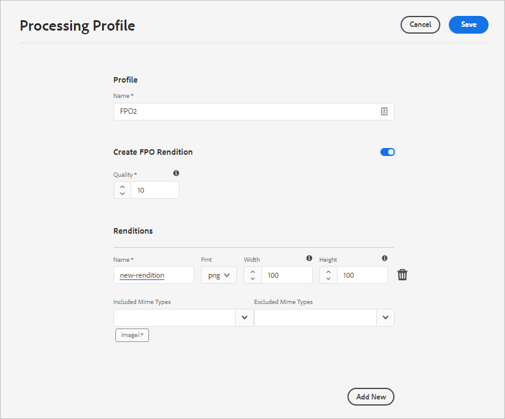
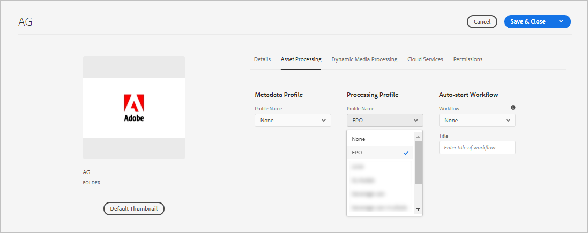

# Uitvoeringen alleen voor plaatsing genereren voor Adobe InDesign {#fpo-renditions}

| Versie | Artikelkoppeling |
| -------- | ---------------------------- |
| AEM 6.5 | [ klik hier ](https://experienceleague.adobe.com/en/docs/experience-manager-65/content/assets/administer/configure-fpo-renditions) |
| AEM as a Cloud Service | Dit artikel |

Wanneer het plaatsen van grote activa van Experience Manager in de documenten van Adobe InDesign, moet een creatieve beroeps op een aanzienlijke tijd wachten nadat zij [ activa ](https://helpx.adobe.com/indesign/using/placing-graphics.html) plaatsen. Ondertussen kan de gebruiker geen InDesign gebruiken. Dit onderbreekt de creatieve stroom en beïnvloedt de gebruikerservaring negatief. Met Adobe kunt u tijdelijk kleine uitvoeringen plaatsen in InDesign-documenten om mee te beginnen. Wanneer de uiteindelijke uitvoer vereist is, bijvoorbeeld voor drukwerk- en publicatieworkflows, vervangen de oorspronkelijke elementen met volledige resolutie de tijdelijke uitvoering op de achtergrond. Deze asynchrone update op de achtergrond versnelt het ontwerpproces om de productiviteit te verhogen en belemmert het creatieve proces niet.

Assets biedt uitvoeringen die alleen voor plaatsing worden gebruikt (FPO). Deze FPO-uitvoeringen hebben een kleine bestandsgrootte maar hebben dezelfde hoogte-breedteverhouding. Als een FPO-uitvoering niet beschikbaar is voor een element, gebruikt Adobe InDesign in plaats daarvan het oorspronkelijke element. Dit fallback-mechanisme zorgt ervoor dat de creatieve workflow zonder onderbrekingen doorgaat.

Experience Manager as a Cloud Service biedt mogelijkheden voor de native verwerking van bedrijfsmiddelen in de cloud om de FPO-uitvoeringen te genereren. Gebruik asset microservices voor het genereren van vertoningen. U kunt het genereren van vertoningen configureren van nieuw geüploade elementen en van de elementen die in Experience Manager aanwezig zijn.

Hier volgen de stappen voor het genereren van FPO-uitvoeringen:

1. [ creeer een verwerkingsprofiel ](#create-processing-profile).

1. Vorm Experience Manager om dit profiel te gebruiken [ nieuwe activa ](#generate-renditions-of-new-assets) verwerken.
1. Gebruik de profielen om [ bestaande activa ](#generate-renditions-of-existing-assets) te verwerken.

## Een verwerkingsprofiel maken {#create-processing-profile}

Als u FPO-uitvoeringen wilt genereren, maakt u een **[!UICONTROL Processing Profile]** . De profielen gebruiken cloud-native asset-microservices voor verwerking. Voor instructies, zie [ verwerkingsprofielen voor activa microservices ](asset-microservices-configure-and-use.md) creëren.

Selecteer **[!UICONTROL Create FPO Rendition]** om FPO-uitvoering te genereren. Klik indien nodig op **[!UICONTROL Add New]** om nog een renditie-instelling aan hetzelfde profiel toe te voegen.

## Uitvoeringen van nieuwe elementen genereren {#generate-renditions-of-new-assets}

Als u FPO-uitvoeringen van nieuwe elementen wilt genereren, past u de **[!UICONTROL Processing Profile]** toe op de map in mapeigenschappen. Klik op de pagina Eigenschappen van een map op de tab **[!UICONTROL Asset Processing]** , selecteer de **[!UICONTROL FPO profile]** as a **[!UICONTROL Processing Profile]** en sla de wijzigingen op. Alle nieuwe elementen die naar de map zijn geüpload, worden met dit profiel verwerkt.

## Uitvoeringen van bestaande elementen genereren {#generate-renditions-of-existing-assets}

Als u uitvoeringen wilt genereren, selecteert u de elementen en voert u de volgende stappen uit.

## FPO-uitvoeringen weergeven {#view-fpo-renditions}

U kunt controleren of de gegenereerde FPO-uitvoeringen zijn voltooid nadat de workflow is voltooid. Klik in de Experience Manager Assets-gebruikersinterface op het element om een grote voorvertoning te openen. Open het linkerspoor en selecteer **[!UICONTROL Renditions]**. U kunt ook de sneltoets `Alt + 3` gebruiken wanneer de voorvertoning is geopend.

Klik op **[!UICONTROL FPO rendition]** om de voorvertoning te laden. U kunt ook met de rechtermuisknop op de vertoning klikken en deze opslaan in uw bestandssysteem. Controleren op beschikbare uitvoeringen in de linkertrack.

**zie ook**

* [Assets vertalen](translate-assets.md)
* [ASSETS HTTP API](mac-api-assets.md)
* [Door Assets ondersteunde bestandsindelingen](file-format-support.md)
* [Zoeken in middelen](search-assets.md)
* [Verbonden elementen](use-assets-across-connected-assets-instances.md)
* [Elementen rapporteren](asset-reports.md)
* [Metagegevensschema&#39;s](metadata-schemas.md)
* [Elementen downloaden](download-assets-from-aem.md)
* [Metagegevens beheren](manage-metadata.md)
* [Zoeken in facetten](search-facets.md)
* [Verzamelingen beheren](manage-collections.md)
* [Bulkmetagegevens importeren](metadata-import-export.md)
* [Assets publiceren naar AEM en Dynamic Media](/help/assets/publish-assets-to-aem-and-dm.md)