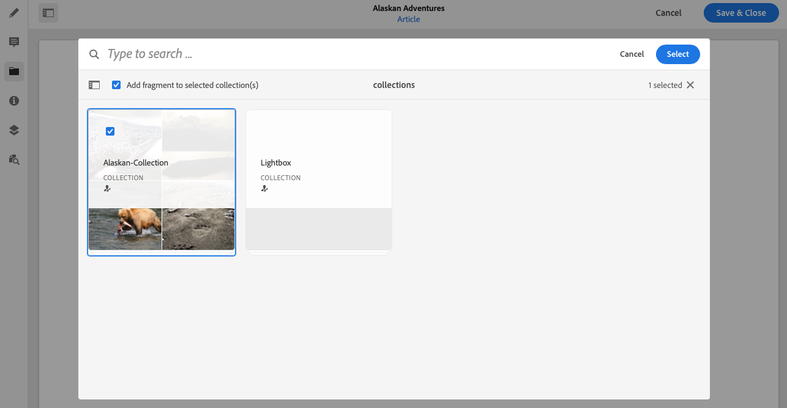

# Gekoppelde inhoud{#associated-content}

Gekoppelde inhoud biedt de verbinding, zodat elementen (d.w.z.) (optioneel) met het fragment kunnen worden gebruikt wanneer het aan een inhoudspagina wordt toegevoegd. Dit biedt flexibiliteit door een reeks elementen [beschikbaar te stellen die u kunt gebruiken wanneer u het inhoudsfragment op een pagina](/help/sites-cloud/authoring/fundamentals/content-fragments.md#using-associated-content)gebruikt, en tegelijk de tijd te verkorten die nodig is om naar het juiste element te zoeken.

## Gekoppelde inhoud toevoegen {#adding-associated-content}

>[!NOTE]
>
>Er zijn verschillende methoden om [visuele elementen (bijvoorbeeld afbeeldingen)](/help/assets/content-fragments/content-fragments.md#fragments-with-visual-assets) aan het fragment en/of de pagina toe te voegen.

Als u de koppeling wilt maken, moet u eerst uw media-elementen [toevoegen aan een verzameling](/help/assets/manage-collections.md). Daarna kunt u:

1. Open uw fragment en selecteer **Gekoppelde content** in het zijpaneel.

   

2. Selecteer **Inhoud koppelen** of **Verzameling koppelen** (afhankelijk van of verzamelingen al zijn gekoppeld of niet).
3. Selecteer de gewenste verzameling.

   U kunt optioneel het fragment zelf toevoegen aan de geselecteerde verzameling. dit is het volgen van hulpmiddelen .

   

4. Bevestig (met het vinkje). De verzameling wordt weergegeven als gekoppeld.

   

## Gekoppelde inhoud bewerken {#editing-associated-content}

Nadat u een verzameling hebt gekoppeld, kunt u:

* **Verwijder** de koppeling.
* **Voeg elementen** toe aan de verzameling.
* Selecteer een element voor verdere actie.
* Bewerk het element.
