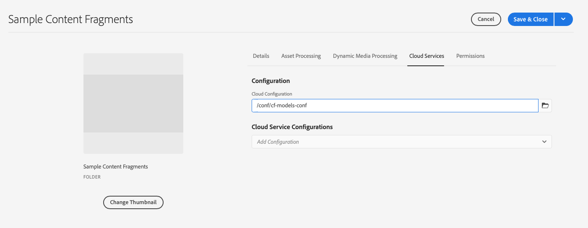

# Inhoudsfragmenten - Configuratiebrowser{#content-fragments-configuration-browser}

Leer hoe te om bepaalde functionaliteit van het Fragment van de Inhoud in Browser van de Configuratie toe te laten om AEM krachtige koploze leveringseigenschappen te gebruiken.

## Functionaliteit van inhoudsfragment inschakelen voor uw instantie {#enable-content-fragment-functionality-instance}

Alvorens Inhoudsfragmenten te gebruiken moet u **Browser van de Configuratie** gebruiken om toe te laten:

* **Modellen**  voor inhoudsfragmenten - verplicht
* **GrafiekQL Blijvende query** &#39;s - optioneel

>[!CAUTION]
>
>Als u **Content Fragment Models** niet inschakelt, is de optie **Create** niet beschikbaar voor het maken van nieuwe modellen.

Voor het inschakelen van de functionaliteit voor inhoudsfragmenten moet u:

* Het gebruik van de functionaliteit voor inhoudsfragmenten inschakelen via de configuratiesbrowser
* De configuratie toepassen op de map Middelen

### Functionaliteit van inhoudsfragment inschakelen in configuratiebrowser {#enable-content-fragment-functionality-in-configuration-browser}

Als u [bepaalde functionaliteit voor inhoudsfragmenten wilt gebruiken](#creating-a-content-fragment-model), moet u **must** eerst inschakelen via de **Configuratiebrowser**:

>[!NOTE]
>
>Zie ook [Configuration Browser:](/help/implementing/developing/introduction/configurations.md#using-configuration-browser) voor meer informatie.

>[!CAUTION]
>
>Subconfiguraties (een configuratie die in een configuratie is genest) worden niet ondersteund voor gebruik met Content Fragments.

1. Ga naar **Tools**, **Algemeen** en open vervolgens de **Browserconfiguratie**.

1. Gebruik **Maken** om het dialoogvenster te openen, waarin u:

   1. Geef een **Titel** op.
   1. Selecteer
      * **Modellen van contentfragmenten**
      * **GrafiekQL blijvende vragen**

      

1. Selecteer **Maken** om de definitie op te slaan.

<!-- 1. Select the location appropriate to your website. -->

### Pas de Configuratie op uw Omslag van Activa {#apply-the-configuration-to-your-assets-folder} toe

Wanneer de configuratie **global** is ingeschakeld voor de functionaliteit van inhoudsfragmenten, wordt deze vervolgens toegepast op elke map Assets.

Als u andere configuraties (dat wil zeggen exclusief globaal) wilt gebruiken met een vergelijkbare map met assets, moet u de verbinding definiëren. U doet dit door de juiste **Configuratie** te selecteren op het tabblad **Cloud Services** van de **Mapeigenschappen** van de juiste map.

