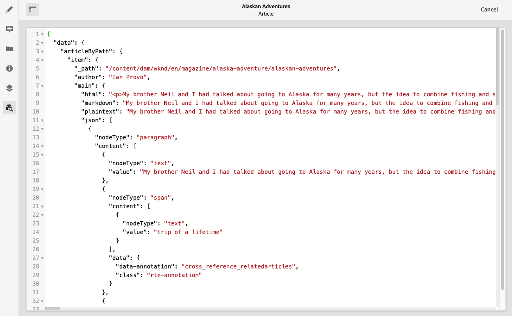

# Voorvertoning - JSON-representatie {#preview-json-representation}

Wanneer het ontwikkelen van de modellen voor de Fragmenten van de Inhoud als deel van uw AEM hoofdloze implementatie, zou u steekproefJSON output voor een inhoudsfragment kunnen willen bekijken, zoals die op een model wordt gebaseerd. Bijvoorbeeld om een idee te krijgen van hoe de definitieve output eruit zal zien. Dit kan handig zijn voor het valideren van de JSON-modelstructuur, bijvoorbeeld met standaardvoorbeeldinhoud per gegevenstype.

Met het pictogram **Voorvertoning**:

U kunt de JSON-weergave van het huidige fragment weergeven. Bijvoorbeeld:

