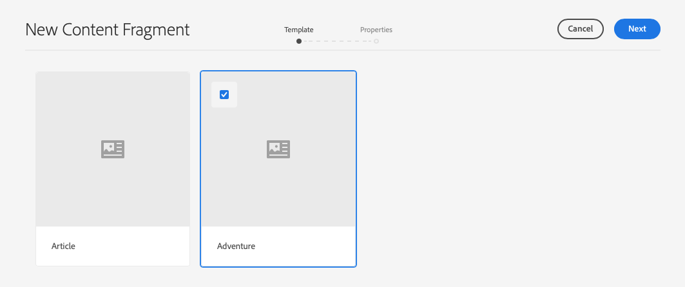
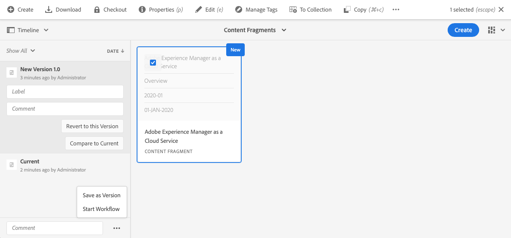
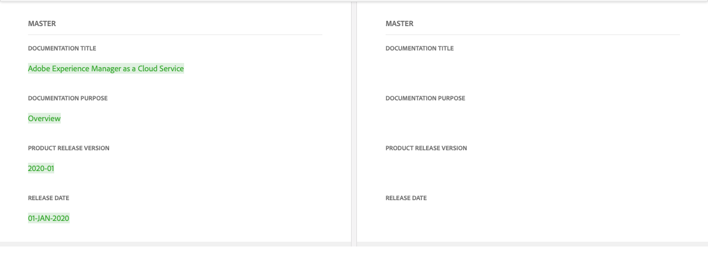

# Inhoudsfragmenten beheren{#managing-content-fragments}

Inhoudsfragmenten worden opgeslagen als **elementen**, zodat ze voornamelijk worden beheerd vanaf de **middelenconsole** .

>[!NOTE]
>
>Inhoudsfragmenten worden vervolgens gebruikt bij het ontwerpen van pagina&#39;s. Zie [Pagina&#39;s ontwerpen met inhoudsfragmenten](/help/sites-cloud/authoring/fundamentals/content-fragments.md).

## Inhoudsfragmenten maken {#creating-content-fragments}

### Een inhoudsmodel maken {#creating-a-content-model}

[U kunt contentfragmentmodellen](/help/assets/content-fragments/content-fragments-models.md) inschakelen en maken voordat u inhoudsfragmenten met gestructureerde inhoud maakt.

>[!NOTE]
>
>Zie Inhoudsfragmenten ontwikkelen voor meer informatie over sjablonen; worden gebruikt voor eenvoudige inhoudsfragmenten.

<!--
>[!NOTE]
>
>See [Developing Content Fragments](/help/sites-developing/customizing-content-fragments.md) for further information on templates; used for simple content fragments.
-->

### Een inhoudsfragment maken {#creating-a-content-fragment}

De methode voor het maken van een inhoudsfragment is (in principe) hetzelfde voor eenvoudige en gestructureerde fragmenten:

1. Navigeer naar de map **Middelen** waar u het fragment wilt maken.
2. Selecteer **Maken** en vervolgens **Inhoudsfragment** om de wizard te openen.
3. In de eerste stap van de wizard moet u de basis van het nieuwe fragment opgeven.

   * Dit kan een:

      * Sjabloon - bijvoorbeeld **Eenvoudig fragment**<!-- [Template](/help/sites-developing/content-fragment-templates.md) - for example **Simple Fragment** -->

      * [Model](/help/assets/content-fragments/content-fragments-models.md) - wordt gebruikt om een fragment tot stand te brengen dat gestructureerde inhoud vereist; bijvoorbeeld het model **Airports**
   * Alle beschikbare sjablonen en modellen worden weergegeven.
   Na selectie gebruikt u **Volgende** om door te gaan.

   

4. Geef in de stap **Eigenschappen** op:

   * **Basis**

      * **Titel**

         De fragmenttitel.

         Verplicht.

      * **Beschrijving**

      * **Tags**
   * **Geavanceerd**

      * **Naam**

         de naam; wordt gebruikt om de URL te vormen.

         Verplicht; wordt automatisch afgeleid van de titel, maar kan worden bijgewerkt.

5. Selecteer **Maken** om de actie te voltooien, dan of **Open** het fragment voor het uitgeven of terugkeer aan de console met **Gedaan**.

## Handelingen voor een inhoudsfragment {#actions-for-a-content-fragment}

In de **middelenconsole** is een reeks acties beschikbaar voor uw inhoudsfragmenten:

* van de werkbalk; nadat u het fragment hebt geselecteerd, zijn alle relevante handelingen beschikbaar.
* als [snelle acties](/help/sites-cloud/authoring/getting-started/basic-handling.md#quick-actions); een subset van acties beschikbaar voor de afzonderlijke fragmentkaarten.

Selecteer het fragment om de werkbalk weer te geven met de toepasselijke acties:

* **Maken**
* **Downloaden**

   * Sla het fragment op als een ZIP-bestand. U kunt definiëren of u Elements, Variaties, Metagegevens wilt opnemen.

* **Afhandeling**
* **Eigenschappen**

   * Hiermee kunt u de metagegevens van het fragment weergeven en/of bewerken.

* **Bewerken**

   * Hiermee kunt u het fragment [openen voor het bewerken van inhoud](/help/assets/content-fragments/content-fragments-variations.md) , samen met de elementen, variaties, bijbehorende inhoud en metagegevens.

* **Tags beheren**
* **Naar verzameling**

   * Voeg het fragment toe aan een verzameling.
   * Dit kan ook worden gedaan wanneer u een verzameling [aan het fragment](/help/assets/content-fragments/content-fragments-assoc-content.md#adding-associated-content)koppelt.

* **Kopiëren**/**plakken**

* **Verplaatsen**
* **Snel publiceren**
* **Publicatie beheren**
* **Verwijderen**

>[!NOTE]
>
>Veel van deze acties zijn [standaardhandelingen voor middelen](/help/assets/manage-digital-assets.md) en/of de [AEM-bureaubladtoepassing](https://helpx.adobe.com/experience-manager/desktop-app/aem-desktop-app.html).

## De fragmenteditor openen {#opening-the-fragment-editor}

Uw fragment openen voor bewerken:

<!--
>[!CAUTION]
>
>To edit a content fragment you need [the appropriate permissions](/help/sites-developing/customizing-content-fragments.md#asset-permissions). Please contact your system administrator if you are experiencing issues.
-->

>[!CAUTION]
>
>U hebt de juiste machtigingen nodig om een inhoudsfragment te bewerken. Neem contact op met de systeembeheerder als er problemen optreden.

1. Gebruik de **middelenconsole** om naar de locatie van het inhoudsfragment te navigeren.
2. Open het fragment voor bewerking door:

   * Klikken of tikken op de fragment- of fragmentkoppeling (dit is afhankelijk van de consoleweergave).
   * Selecteer het fragment en **bewerk** het vervolgens op de werkbalk.
   De fragmenteditor wordt geopend:

   

   >[!NOTE]
   >
   >1. Er wordt een bericht weergegeven wanneer al naar het fragment wordt verwezen op een inhoudspagina.
   >
   >
   >2. Het zijpaneel kan worden verborgen of weergegeven met het pictogram **Zijpaneel** in-/uitschakelen.

3. Navigeer door de drie modi met de pictogrammen in het zijpaneel:

   * Variaties: De inhoud  bewerken en de variaties [beheren](#creating-and-managing-variations-within-your-fragment)

   * [Annotaties](/help/assets/content-fragments/content-fragments-variations.md#annotating-a-content-fragment)
   * [Gekoppelde inhoud](#associating-content-with-your-fragment)
   * [Metagegevens](#viewing-and-editing-the-metadata-properties-of-your-fragment)
   

4. Nadat u wijzigingen hebt aangebracht, gebruikt u **Opslaan** of **Annuleren** .

   >[!NOTE]
   >
   >Zowel **Opslaan** als **Annuleren** sluit de editor af. Zie [Opslaan, Annuleren en Versies](#save-cancel-and-versions) voor volledige informatie over hoe beide opties werken voor inhoudsfragmenten.

## Opslaan, Annuleren en versies {#save-cancel-and-versions}

>[!NOTE]
>
>Versies kunnen ook worden [gemaakt, vergeleken en teruggezet vanaf de tijdlijn](/help/assets/content-fragments/content-fragments-managing.md#timeline-for-content-fragments).

De editor heeft twee opties:

* **Opslaan**

   Hiermee slaat u de laatste wijzigingen op en sluit u de editor af.

   >[!CAUTION]
   >
   >U hebt de juiste machtigingen nodig om een inhoudsfragment te bewerken. Neem contact op met de systeembeheerder als er problemen optreden.

   <!-- 
  >[!CAUTION]
  >
  >To edit a content fragment you need [the appropriate permissions](/help/sites-developing/customizing-content-fragments.md#asset-permissions). Please contact your system administrator if you are experiencing issues. 
  -->

   >[!NOTE]
   >
   >Het is mogelijk om in de redacteur te blijven, makend een reeks veranderingen, alvorens **sparen** te selecteren.

   >[!CAUTION]
   >
   >Naast het eenvoudig opslaan van uw wijzigingen, werkt **sparen** ook om het even welke verwijzingen bij en zorgt ervoor dat de verzender zoals vereist wordt gespoeld. Deze wijzigingen kunnen enige tijd in beslag nemen. Hierdoor kan de prestaties van een groot/complex/zwaar geladen systeem worden beïnvloed.
   >
   >
   >Houd hier rekening mee wanneer u **Opslaan** gebruikt en vervolgens snel de fragmenteditor ingaat om verdere wijzigingen aan te brengen en op te slaan.

* **Annuleren**

   Sluit de editor af zonder de laatste wijzigingen op te slaan.

Tijdens het bewerken van het inhoudsfragment maakt AEM automatisch versies om ervoor te zorgen dat eerdere inhoud kan worden hersteld als u de wijzigingen **annuleert** :

1. Wanneer een inhoudsfragment wordt geopend voor het bewerken van AEM, wordt gecontroleerd op het bestaan van een token op basis van cookies dat aangeeft of een *bewerkingssessie* bestaat:

   1. Als het token wordt gevonden, wordt het fragment beschouwd als onderdeel van de bestaande bewerkingssessie.
   2. Als het token *niet* beschikbaar is en de gebruiker begint met het bewerken van inhoud, wordt een versie gemaakt en wordt een token voor deze nieuwe bewerkingssessie verzonden naar de client, waar deze wordt opgeslagen in een cookie.

2. Terwijl er een *actieve* bewerkingssessie is, wordt de inhoud die wordt bewerkt automatisch om de 600 seconden opgeslagen (standaard).

   >[!NOTE]
   >
   >Het auto sparen interval is configureerbaar gebruikend het `/conf` mechanisme.
   >
   >Standaardwaarde, zie:
   >  `/libs/settings/dam/cfm/jcr:content/autoSaveInterval`

3. Als de gebruiker ervoor kiest de bewerking te **annuleren** , wordt de versie die aan het begin van de bewerkingssessie is gemaakt, hersteld en wordt het token verwijderd om de bewerkingssessie te beëindigen.
4. Als de gebruiker de bewerkingen **opslaat** , blijven de bijgewerkte elementen/variaties behouden en wordt het token verwijderd om de bewerkingssessie te beëindigen.

## De inhoud van het fragment bewerken {#editing-the-content-of-your-fragment}

Nadat u het fragment hebt geopend, kunt u het tabblad [Variaties](/help/assets/content-fragments/content-fragments-variations.md) gebruiken om de inhoud te ontwerpen.

## Variaties maken en beheren in uw fragment {#creating-and-managing-variations-within-your-fragment}

Als u de inhoud van het stramien hebt gemaakt, kunt u [Variaties](/help/assets/content-fragments/content-fragments-variations.md) van die inhoud maken en beheren.

## Inhoud koppelen aan uw fragment {#associating-content-with-your-fragment}

U kunt inhoud [ook](/help/assets/content-fragments/content-fragments-assoc-content.md) aan een fragment koppelen. Dit biedt een verbinding zodat elementen (d.w.z. afbeeldingen) (optioneel) met het fragment kunnen worden gebruikt wanneer het aan een inhoudspagina wordt toegevoegd.

## De metagegevens (eigenschappen) van het fragment weergeven en bewerken {#viewing-and-editing-the-metadata-properties-of-your-fragment}

U kunt de eigenschappen van een fragment weergeven en bewerken met het tabblad [Metagegevens](/help/assets/content-fragments/content-fragments-metadata.md) .

## Tijdlijn voor inhoudsfragmenten {#timeline-for-content-fragments}

Naast de standaardopties biedt de [tijdlijn](/help/assets/manage-digital-assets.md#timeline) zowel informatie als handelingen die specifiek zijn voor inhoudsfragmenten:

* Informatie weergeven over versies, opmerkingen en annotaties
* Handelingen voor versies

   * **[Terugkeren naar deze versie](#reverting-to-a-version)**(selecteer een bestaand fragment en selecteer vervolgens een specifieke versie)

   * **[Vergelijken met huidige](#comparing-fragment-versions)**versie (selecteer een bestaand fragment en selecteer vervolgens een specifieke versie)

   * Voeg een **Label** en/of **Commentaar** toe (selecteer een bestaand fragment, dan een specifieke versie)

   * **Opslaan als versie** (selecteer een bestaand fragment en klik vervolgens op de pijl omhoog onder aan de tijdlijn)

* Handelingen voor annotaties

   * **Verwijderen**

>[!NOTE]
Opmerkingen zijn:
* Standaardfunctionaliteit voor alle elementen
* Gemaakt in tijdlijn
* Verwant aan het fragmentelement

Annotaties (voor inhoudsfragmenten) zijn:
* Opgegeven in de fragmenteditor
* Specifiek voor een geselecteerd tekstsegment binnen het fragment

Bijvoorbeeld:

## Fragmentversies vergelijken {#comparing-fragment-versions}

De actie **Vergelijken met huidig** is beschikbaar bij de [Chronologie](/help/assets/content-fragments/content-fragments-managing.md#timeline-for-content-fragments) nadat u een specifieke versie hebt geselecteerd.

Hiermee wordt het volgende geopend:

* de **huidige** (laatste) versie (links)

* de geselecteerde versie **v&lt;*x.y*>** (rechts)

Zij worden naast elkaar weergegeven, waarbij:

* Eventuele verschillen worden gemarkeerd

   * Verwijderde tekst - rood
   * Ingevoegde tekst - groen
   * Vervangen tekst - blauw

* Met het pictogram voor volledig scherm kunt u elke versie afzonderlijk openen. dan terug naar de parallelle weergave
* U kunt de specifieke versie **herstellen**
* **Done** will return you to the console

>[!NOTE]
U kunt de fragmentinhoud niet bewerken wanneer u fragmenten vergelijkt.

## Een versie herstellen {#reverting-to-a-version}

U kunt terugkeren naar een specifieke versie van het fragment:

* Rechtstreeks vanuit de [tijdlijn](/help/assets/content-fragments/content-fragments-managing.md#timeline-for-content-fragments).

   Selecteer de gewenste versie en kies **Vorige versie** .

* Wanneer u een versie [vergelijkt met de huidige versie](/help/assets/content-fragments/content-fragments-managing.md#comparing-fragment-versions) , kunt u de geselecteerde versie **herstellen** .

## Een fragment publiceren en ernaar verwijzen {#publishing-and-referencing-a-fragment}

>[!CAUTION]
Als het fragment op een model is gebaseerd, moet u ervoor zorgen dat het [model is gepubliceerd](/help/assets/content-fragments/content-fragments-models.md#publishing-a-content-fragment-model).
Als u een inhoudsfragment publiceert waarvoor het model nog niet is gepubliceerd, wordt dit in een selectielijst aangegeven en wordt het model met het fragment gepubliceerd.

Inhoudsfragmenten moeten worden gepubliceerd voor gebruik in de publicatieomgeving. Zij kunnen worden gepubliceerd:

* Na de aanmaak; vanuit de **middelenconsole** .
* Wanneer u een pagina [publiceert die het fragment](/help/sites-cloud/authoring/fundamentals/content-fragments.md#publishing)gebruikt; het fragment wordt weergegeven in de paginaverwijzingen.

>[!CAUTION]
Nadat een fragment is gepubliceerd en/of waarnaar wordt verwezen, geeft AEM een waarschuwing weer wanneer een auteur het fragment opent voor opnieuw bewerken. Hiermee wordt u gewaarschuwd dat wijzigingen in het fragment ook van invloed zijn op de pagina&#39;s waarnaar wordt verwezen.

## Een fragment verwijderen {#deleting-a-fragment}

Een fragment verwijderen:

1. Navigeer in de **middelenconsole** naar de locatie van het inhoudsfragment.
2. Selecteer het fragment.

   >[!NOTE]
   De handeling **Verwijderen** is niet beschikbaar als een snelle handeling.

3. Selecteer **Verwijderen** op de werkbalk.
4. Bevestig de actie **Verwijderen** .

   >[!CAUTION]
   Als er al naar het fragment wordt verwezen op een pagina, wordt er een waarschuwingsbericht weergegeven en moet u bevestigen dat u wilt doorgaan met een **Force Delete**. Het fragment wordt samen met de bijbehorende component voor inhoudsfragmenten verwijderd uit alle inhoudspagina&#39;s.
