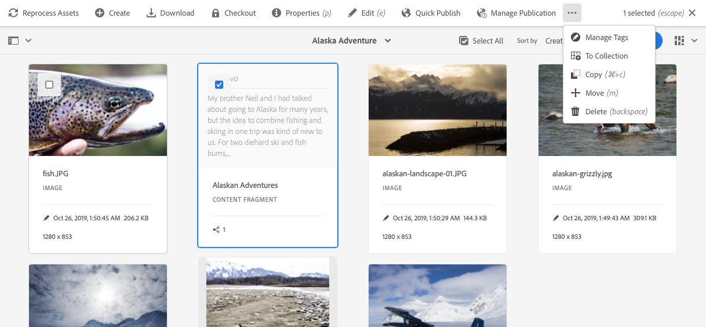

# Contentfragmenten beheren {#managing-content-fragments}

Leer hoe u de middelenconsole kunt gebruiken om uw AEM inhoudsfragmenten, de basis van uw inhoud zonder kop, te beheren.

Inhoudsfragmenten worden opgeslagen als **Elementen**, zodat ze primair worden beheerd vanuit de **Assets**-console.

>[!NOTE]
>
>Inhoudsfragmenten kunnen worden gebruikt:
>
>* bij het ontwerpen van pagina&#39;s; zie [Pagina-authoring met inhoudfragmenten](/help/sites-cloud/authoring/fundamentals/content-fragments.md).
>* voor [Koploze inhoudslevering met behulp van inhoudsfragmenten met GraphQL](/help/assets/content-fragments/content-fragments-graphql.md).

## Inhoudsfragmenten {#creating-content-fragments} maken

### Een inhoudsmodel maken {#creating-a-content-model}

[U kunt ](/help/assets/content-fragments/content-fragments-models.md) contentfragmentmodellen inschakelen en maken voordat u inhoudsfragmenten met gestructureerde inhoud maakt.

### Een inhoudsfragment {#creating-a-content-fragment} maken

De methode voor het maken van een inhoudsfragment is:

1. Ga naar de map **Assets** waar u het fragment wilt maken.
1. Selecteer **Maken** en vervolgens **Inhoudsfragment** om de wizard te openen.
1. In de eerste stap van de wizard moet u de basis van het nieuwe fragment opgeven.

   * [Model](/help/assets/content-fragments/content-fragments-models.md)  - gebruikt om een fragment tot stand te brengen dat gestructureerde inhoud vereist; bijvoorbeeld het  **** Adventuremodel

      * Alle beschikbare modellen worden weergegeven.

   Na selectie gebruikt u **Volgende** om door te gaan.

   

1. Geef in de stap **Eigenschappen** het volgende op:

   * **Basis**

      * **Titel**

         De fragmenttitel.

         Verplicht.

      * **Beschrijving**

      * **Tags**
   * **Geavanceerd**

      * **Naam**

         de naam; wordt gebruikt om de URL te vormen.

         Verplicht; wordt automatisch afgeleid van de titel, maar kan worden bijgewerkt.

1. Selecteer **Maken** om de actie te voltooien en **open** vervolgens het fragment voor het bewerken of keer terug naar de console met **Gereed**.

   >[!NOTE]
   >In de modus **List** van de console kunt u de **View Settings** bijwerken om de kolom **Content Fragment Model** in te schakelen.

## Handelingen voor een inhoudsfragment in de middelenconsole {#actions-for-a-content-fragment-assets-console}

In de **Assets** console is een reeks acties beschikbaar voor uw inhoudsfragmenten, of:

* van de werkbalk; nadat u het fragment hebt geselecteerd, zijn alle relevante handelingen beschikbaar.
* Als [snelle acties](/help/sites-cloud/authoring/getting-started/basic-handling.md#quick-actions); een subset van acties beschikbaar voor de afzonderlijke fragmentkaarten.

Selecteer het fragment om de werkbalk weer te geven met de toepasselijke acties:

* **Elementen opnieuw verwerken**
* **Maken**
* **Downloaden**

   * Sla het fragment op als een ZIP-bestand. U kunt definiëren of u Elements, Variaties, Metagegevens wilt opnemen.

* **Afhandeling**
* **Eigenschappen**

   * Hiermee kunt u de metagegevens van het fragment weergeven en/of bewerken.

* **Bewerken**

   * Hiermee kunt u het fragment [openen voor het bewerken van inhoud](/help/assets/content-fragments/content-fragments-variations.md) samen met de elementen, variaties, bijbehorende inhoud en metagegevens.

* **Snel publiceren**
* **Publicatie beheren**
* **Tags beheren**
* **Naar verzameling**
* **Kopiëren**  (en  **Plakken**)
* **Verplaatsen**
* **Verwijderen**

>[!NOTE]
>
>Veel hiervan zijn [standaardhandelingen voor elementen](/help/assets/manage-digital-assets.md) en/of de [AEM-bureaubladtoepassing](https://helpx.adobe.com/experience-manager/desktop-app/aem-desktop-app.html).

## De fragmenteditor openen {#opening-the-fragment-editor}

Uw fragment openen voor bewerken:

>[!CAUTION]
>
>Als u een inhoudsfragment wilt bewerken, hebt u [de juiste machtigingen](/help/implementing/developing/extending/content-fragments-customizing.md#asset-permissions) nodig. Neem contact op met de systeembeheerder als er problemen optreden.

>[!CAUTION]
>
>U hebt de juiste machtigingen nodig om een inhoudsfragment te bewerken. Neem contact op met de systeembeheerder als er problemen optreden.

1. Met de console **Middelen** kunt u naar de locatie van het inhoudsfragment navigeren.
1. Open het fragment voor bewerking door:

   * Klikken of tikken op de fragment- of fragmentkoppeling (dit is afhankelijk van de consoleweergave).
   * Selecteer het fragment en **Bewerk** op de werkbalk.

1. De fragmenteditor wordt geopend. Breng de gewenste wijzigingen aan:

   

1. Nadat u wijzigingen hebt aangebracht, gebruikt u **Opslaan en sluiten** of **Annuleren** naar wens.

   >[!NOTE]
   >
   >Zowel **Opslaan en sluiten** als **Annuleren** sluiten de editor af. Zie [Opslaan, Annuleren en Versies](#save-cancel-and-versions) voor volledige informatie over hoe beide opties werken voor inhoudsfragmenten.

## Modi en handelingen in de Inhoudsfragmenteditor {#modes-actions-content-fragment-editor}

Er zijn verschillende modi en acties beschikbaar in de Inhoudsfragmenteditor.

### Modi in de Inhoudsfragmenteditor {#modes-in-the-content-fragment-editor}

Navigeer door de verschillende modi met de pictogrammen in het zijpaneel:

* Variaties: [De inhoud bewerken](#editing-the-content-of-your-fragment) en [De variaties beheren](#creating-and-managing-variations-within-your-fragment)

* [Annotaties](/help/assets/content-fragments/content-fragments-variations.md#annotating-a-content-fragment)
* [Gekoppelde inhoud](#associating-content-with-your-fragment)
* [Metagegevens](#viewing-and-editing-the-metadata-properties-of-your-fragment)
* [Boomstructuur](/help/assets/content-fragments/content-fragments-structure-tree.md)
* [Voorvertoning](/help/assets/content-fragments/content-fragments-json-preview.md)

### Werkbalkhandelingen in de Inhoudsfragmenteditor {#toolbar-actions-in-the-content-fragment-editor}

Sommige functies in de bovenste werkbalk zijn beschikbaar in meerdere modi:

* Er wordt een bericht weergegeven wanneer al naar het fragment wordt verwezen op een inhoudspagina. U kunt **Close** het bericht.

* Het zijpaneel kan worden verborgen/getoond gebruikend **Kneep van de Kant** pictogram.

* Onder de fragmentnaam ziet u de naam van het [Content Fragment Model](/help/assets/content-fragments/content-fragments-models.md) dat wordt gebruikt voor het maken van het huidige fragment:

   * De naam is ook een verbinding die de modelredacteur zal openen.

* Zie de status van het fragment; bijvoorbeeld informatie over het tijdstip waarop deze is gemaakt, gewijzigd of gepubliceerd. De status heeft ook een kleurcode:

   * **Nieuw**: grijs
   * **Concept**: blauw
   * **Gepubliceerd**: groen
   * **Gewijzigd**: oranje
   * **gedeactiveerd**: rood

* De drie puntjes (**..**) biedt toegang tot extra handelingen:
   * **[Snel publiceren](#publishing-and-referencing-a-fragment)**
   * **[Publicatie beheren](#publishing-and-referencing-a-fragment)**

## Opslaan, annuleren en versies {#save-cancel-and-versions}

>[!NOTE]
>
>Versies kunnen ook [worden gemaakt, vergeleken en teruggezet vanaf de tijdlijn](/help/assets/content-fragments/content-fragments-managing.md#timeline-for-content-fragments).

De editor heeft twee opties:

* **Opslaan**

   Hiermee slaat u de laatste wijzigingen op en sluit u de editor af.

   >[!CAUTION]
   >
   >Als u een inhoudsfragment wilt bewerken, hebt u [de juiste machtigingen](/help/implementing/developing/extending/content-fragments-customizing.md#asset-permissions) nodig. Neem contact op met de systeembeheerder als er problemen optreden.

   >[!NOTE]
   >
   >Het is mogelijk om in de redacteur te blijven, makend een reeks veranderingen, alvorens **sparen** te selecteren.

   >[!CAUTION]
   >
   >Naast het eenvoudig opslaan van uw veranderingen, **sparen** werkt ook om het even welke verwijzingen bij en zorgt ervoor dat de Dispatcher zoals vereist wordt gespoeld. Deze wijzigingen kunnen enige tijd in beslag nemen. Hierdoor kan de prestaties van een groot/complex/zwaar geladen systeem worden beïnvloed.
   >
   >
   >Houd hier rekening mee wanneer u **Opslaan** gebruikt en vervolgens snel de fragmenteditor invoert om verdere wijzigingen aan te brengen en op te slaan.

* **Annuleren**

   Sluit de editor af zonder de laatste wijzigingen op te slaan.

Tijdens het bewerken van het inhoudsfragment AEM automatisch versies worden gemaakt om ervoor te zorgen dat eerdere inhoud kan worden hersteld als u uw wijzigingen **Annuleren**:

1. Wanneer een inhoudsfragment wordt geopend voor het bewerken AEM controleert u op het bestaan van het op cookies gebaseerde token dat aangeeft of een *bewerksessie* bestaat:

   1. Als het token wordt gevonden, wordt het fragment beschouwd als onderdeel van de bestaande bewerkingssessie.
   2. Als het token *niet* beschikbaar is en de gebruiker begint met het bewerken van inhoud, wordt een versie gemaakt en wordt een token voor deze nieuwe bewerkingssessie naar de client verzonden, waar deze wordt opgeslagen in een cookie.

2. Terwijl er een *actieve* het uitgeven zitting is, wordt de inhoud die automatisch bewaard om de 600 seconden (gebrek) wordt uitgegeven.

   >[!NOTE]
   >
   >Het auto sparen interval is configureerbaar gebruikend het `/conf` mechanisme.
   >
   >Standaardwaarde, zie:
   >  `/libs/settings/dam/cfm/jcr:content/autoSaveInterval`

3. Als de gebruiker de bewerking **Annuleren** selecteert, wordt de versie die aan het begin van de bewerkingssessie is gemaakt, hersteld en wordt het token verwijderd om de bewerkingssessie te beëindigen.
4. Als de gebruiker de bewerkingen **Opslaan** selecteert, blijven de bijgewerkte elementen/variaties behouden en wordt het token verwijderd om de bewerkingssessie te beëindigen.

## De inhoud van het fragment {#editing-the-content-of-your-fragment} bewerken

Nadat u het fragment hebt geopend, kunt u het tabblad [Variaties](/help/assets/content-fragments/content-fragments-variations.md) gebruiken om de inhoud te ontwerpen.

## Variaties maken en beheren in het fragment {#creating-and-managing-variations-within-your-fragment}

Als u de Master inhoud hebt gemaakt, kunt u [Variaties](/help/assets/content-fragments/content-fragments-variations.md) van die inhoud maken en beheren.

## Inhoud koppelen aan uw fragment {#associating-content-with-your-fragment}

U kunt ook [inhoud](/help/assets/content-fragments/content-fragments-assoc-content.md) aan een fragment koppelen. Dit biedt een verbinding zodat elementen (d.w.z. afbeeldingen) (optioneel) met het fragment kunnen worden gebruikt wanneer het aan een inhoudspagina wordt toegevoegd.

## De metagegevens (eigenschappen) van het fragment {#viewing-and-editing-the-metadata-properties-of-your-fragment} weergeven en bewerken

U kunt de eigenschappen van een fragment weergeven en bewerken met het tabblad [Metagegevens](/help/assets/content-fragments/content-fragments-metadata.md).

## Tijdlijn voor inhoudsfragmenten {#timeline-for-content-fragments}

Naast de standaardopties biedt [Timeline](/help/assets/manage-digital-assets.md#timeline) zowel informatie als acties die specifiek zijn voor inhoudsfragmenten:

* Informatie weergeven over versies, opmerkingen en annotaties
* Handelingen voor versies

   * **[Terugkeren naar deze versie](#reverting-to-a-version)**  (selecteer een bestaand fragment en selecteer vervolgens een specifieke versie)

   * **[Vergelijken met huidige](#comparing-fragment-versions)**  versie (selecteer een bestaand fragment en selecteer vervolgens een specifieke versie)

   * Een **Label** en/of **Opmerking** toevoegen (selecteer een bestaand fragment en selecteer vervolgens een specifieke versie)

   * **Opslaan als versie**  (selecteer een bestaand fragment en klik vervolgens op de pijl omhoog onder aan de tijdlijn)

* Handelingen voor annotaties

   * **Verwijderen**

>[!NOTE]
Opmerkingen zijn:
* Standaardfunctionaliteit voor alle elementen
* Gemaakt in tijdlijn
* Verwant aan het fragmentelement

Annotaties (voor inhoudsfragmenten) zijn:
* Opgegeven in de fragmenteditor
* Specifiek voor een geselecteerd tekstsegment binnen het fragment

Bijvoorbeeld:

## Fragmentversies vergelijken {#comparing-fragment-versions}

De **Vergelijken met Huidige** actie is beschikbaar bij [Chronologie](/help/assets/content-fragments/content-fragments-managing.md#timeline-for-content-fragments) nadat u een specifieke versie hebt geselecteerd.

Hiermee wordt het volgende geopend:

* de **Huidige** (laatste) versie (links)

* de geselecteerde versie **v&lt;*x.y*** (rechts)

Zij worden naast elkaar weergegeven, waarbij:

* Eventuele verschillen worden gemarkeerd

   * Verwijderde tekst - rood
   * Ingevoegde tekst - groen
   * Vervangen tekst - blauw

* Met het pictogram voor volledig scherm kunt u elke versie afzonderlijk openen. dan terug naar de parallelle weergave
* U kunt **Terugkeren** naar de specifieke versie
* **** Donewill return you to the console

>[!NOTE]
U kunt de fragmentinhoud niet bewerken wanneer u fragmenten vergelijkt.

## Terugkeren naar een versie {#reverting-to-a-version}

U kunt terugkeren naar een specifieke versie van het fragment:

* Rechtstreeks vanuit de [tijdlijn](/help/assets/content-fragments/content-fragments-managing.md#timeline-for-content-fragments).

   Selecteer de vereiste versie en kies vervolgens de handeling **Terugkeren naar deze versie**.

* Terwijl [het vergelijken van een versie aan de huidige versie](/help/assets/content-fragments/content-fragments-managing.md#comparing-fragment-versions) kunt u **terugkeren** aan de geselecteerde versie.

## Een fragment {#publishing-and-referencing-a-fragment} publiceren en ernaar verwijzen

>[!CAUTION]
Als het fragment op een model is gebaseerd, moet u ervoor zorgen dat het [model is gepubliceerd](/help/assets/content-fragments/content-fragments-models.md#publishing-a-content-fragment-model).
Als u een inhoudsfragment publiceert waarvoor het model nog niet is gepubliceerd, wordt dit in een selectielijst aangegeven en wordt het model met het fragment gepubliceerd.

Inhoudsfragmenten moeten worden gepubliceerd voor gebruik in de publicatieomgeving. Zij kunnen worden gepubliceerd:

* Na de aanmaak; het gebruiken van [acties beschikbaar in de console van Activa](#actions-for-a-content-fragment-assets-console).
* Vanuit de [Inhoudsfragmenteditor](#toolbar-actions-in-the-content-fragment-editor).
* Wanneer u [een pagina publiceert die het fragment](/help/sites-cloud/authoring/fundamentals/content-fragments.md#publishing) gebruikt; het fragment wordt weergegeven in de paginaverwijzingen.

>[!CAUTION]
Nadat een fragment is gepubliceerd en/of waarnaar wordt verwezen, geeft AEM een waarschuwing weer wanneer een auteur het fragment opent om opnieuw te bewerken. Hiermee wordt u gewaarschuwd dat wijzigingen in het fragment ook van invloed zijn op de pagina&#39;s waarnaar wordt verwezen.

## Een fragment {#deleting-a-fragment} verwijderen

Een fragment verwijderen:

1. Navigeer in de **Assets**-console naar de locatie van het inhoudsfragment.
2. Selecteer het fragment.

   >[!NOTE]
   De handeling **Delete** is niet beschikbaar als een snelle handeling.

3. Selecteer **Delete** van de toolbar.
4. Bevestig de handeling **Delete**.

   >[!CAUTION]
   Als er al naar het fragment wordt verwezen op een pagina, wordt er een waarschuwingsbericht weergegeven en moet u bevestigen dat u wilt doorgaan met **Verwijderen forceren**. Het fragment wordt samen met de bijbehorende component voor contentfragmenten uit alle contentpagina&#39;s verwijderd.
