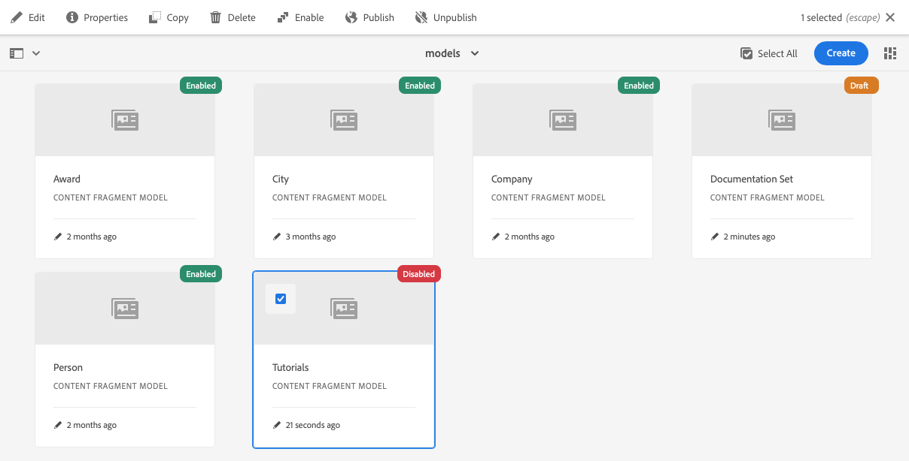

# Modellen van contentfragmenten {#content-fragment-models}

Content Fragment Models in AEM definiëren de structuur van inhoud voor uw [inhoudsfragmenten,](/help/assets/content-fragments/content-fragments.md) dient als basis voor uw inhoud zonder kop.

U kunt als volgt modellen van inhoudsfragmenten gebruiken:

1. [Functionaliteit van inhoudsfragmentmodel inschakelen voor uw instantie](/help/assets/content-fragments/content-fragments-configuration-browser.md)
1. [Maak](#creating-a-content-fragment-model) en  [configureer](#defining-your-content-fragment-model) uw modellen van inhoudsfragmenten
1. [Schakel ](#enabling-disabling-a-content-fragment-model) Modellen van inhoudsfragmenten in voor gebruik bij het maken van inhoudsfragmenten
1. [Sta uw Modellen van het Fragment van de Inhoud op de vereiste ](#allowing-content-fragment-models-assets-folder) omslagen van Activa toe door  **Beleid** te vormen.

## Een inhoudsfragmentmodel maken {#creating-a-content-fragment-model}

1. Navigeer naar **Tools**, **Assets** en open **Content Fragment Models**.
1. Navigeer naar de map die geschikt is voor uw [configuratie](/help/assets/content-fragments/content-fragments-configuration-browser.md).
1. Gebruik **Create** om de wizard te openen.

   >[!CAUTION]
   >
   >Als het [gebruik van inhoudsfragmentmodellen niet is ingeschakeld](/help/assets/content-fragments/content-fragments-configuration-browser.md), is de optie **Maken** niet beschikbaar.

1. Geef de **modeltitel** op. U kunt ook **Codes**, een **Beschrijving** toevoegen en **Model** inschakelen om het model ](#enabling-disabling-a-content-fragment-model) indien nodig in te schakelen.[

   

1. Gebruik **Maken** om het lege model op te slaan. Een bericht zal op het succes van de actie wijzen, kunt u **Open** selecteren om het model onmiddellijk uit te geven, of **Done** om aan de console terug te keren.

## Het inhoudsfragmentmodel {#defining-your-content-fragment-model} definiëren

Het inhoudsfragmentmodel definieert effectief de structuur van de resulterende inhoudsfragmenten met behulp van een selectie van **[Gegevenstypen](#data-types)**. Gebruikend de modelredacteur kunt u instanties van de gegevenstypes toevoegen, dan hen vormen om de vereiste gebieden tot stand te brengen:

>[!CAUTION]
>
>Het bewerken van een bestaand inhoudsfragmentmodel kan invloed hebben op afhankelijke fragmenten.

1. Navigeer naar **Tools**, **Assets** en open **Content Fragment Models**.

1. Navigeer naar de map met het fragmentmodel van de inhoud.
1. Open het vereiste model voor **Edit**; gebruik de snelle actie of selecteer het model en de actie op de werkbalk.

   Zodra open de modelredacteur toont:

   * links: velden al gedefinieerd
   * rechts: **datatypen** voor het maken van velden (en **eigenschappen** voor gebruik als er velden zijn gemaakt)

   >[!NOTE]
   >
   >Als een veld **Vereist** is, wordt het **label** in het linkerdeelvenster gemarkeerd met een sterretje (*****).

   

1. **Een veld toevoegen**

   * Sleep een vereist gegevenstype naar de vereiste locatie voor een veld:

      

   * Nadat een veld aan het model is toegevoegd, wordt in het rechterdeelvenster **Eigenschappen** weergegeven die voor dat specifieke gegevenstype kunnen worden gedefinieerd. Hier kunt u definiëren wat voor dat veld is vereist.

      * Vele eigenschappen zijn duidelijk, voor extra details zie [Eigenschappen](#properties).
      * Als u een **Veld Label** typt, wordt de **Eigenschapnaam** automatisch aangevuld; als deze naam leeg is, kan de tag achteraf handmatig worden bijgewerkt.

      Bijvoorbeeld:

      


1. **Een veld verwijderen**

   Selecteer het gewenste veld en klik op het pictogram van de prullenbak of tik erop. U wordt gevraagd de actie te bevestigen.

   

1. Voeg alle vereiste velden toe en definieer de bijbehorende eigenschappen, zoals vereist. Bijvoorbeeld:

   

1. Selecteer **Opslaan** om de definitie te behouden.

## Gegevenstypen {#data-types}

Voor het definiëren van uw model zijn verschillende gegevenstypen beschikbaar:

* **Tekst met één regel**
   * Voeg een of meer velden van één regel tekst toe. de maximumlengte kan worden bepaald
* **Tekst met meerdere regels**
   * Een tekstgebied dat RTF-tekst, normale tekst of markeringen kan bevatten
* **Getal**
   * Een of meer numerieke velden toevoegen
* **Boolean**
   * Een Booleaans selectievakje toevoegen
* **Datum en tijd**
   * Een datum en/of tijd toevoegen
* **Opsomming**
   * Een set selectievakjes, keuzerondjes of vervolgkeuzelijsten toevoegen
* **Tags**
   * Hiermee kunnen auteurs van fragmenten gebieden met tags openen en selecteren
* **Content Reference**
   * verwijzingen naar andere inhoud, ongeacht het type; kan worden gebruikt om [geneste inhoud te maken](#using-references-to-form-nested-content)
* **Fragmentverwijzing**
   * Verwijzingen naar andere inhoudsfragmenten; kan worden gebruikt om [geneste inhoud te maken](#using-references-to-form-nested-content)
   * Het gegevenstype kan worden geconfigureerd om fragmentauteurs toe te staan:
      * Bewerk het fragment waarnaar wordt verwezen rechtstreeks.
      * Een nieuw inhoudsfragment maken op basis van het juiste model
* **JSON-object**
   * Hiermee kan de auteur van het inhoudsfragment JSON-syntaxis invoeren in de overeenkomende elementen van een fragment.
      * Om AEM toe te staan direct JSON op te slaan die u van een andere dienst hebt gekopieerd/gekleefd.
      * De JSON wordt doorgegeven en uitvoer als JSON in GraphQL.
      * Neemt JSON-syntaxismarkering, automatisch aanvullen en foutmarkering op in de inhoudsfragmenteditor.

## Eigenschappen {#properties}

Vele eigenschappen zijn voor zichzelf verklarend, voor bepaalde eigenschappen zijn hieronder meer details te vinden:

* **Render**
AsThe diverse opties voor het realiseren/renderen van het veld in een fragment. Hierdoor kunt u vaak definiëren of de auteur één exemplaar van het veld ziet of meerdere exemplaren mag maken.

* **Veld**
LabelEnter 
**Met** veldlabel wordt automatisch een  **eigenschapsnaam** gegenereerd. U kunt deze naam desgewenst handmatig bijwerken.

* **De**
bevestiging ValidationBasic is beschikbaar door mechanismen zoals het  **** Vereiste bezit. Sommige gegevenstypen hebben extra validatievelden. Zie [Validatie](#validation) voor meer informatie.

* Voor het datatype **Tekst met meerdere regels** is het mogelijk het **standaardtype** als volgt te definiëren:

   * **RTF**
   * **Markering**
   * **Onbewerkte tekst**

   Indien niet opgegeven, wordt de standaardwaarde **RTF-tekst** gebruikt voor dit veld.

   Het wijzigen van het **standaardtype** in een contentfragmentmodel heeft alleen effect op een bestaand, gerelateerd contentfragment nadat dat fragment is geopend in de editor en opgeslagen.

* **UniqueContent (voor het specifieke veld) moet uniek zijn in alle inhoudsfragmenten die van het huidige model zijn gemaakt.**


   Dit wordt gebruikt om ervoor te zorgen dat inhoudsauteurs geen inhoud kunnen herhalen die al in een ander fragment van hetzelfde model is toegevoegd.

   Een veld **Enkele regel tekst** met de naam `Country` in het inhoudsfragmentmodel kan bijvoorbeeld niet de waarde `Japan` in twee afhankelijke inhoudsfragmenten hebben. Er wordt een waarschuwing weergegeven wanneer de tweede instantie wordt geprobeerd.

   >[!NOTE]
   Er wordt gezorgd voor uniformiteit per taalwortel.

   >[!NOTE]
   Variaties kunnen dezelfde *unieke*-waarde hebben als variaties van hetzelfde fragment, maar niet dezelfde waarde als bij variaties van andere fragmenten.

* ****
TranslatableChecking the &quot;Translatable&quot; checkbox on a field in CF model editor

   * Zorg ervoor dat de eigenschapsnaam van het veld wordt toegevoegd in de vertaalconfig, context `/content/dam/<tenant>`, als deze nog niet aanwezig is.
   * Voor GraphQL: Stel een `<translatable>`-eigenschap in het veld Inhoudsfragment in op `yes` om GraphQL-queryfilter toe te staan voor JSON-uitvoer met alleen vertaalbare inhoud.

* Zie **[Fragmentverwijzing (geneste fragmenten)](#fragment-reference-nested-fragments)** voor meer informatie over dat specifieke gegevenstype en zijn eigenschappen.

## Validatie {#validation}

Verschillende gegevenstypen bieden nu de mogelijkheid om validatievereisten te definiëren voor het tijdstip waarop inhoud wordt ingevoerd in het resulterende fragment:

* **Tekst met één regel**
   * Vergelijk met een vooraf gedefinieerde regex.
* **Getal**
   * Controleren op specifieke waarden.
* **Content Reference**
   * Testen op specifieke typen inhoud.
   * Er kan alleen worden verwezen naar elementen van een opgegeven bestandsgrootte of kleiner.
   * Er kan alleen worden verwezen naar afbeeldingen binnen een vooraf gedefinieerd bereik van breedte en/of hoogte (in pixels).
* **Fragmentverwijzing**
   * Testen op een specifiek inhoudsfragmentmodel.

<!--
  * Only predefined file types can be referenced.
  * No more than the predefined number of assets can be referenced. 
  * No more than the predefined number of fragments can be referenced.
-->

## Referenties gebruiken om geneste inhoud {#using-references-to-form-nested-content} te vormen

Inhoudsfragmenten kunnen geneste inhoud vormen met een van de volgende gegevenstypen:

* **[Content Reference](#content-reference)**
   * Verstrekt een eenvoudige verwijzing naar andere inhoud; van elk type.
   * Kan worden geconfigureerd voor een of meerdere verwijzingen (in het resulterende fragment).

* **[Fragmentverwijzing](#fragment-reference-nested-fragments)**  (geneste fragmenten)
   * Verwijzingen naar andere fragmenten, afhankelijk van de opgegeven modellen.
   * Hiermee kunt u gestructureerde gegevens opnemen/ophalen.

      >[!NOTE]
      Deze methode is van bijzonder belang in combinatie met [Aflevering van inhoud zonder kop met gebruik van Content Fragments met GraphQL](/help/assets/content-fragments/content-fragments-graphql.md).
   * Kan worden geconfigureerd voor een of meerdere verwijzingen (in het resulterende fragment).

>[!NOTE]
AEM heeft een terugkerende bescherming voor:
* Content References
Zo voorkomt u dat de gebruiker een verwijzing naar het huidige fragment toevoegt. Dit kan leiden tot een leeg dialoogvenster van de kiezer voor fragmentverwijzing.

* Fragmentverwijzingen in GraphQL
Wanneer u een diepe query maakt die meerdere Content Fragments retourneert waarnaar door elkaar wordt verwezen, wordt null geretourneerd bij de eerste instantie.


### Inhoudsverwijzing {#content-reference}

Met de Content Reference kunt u inhoud van een andere bron renderen. bijvoorbeeld een afbeeldings- of inhoudsfragment.

Naast de standaardeigenschappen kunt u opgeven:

* Het **basispad** voor inhoud waarnaar wordt verwezen.
* De inhoudstypen waarnaar kan worden verwezen.
* Beperkingen voor bestandsgrootten.
* Afbeeldingsbeperkingen.
   <!-- Check screenshot - might need update -->
   

### Fragmentverwijzing (geneste fragmenten) {#fragment-reference-nested-fragments}

De fragmentverwijzing verwijst naar een of meer inhoudsfragmenten. Deze functie is vooral van belang wanneer u inhoud ophaalt die u wilt gebruiken in uw app, omdat u gestructureerde gegevens met meerdere lagen kunt ophalen.

Bijvoorbeeld:

* een model dat de gegevens voor een werknemer definieert; deze omvatten :
   * Een verwijzing naar het model dat de werkgever (onderneming) definieert

```xml
type EmployeeModel {
    name: String
    firstName: String
    company: CompanyModel
}

type CompanyModel {
    name: String
    street: String
    city: String
}
```

>[!NOTE]
Dit is van bijzonder belang in combinatie met [Aflevering van inhoud zonder kop met gebruik van Content Fragments met GraphQL](/help/assets/content-fragments/content-fragments-graphql.md).

Naast de standaardeigenschappen kunt u definiëren:

* **Renderen als**:

   * **multifield** : de auteur van het fragment kan meerdere, afzonderlijke, verwijzingen maken

   * **fragmentreference** : hiermee kan de fragmentauteur één verwijzing naar een fragment selecteren

* **U kunt**
meerdere modellen van het model selecteren. Bij het ontwerpen van het inhoudsfragment moeten fragmenten waarnaar wordt verwezen, met deze modellen zijn gemaakt.

* **Root**
PathThis specifies a root path for any fragments referenced.

* **Fragment maken toestaan**

   Hierdoor kan de auteur van het fragment een nieuw fragment maken op basis van het juiste model.

   * **fragmentreference samengesteld** : hiermee kan de auteur van het fragment een samenstelling maken door meerdere fragmenten te selecteren

   <!-- Check screenshot - might need update -->
   

>[!NOTE]
Er is een terugkerend beschermingsmechanisme ingesteld. Hiermee wordt de gebruiker verboden het huidige inhoudsfragment in de fragmentverwijzing te selecteren. Dit kan leiden tot een leeg dialoogvenster van de kiezer voor fragmentverwijzing.
Er is ook een terugkerende bescherming voor de Verwijzingen van het Fragment in GraphQL. Als u een diepe vraag over twee Fragments creeert van de Inhoud die elkaar van verwijzingen voorzien, zal het ongeldig terugkeren.

## Een inhoudsfragmentmodel {#enabling-disabling-a-content-fragment-model} in- of uitschakelen

Voor volledige controle over het gebruik van uw modellen van het Fragment van de Inhoud hebben zij een status die u kunt plaatsen.

### Een inhoudsfragmentmodel {#enabling-a-content-fragment-model} inschakelen

Nadat een model is gemaakt, moet het worden ingeschakeld zodat het:

* Deze optie is beschikbaar voor selectie wanneer u een nieuw inhoudsfragment maakt.
* Er kan vanuit een inhoudsfragmentmodel naar worden verwezen.
* is beschikbaar voor GraphQL; zodat wordt het schema geproduceerd.

Een model inschakelen dat is gemarkeerd als:

* **Concept** : mew (nooit ingeschakeld).
* **Uitgeschakeld** : is specifiek uitgeschakeld.

U gebruikt de optie **Enable** van:

* De bovenste werkbalk als het vereiste model is geselecteerd.
* De corresponderende snelle actie (mouse-over het vereiste model).



### Een inhoudsfragmentmodel {#disabling-a-content-fragment-model} uitschakelen

Een model kan ook worden uitgeschakeld, zodat:

* Het model is niet meer beschikbaar als basis voor het maken van *new* Inhoudsfragmenten.
* Echter:
   * Het GraphQL-schema wordt steeds gegenereerd en kan nog steeds worden opgevraagd (om te voorkomen dat JSON API wordt beïnvloed).
   * Om het even welke die Inhoudsfragmenten van het model worden gebaseerd kunnen nog van het eindpunt worden gevraagd en van GraphQL zijn teruggekeerd.
* Het model kan niet meer van verwijzingen worden voorzien, maar de bestaande verwijzingen worden gehouden onaangeroerd, en kunnen nog worden gevraagd en van het eindpunt GraphQL zijn teruggekeerd.

Als u een model wilt uitschakelen dat is gemarkeerd als **Ingeschakeld**, gebruikt u de optie **Uitschakelen** van:

* De bovenste werkbalk als het vereiste model is geselecteerd.
* De corresponderende snelle actie (mouse-over het vereiste model).


## Modellen voor inhoudsfragmenten toestaan in de middelenmap {#allowing-content-fragment-models-assets-folder}

Om inhoudsbeheer uit te voeren, kunt u **Beleid** op de omslag van Activa vormen om te controleren welke Modellen van het Fragment van de Inhoud voor de verwezenlijking van het Fragment in die omslag worden toegestaan.

>[!NOTE]
Het mechanisme lijkt op [het toestaan van paginasjablonen](/help/sites-cloud/authoring/features/templates.md#allowing-a-template-author) voor een pagina, en zijn kinderen, in geavanceerde eigenschappen van een pagina.

Om **Beleid** voor **Toegestane Modellen van het Fragment van de Inhoud te vormen**:

1. Navigeer en open **Eigenschappen** voor de vereiste omslag van Activa.

1. Open het tabblad **Beleid**, waar u kunt configureren:

   * **Overgenomen van`<folder>`**

      Het beleid wordt automatisch geërft wanneer het creëren van nieuwe kindomslagen; het beleid kan worden aangepast (en de overerving wordt verbroken) als submappen andere modellen dan de bovenliggende map moeten toestaan.

   * **Modellen van inhoudsfragmenten op pad toestaan**

      U kunt meerdere modellen toestaan.

   * **Modellen voor inhoudsfragmenten zijn toegestaan op tag**

      U kunt meerdere modellen toestaan.
   

1. **Wijzigingen** opslaan.

De modellen van inhoudsfragmenten die zijn toegestaan voor een map, worden als volgt opgelost:
* Het **Beleid** voor **Allow Content Fragment Models**.
* Als dit leeg is, kunt u het beleid bepalen met behulp van de overervingsregels.
* Als de overervingsketen geen resultaat oplevert, bekijkt u de **Cloud Services**-configuratie voor die map (ook eerst rechtstreeks en vervolgens via overerving).
* Als geen van de bovenstaande resultaten worden weergegeven, zijn er geen modellen toegestaan voor die map.

## Een inhoudsfragmentmodel {#deleting-a-content-fragment-model} verwijderen

>[!CAUTION]
Het verwijderen van een inhoudsfragmentmodel kan invloed hebben op afhankelijke fragmenten.

Een inhoudsfragmentmodel verwijderen:

1. Navigeer naar **Tools**, **Assets** en open **Content Fragment Models**.

1. Navigeer naar de map met het fragmentmodel van de inhoud.
1. Selecteer het model, gevolgd door **Delete** op de werkbalk.

   >[!NOTE]
   Als naar het model wordt verwezen, wordt een waarschuwing gegeven. Voer de juiste actie uit.

## Een inhoudsfragmentmodel {#publishing-a-content-fragment-model} publiceren

Inhoudsfragmentmodellen moeten worden gepubliceerd wanneer/voordat afhankelijke inhoudsfragmenten worden gepubliceerd.

Een fragmentmodel voor inhoud publiceren:

1. Navigeer naar **Tools**, **Assets** en open **Content Fragment Models**.

1. Navigeer naar de map met het fragmentmodel van de inhoud.
1. Selecteer het model, gevolgd door **Publiceren** op de werkbalk.
De gepubliceerde status wordt aangegeven in de console.

   >[!NOTE]
   Als u een inhoudsfragment publiceert waarvoor het model nog niet is gepubliceerd, wordt dit in een selectielijst aangegeven en wordt het model met het fragment gepubliceerd.

## Publicatie van een inhoudsfragmentmodel opheffen {#unpublishing-a-content-fragment-model}

Inhoudsfragmentmodellen kunnen ongepubliceerd zijn als naar deze modellen niet wordt verwezen door fragmenten.

Publicatie van een inhoudsfragmentmodel ongedaan maken:

1. Navigeer naar **Tools**, **Assets** en open **Content Fragment Models**.

1. Navigeer naar de map met het fragmentmodel van de inhoud.
1. Selecteer uw model, dat door **wordt gevolgd Unpublish** van de toolbar.
De gepubliceerde status wordt aangegeven in de console.

## Inhoudsfragmentmodel - eigenschappen {#content-fragment-model-properties}

U kunt de **Eigenschappen** van een model van het Fragment van de Inhoud uitgeven:

* **Basis**
   * **Modeltitel**
   * **Tags**
   * **Beschrijving**
   * **Afbeelding uploaden**

<!--
* **GraphQL**
  
  >[!CAUTION]
  >
  >These properties are only required for [development purposes](/help/assets/content-fragments/graphql-api-content-fragments.md#schema-generation).
  >
  >Updating these properties can impact dependent applications.

  * **API Name**
  * **Single Query Field Name**
  * **Multiple Query Field Name**
-->
