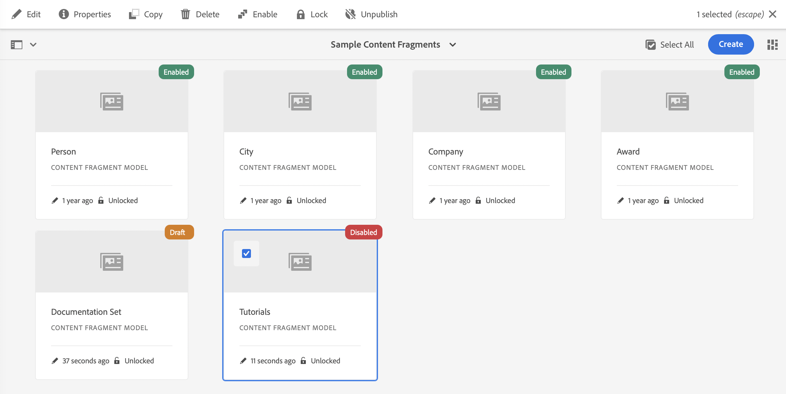

# Modellen van contentfragmenten {#content-fragment-models}

<!--
>[!CAUTION]
>
>Certain features for Content Fragments will be released in early 2021.
>
>The related documentation is already available for preview purposes.
>
>Please see the [Release Notes](/help/release-notes/release-notes-cloud/release-notes-current.md) for further details.
-->

>[!CAUTION]
>
>De AEM GraphQL API, voor het leveren van inhoudsfragmenten, zal begin 2021 worden vrijgegeven.
>
>De verwante documentatie is reeds beschikbaar voor voorproefdoeleinden.

Met Inhoudsfragmentmodellen wordt de inhoudsstructuur gedefinieerd voor uw [inhoudsfragmenten](/help/assets/content-fragments/content-fragments.md).

U kunt als volgt modellen van inhoudsfragmenten gebruiken:

1. [Functionaliteit van inhoudsfragmentmodel inschakelen voor uw instantie](/help/assets/content-fragments/content-fragments-configuration-browser.md)
1. [Maak](#creating-a-content-fragment-model) en  [configureer](#defining-your-content-fragment-model) uw modellen van inhoudsfragmenten
1. [Schakel ](#enabling-disabling-a-content-fragment-model) Modellen van inhoudsfragmenten in voor gebruik bij het maken van inhoudsfragmenten

## Een inhoudsfragmentmodel maken {#creating-a-content-fragment-model}

1. Navigeer naar **Tools**, **Assets** en open **Content Fragment Models**.
1. Navigeer naar de map die geschikt is voor uw [configuratie](/help/assets/content-fragments/content-fragments-configuration-browser.md).
1. Gebruik **Create** om de wizard te openen.

   >[!CAUTION]
   >
   >Als het [gebruik van inhoudsfragmentmodellen niet is ingeschakeld](/help/assets/content-fragments/content-fragments-configuration-browser.md), is de optie **Maken** niet beschikbaar.

1. Geef de **modeltitel** op. U kunt **Codes**, en **Beschrijving** indien nodig ook toevoegen.

   

1. Gebruik **Maken** om het lege model op te slaan. Een bericht zal op het succes van de actie wijzen, kunt u **Open** selecteren om het model onmiddellijk uit te geven, of **Done** om aan de console terug te keren.

## Het inhoudsfragmentmodel {#defining-your-content-fragment-model} definiëren

Het inhoudsfragmentmodel definieert effectief de structuur van de resulterende inhoudsfragmenten met behulp van een selectie van **[Gegevenstypen](#data-types)**. Gebruikend de modelredacteur kunt u instanties van de gegevenstypes toevoegen, dan hen vormen om de vereiste gebieden tot stand te brengen:

>[!CAUTION]
>
>Het bewerken van een bestaand inhoudsfragmentmodel kan invloed hebben op afhankelijke fragmenten.

1. Navigeer naar **Tools**, **Assets** en open **Content Fragment Models**.

1. Navigeer naar de map met het fragmentmodel van de inhoud.
1. Open het vereiste model voor **Edit**; gebruik de snelle actie of selecteer het model en de actie op de werkbalk.

   Zodra open de modelredacteur toont:

   * links: velden al gedefinieerd
   * rechts: **datatypen** voor het maken van velden (en **eigenschappen** voor gebruik als er velden zijn gemaakt)

   >[!NOTE]
   >
   >Als een veld **Vereist** is, wordt het **label** in het linkerdeelvenster gemarkeerd met een sterretje (*****).

1. **Een veld toevoegen**

   * Sleep een vereist gegevenstype naar de vereiste locatie voor een veld.

   * Nadat een veld aan het model is toegevoegd, wordt in het rechterdeelvenster **Eigenschappen** weergegeven die voor dat specifieke gegevenstype kunnen worden gedefinieerd. Hier kunt u definiëren wat voor dat veld is vereist.
Vele eigenschappen zijn duidelijk, voor extra details zie [Eigenschappen](#properties).

1. **Een veld verwijderen**

   Selecteer het gewenste veld en klik op het pictogram van de prullenbak of tik erop. U wordt gevraagd de actie te bevestigen.

1. Voeg alle vereiste velden toe en definieer de bijbehorende eigenschappen, zoals vereist.

1. Selecteer **Opslaan** om de definitie te behouden.

<!--
## Defining your Content Fragment Model {#defining-your-content-fragment-model}

The content fragment model effectively defines the structure of the resulting content fragments using a selection of **[Data Types](#data-types)**. Using the model editor you can add instances of the data types, then configure them to create the required fields:

>[!CAUTION]
>
>Editing an existing content fragment model can impact dependent fragments.

1. Navigate to **Tools**, **Assets**, then open **Content Fragment Models**.

1. Navigate to the folder holding your content fragment model.
1. Open the required model for **Edit**; use either the quick action, or select the model and then the action from the toolbar.

   Once open the model editor shows:

    * left: fields already defined
    * right: **Data Types** available for creating fields (and **Properties** for use once fields have been created)

   >[!NOTE]
   >
   >When a field as **Required**, the **Label** indicated in the left pane will be marked with an asterix (**&#42;**).

   

1. **To Add a Field**

    * Drag a required data type to the required location for a field:

      

    * Once a field has been added to the model, the right panel will show the **Properties** that can be defined for that particular data type. Here you can define what is required for that field. 
      Many properties are self-explanatory, for additional details see [Properties](#properties).
      For example:

      

1. **To Remove a Field**

   Select the required field, then click/tap the trash-can icon. You will be asked to confirm the action.

   

1. Add all required fields, and define the related properties, as required. For example:

   

1. Select **Save** to persist the definition.
-->

## Gegevenstypen {#data-types}

Voor het definiëren van uw model zijn verschillende gegevenstypen beschikbaar:

* **Tekst met één regel**
   * Voeg een of meer velden van één regel tekst toe. de maximumlengte kan worden bepaald
* **Tekst met meerdere regels**
   * Een tekstgebied dat RTF-tekst, normale tekst of markeringen kan bevatten
* **Getal**
   * Een of meer numerieke velden toevoegen
* **Boolean**
   * Een Booleaans selectievakje toevoegen
* **Datum en tijd**
   * Een datum en/of tijd toevoegen
* **Opsomming**
   * Een set selectievakjes, keuzerondjes of vervolgkeuzelijsten toevoegen
* **Tags**
   * Hiermee kunnen auteurs van fragmenten gebieden met tags openen en selecteren
* **Content Reference**
   * verwijzingen naar andere inhoud, ongeacht het type; kan worden gebruikt om [geneste inhoud te maken](#using-references-to-form-nested-content)

<!--
* **Fragment Reference**
  * References other content fragments; can be used to [create nested content](#using-references-to-form-nested-content)
  * The data type can be configured to allow fragment authors to:
    * Edit the referenced fragment directly.
    * Create a new content fragment, based on the appropriate model  
* **JSON Object**
  * Allows the content fragment author to enter JSON syntax into the corresponding elements of a fragment. 
    * To allow AEM to store direct JSON that you have copy/pasted from another service.
    * The JSON will be passed through, and output as JSON in GraphQL.
    * Includes JSON syntax-highlighting, auto-complete and error-highlighting in the content fragment editor.
-->

## Eigenschappen {#properties}

Veel eigenschappen zijn niet-verklarend, voor bepaalde eigenschappen zijn de extra details hieronder:

* **Render**
AsThe diverse opties voor het realiseren/renderen van het veld in een fragment. Hierdoor kunt u vaak definiëren of de auteur één exemplaar van het veld ziet of meerdere exemplaren mag maken.

* **Veld**
LabelEnter 
**Met** veldlabel wordt automatisch een  **eigenschapsnaam** gegenereerd. U kunt deze naam desgewenst handmatig bijwerken.

* **De**
bevestiging ValidationBasic is beschikbaar door mechanismen zoals het  **** Vereiste bezit. Sommige gegevenstypen hebben extra validatievelden. Zie [Validatie](#validation) voor meer informatie.

* Voor het datatype **Tekst met meerdere regels** is het mogelijk het **standaardtype** als volgt te definiëren:

   * **RTF**
   * **Markering**
   * **Onbewerkte tekst**

   Indien niet opgegeven, wordt de standaardwaarde **RTF-tekst** gebruikt voor dit veld.

   Het wijzigen van het **standaardtype** in een contentfragmentmodel heeft alleen effect op een bestaand, gerelateerd contentfragment nadat dat fragment is geopend in de editor en opgeslagen.

<!--
* **Translatable**
  Checking the "Translatable" checkbox on a field in CF model editor will

  * Ensure the field's property name is added in translation config, context `/content/dam/<tenant>`, if not already present. 
  * For GraphQL: set a `<translatable>` property on the Content Fragment field to `yes`, to allow GraphQL query filter for JSON output with only translatable content.

* See **[Fragment Reference (Nested Fragments)](#fragment-reference-nested-fragments)** for more details about that specific data type and its properties.
-->

## Validatie {#validation}

Verschillende gegevenstypen bieden nu de mogelijkheid om validatievereisten te definiëren voor het tijdstip waarop inhoud wordt ingevoerd in het resulterende fragment:

* **Tekst met één regel**
   * Vergelijk met een vooraf gedefinieerde regex.
* **Getal**
   * Controleren op specifieke waarden.

<!--
* **Content Reference**
  * Test for specific types of content.
  * Only images within a predefined range of width and height (in pixels) can be referenced. 
  * Only assets of specified file size or smaller can be referenced. 
  * Only predefined file types can be referenced.
  * No more than the predefined number of assets can be referenced. 
  * No more than the predefined number of fragments can be referenced.
* **Fragment Reference**
  * Test for a specific content fragment model.
-->

<!--
## Using References to form Nested Content {#using-references-to-form-nested-content}

Content Fragments can form nested content, using either of the following data types:

* **[Content Reference](#content-reference)**
  * Provides a simple reference to other content; of any type.
  * Can be configured for a one or multiple references (in the resulting fragment).

* **[Fragment Reference](#fragment-reference-nested-fragments)** (Nested Fragments)
  * References other fragments, dependent on the specific models specified.
  * Allows you to include/retrieve structured data.
    >[!NOTE]
    >
    >This method is of particular interest in conjunction with [Headless Content Delivery using Content Fragments with GraphQL](/help/assets/content-fragments/content-fragments-graphql.md).
  * Can be configured for one or multiple references (in the resulting fragment)..

>[!NOTE]
>
>AEM has a recurrence protection for:
>
>* Content References
>  This prevents the user from adding a reference to the current fragment. This may lead to an empty Fragment Reference picker dialog.
>
>* Fragment References in GraphQL 
>  If you create a deep query that returns multiple Content Fragments referenced by each another, it will return null at first occurence.

### Content Reference {#content-reference}

The Content Reference allows you to render content from another source; for example, image or content fragment.

In addition to standard properties you can specify:

* The **Root Path** for any referenced content.
* The content types that can be referenced.
* Limitations for file sizes.
* Image restraints.
-->

<!-- Check screenshot - might need update

   
-->

<!--
### Fragment Reference (Nested Fragments) {#fragment-reference-nested-fragments}

The Fragment Reference references one, or more, content fragments. This feature of particular interest when retrieving content for use in your app, as it allows you to retrieve structured data with multiple layers.

For example:

* A model defining details for an employee; these include:
  * A reference to the model that defines the employer (company)

```xml
type EmployeeModel {
    name: String
    firstName: String
    company: CompanyModel
}

type CompanyModel {
    name: String
    street: String
    city: String
}
```

>[!NOTE]
>
>This is of particular interest in conjunction with [Headless Content Delivery using Content Fragments with GraphQL](/help/assets/content-fragments/content-fragments-graphql.md).

In addition to standard properties you can define:

* **Render As**:

  * **multifield** - the fragment author can create multiple, individual, references

  * **fragmentreference** - allows the fragment author to select a single reference to a fragment

* **Model Type**
  Multiple models can be selected. When authoring the Content Fragment any referenced fragments must have been created using these models.

* **Root Path**
  This specifies a root path for any fragments referenced.

* **Allow Fragment Creation**

  This will allow the fragment author to create a new fragment based on the appropriate model.
-->

<!--
  * **fragmentreferencecomposite** - allows the fragment author to build a composite, by selecting multiple fragments
-->

<!-- Check screenshot - might need update

   
-->

<!--
>[!NOTE]
>
>A recurrence protection mechanism is in place. It prohibits the user from selecting the current Content Fragment in the Fragment Reference. This may lead to an empty Fragment Reference picker dialog.
>
>There is also a recurrence protection for Fragment References in GraphQL. If you create a deep query across two Content Fragments that reference each other, it will return null.
-->

## Een inhoudsfragmentmodel {#enabling-disabling-a-content-fragment-model} in- of uitschakelen

Voor volledige controle over het gebruik van uw modellen van het Fragment van de Inhoud hebben zij een status die u kunt plaatsen.

### Een inhoudsfragmentmodel {#enabling-a-content-fragment-model} inschakelen

Nadat een model is gemaakt, moet het worden ingeschakeld zodat het:

* Deze optie is beschikbaar voor selectie wanneer u een nieuw inhoudsfragment maakt.
* Er kan vanuit een inhoudsfragmentmodel naar worden verwezen.
* is beschikbaar voor GraphQL; zodat wordt het schema geproduceerd.

Een model inschakelen dat is gemarkeerd als:

* **Concept** : mew (nooit ingeschakeld).
* **Uitgeschakeld** : is specifiek uitgeschakeld.

U gebruikt de optie **Enable** van:

* De bovenste werkbalk als het vereiste model is geselecteerd.
* De corresponderende snelle actie (mouse-over het vereiste model).



### Een inhoudsfragmentmodel {#disabling-a-content-fragment-model} uitschakelen

Een model kan ook worden uitgeschakeld, zodat:

* Het model is niet meer beschikbaar als basis voor het maken van *new* Inhoudsfragmenten.
* Echter:
   * Het GraphQL-schema wordt steeds gegenereerd en kan nog steeds worden opgezocht (om te voorkomen dat JSON API wordt beïnvloed).
   * Om het even welke die Inhoudsfragmenten van het model worden gebaseerd kunnen nog van het eindpunt worden gevraagd en van GraphQL zijn teruggekeerd.
* Het model kan niet meer van verwijzingen worden voorzien, maar de bestaande verwijzingen worden gehouden onaangeroerd, en kunnen nog worden gevraagd en van het eindpunt GraphQL zijn teruggekeerd.

Als u een model wilt uitschakelen dat is gemarkeerd als **Ingeschakeld**, gebruikt u de optie **Uitschakelen** van:

* De bovenste werkbalk als het vereiste model is geselecteerd.
* De corresponderende snelle actie (mouse-over het vereiste model).


## Een inhoudsfragmentmodel {#deleting-a-content-fragment-model} verwijderen

>[!CAUTION]
Het verwijderen van een inhoudsfragmentmodel kan invloed hebben op afhankelijke fragmenten.

Een inhoudsfragmentmodel verwijderen:

1. Navigeer naar **Tools**, **Assets** en open **Content Fragment Models**.

1. Navigeer naar de map met het fragmentmodel van de inhoud.
1. Selecteer het model, gevolgd door **Delete** op de werkbalk.

   >[!NOTE]
   Als naar het model wordt verwezen, wordt een waarschuwing gegeven. Voer de juiste actie uit.

## Een inhoudsfragmentmodel {#publishing-a-content-fragment-model} publiceren

Inhoudsfragmentmodellen moeten worden gepubliceerd wanneer/voordat afhankelijke inhoudsfragmenten worden gepubliceerd.

Een fragmentmodel voor inhoud publiceren:

1. Navigeer naar **Tools**, **Assets** en open **Content Fragment Models**.

1. Navigeer naar de map met het fragmentmodel van de inhoud.
1. Selecteer het model, gevolgd door **Publiceren** op de werkbalk.
De gepubliceerde status wordt aangegeven in de console.

   >[!NOTE]
   Als u een inhoudsfragment publiceert waarvoor het model nog niet is gepubliceerd, wordt dit in een selectielijst aangegeven en wordt het model met het fragment gepubliceerd.

## Publicatie van een inhoudsfragmentmodel opheffen {#unpublishing-a-content-fragment-model}

Inhoudsfragmentmodellen kunnen ongepubliceerd zijn als naar deze modellen niet wordt verwezen door fragmenten.

Publicatie van een inhoudsfragmentmodel ongedaan maken:

1. Navigeer naar **Tools**, **Assets** en open **Content Fragment Models**.

1. Navigeer naar de map met het fragmentmodel van de inhoud.
1. Selecteer uw model, dat door **wordt gevolgd Unpublish** van de toolbar.
De gepubliceerde status wordt aangegeven in de console.
