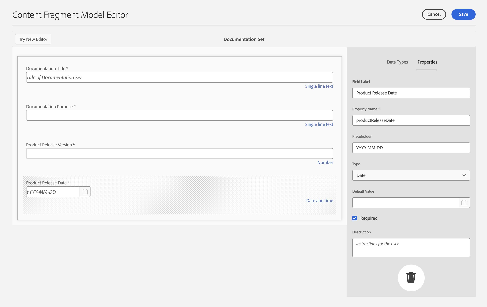
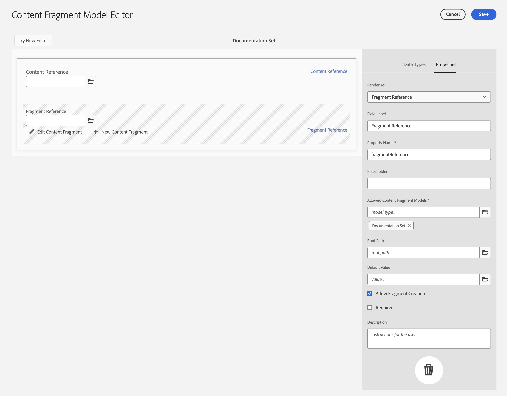
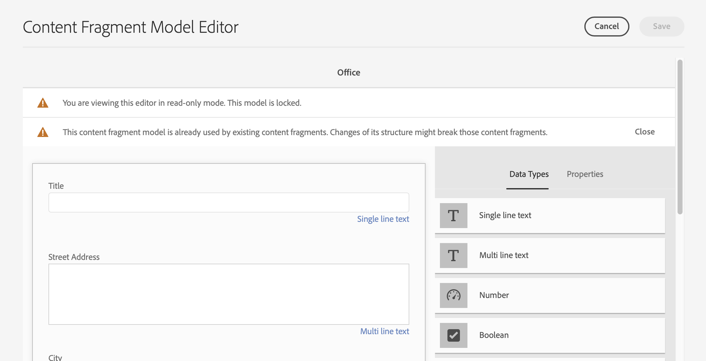
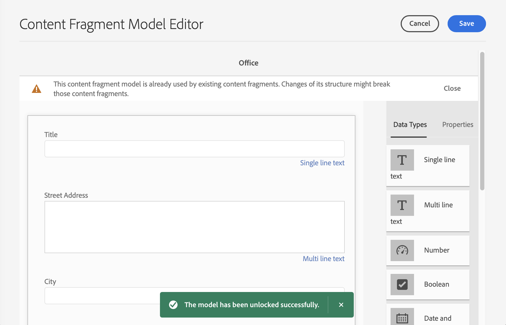

# Modellen van contentfragmenten {#content-fragment-models}

Content Fragment Models in AEM de structuur van de inhoud voor uw [inhoudsfragmenten,](/help/assets/content-fragments/content-fragments.md) fungeren als basis voor uw inhoud zonder kop.

U kunt als volgt modellen van inhoudsfragmenten gebruiken:

1. [Functionaliteit van inhoudsfragmentmodel inschakelen voor uw instantie](/help/assets/content-fragments/content-fragments-configuration-browser.md)
1. [Maken](#creating-a-content-fragment-model), en [vormen](#defining-your-content-fragment-model), uw modellen van inhoudsfragmenten
1. [Modellen van inhoudsfragmenten inschakelen](#enabling-disabling-a-content-fragment-model) voor gebruik bij het maken van Content Fragments voor gebruik bij het maken van Content Fragments
1. [Modellen van inhoudsfragmenten toestaan in de vereiste mappen Middelen](#allowing-content-fragment-models-assets-folder) door te vormen **Beleid**.

## Een inhoudsfragmentmodel maken {#creating-a-content-fragment-model}

1. Navigeren naar **Gereedschappen**, **Activa** en vervolgens openen **Modellen van inhoudsfragmenten**.
1. Navigeer naar de map die geschikt is voor uw [configuratie](/help/assets/content-fragments/content-fragments-configuration-browser.md).
1. Gebruiken **Maken** om de wizard te openen.

   >[!CAUTION]
   >
   >Als de [gebruik van inhoudsfragmentmodellen is niet ingeschakeld](/help/assets/content-fragments/content-fragments-configuration-browser.md)de **Maken** is niet beschikbaar.

1. Geef de **modeltitel** op. U kunt ook toevoegen **Tags**, **Beschrijving** en selecteert u **Model inschakelen** tot [het model inschakelen](#enabling-disabling-a-content-fragment-model) indien nodig.

   

1. Gebruiken **Maken** om het lege model op te slaan. Een bericht geeft het succes van de actie aan. U kunt **Openen** het model onmiddellijk te bewerken, of **Gereed** om naar de console terug te keren.

## Het model van het inhoudsfragment definiëren {#defining-your-content-fragment-model}

Het inhoudsfragmentmodel definieert effectief de structuur van de resulterende inhoudsfragmenten met behulp van een selectie van **[Gegevenstypen](#data-types)**. Gebruikend de modelredacteur kunt u instanties van de gegevenstypes toevoegen, dan hen vormen om de vereiste gebieden tot stand te brengen:

>[!CAUTION]
>
>Het bewerken van een bestaand inhoudsfragmentmodel kan invloed hebben op afhankelijke fragmenten.

1. Navigeren naar **Gereedschappen**, **Activa** en vervolgens openen **Modellen van inhoudsfragmenten**.

1. Navigeer naar de map met het fragmentmodel van de inhoud.
1. Open het vereiste model voor **Bewerken**; gebruik de snelle actie of selecteer het model en de actie op de werkbalk.

   Zodra open de modelredacteur toont:

   * links: velden al gedefinieerd
   * rechts: **datatypen** voor het maken van velden (en **eigenschappen** voor gebruik als er velden zijn gemaakt)

   >[!NOTE]
   >
   >Als een veld **Vereist** is, wordt het **label** in het linkerdeelvenster gemarkeerd met een sterretje (*****).


1. **Een veld toevoegen**

   * Sleep een vereist gegevenstype naar de vereiste locatie voor een veld:

      

   * Nadat een veld aan het model is toegevoegd, wordt in het rechterdeelvenster het volgende weergegeven: **Eigenschappen** die voor dat bepaalde gegevenstype kunnen worden gedefinieerd. Hier kunt u definiëren wat voor dat veld is vereist.

      * Veel eigenschappen zijn niet-verklarend, voor meer details zie [Eigenschappen](#properties).
      * Een **Veldlabel** zal automatisch de **Eigenschapnaam**  - indien leeg, en het kan achteraf handmatig worden bijgewerkt.

         >[!CAUTION]
         Wanneer u de eigenschap handmatig bijwerkt **Eigenschapnaam** voor een gegevenstype, merk op dat de namen slechts Latijnse karakters, numerieke cijfers en onderstrepingsteken &quot;_&quot;als speciaal karakter moeten bevatten.
         Als modellen die in eerdere versies van AEM zijn gemaakt, ongeldige tekens bevatten, verwijdert of werkt u deze tekens bij.
      Bijvoorbeeld:

      


1. **Een veld verwijderen**

   Selecteer het gewenste veld en klik op het pictogram van de prullenbak of tik erop. U wordt gevraagd de actie te bevestigen.

   

1. Voeg alle vereiste velden toe en definieer de bijbehorende eigenschappen, zoals vereist. Bijvoorbeeld:

   

1. Selecteren **Opslaan** om de definitie te handhaven.

## Gegevenstypen {#data-types}

Voor het definiëren van uw model zijn verschillende gegevenstypen beschikbaar:

* **Tekst met één regel**
   * Voeg een of meer velden van één regel tekst toe. de maximumlengte kan worden bepaald
* **Tekst met meerdere regels**
   * Een tekstgebied dat RTF-tekst, normale tekst of markeringen kan bevatten
* **Getal**
   * Een of meer numerieke velden toevoegen
* **Boolean**
   * Een Booleaans selectievakje toevoegen
* **Datum en tijd**
   * Een datum en/of tijd toevoegen
* **Opsomming**
   * Een set selectievakjes, keuzerondjes of vervolgkeuzelijsten toevoegen
* **Tags**
   * Hiermee kunnen auteurs van fragmenten gebieden met tags openen en selecteren
* **Content Reference**
   * verwijzingen naar andere inhoud, ongeacht het type; kan worden gebruikt om [geneste inhoud maken](#using-references-to-form-nested-content)
   * Als er naar een afbeelding wordt verwezen, kunt u ervoor kiezen een miniatuur weer te geven
* **Fragmentverwijzing**
   * Verwijzingen naar andere inhoudsfragmenten; kan worden gebruikt om [geneste inhoud maken](#using-references-to-form-nested-content)
   * Het gegevenstype kan worden geconfigureerd om fragmentauteurs toe te staan:
      * Bewerk het fragment waarnaar wordt verwezen rechtstreeks.
      * Een nieuw inhoudsfragment maken op basis van het juiste model
* **JSON-object**
   * Hiermee kan de auteur van het inhoudsfragment JSON-syntaxis invoeren in de overeenkomende elementen van een fragment.
      * Om AEM toe te staan direct JSON op te slaan die u van een andere dienst hebt gekopieerd/gekleefd.
      * De JSON wordt doorgegeven en uitvoer als JSON in GraphQL.
      * Neemt JSON-syntaxismarkering, automatisch aanvullen en foutmarkering op in de inhoudsfragmenteditor.
* **Tijdelijke aanduiding voor tab**
   * Hiermee kunt u tabbladen invoeren die u kunt gebruiken bij het bewerken van de inhoud van het inhoudsfragment.
Dit zal als verdeler in de modelredacteur worden getoond, scheidend secties van de lijst van de types van inhoudsgegevens. Elke instantie vertegenwoordigt het begin van een nieuw lusje.
In de fragmenteditor wordt elke instantie weergegeven als een tab.

      >[!NOTE]
      Dit gegevenstype wordt puur gebruikt voor het formatteren, wordt het genegeerd door het schema AEM GraphQL.

## Eigenschappen {#properties}

Vele eigenschappen zijn voor zichzelf verklarend, voor bepaalde eigenschappen zijn hieronder meer details te vinden:

* **Eigenschapnaam**

   Wanneer u deze eigenschap handmatig bijwerkt voor een gegevenstype, moet u opletten dat namen **moet** bevatten *alleen* Latijnse tekens, numerieke cijfers en onderstrepingsteken &quot;_&quot; als speciaal teken.

   >[!CAUTION]
   Als modellen die in eerdere versies van AEM zijn gemaakt, ongeldige tekens bevatten, verwijdert of werkt u deze tekens bij.

* **Renderen als**
De verschillende opties voor het realiseren/renderen van het veld in een fragment. Hierdoor kunt u vaak definiëren of de auteur één exemplaar van het veld ziet of meerdere exemplaren mag maken.

* **Veldlabel**
Een 
**Veldlabel** zal automatisch een **Eigenschapnaam**, die indien nodig handmatig kan worden bijgewerkt.

* **Validatie**
De basisbevestiging is beschikbaar door mechanismen zoals **Vereist** eigenschap. Sommige gegevenstypen hebben extra validatievelden. Zie [Validatie](#validation) voor nadere bijzonderheden.

* Voor het datatype **Tekst met meerdere regels** is het mogelijk het **standaardtype** als volgt te definiëren:

   * **RTF**
   * **Markering**
   * **Onbewerkte tekst**

   Indien niet opgegeven, wordt de standaardwaarde **RTF** wordt gebruikt voor dit veld.

   Het wijzigen van het **standaardtype** in een contentfragmentmodel heeft alleen effect op een bestaand, gerelateerd contentfragment nadat dat fragment is geopend in de editor en opgeslagen.

* **Uniek**
De inhoud (voor het specifieke veld) moet uniek zijn in alle inhoudsfragmenten die op basis van het huidige model zijn gemaakt.

   Dit wordt gebruikt om ervoor te zorgen dat inhoudsauteurs geen inhoud kunnen herhalen die al in een ander fragment van hetzelfde model is toegevoegd.

   Bijvoorbeeld een **Tekst met één regel** veld aangeroepen `Country` in het inhoudsfragmentmodel kan de waarde niet hebben `Japan` in twee afhankelijke inhoudsfragmenten. Er wordt een waarschuwing weergegeven wanneer de tweede instantie wordt geprobeerd.

   >[!NOTE]
   Er wordt gezorgd voor uniformiteit per taalwortel.

   >[!NOTE]
   Variaties kunnen hetzelfde hebben *uniek* waarde als variaties van hetzelfde fragment, maar niet dezelfde waarde als bij variaties van andere fragmenten.

* Zie **[Content Reference](#content-reference)** voor meer details over dat specifieke gegevenstype en zijn eigenschappen.

* Zie **[Fragmentverwijzing (geneste fragmenten)](#fragment-reference-nested-fragments)** voor meer details over dat specifieke gegevenstype en zijn eigenschappen.

* **Vertaalbaar**

   >[!NOTE]
   Deze functie is beschikbaar in het prereleasekanaal.
   Zie de [Prerelease Channel-documentatie](https://experienceleague.adobe.com/docs/experience-manager-cloud-service/content/release-notes/prerelease.html#enable-prerelease) voor informatie over hoe u de functie voor uw omgeving kunt inschakelen.

   De **Vertaalbaar** Schakel het selectievakje in een veld in de editor van het inhoudsfragmentmodel in:

   * Zorg ervoor dat de eigenschapsnaam van het veld wordt toegevoegd aan de vertaalconfiguratie, context `/content/dam/<sites-configuration>`, indien nog niet aanwezig.
   * Voor GraphQL: instellen `<translatable>` eigenschap in het veld Inhoudsfragment naar `yes`, om GraphQL-queryfilter toe te staan voor JSON-uitvoer met alleen vertaalbare inhoud.

## Validatie {#validation}

Verschillende gegevenstypen bieden nu de mogelijkheid om validatievereisten te definiëren voor het tijdstip waarop inhoud wordt ingevoerd in het resulterende fragment:

* **Tekst met één regel**
   * Vergelijk met een vooraf gedefinieerde regex.
* **Getal**
   * Controleren op specifieke waarden.
* **Content Reference**
   * Testen op specifieke typen inhoud.
   * Er kan alleen worden verwezen naar elementen van een opgegeven bestandsgrootte of kleiner.
   * Er kan alleen worden verwezen naar afbeeldingen binnen een vooraf gedefinieerd bereik van breedte en/of hoogte (in pixels).
* **Fragmentverwijzing**
   * Testen op een specifiek inhoudsfragmentmodel.

## Referenties gebruiken om geneste inhoud te vormen {#using-references-to-form-nested-content}

Inhoudsfragmenten kunnen geneste inhoud vormen met een van de volgende gegevenstypen:

* **[Content Reference](#content-reference)**
   * Verstrekt een eenvoudige verwijzing naar andere inhoud; van elk type.
   * Kan worden geconfigureerd voor een of meerdere verwijzingen (in het resulterende fragment).

* **[Fragmentverwijzing](#fragment-reference-nested-fragments)** (Geneste fragmenten)
   * Verwijzingen naar andere fragmenten, afhankelijk van de opgegeven modellen.
   * Hiermee kunt u gestructureerde gegevens opnemen/ophalen.

      >[!NOTE]
      Deze methode is van bijzonder belang in samenhang met [Aflevering van inhoud zonder kop met gebruik van inhoudsfragmenten met GraphQL](/help/assets/content-fragments/content-fragments-graphql.md).
   * Kan worden geconfigureerd voor een of meerdere verwijzingen (in het resulterende fragment).

>[!NOTE]
AEM heeft een terugkerende bescherming voor:
* Inhoudsverwijzingen Hiermee voorkomt u dat de gebruiker een verwijzing naar het huidige fragment toevoegt. Dit kan leiden tot een leeg dialoogvenster van de kiezer voor fragmentverwijzing.
* De Verwijzingen van het fragment in GraphQL als u een diepe vraag creeert die veelvoudige tevreden Fragments terugkeert die door elkaar van verwijzingen worden voorzien, zal het ongeldig bij eerste voorkomen terugkeren.


### Content Reference {#content-reference}

Met de Content Reference kunt u inhoud van een andere bron renderen. bijvoorbeeld een afbeeldings- of inhoudsfragment.

Naast de standaardeigenschappen kunt u opgeven:

* De **Hoofdpad** voor inhoud waarnaar wordt verwezen
* De inhoudstypen waarnaar kan worden verwezen
* Beperkingen voor bestandsgrootten
* Als naar een afbeelding wordt verwezen:
   * Miniatuur tonen
   * Hoogte- en breedtebeperkingen voor afbeeldingen


### Fragmentverwijzing (geneste fragmenten) {#fragment-reference-nested-fragments}

De fragmentverwijzing verwijst naar een of meer inhoudsfragmenten. Deze functie is vooral van belang wanneer u inhoud ophaalt die u wilt gebruiken in uw app, omdat u gestructureerde gegevens met meerdere lagen kunt ophalen.

Bijvoorbeeld:

* een model dat de gegevens voor een werknemer definieert; deze omvatten :
   * Een verwijzing naar het model dat de werkgever (onderneming) definieert

```xml
type EmployeeModel {
    name: String
    firstName: String
    company: CompanyModel
}

type CompanyModel {
    name: String
    street: String
    city: String
}
```

>[!NOTE]
Dit is van bijzonder belang in samenhang met [Aflevering van inhoud zonder kop met gebruik van inhoudsfragmenten met GraphQL](/help/assets/content-fragments/content-fragments-graphql.md).

Naast de standaardeigenschappen kunt u definiëren:

* **Renderen als**:

   * **multifield** - de auteur van het fragment kan meerdere, afzonderlijke, verwijzingen maken

   * **fragmentreference** - Hiermee kan de auteur van het fragment één verwijzing naar een fragment selecteren

* **Modeltype**
U kunt meerdere modellen selecteren. Bij het ontwerpen van het inhoudsfragment moeten fragmenten waarnaar wordt verwezen, met deze modellen zijn gemaakt.

* **Hoofdpad**
Geeft een hoofdpad aan voor alle fragmenten waarnaar wordt verwezen.

* **Fragment maken toestaan**

   Hierdoor kan de auteur van het fragment een nieuw fragment maken op basis van het juiste model.

   * **fragmentreferencecomponent** - stelt de auteur van het fragment in staat een samenstelling samen te stellen door meerdere fragmenten te selecteren

   

>[!NOTE]
Er is een terugkerend beschermingsmechanisme ingesteld. Hiermee wordt de gebruiker verboden het huidige inhoudsfragment in de fragmentverwijzing te selecteren. Dit kan leiden tot een leeg dialoogvenster van de kiezer voor fragmentverwijzing.
Er is ook een terugkerende bescherming voor de Verwijzingen van het Fragment in GraphQL. Als u een diepe vraag over twee Fragments creeert van de Inhoud die elkaar van verwijzingen voorzien, zal het ongeldig terugkeren.

## Inhoudsfragmentmodel - eigenschappen {#content-fragment-model-properties}

U kunt de **Eigenschappen** van een inhoudsfragmentmodel:

* **Basis**
   * **Modeltitel**
   * **Tags**
   * **Beschrijving**
   * **Afbeelding uploaden**

## Een inhoudsfragmentmodel in- of uitschakelen {#enabling-disabling-a-content-fragment-model}

Voor volledige controle over het gebruik van uw modellen van het Fragment van de Inhoud hebben zij een status die u kunt plaatsen.

### Een inhoudsfragmentmodel inschakelen {#enabling-a-content-fragment-model}

Nadat een model is gemaakt, moet het worden ingeschakeld zodat het:

* Deze optie is beschikbaar voor selectie wanneer u een nieuw inhoudsfragment maakt.
* Er kan vanuit een inhoudsfragmentmodel naar worden verwezen.
* is beschikbaar voor GraphQL; zodat wordt het schema geproduceerd.

Een model inschakelen dat is gemarkeerd als:

* **Concept** : mew (nooit ingeschakeld).
* **Uitgeschakeld** : is specifiek uitgeschakeld.

U gebruikt de **Inschakelen** optie van:

* De bovenste werkbalk als het vereiste model is geselecteerd.
* De corresponderende snelle actie (mouse-over het vereiste model).


### Een inhoudsfragmentmodel uitschakelen {#disabling-a-content-fragment-model}

Een model kan ook worden uitgeschakeld, zodat:

* Het model is niet meer beschikbaar als basis voor het maken van *new* Inhoudsfragmenten.
* Echter:
   * Het GraphQL-schema wordt steeds gegenereerd en kan nog steeds worden opgevraagd (om te voorkomen dat JSON API wordt beïnvloed).
   * Om het even welke die Inhoudsfragmenten van het model worden gebaseerd kunnen nog van het eindpunt worden gevraagd en van GraphQL zijn teruggekeerd.
* Het model kan niet meer van verwijzingen worden voorzien, maar de bestaande verwijzingen worden gehouden onaangeroerd, en kunnen nog worden gevraagd en van het eindpunt GraphQL zijn teruggekeerd.

Een model uitschakelen dat is gemarkeerd als **Ingeschakeld** u de **Uitschakelen** optie van:

* De bovenste werkbalk als het vereiste model is geselecteerd.
* De corresponderende snelle actie (mouse-over het vereiste model).


## Modellen voor inhoudsfragmenten toestaan in de middelenmap {#allowing-content-fragment-models-assets-folder}

Om inhoudsbeheer uit te voeren, kunt u vormen **Beleid** in de map Elementen om te bepalen welke modellen van inhoudsfragmenten mogen worden gemaakt voor fragmenten in die map.

>[!NOTE]
Het mechanisme lijkt op [toestaan, van paginasjablonen](/help/sites-cloud/authoring/features/templates.md#allowing-a-template-author) voor een pagina en de onderliggende elementen, in geavanceerde eigenschappen van een pagina.

Om het **Beleid** for **Modellen voor toegestane inhoudsfragmenten**:

1. Navigeren en openen **Eigenschappen** voor de map met vereiste middelen.

1. Open de **Beleid** tab, waar u kunt configureren:

   * **Overgenomen van`<folder>`**

      Het beleid wordt automatisch geërft wanneer het creëren van nieuwe kindomslagen; het beleid kan worden aangepast (en de overerving wordt verbroken) als submappen andere modellen dan de bovenliggende map moeten toestaan.

   * **Modellen van inhoudsfragmenten op pad toestaan**

      U kunt meerdere modellen toestaan.

   * **Modellen voor inhoudsfragmenten zijn toegestaan op tag**

      U kunt meerdere modellen toestaan.
   

1. **Opslaan** eventuele wijzigingen.

De modellen van inhoudsfragmenten die zijn toegestaan voor een map, worden als volgt opgelost:
* De **Beleid** for **Modellen voor toegestane inhoudsfragmenten**.
* Als dit leeg is, kunt u het beleid bepalen met behulp van de overervingsregels.
* Als de overervingsketen geen resultaat oplevert, kijkt u naar de **Cloud Services** configuratie voor die map (ook eerst rechtstreeks en vervolgens via overerving).
* Als geen van de bovenstaande resultaten worden weergegeven, zijn er geen modellen toegestaan voor die map.

## Een inhoudsfragmentmodel verwijderen {#deleting-a-content-fragment-model}

>[!CAUTION]
Het verwijderen van een inhoudsfragmentmodel kan invloed hebben op afhankelijke fragmenten.

Een inhoudsfragmentmodel verwijderen:

1. Navigeren naar **Gereedschappen**, **Activa** en vervolgens openen **Modellen van inhoudsfragmenten**.

1. Navigeer naar de map met het fragmentmodel van de inhoud.
1. Selecteer uw model, gevolgd door **Verwijderen** op de werkbalk.

   >[!NOTE]
   Als naar het model wordt verwezen, wordt een waarschuwing gegeven. Voer de juiste actie uit.

## Een inhoudsfragmentmodel publiceren {#publishing-a-content-fragment-model}

Inhoudsfragmentmodellen moeten worden gepubliceerd wanneer/voordat afhankelijke inhoudsfragmenten worden gepubliceerd.

Een fragmentmodel voor inhoud publiceren:

1. Navigeren naar **Gereedschappen**, **Activa** en vervolgens openen **Modellen van inhoudsfragmenten**.

1. Navigeer naar de map met het fragmentmodel van de inhoud.
1. Selecteer uw model, gevolgd door **Publiceren** op de werkbalk.
De gepubliceerde status wordt aangegeven in de console.

   >[!NOTE]
   Als u een inhoudsfragment publiceert waarvoor het model nog niet is gepubliceerd, wordt dit in een selectielijst aangegeven en wordt het model met het fragment gepubliceerd.

## Publicatie van een inhoudsfragmentmodel ongedaan maken {#unpublishing-a-content-fragment-model}

Inhoudsfragmentmodellen kunnen ongepubliceerd zijn als naar deze modellen niet wordt verwezen door fragmenten.

Publicatie van een inhoudsfragmentmodel ongedaan maken:

1. Navigeren naar **Gereedschappen**, **Activa** en vervolgens openen **Modellen van inhoudsfragmenten**.

1. Navigeer naar de map met het fragmentmodel van de inhoud.
1. Selecteer uw model, gevolgd door **Publiceren ongedaan maken** op de werkbalk.
De gepubliceerde status wordt aangegeven in de console.

Als u probeert de publicatie ongedaan te maken van een model dat momenteel wordt gebruikt door een of meer fragmenten, wordt u hiervan op de hoogte gesteld door een foutwaarschuwing:


Het bericht zal suggereren dat u de [Verwijzingen](/help/sites-cloud/authoring/getting-started/basic-handling.md#references) panel voor een nader onderzoek :


## Vergrendelde (gepubliceerde) modellen van inhoudsfragmenten {#locked-published-content-fragment-models}

Deze functie biedt beheer voor modellen van inhoudsfragmenten die zijn gepubliceerd.

### De uitdaging {#the-challenge}

* De Modellen van het Fragment van de inhoud bepalen het schema voor vragen GraphQL in AEM.

   * AEM GraphQL-schema&#39;s worden gemaakt zodra een Content Fragment Model is gemaakt en kunnen bestaan in zowel auteur- als publicatieomgevingen.

   * Schema&#39;s bij publiceren zijn het meest kritiek aangezien zij de basis voor levende levering van inhoud van het Fragment van de Inhoud in formaat JSON verstrekken.

* Er kunnen zich problemen voordoen wanneer modellen van inhoudsfragmenten worden gewijzigd of met andere woorden worden bewerkt. Dit betekent dat het schema verandert, wat beurtelings bestaande vragen GraphQL kan beïnvloeden.

* Het toevoegen van nieuwe velden aan een inhoudsfragmentmodel mag (gewoonlijk) geen nadelige effecten hebben. Als u echter bestaande gegevensvelden wijzigt (bijvoorbeeld hun naam) of velddefinities verwijdert, worden bestaande GraphQL-query&#39;s verbroken wanneer deze velden worden aangevraagd.

### De vereisten {#the-requirements}

* Gebruikers bewust maken van de risico&#39;s bij het bewerken van modellen die al worden gebruikt voor de levering van live-inhoud (met andere woorden, modellen die zijn gepubliceerd).

* Ook, om onbedoelde veranderingen te vermijden.

Één van beiden van deze zou vragen kunnen breken als de gewijzigde modellen opnieuw worden gepubliceerd.

### De oplossing {#the-solution}

U kunt deze problemen oplossen door Modellen voor inhoudsfragmenten op te stellen: *vergrendeld* in de modus ALLEEN-LEZEN op auteur - zodra ze zijn gepubliceerd. Dit wordt aangegeven door **Vergrendeld**:


Wanneer het model **Vergrendeld** (in de modus ALLEEN-LEZEN) kunt u de inhoud en structuur van modellen zien, maar u kunt deze niet bewerken.

U kunt **Vergrendeld** modellen van of de console, of modelredacteur:

* Console

   Vanuit de console kunt u de modus ALLEEN-LEZEN beheren met de **Ontgrendelen** en **Vergrendelen** acties op de werkbalk:

   

   * U kunt **Ontgrendelen** een model om bewerkingen in te schakelen.

      Als u **Ontgrendelen** er wordt een waarschuwing weergegeven en u moet de **Ontgrendelen** handeling:
      

      Vervolgens kunt u het model openen en bewerken.

   * U kunt ook **Vergrendelen** het model daarna.
   * Als u het model opnieuw publiceert, wordt het meteen weer opgenomen in **Vergrendeld** (ALLEEN-LEZEN) modus.

* Modeleditor

   * Wanneer u een vergrendeld model opent, wordt u gewaarschuwd en krijgt u de volgende drie acties te zien: **Annuleren**, **Alleen-lezen weergeven**, **Bewerken**:

      

   * Als u **Alleen-lezen weergeven** u kunt de inhoud en de structuur van het model zien:

      

   * Als u **Bewerken** u kunt uw updates bewerken en opslaan:

      

      >[!NOTE]
      Mogelijk staat er nog een waarschuwing boven aan het scherm, maar dat is wanneer het model al wordt gebruikt door bestaande inhoudsfragmenten.

   * **Annuleren** Hiermee keert u terug naar de console.
