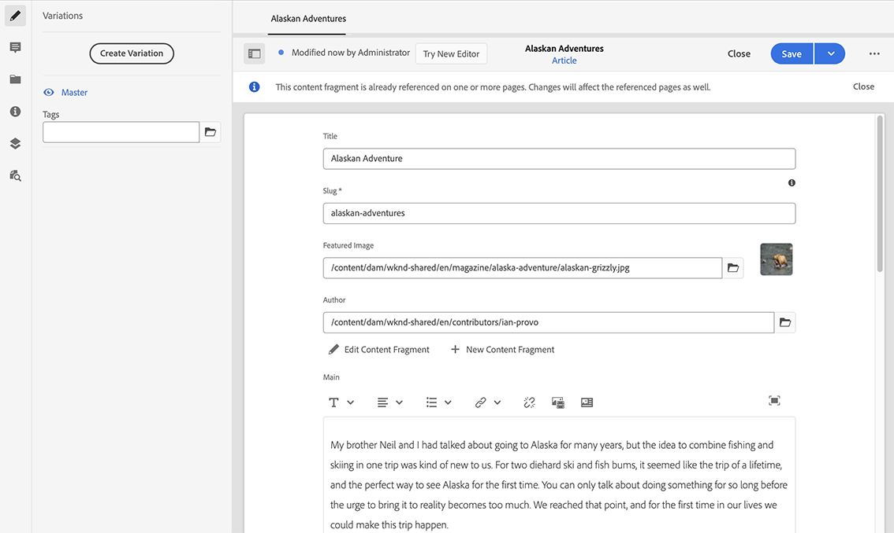

# Variaties - Fragmentinhoud ontwerpen{#variations-authoring-fragment-content}

[Variaties](/help/assets/content-fragments/content-fragments.md#constituent-parts-of-a-content-fragment) zijn een belangrijk kenmerk van inhoudsfragmenten, omdat u hiermee kopieën van de basisinhoud kunt maken en bewerken voor gebruik op specifieke kanalen en/of scenario&#39;s.

Op het tabblad **Variaties** kunt u:

* [De inhoud](#authoring-your-content) van het fragment invoeren
* [Variaties](#managing-variations) van de **basisinhoud** maken en beheren

Voer een reeks andere acties uit afhankelijk van het gegevenstype dat wordt uitgegeven; bijvoorbeeld:

* [Visuele elementen in het fragment](#inserting-assets-into-your-fragment) invoegen (afbeeldingen)

* Selecteren tussen [RTF](#rich-text), [normale tekst](#plain-text) en [opmaakcode](#markdown) voor bewerking

* [Inhoud uploaden](#uploading-content)

* [Belangrijke statistieken](#viewing-key-statistics) weergeven (over tekst met meerdere regels)

* [Tekst samenvatten](#summarizing-text)

* [Variaties synchroniseren met stramieninhoud](#synchronizing-with-master)

>[!CAUTION]
>
>Nadat een fragment is gepubliceerd en/of waarnaar wordt verwezen, geeft AEM een waarschuwing weer wanneer een auteur het fragment opent voor opnieuw bewerken. Hiermee wordt u gewaarschuwd dat wijzigingen in het fragment ook van invloed zijn op de pagina&#39;s waarnaar wordt verwezen.

## Inhoud ontwerpen {#authoring-your-content}

Wanneer u het inhoudsfragment opent voor bewerking, is het tabblad **Variaties** standaard geopend. Hier kunt u de inhoud ontwerpen, voor stramien of variaties die u hebt. U kunt:

* direct wijzigingen aanbrengen op het tabblad **Variaties**
* Open de [volledige-schermeditor](#full-screen-editor) voor:

   * Selecteer de [indeling](#formats)
   * zie meer het uitgeven opties (voor het formaat van de [RTF](#rich-text) )

   * toegang tot een reeks [acties](#actions)

Bijvoorbeeld:

* Een eenvoudig fragment bewerken

   Een eenvoudig fragment bestaat uit één tekstveld met meerdere regels (visuele elementen kunnen worden toegevoegd vanuit de volledige-schermeditor).

   

* Een fragment bewerken met gestructureerde inhoud

   Een gestructureerd fragment bevat diverse velden, van verschillende gegevenstypen, die zijn gedefinieerd in het inhoudsmodel. Voor velden met meerdere regels is de [schermvullende editor](#full-screen-editor) beschikbaar.

   

### Editor op volledig scherm {#full-screen-editor}

Als u een tekstveld met meerdere regels bewerkt, kunt u de volledige-schermeditor openen. Tik of klik in de werkelijke tekst en selecteer vervolgens het volgende handelingspictogram:

De volledige-schermredacteur verstrekt:

* Toegang tot verschillende [acties](#actions)
* Afhankelijk van de [opmaak](#formats)zijn er extra opmaakopties ([RTF](#rich-text))

### Acties {#actions}

De volgende acties zijn ook beschikbaar (voor alle [indelingen](#formats)) wanneer de volledige-schermeditor (d.w.z. tekst met meerdere regels) is geopend:

* Selecteer de [indeling](#formats) ([RTF](#rich-text), [normale tekst,](#plain-text) [opmaak](#markdown))

* [Inhoud uploaden](#uploading-content)

* [Uw tekst notities](/help/assets/content-fragments/content-fragments-variations.md#annotating-a-content-fragment) aanbrengen

* [Visuele elementen in het fragment](#inserting-assets-into-your-fragment) invoegen (afbeeldingen)

* [Tekststatistieken tonen](#viewing-key-statistics)

* [Synchroniseren met stramien](#synchronizing-with-master) (wanneer u een variatie bewerkt)

* [Tekst samenvatten](#summarizing-text)

### Indelingen {#formats}

De opties voor het bewerken van tekst met meerdere regels zijn afhankelijk van de geselecteerde indeling:

* [RTF](#rich-text)
* [Onbewerkte tekst](#plain-text)
* [Markering](#markdown)

De indeling kan worden geselecteerd in de schermvullende editor.

### RTF {#rich-text}

Met RTF-bewerkingen kunt u de volgende opmaken:

* Vet
* Cursief
* Onderstrepen
* Uitlijning: links, midden, rechts
* Lijst met opsommingstekens
* Genummerde lijst
* Inspringing: toename, afname
* Hyperlinks maken/verbreken
* Open de volledige-schermredacteur, waar de volgende het formatteren opties beschikbaar zijn:

   * Tekst/tekst uit Word plakken
   * Een tabel invoegen
   * Alineastijl: Alinea, kopje 1/2/3
   * [Visuele elementen invoegen](#inserting-assets-into-your-fragment)
   * Zoeken
   * Zoeken/vervangen
   * Spellingcontrole
   * [Annotaties](/help/assets/content-fragments/content-fragments-variations.md#annotating-a-content-fragment)

De [acties](#actions) zijn ook toegankelijk van de volledig-schermredacteur.

### Onbewerkte tekst {#plain-text}

Met platte tekst kunt u snel inhoud invoeren zonder opmaak- of markeringsgegevens. U kunt de volledige-schermredacteur voor verdere [acties](#actions)ook openen.

>[!CAUTION]
>
>Als u **Onbewerkte tekst** selecteert, gaan opmaak, markeringen en/of elementen verloren die u hebt ingevoegd in **RTF** of **Markering**.

### Markering {#markdown}

>[!NOTE]
>
>Zie de documentatie over [Afprijzing](/help/assets/content-fragments/content-fragments-markdown.md) voor volledige informatie.

Hierdoor kunt u de tekst opmaken met behulp van een markering. U kunt het volgende definiëren:

* Koppen
* Alinea&#39;s en regeleinden
* Koppelingen
* Afbeeldingen
* Aanhalingstekens blokkeren
* Lijsten
* Nadruk
* Codeblokken
* backslash-eces

U kunt de volledige-schermredacteur voor verdere [acties](#actions)ook openen.

>[!CAUTION]
>
>Als u tussen **RTF** en **Markering** schakelt, kunt u onverwachte gevolgen met de Aanhalingstekens van het Blok en de Blokken van de Code ervaren, aangezien deze twee formaten verschillen in hoe zij worden behandeld kunnen hebben.

### Belangrijkste statistieken weergeven {#viewing-key-statistics}

Wanneer de volledige het schermredacteur open is, zal de actie de Statistieken **van de** Tekst een waaier van informatie over de tekst tonen.

Bijvoorbeeld:

### Inhoud uploaden {#uploading-content}

Als u het maken van inhoudsfragmenten wilt vereenvoudigen, kunt u tekst uploaden die is voorbereid in een externe editor en deze rechtstreeks aan het fragment toevoegen.

### Tekst samenvatten {#summarizing-text}

Samenvattende tekst is ontworpen om gebruikers te helpen de lengte van hun tekst te beperken tot een vooraf gedefinieerd aantal woorden, terwijl de hoofdpunten en de algemene betekenis behouden blijven.

>[!NOTE]
>
>Op technisch niveau houdt het systeem de zinnen bij die het als de *beste verhouding van informatiedichtheid en -uniciteit* beschouwt volgens specifieke algoritmen.

>[!CAUTION]
>
>Het inhoudsfragment moet een geldige taalmap (ISO-code) hebben als voorouder. dit wordt gebruikt om het te gebruiken taalmodel te bepalen.
>
>Bijvoorbeeld `en/` zoals in het volgende pad:
>
>  `/content/dam/my-brand/en/path-down/my-content-fragment`

>[!CAUTION]
Engels is beschikbaar buiten de box.
Andere talen zijn beschikbaar als Pakketten van het Model van de Taal van het Aandeel van het Pakket:
* [Frans (fr)](https://www.adobeaemcloud.com/content/marketplace/marketplaceProxy.html?packagePath=/content/companies/public/adobe/packages/cq630/product/smartcontent-model-fr)
* [Duits (de)](https://www.adobeaemcloud.com/content/marketplace/marketplaceProxy.html?packagePath=/content/companies/public/adobe/packages/cq630/product/smartcontent-model-de)
* [Italiaans (it)](https://www.adobeaemcloud.com/content/marketplace/marketplaceProxy.html?packagePath=/content/companies/public/adobe/packages/cq630/product/smartcontent-model-it)
* [Spaans (es)](https://www.adobeaemcloud.com/content/marketplace/marketplaceProxy.html?packagePath=/content/companies/public/adobe/packages/cq630/product/smartcontent-model-es)

1. Selecteer **Stramien** of de gewenste variatie.
2. Open de editor voor het volledige scherm.

3. Selecteer Tekst **** samenvatten op de werkbalk.

   

4. Geef het doelaantal woorden op en selecteer **Start**:
5. De oorspronkelijke tekst wordt naast de voorgestelde samenvatting weergegeven:

   * Alle zinnen die moeten worden verwijderd, worden rood gemarkeerd met doorhaling.
   * Klik op een gemarkeerde zin om deze in de samengevatte inhoud te houden.
   * Klik op een niet-gemarkeerde zin om deze te verwijderen.
   

6. Selecteer **Samenvatten** om de wijzigingen te bevestigen.

### Een inhoudsfragment annoteren {#annotating-a-content-fragment}

Een fragment annoteren:

1. Selecteer **Stramien** of de gewenste variatie.
1. Open de editor voor het volledige scherm.
1. Selecteer tekst. Het pictogram **Annoteren** wordt beschikbaar.

   

1. Er wordt een dialoogvenster geopend. Hier kunt u uw annotatie invoeren.

1. Sluit de volledige-schermeditor en **sla** het fragment op.

### Annotaties weergeven, bewerken, verwijderen {#viewing-editing-deleting-annotations}

Annotaties:

* Deze worden aangegeven door de markering in de tekst, zowel in de modus Volledig scherm als in de normale modus van de editor. Alle details van een annotatie kunnen vervolgens worden weergegeven, bewerkt en/of verwijderd door op de gemarkeerde tekst te klikken, waarna het dialoogvenster opnieuw wordt geopend.

   >[!NOTE]
   Er is een keuzekiezer beschikbaar als er meerdere annotaties zijn toegepast op één stuk tekst.

* Wanneer u de volledige tekst verwijdert waarop de annotatie is toegepast, wordt de annotatie ook verwijderd.

* Kan worden weergegeven en verwijderd door het tabblad **Annotaties** in de fragmenteditor te selecteren.

   

* Kan voor het geselecteerde fragment worden weergegeven en verwijderd in de [tijdlijn](/help/assets/content-fragments/content-fragments-managing.md#timeline-for-content-fragments) .

### Elementen invoegen in uw fragment {#inserting-assets-into-your-fragment}

U kunt [elementen](/help/assets/manage-digital-assets.md) (afbeeldingen) rechtstreeks aan het fragment toevoegen om het ontwerpen van inhoudsfragmenten te vereenvoudigen.

Ze worden zonder opmaak toegevoegd aan de alineasequentie van het fragment. U kunt opmaak toepassen wanneer naar het [fragment wordt verwezen of wanneer het fragment op een pagina](/help/sites-cloud/authoring/fundamentals/content-fragments.md)wordt gebruikt.

>[!CAUTION]
Deze elementen kunnen niet worden verplaatst of verwijderd op een pagina waarnaar wordt verwezen. Dit moet gebeuren in de fragmenteditor.
Opmaak van het element (bijvoorbeeld de grootte) moet echter wel plaatsvinden in de [paginaeditor](/help/sites-cloud/authoring/fundamentals/content-fragments.md). De representatie van het element in de fragmenteditor is uitsluitend bedoeld voor het ontwerpen van de inhoudsstroom.

>[!NOTE]
Er zijn verschillende methoden om [afbeeldingen](/help/assets/content-fragments/content-fragments.md#fragments-with-visual-assets) toe te voegen aan het fragment en/of de pagina.

1. Plaats de cursor op de positie waar u de afbeelding wilt toevoegen.
2. Gebruik het pictogram Element **** invoegen om het zoekdialoogvenster te openen.

   

3. In het dialoogvenster kunt u:

   * navigeren naar het vereiste element in DAM
   * zoeken naar de middelen in DAM
   Selecteer het gewenste element door op de miniatuur te klikken.

4. Gebruik **Selecteren** om het element op de huidige locatie toe te voegen aan het alineasysteem van het inhoudsfragment.

   >[!CAUTION]
   Als u na het toevoegen van een element de indeling wijzigt in:
   * **Onbewerkte tekst**: het element wordt volledig uit het fragment verwijderd.
   * **Markering**: het element is niet zichtbaar, maar blijft aanwezig wanneer u terugkeert naar **RTF**.

## Variaties beheren {#managing-variations}

### Een variatie maken {#creating-a-variation}

Met behulp van variaties kunt u de inhoud van het **stramien** afstemmen op het doel (indien nodig).

Een nieuwe variatie maken:

1. Open het fragment en controleer of het zijpaneel zichtbaar is.
1. Selecteer **Variaties** in de pictogrambalk in het zijpaneel.
1. Selecteer Variatie **maken**.
1. Er wordt een dialoogvenster geopend waarin u de **titel** en de **beschrijving** voor de nieuwe wijziging kunt opgeven.
1. Selecteer **Toevoegen**. De **fragmentstramien** wordt gekopieerd naar de nieuwe variant, die nu is geopend voor [bewerking](#editing-a-variation).

   >[!NOTE]
   Wanneer u een nieuwe variant maakt, wordt deze altijd gekopieerd naar het **stramien** , niet naar de variant die momenteel is geopend.

### Een variatie bewerken {#editing-a-variation}

U kunt wijzigingen aanbrengen in de inhoud van de variatie nadat:

* [Uw variatie](#creating-a-variation)maken.
* Een bestaand fragment openen en vervolgens de gewenste variant in het zijpaneel selecteren.

### De naam van een variatie wijzigen {#renaming-a-variation}

Een bestaande variatie een andere naam geven:

1. Open het fragment en selecteer **Variaties** in het zijpaneel.
1. Selecteer de gewenste variatie.
1. Selecteer **Naam wijzigen** in het keuzemenu **Handelingen** .

1. Voer in het dialoogvenster dat verschijnt de nieuwe **titel** en/of **beschrijving** in.

1. Bevestig de handeling **Naam wijzigen** .

>[!NOTE]
Dit is alleen van invloed op de **titel** van de variatie.

### Een variatie verwijderen {#deleting-a-variation}

Een bestaande wijziging verwijderen:

1. Open het fragment en selecteer **Variaties** in het zijpaneel.
1. Selecteer de gewenste variatie.
1. Selecteer **Verwijderen** in het keuzemenu **Handelingen** .

1. Bevestig de actie **Verwijderen** in het dialoogvenster.

>[!NOTE]
U kunt **stramien** niet verwijderen.

### Synchroniseren met stramien {#synchronizing-with-master}

**Stramien** maken integraal deel uit van een inhoudsfragment en bevatten per definitie de hoofdkopie van de inhoud, terwijl de variaties de afzonderlijke bijgewerkte en op maat gemaakte versies van die inhoud bevatten. Wanneer Master wordt bijgewerkt, is het mogelijk dat deze wijzigingen ook relevant zijn voor de variaties en daarom aan hen moeten worden doorgegeven.

Wanneer u een variatie bewerkt, hebt u toegang tot de handeling voor het synchroniseren van het huidige element van de variatie met stramien. Op deze manier kunt u automatisch wijzigingen kopiëren die in het stramien zijn aangebracht naar de gewenste variatie.

>[!CAUTION]
De synchronisatie is alleen beschikbaar om wijzigingen *van **Stramien**naar variatie* te kopiëren.
Alleen het huidige element van de variatie wordt gesynchroniseerd.
Synchronisatie werkt alleen op het gegevenstype **Meerdere regels** .
Het overbrengen van wijzigingen *van een variatie naar **stramien ***is niet beschikbaar als optie.

1. Open het inhoudsfragment in de fragmenteditor. Zorg ervoor dat het **stramien** is bewerkt.
1. Selecteer een specifieke variant en kies vervolgens de gewenste synchronisatiehandeling uit:

   * de keuzelijst **Handelingen** - Huidig element **synchroniseren met stramien**

   * de werkbalk van de volledige schermeditor - **Synchroniseren met stramien**

1. Stramien en variatie worden naast elkaar weergegeven:

   * groen geeft de inhoud aan die is toegevoegd (aan de variatie)
   * rood geeft aan dat inhoud is verwijderd (uit de variatie)
   * blauw geeft vervangen tekst aan
   

1. Selecteer **Synchroniseren**. De variatie wordt bijgewerkt en weergegeven.
