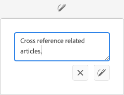

# Variaties - Fragmentinhoud ontwerpen{#variations-authoring-fragment-content}

[Variaties](/help/assets/content-fragments/content-fragments.md#constituent-parts-of-a-content-fragment) zijn een significante eigenschap van de Fragments van de Inhoud in as a Cloud Service Manager van de Belichting van de Adobe (AEM). De reden hiervoor is dat u hiermee kopieën van de **Master** inhoud voor gebruik op specifieke kanalen en scenario&#39;s. Dit maakt met name de levering van inhoud zonder kop nog flexibeler.

>[!NOTE]
>
>Inhoudsfragmenten zijn een functie Sites, maar worden opgeslagen als **Activa**.
>
>Er zijn twee editors voor het ontwerpen van inhoudsfragmenten. In deze sectie wordt de oorspronkelijke editor beschreven, die voornamelijk wordt geopend vanuit de **Activa** console. Zie de documentatie van Plaatsen, [Inhoudsfragmenten - Authoring](/help/sites-cloud/administering/content-fragments/authoring.md), voor meer informatie over de nieuwe editor (die voornamelijk wordt benaderd vanuit de **Inhoudsfragmenten** console).

Van de **Variaties** kunt u het volgende doen:

* [Voer de inhoud in](#authoring-your-content) voor het fragment,
* [Variaties maken en beheren](#managing-variations) van de **Master** inhoud,

Voer een reeks andere acties uit afhankelijk van het gegevenstype dat wordt bewerkt, bijvoorbeeld:

* [Visuele elementen in een fragment invoegen](#inserting-assets-into-your-fragment) (afbeeldingen)

* Selecteren tussen [RTF](#rich-text), [Onbewerkte tekst](#plain-text), en [Markering](#markdown) voor bewerking

* [Inhoud uploaden](#uploading-content)

* [Belangrijkste statistieken weergeven](#viewing-key-statistics) (over tekst met meerdere regels)

* [Tekst samenvatten](#summarizing-text)

* [Variaties synchroniseren met stramieninhoud](#synchronizing-with-master)

>[!CAUTION]
>
>Nadat een fragment is gepubliceerd en/of waarnaar wordt verwezen, wordt AEM een waarschuwing weergegeven wanneer een auteur het fragment opent voor opnieuw bewerken. Hiermee wordt u gewaarschuwd dat wijzigingen in het fragment ook van invloed zijn op de pagina&#39;s waarnaar wordt verwezen.

## Inhoud ontwerpen {#authoring-your-content}

Wanneer u het inhoudsfragment opent voor bewerking, worden de **Variaties** is standaard geopend. Hier kunt u de inhoud ontwerpen, voor stramien of variaties die u hebt. Het gestructureerde fragment bevat velden van diverse gegevenstypen die in het inhoudsmodel zijn gedefinieerd.

Bijvoorbeeld:

U kunt:

* Bewerk de inhoud rechtstreeks in het dialoogvenster **Variaties** tab; elk gegevenstype biedt verschillende bewerkingsopties, bijvoorbeeld:

   * for **Tekst met meerdere regels** kunt u ook de [full-screen redacteur](#full-screen-editor) tot:

      * Selecteer de [Indeling](#formats)
      * zie meer bewerkingsopties (voor [RTF](#rich-text) bestandsindeling)
      * toegang tot een reeks [handelingen](#actions)

   * Voor **Fragmentverwijzing** velden, [Inhoudsfragment bewerken](#fragment-references-edit-content-fragment) Deze optie kan beschikbaar zijn, afhankelijk van de modeldefinitie.

* Toewijzen **Tags** aan de huidige variatie; de markeringen kunnen worden toegevoegd, worden bijgewerkt en worden verwijderd.

   * [Tags](/help/sites-cloud/authoring/sites-console/tags.md) zijn krachtig wanneer het organiseren van uw fragmenten aangezien zij voor inhoudsclassificatie en taxonomie kunnen worden gebruikt. Tags kunnen worden gebruikt voor het zoeken naar inhoud (door tags) en het toepassen van bulkbewerkingen.

      * Zoekt naar een tag en retourneert het fragment, waarbij de tagvariatie is gemarkeerd.
      * Variatietags kunnen ook worden gebruikt om variaties te groeperen voor een specifiek CDN-profiel (Content Delivery Network) (voor CDN-caching) in plaats van de variatienaam te gebruiken.

     U kunt bijvoorbeeld relevante fragmenten labelen als &#39;kerstlancering&#39; om alleen deze fragmenten als een subset te kunnen doorbladeren, of om ze te kopiëren voor gebruik met een andere toekomstige start in een nieuwe map.

  >[!NOTE]
  >
  >**Tags** kan ook worden toegevoegd (aan **Master** wijziging) als onderdeel van de [Metagegevens](/help/assets/content-fragments/content-fragments-metadata.md)

* [Variaties maken en beheren](#managing-variations) van de **Master** inhoud.

>[!NOTE]
>
>Afhankelijk van definities in het onderliggende model kunnen velden worden onderworpen aan bepaalde typen [Validatie](/help/assets/content-fragments/content-fragments-models.md#validation).

### Volledige schermeditor {#full-screen-editor}

Wanneer u een tekstveld met meerdere regels bewerkt, kunt u de volledige schermeditor openen. Selecteer de gewenste tekst en selecteer vervolgens het volgende actiepictogram:

Hiermee opent u de teksteditor voor het volledige scherm:

De teksteditor voor volledig scherm biedt de volgende mogelijkheden:

* Toegang tot verschillende [handelingen](#actions)
* Afhankelijk van de [format](#formats), aanvullende opmaakopties ([RTF](#rich-text))

### Handelingen {#actions}

De volgende acties zijn ook beschikbaar (voor alle [formaten](#formats)) als de volledige-schermeditor (dat wil zeggen tekst met meerdere regels) is geopend:

* Selecteer de [format](#formats) ([RTF](#rich-text), [Onbewerkte tekst,](#plain-text) [Markering](#markdown))

* [Inhoud uploaden](#uploading-content)

* [Tekststatistieken tonen](#viewing-key-statistics)

* [Synchroniseren met stramien](#synchronizing-with-master) (bij het bewerken van een variatie)

* [Tekst samenvatten](#summarizing-text)

### Indelingen {#formats}

De opties voor het bewerken van tekst met meerdere regels zijn afhankelijk van de geselecteerde indeling:

* [RTF](#rich-text)
* [Onbewerkte tekst](#plain-text)
* [Markering](#markdown)

De indeling kan worden geselecteerd in de schermvullende editor.

### RTF {#rich-text}

Met RTF-bewerking kunt u opmaken:

* Vet
* Cursief
* Onderstrepen
* Uitlijning: links, midden, rechts
* Lijst met opsommingstekens
* Genummerde lijst
* Inspringing: verhogen, verlagen
* Hyperlinks maken/verbreken
* Tekst/tekst uit Word plakken
* Een tabel invoegen
* Alineastijl: Alinea, kop 1/2/3
* [Element invoegen](#inserting-assets-into-your-fragment)
* Open de volledige-schermredacteur, waar de volgende het formatteren opties beschikbaar zijn:
   * Zoeken
   * Zoeken/vervangen
   * Spellingcontrole
   * [Annotaties](/help/assets/content-fragments/content-fragments-variations.md#annotating-a-content-fragment)
* [Inhoudsfragment invoegen](#inserting-content-fragment-into-your-fragment); beschikbaar als uw **Tekst met meerdere regels** veld is geconfigureerd met **Fragmentverwijzing toestaan**.

De [handelingen](#actions) zijn ook toegankelijk van de volledig-schermredacteur.

### Onbewerkte tekst {#plain-text}

Met platte tekst kunt u snel inhoud invoeren zonder opmaak- of markeringsgegevens. U kunt de volledige-schermeditor ook voor meer informatie openen [handelingen](#actions).

>[!CAUTION]
>
>Als u **Onbewerkte tekst**, kunt u opmaak of markeringen verliezen of elementen die u in een van beide hebt ingevoegd **RTF** of **Markering**.

### Markering {#markdown}

>[!NOTE]
>
>Voor volledige informatie raadpleegt u de [Markering](/help/assets/content-fragments/content-fragments-markdown.md) documentatie.

Hiermee kunt u de tekst opmaken met behulp van een markering. U kunt het volgende definiëren:

* Koppen
* Alinea&#39;s en regeleinden
* Koppelingen
* Afbeeldingen
* Aanhalingstekens blokkeren
* Lijsten
* Nadruk
* Codeblokken
* backslash-eces

U kunt de volledige-schermeditor ook voor meer informatie openen [handelingen](#actions).

>[!CAUTION]
>
>Als u tussen **Tekst met opmaak** en **Markdown** schakelt, kunt u onverwachte effecten met Blokcitaten en Codeblokken ervaren, aangezien deze twee opmaakindelingen verschillen in hoe zij worden behandeld.

### Fragmentverwijzingen {#fragment-references}

Als het Content Fragment-model fragmentverwijzingen bevat, hebben de auteurs van het fragment mogelijk aanvullende opties:

* [Inhoudsfragment bewerken](#fragment-references-edit-content-fragment)
* [Nieuw inhoudsfragment](#fragment-references-new-content-fragment)

#### Inhoudsfragment bewerken {#fragment-references-edit-content-fragment}

De optie **Inhoudsfragment bewerken** Hiermee opent u dat fragment op een nieuw editortabblad (binnen hetzelfde browsertabblad).

Het oorspronkelijke tabblad opnieuw selecteren (bijvoorbeeld **Little Pony Inc.**) sluit dit secundaire tabblad (in dit geval, **Adam Smith**).

#### Nieuw inhoudsfragment {#fragment-references-new-content-fragment}

De optie **Nieuw inhoudsfragment** Hiermee kunt u een fragment maken. Hiervoor wordt een variant van de wizard voor het maken van inhoudsfragmenten geopend in de editor.

**Een inhoudsfragment maken:**

1. Navigeer naar en selecteer de gewenste map.
1. Selecteren **Volgende**.
1. Eigenschappen opgeven, bijvoorbeeld **Titel**.
1. Selecteren **Maken**.
1. Tot slot:
   1. **Gereed**:
      * retourneert (naar het oorspronkelijke fragment)
      * verwijst naar het nieuwe fragment
   1. **Openen**:
      * verwijst naar het nieuwe fragment
      * Hiermee opent u het nieuwe fragment om het te bewerken in een nieuw browsertabblad

### Belangrijkste statistieken weergeven {#viewing-key-statistics}

Wanneer de volledige het schermredacteur open is, de actie **Tekststatistieken** geeft een gegevensbereik over de tekst weer.

Bijvoorbeeld:

### Inhoud uploaden {#uploading-content}

U kunt het maken van inhoudsfragmenten vereenvoudigen door tekst te uploaden die is voorbereid in een externe editor en deze rechtstreeks toe te voegen aan het fragment.

### Tekst samenvatten {#summarizing-text}

Samenvattende tekst is ontworpen om gebruikers te helpen de lengte van hun tekst te beperken tot een vooraf gedefinieerd aantal woorden, terwijl de hoofdpunten en de algemene betekenis behouden blijven.

>[!NOTE]
>
>Op een meer technisch niveau houdt het systeem de zinnen die het als het verstrekken van *beste verhouding tussen informatiedichtheid en uniciteit* volgens specifieke algoritmen.

>[!CAUTION]
>
>Het inhoudsfragment moet een geldige taalmap (ISO-code) hebben als voorouder. Hiermee wordt bepaald welk taalmodel moet worden gebruikt.
>
>Bijvoorbeeld: `en/` zoals in het volgende pad:
>
>  `/content/dam/my-brand/en/path-down/my-content-fragment`

>[!CAUTION]
>
>Engels is beschikbaar buiten de box.
>
>Andere talen zijn beschikbaar als Pakketten van het Model van de Taal van Software Distributie:
>
>* [Frans (fr)](https://experience.adobe.com/#/downloads/content/software-distribution/en/aem.html?package=/content/software-distribution/en/details.html/content/dam/aem/public/adobe/packages/cq630/product/smartcontent-model-fr)
>* [Duits (de)](https://experience.adobe.com/#/downloads/content/software-distribution/en/aem.html?package=/content/software-distribution/en/details.html/content/dam/aem/public/adobe/packages/cq630/product/smartcontent-model-de)
>* [Italiaans (it)](https://experience.adobe.com/#/downloads/content/software-distribution/en/aem.html?package=/content/software-distribution/en/details.html/content/dam/aem/public/adobe/packages/cq630/product/smartcontent-model-it)
>* [Spaans (es)](https://experience.adobe.com/#/downloads/content/software-distribution/en/aem.html?package=/content/software-distribution/en/details.html/content/dam/aem/public/adobe/packages/cq630/product/smartcontent-model-es)
>

1. Selecteren **Master** of de vereiste variatie.
1. Open de editor voor het volledige scherm.

1. Selecteren **Tekst samenvatten** op de werkbalk.

   

1. Geef het doelaantal woorden op en selecteer **Start**:
1. De oorspronkelijke tekst wordt naast de voorgestelde samenvatting weergegeven:

   * Alle zinnen die moeten worden verwijderd, worden rood gemarkeerd met doorhaling.
   * Klik op een gemarkeerde zin, zodat u deze in de samengevatte inhoud kunt houden.
   * Klik op een niet-gemarkeerde zin, zodat deze kan worden verwijderd.

1. Selecteren **Samenvatten** om de wijzigingen te bevestigen.

1. De oorspronkelijke tekst wordt naast de voorgestelde samenvatting weergegeven:

   * Alle zinnen die moeten worden verwijderd, worden rood gemarkeerd met doorhaling.
   * Klik op een gemarkeerde zin, zodat u deze in de samengevatte inhoud kunt houden.
   * Klik op een niet-gemarkeerde zin, zodat deze kan worden verwijderd.
   * De samenvattingsstatistieken worden weergegeven: **Werkelijk** en **Doel**-
   * U kunt **Voorvertoning** de wijzigingen.

   

### Een inhoudsfragment annoteren {#annotating-a-content-fragment}

Een fragment annoteren:

1. Selecteren **Master** of de vereiste variatie.

1. Open de editor voor het volledige scherm.

1. De **Annoteren** is beschikbaar in de bovenste werkbalk. U kunt desgewenst tekst selecteren.

   

1. Er wordt een dialoogvenster geopend. Hier kunt u uw annotatie invoeren.

   

1. Selecteren **Toepassen** in het dialoogvenster.

   

   Als de annotatie is toegepast op de geselecteerde tekst, blijft die tekst gemarkeerd.

   

1. Sluit de volledige-schermredacteur, de annotaties worden nog benadrukt. Als deze optie is geselecteerd, wordt een dialoogvenster geopend waarin u de annotatie verder kunt bewerken.

1. Selecteren **Opslaan**.

1. Sluit de volledige-schermredacteur, de annotaties worden nog benadrukt. Als deze optie is geselecteerd, wordt een dialoogvenster geopend waarin u de annotatie verder kunt bewerken.

   

### Annotaties weergeven, bewerken, verwijderen {#viewing-editing-deleting-annotations}

Annotaties:

* Deze worden aangegeven door de markering in de tekst, zowel in de modus Volledig scherm als in de normale modus van de editor. Alle details van een annotatie kunnen vervolgens worden weergegeven, bewerkt en/of verwijderd door op de gemarkeerde tekst te klikken, waarna het dialoogvenster opnieuw wordt geopend.

  >[!NOTE]
  >
  >Er is een keuzekiezer beschikbaar als er meerdere annotaties zijn toegepast op één stuk tekst.

* Wanneer u de volledige tekst verwijdert waarop de annotatie is toegepast, wordt de annotatie ook verwijderd.

* Deze kan worden vermeld en verwijderd door de optie **Annotaties** in de fragmenteditor.

  

* U kunt de selectie weergeven en verwijderen in het dialoogvenster [Tijdlijn](/help/assets/content-fragments/content-fragments-managing.md#timeline-for-content-fragments) voor het geselecteerde fragment.

### Elementen invoegen in uw fragment {#inserting-assets-into-your-fragment}

U kunt toevoegen om het ontwerpen van inhoudsfragmenten te vereenvoudigen [Activa](/help/assets/manage-digital-assets.md) (afbeeldingen) rechtstreeks naar het fragment.

Ze worden zonder opmaak toegevoegd aan de alineasequentie van het fragment. De opmaak kan worden uitgevoerd wanneer de [fragment wordt gebruikt of er wordt naar verwezen op een pagina](/help/sites-cloud/authoring/fragments/content-fragments.md).

>[!CAUTION]
>
>Deze elementen kunnen niet worden verplaatst of verwijderd op een pagina waarnaar wordt verwezen. Dit moet gebeuren in de fragmenteditor.
>
>De opmaak van het element (bijvoorbeeld de grootte) moet echter worden uitgevoerd in het dialoogvenster [paginaeditor](/help/sites-cloud/authoring/fragments/content-fragments.md). De representatie van het element in de fragmenteditor is uitsluitend bedoeld voor het ontwerpen van de inhoudsstroom.

>[!NOTE]
>
>Er zijn verschillende methoden om toe te voegen [afbeeldingen](/help/assets/content-fragments/content-fragments.md#fragments-with-visual-assets) op het fragment en/of de pagina.

1. Plaats de cursor op de positie waar u de afbeelding wilt toevoegen.
1. Gebruik het pictogram **Asset invoegen** om het zoekdialoogvenster te openen.

   

1. In het dialoogvenster kunt u naar het vereiste element navigeren in DAM of het element zoeken in DAM.

   Selecteer het gewenste element door op de miniatuur te klikken.

1. Gebruik **Selecteren** om de asset op de huidige locatie toe te voegen aan het alineasysteem van het contentfragment.

   >[!CAUTION]
   >
   >Nadat u een element hebt toegevoegd, als u de indeling wijzigt in:
   >
   >* **Onbewerkte tekst**: het element gaat verloren door het fragment.
   >* **Markering**: het element is niet zichtbaar, maar blijft aanwezig wanneer u terugkeert naar **RTF**.

### Een inhoudsfragment invoegen in uw fragment {#inserting-content-fragment-into-your-fragment}

U kunt het maken van inhoudsfragmenten vereenvoudigen door ook een ander inhoudsfragment aan het fragment toe te voegen.

Ze worden als een referentie toegevoegd op de huidige locatie in het fragment.

>[!NOTE]
>
>Deze optie is beschikbaar als **Tekst met meerdere regels** is geconfigureerd met **Fragmentverwijzing toestaan**.

>[!CAUTION]
>
>Deze elementen kunnen niet worden verplaatst of verwijderd op een pagina waarnaar wordt verwezen. Dit moet gebeuren in de fragmenteditor.
>
>De opmaak van het element (bijvoorbeeld de grootte) moet echter worden uitgevoerd in het dialoogvenster [paginaeditor](/help/sites-cloud/authoring/fragments/content-fragments.md). De representatie van het element in de fragmenteditor is uitsluitend bedoeld voor het ontwerpen van de inhoudsstroom.

>[!NOTE]
>
>Er zijn verschillende methoden om toe te voegen [afbeeldingen](/help/assets/content-fragments/content-fragments.md#fragments-with-visual-assets) op het fragment en/of de pagina.

1. Plaats de cursor op de positie waar u het fragment wilt toevoegen.
1. Gebruik de **Inhoudsfragment invoegen** om het zoekdialoogvenster te openen.

   

1. In het dialoogvenster kunt u naar het gewenste fragment in de map Middelen navigeren of naar het fragment zoeken.

   Selecteer het gewenste fragment door op de miniatuur te klikken.

1. Gebruiken **Selecteren** om een verwijzing naar het geselecteerde inhoudsfragment toe te voegen aan het huidige inhoudsfragment (op de huidige locatie).

   >[!CAUTION]
   >
   >Nadat u een verwijzing naar een ander fragment hebt toegevoegd, wijzigt u de indeling in:
   >
   >* **Onbewerkte tekst**: de verwijzing gaat verloren door het fragment.
   >* **Markering**: de verwijzing blijft behouden.

## Overerving {#inheritance}

Overerving is het mechanisme waarbij inhoud automatisch van het ene naar het andere fragment kan worden verplaatst. Overgenomen velden en variaties kunnen het product zijn van [Beheer van meerdere sites](/help/assets/content-fragments/content-fragments-msm.md).

U kunt de overerving annuleren (en vervolgens opnieuw inschakelen). Afhankelijk van de context, kan dit voor een variatie, of een individueel gebied, beschikbaar zijn als het fragment deel van een levende kopie uitmaakt.

Bijvoorbeeld:

* Overerving annuleren

  

* Overerving opnieuw inschakelen (als overerving al is geannuleerd)

  

<!--
* Rollout action is also available in Live Copy source

  
-->

## Variaties beheren {#managing-variations}

### Een variatie maken {#creating-a-variation}

Met variaties kunt u de **Master** inhoud en variëren naar gelang van het doel (indien nodig).

**Een variatie maken:**

1. Open het fragment en controleer of het zijpaneel zichtbaar is.
1. Selecteren **Variaties** in de pictogrambalk in het zijpaneel.
1. Selecteren **Variatie maken**.
1. Er wordt een dialoogvenster geopend waarin u de **Titel** en **Beschrijving** voor de nieuwe wijziging.
1. Selecteren **Toevoegen**; het fragment **Master** wordt gekopieerd naar de nieuwe variatie waarvoor nu een [bewerken](#editing-a-variation).

   >[!NOTE]
   >
   >Bij het maken van een variatie is dit altijd de **Master** dat wordt gekopieerd, niet de variatie die open is.

   >[!NOTE]
   >
   >Wanneer u een variatie maakt, alles **Tags** momenteel toegewezen aan **Master** variatie wordt naar de nieuwe variatie gekopieerd.

### Een variatie bewerken {#editing-a-variation}

U kunt de variatie-inhoud wijzigen na:

* [Uw variatie maken](#creating-a-variation).
* Een bestaand fragment openen en vervolgens de gewenste variant in het zijpaneel selecteren.

### De naam van een variatie wijzigen {#renaming-a-variation}

1. Open het fragment en selecteer **Variaties** in het zijpaneel.
1. Selecteer de gewenste variatie.
1. Selecteren **Naam wijzigen** van de **Handelingen** vervolgkeuzelijst.

1. Voer in het dialoogvenster dat verschijnt de nieuwe **titel** en/of **beschrijving** in.

1. Bevestig de **Naam wijzigen** handeling.

>[!NOTE]
>
>Dit is alleen van invloed op de variatie **Titel**.

### Een variatie verwijderen {#deleting-a-variation}

1. Open het fragment en selecteer **Variaties** in het zijpaneel.
1. Selecteer de gewenste variatie.
1. Selecteren **Verwijderen** van de **Handelingen** vervolgkeuzelijst.

1. Bevestig de **Verwijderen** in het dialoogvenster.

>[!NOTE]
>
>U kunt niet verwijderen **Master**.

### Synchroniseren met stramien {#synchronizing-with-master}

**Master** maakt deel uit van een inhoudsfragment en per definitie de hoofdkopie van de inhoud bevat. Terwijl de variaties de individuele bijgewerkte en op maat gemaakte versies van die inhoud houden. Wanneer de Master wordt bijgewerkt, is het mogelijk dat deze wijzigingen ook relevant zijn voor de wijzigingen en daarom aan hen moeten worden doorgegeven.

Wanneer u een variatie bewerkt, hebt u toegang tot de handeling voor het synchroniseren van het huidige element van de variatie met stramien. Hiermee kunt u automatisch wijzigingen kopiëren die u hebt aangebracht in Stramien naar de gewenste variatie.

>[!CAUTION]
>
>De synchronisatie is alleen beschikbaar om wijzigingen *van **Master**naar de variatie* te kopiëren.
>
>Alleen het huidige element van de variatie wordt gesynchroniseerd.
>
>Synchronisatie werkt alleen op de **Tekst met meerdere regels** gegevenstype.
>
>Het overbrengen van wijzigingen *van een variatie naar **master*** is niet beschikbaar als optie.

1. Open het inhoudsfragment in de fragmenteditor. Zorg ervoor dat de **Master** is bewerkt.

1. Selecteer een specifieke variant en kies vervolgens de gewenste synchronisatiehandeling uit:

   * de **Handelingen** drop-down kiezer - **Huidig element synchroniseren met stramien**

     

   * de werkbalk van de volledige schermweergave - **Synchroniseren met stramien**

     

1. Stramien en variaties worden naast elkaar weergegeven:

   * groen geeft aan dat inhoud is toegevoegd (aan de variatie)
   * rood geeft aan dat inhoud is verwijderd (uit de variatie)
   * blauw geeft vervangen tekst aan

   

1. Selecteren **Synchroniseren**, wordt de variatie bijgewerkt en weergegeven.
