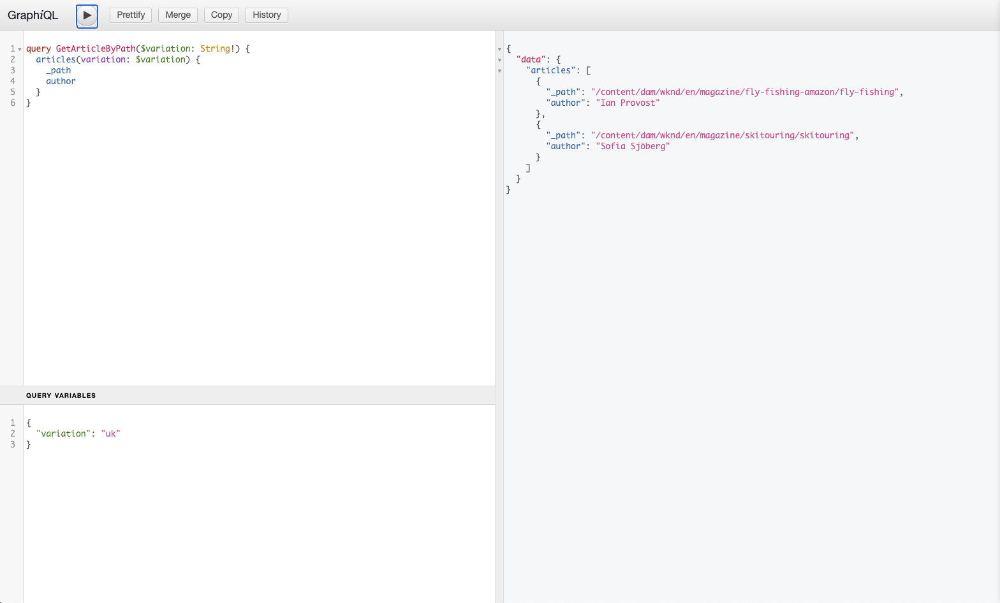

# AEM GraphQL API voor gebruik met Content Fragments {#graphql-api-for-use-with-content-fragments}

Leer hoe u Content Fragments in Adobe Experience Manager (AEM) gebruikt als Cloud Service met de AEM GraphQL API voor het leveren van inhoud zonder kop.

AEM als Cloud Service GraphQL API die met Inhoudsfragmenten wordt gebruikt is sterk gebaseerd op de standaard, open-source GraphQL API.

Door de GraphQL API in AEM te gebruiken, kunt u inhoudsfragmenten efficiënt aan JavaScript-clients leveren in CMS-implementaties zonder kop:

* Herhalende API-aanvragen voorkomen, zoals REST,
* ervoor zorgen dat de levering beperkt blijft tot de specifieke eisen;
* Het toestaan voor bulklevering van precies wat voor het teruggeven als antwoord op één enkele API vraag nodig is.

>[!NOTE]
>
>GraphQL wordt momenteel gebruikt in twee (afzonderlijke) scenario&#39;s in Adobe Experience Manager (AEM) als Cloud Service:
>
>* [AEM de Handel verbruikt gegevens van een platform van de Handel via GraphQL](/help/commerce-cloud/architecture/magento.md).
>* AEM Inhoudsfragmenten werken samen met de AEM GraphQL API (een aangepaste implementatie op basis van standaard GraphQL) voor gestructureerde inhoud voor gebruik in uw toepassingen.


## De GraphQL API {#graphql-api}

GraphQL is:

* &quot;*..een querytaal voor API&#39;s en een runtime voor het uitvoeren van deze query&#39;s met uw bestaande gegevens. GraphQL verstrekt een volledige en begrijpelijke beschrijving van de gegevens in uw API, geeft cliënten de macht om precies te vragen wat zij en niets meer nodig hebben, maakt het gemakkelijker om APIs in tijd te evolueren, en laat krachtige ontwikkelaarshulpmiddelen toe.*&quot;.

   Zie [GraphQL.org](https://graphql.org)

* &quot;*..een open specificatie voor een flexibele API-laag. GrafiekQL op uw bestaande achtergronden plaatsen om producten sneller dan ooit te bouwen....*&quot;.

   Zie [GraphQL](https://www.graphql.com) verkennen.

* *&quot;...een taal en specificatie voor gegevensquery die in 2012 intern door Facebook zijn ontwikkeld voordat deze in 2015 openbaar werd uitbesteed. Het biedt een alternatief voor op REST gebaseerde architecturen met als doel de productiviteit van ontwikkelaars te verhogen en de hoeveelheden overgedragen gegevens te minimaliseren. GraphQL wordt gebruikt in productie door honderden organisaties van om het even welke grootte..&quot;*

   Zie [GraphQL Foundation](https://foundation.graphql.org/).

<!--
"*Explore GraphQL is maintained by the Apollo team. Our goal is to give developers and technical leaders around the world all of the tools they need to understand and adopt GraphQL.*". 
-->

Zie de volgende secties (onder andere bronnen) voor meer informatie over de GraphQL API:

* Bij [graphql.org](https://graphql.org):

   * [Inleiding tot GraphQL](https://graphql.org/learn)

   * [De GraphQL-specificatie](http://spec.graphql.org/)

* Op [graphql.com](https://graphql.com):

   * [Hulplijnen](https://www.graphql.com/guides/)

   * [Tutorials](https://www.graphql.com/tutorials/)

   * [Casestudy&#39;s](https://www.graphql.com/case-studies/)

GraphQL voor AEM implementatie is gebaseerd op de standaard Java Library GraphQL. Zie:

* [graphQL.org - Java](https://graphql.org/code/#java)

* [GraphQL Java bij GitHub](https://github.com/graphql-java)

### GraphQL-terminologie {#graphql-terminology}

GraphQL gebruikt het volgende:

* **[Zoekopdrachten](https://graphql.org/learn/queries/)**

* **[Schema&#39;s en typen](https://graphql.org/learn/schema/)**:

   * Schema&#39;s worden gegenereerd door AEM op basis van de modellen van inhoudsfragmenten.
   * Gebruikend uw schema&#39;s, stelt GraphQL de types en verrichtingen voor toegelaten GraphQL voor AEM implementatie voor.

* **[Velden](https://graphql.org/learn/queries/#fields)**

* **[GraphQL-eindpunt](#graphql-aem-endpoint)**
   * De weg in AEM die aan vragen GraphQL antwoordt, en toegang tot de schema&#39;s GraphQL verleent.

   * Zie [Het toelaten van uw Eindpunt GraphQL](#enabling-graphql-endpoint) voor verdere details.

Zie [ (GraphQL.org) Inleiding aan GraphQL](https://graphql.org/learn/) voor uitvoerige details, met inbegrip van [Beste praktijken](https://graphql.org/learn/best-practices/).

### GraphQL-querytypen {#graphql-query-types}

Met GraphQL kunt u vragen uitvoeren om of terug te keren:

* A **single entry**

* A **[lijst van vermeldingen](https://graphql.org/learn/schema/#lists-and-non-null)**

<!--
You can also perform:

* [Persisted Queries, that are cached](#persisted-queries-caching)
-->

## GraphQL voor AEM Endpoint {#graphql-aem-endpoint}

Het eindpunt is de weg die wordt gebruikt om tot GraphQL voor AEM toegang te hebben. Met dit pad kunt u (of uw app) het volgende doen:

* toegang tot het GraphQL-schema;
* verzend uw vragen GraphQL,
* ontvangt de reacties (op uw vragen GraphQL).

Het bewaarplaatspad van GraphQL voor AEM eindpunt is:

`/content/cq:graphql/global/endpoint`

Uw app kan het volgende pad gebruiken in de aanvraag-URL:

`/content/_cq_graphql/global/endpoint.json`

Om het eindpunt voor GraphQL voor AEM toe te laten moet u:

>[!CAUTION]
>
>Deze stappen kunnen in de nabije toekomst veranderen.

* [GrafiekQL-eindpunt inschakelen](#enabling-graphql-endpoint)
* [Aanvullende configuraties uitvoeren](#additional-configurations-graphql-endpoint)

### Het toelaten van uw Eindpunt GraphQL {#enabling-graphql-endpoint}

>[!NOTE]
>
>Zie [Ondersteunende pakketten](#supporting-packages) voor details van de pakketten die Adobe verstrekt helpen deze stappen vereenvoudigen.

Om vragen GraphQL in AEM toe te laten, creeer een eindpunt bij `/content/cq:graphql/global/endpoint`:

* De knooppunten `cq:graphql` en `global` moeten van het type `sling:Folder` zijn.
* Knooppunt `endpoint` moet van het type `nt:unstructured` zijn en een `sling:resourceType` van `graphql/sites/components/endpoint` bevatten.

>[!CAUTION]
>
>Het eindpunt is toegankelijk voor iedereen. Dit kan - vooral bij publiceer instanties - een veiligheidszorg veroorzaken, aangezien de vragen GraphQL een zware lading op de server kunnen opleggen.
>
>U kunt opstelling ACLs, aangewezen aan uw gebruiksgeval, op het eindpunt.

>[!NOTE]
>
>Uw eindpunt zal niet uit-van-de-doos werken. U zult [Aanvullende Configuraties voor Eindpunt GraphQL](#additional-configurations-graphql-endpoint) afzonderlijk moeten verstrekken.

>[!NOTE]
>Bovendien kunt u vragen testen en zuiveren GraphQL gebruikend [GrahiQL winde](#graphiql-interface).

### Aanvullende configuraties voor GraphQL-eindpunt {#additional-configurations-graphql-endpoint}

>[!NOTE]
>
>Zie [Ondersteunende pakketten](#supporting-packages) voor details van de pakketten die Adobe verstrekt helpen deze stappen vereenvoudigen.

Aanvullende configuraties zijn vereist:

* Dispatcher:
   * Vereiste URL&#39;s toestaan
   * Verplicht
* Vanity URL:
   * Een vereenvoudigde URL toewijzen voor het eindpunt
   * Optioneel

### Ondersteunende pakketten {#supporting-packages}

Om de opstelling van een eindpunt te vereenvoudigen GraphQL, verstrekt Adobe [GraphQL het Pakket van de Steekproef van het Project (2021.3)](https://experience.adobe.com/#/downloads/content/software-distribution/en/aemcloud.html?package=/content/software-distribution/en/details.html/content/dam/aemcloud/public/aem-graphql/graphql-sample1.zip).

Dit archief bevat zowel [de vereiste extra configuratie](#additional-configurations-graphql-endpoint) als [het eindpunt GraphQL](#enabling-graphql-endpoint). Als geïnstalleerd op een gewone AEM instantie, zal het een volledig werkend eindpunt GraphQL op `/content/cq:graphql/global/endpoint` blootstellen.

Dit pakket is bedoeld om een blauwdruk voor uw eigen projecten te zijn GraphQL. Zie het pakket **README** voor meer informatie over het gebruik van het pakket.

Als u verkiest om de vereiste configuratie manueel tot stand te brengen, verstrekt Adobe ook een specifieke [GraphQL het Pakket van de Inhoud van het Eindpunt](https://experience.adobe.com/#/downloads/content/software-distribution/en/aemcloud.html?package=%2Fcontent%2Fsoftware-distribution%2Fen%2Fdetails.html%2Fcontent%2Fdam%2Faemcloud%2Fpublic%2Faem-graphql%2Fgraphql-global-endpoint.zip). Dit inhoudspakket bevat het eindpunt GraphQL slechts, zonder enige configuratie.

## GraphiQL Interface {#graphiql-interface}

<!--
AEM Graph API includes an implementation of the standard [GraphiQL](https://graphql.org/learn/serving-over-http/#graphiql) interface. This allows you to directly input, and test, queries.
-->

Een implementatie van de standaard [GraphiQL](https://graphql.org/learn/serving-over-http/#graphiql) interface is beschikbaar voor gebruik met AEM GraphQL. Dit kan [geïnstalleerd met AEM](#installing-graphiql-interface) zijn.

Met deze interface kunt u query&#39;s rechtstreeks invoeren en testen.

Bijvoorbeeld:

* `http://localhost:4502/content/graphiql.html`

Dit biedt functies zoals syntaxismarkering, automatisch aanvullen, automatisch voorstellen, samen met een geschiedenis en online documentatie:


### Installatie van de AEM GraphiQL-interface {#installing-graphiql-interface}

De GraphiQL-gebruikersinterface kan worden geïnstalleerd op AEM met een toegewezen pakket: het [GraphiQL-inhoudspakket v0.0.6 (2021.3)](https://experience.adobe.com/#/downloads/content/software-distribution/en/aemcloud.html?package=/content/software-distribution/en/details.html/content/dam/aemcloud/public/aem-graphql/graphiql-0.0.6.zip)-pakket.

<!--
See the package **README** for full details; including full details of how it can be installed on an AEM instance - in a variety of scenarios.
-->

## Gevallen gebruiken voor auteur- en publicatie-omgevingen {#use-cases-author-publish-environments}

De gebruiksgevallen kunnen van het type van AEM als Cloud Service milieu afhangen:

* Publicatie-omgeving; gebruikt voor:
   * Query-gegevens voor JS-toepassing (standaardgebruikscenario)

* Auteursomgeving; gebruikt voor:
   * Query-gegevens voor &quot;inhoudsbeheerdoeleinden&quot;:
      * GraphQL in AEM als Cloud Service is momenteel een alleen-lezen API.
      * De REST-API kan worden gebruikt voor CR(u)D-bewerkingen.

## Machtigingen {#permission}

De machtigingen zijn vereist voor toegang tot middelen.

## Schema genereren {#schema-generation}

GraphQL is een sterk getypte API, wat betekent dat de gegevens duidelijk gestructureerd en georganiseerd moeten zijn door type.

De specificatie GraphQL verstrekt een reeks richtlijnen op hoe te om tot een robuuste API voor het ondervragen van gegevens over een bepaalde instantie te leiden. Om dit te doen, moet een cliënt [Schema](#schema-generation) halen, die alle types noodzakelijk voor een vraag bevat.

Voor Inhoudsfragmenten zijn de GrafiekQL-schema&#39;s (structuur en typen) gebaseerd op **Ingeschakeld** [Inhoudsfragmentmodellen](/help/assets/content-fragments/content-fragments-models.md) en hun gegevenstypen.

>[!CAUTION]
>
>Alle schema&#39;s GraphQL (die uit de Modellen van het Fragment van de Inhoud worden afgeleid die **Enabled** zijn geweest) zijn leesbaar door het eindpunt GraphQL.
>
>Dit betekent dat u ervoor moet zorgen dat er geen gevoelige gegevens beschikbaar zijn, aangezien deze op deze manier kunnen worden gelekt; Dit omvat bijvoorbeeld informatie die als veldnamen in de modeldefinitie aanwezig kan zijn.

Als een gebruiker bijvoorbeeld een Content Fragment Model met de naam `Article` heeft gemaakt, AEM het object `article` van het type `ArticleModel` genereren. De velden in dit type komen overeen met de velden en gegevenstypen die in het model zijn gedefinieerd.

1. A Content Fragment Model:

   

1. Het corresponderende GraphQL-schema (uitvoer van de automatische documentatie GraphiQL):
   

   Dit toont aan dat het geproduceerde type `ArticleModel` verscheidene [gebieden](#fields) bevat.

   * Drie van hen zijn gecontroleerd door de gebruiker: `author`, `main` en `referencearticle`.

   * De andere velden zijn automatisch toegevoegd door AEM en zijn nuttige methoden voor het verschaffen van informatie over een bepaald inhoudsfragment. in dit voorbeeld, `_path`, `_metadata`, `_variations`. Deze [helpergebieden](#helper-fields) zijn duidelijk met voorafgaande `_` om tussen wat door de gebruiker is bepaald en wat auto-geproduceerd te onderscheiden.

1. Nadat een gebruiker tot een Fragment van de Inhoud leidt dat op het model van het Artikel wordt gebaseerd, kan het dan door GraphQL worden ondervraagd. Zie [Samplequery&#39;s](/help/assets/content-fragments/content-fragments-graphql-samples.md#graphql-sample-queries) (gebaseerd op een [voorbeeldstructuur van inhoudsfragment voor gebruik met GraphQL](/help/assets/content-fragments/content-fragments-graphql-samples.md#content-fragment-structure-graphql)) voor voorbeelden.

In GraphQL voor AEM, is het schema flexibel. Dit betekent dat deze telkens automatisch wordt gegenereerd wanneer een inhoudsfragmentmodel wordt gemaakt, bijgewerkt of verwijderd. De caches voor het gegevensschema worden ook vernieuwd wanneer u een model van het inhoudsfragment bijwerkt.

<!--
>[!NOTE]
>
>AEM does not use the concept of namespacing for Content Fragment Models. 
>
>If required, you can edit the **[GraphQL](/help/assets/content-fragments/content-fragments-models.md#content-fragment-model-properties)** properties of a Model to assign specific names.
-->

De dienst van GrafiekQL van Plaatsen luistert (in de achtergrond) naar om het even welke die wijzigingen aan een Model van het Fragment van de Inhoud worden aangebracht. Wanneer updates worden ontdekt, slechts wordt dat deel van het schema opnieuw geproduceerd. Deze optimalisatie bespaart tijd en zorgt voor stabiliteit.

Als u bijvoorbeeld:

1. Installeer een pakket met `Content-Fragment-Model-1` en `Content-Fragment-Model-2`:

   1. GraphQL-typen voor `Model-1` en `Model-2` worden gegenereerd.

1. Wijzig vervolgens `Content-Fragment-Model-2`:

   1. Alleen het type `Model-2` GraphQL wordt bijgewerkt.

   1. Terwijl `Model-1` hetzelfde zal blijven.

>[!NOTE]
>
>Dit is belangrijk om op te merken voor het geval u bulkupdates op de Modellen van het Fragment van de Inhoud door REST api, of anders wilt doen.

Het schema wordt gediend door het zelfde eindpunt zoals de vragen GraphQL, met de cliënt die het feit behandelt dat het schema met de uitbreiding `GQLschema` wordt geroepen. Als u bijvoorbeeld een eenvoudig `GET`-verzoek uitvoert op `/content/cq:graphql/global/endpoint.GQLschema`, wordt het schema uitgevoerd met het inhoudstype: `text/x-graphql-schema;charset=iso-8859-1`.

### Schema genereren - Niet-gepubliceerde modellen {#schema-generation-unpublished-models}

Wanneer Inhoudsfragmenten zijn genest, kan een bovenliggend inhoudsfragmentmodel worden gepubliceerd, maar een model waarnaar wordt verwezen, niet.

>[!NOTE]
>
>De AEM UI verhindert dit gebeurt, maar als het publiceren programmatically, of met inhoudspakketten wordt gemaakt, kan het voorkomen.

Wanneer dit gebeurt, AEM een *incomplete* Schema voor het model van het Fragment van de ouderinhoud produceert. Dit betekent dat de fragmentverwijzing, die afhankelijk is van het niet-gepubliceerde model, uit het schema wordt verwijderd.

## Fields {#fields}

Binnen het schema zijn er afzonderlijke velden, van twee basiscategorieën:

* Velden die u genereert.

   Een selectie van [Veldtypen](#field-types) worden gebruikt om velden te maken op basis van de manier waarop u het model voor inhoudsfragmenten configureert. De veldnamen zijn afkomstig uit het veld **Eigenschapnaam** van het **Gegevenstype**.

   * Er is ook de **Render als** bezit om in overweging te nemen, omdat de gebruikers bepaalde gegevenstypes kunnen vormen; bijvoorbeeld als tekst met één regel of als een tekstveld met meerdere regels.

* GraphQL voor AEM genereert ook een aantal [helpervelden](#helper-fields).

   Deze worden gebruikt om een inhoudsfragment te identificeren of om meer informatie over een inhoudsfragment te krijgen.

### Veldtypen {#field-types}

GraphQL voor AEM ondersteunt een lijst met typen. Alle ondersteunde gegevenstypen van het Content Fragment Model en de corresponderende typen GraphQL worden weergegeven:

| Inhoudsfragmentmodel - Gegevenstype | Type GraphQL | Beschrijving |
|--- |--- |--- |
| Tekst met één regel | Tekenreeks, [String] |  Wordt gebruikt voor eenvoudige tekenreeksen, zoals namen van auteurs, locaties, enzovoort. |
| Tekst met meerdere regels | Tekenreeks |  Wordt gebruikt voor het uitvoeren van tekst, zoals de hoofdtekst van een artikel |
| Getal |  Float, [Float] | Wordt gebruikt om het zwevende-kommagetal en de reguliere getallen weer te geven |
| Boolean |  Boolean |  Gebruikt om selectievakjes weer te geven → eenvoudige true/false-instructies |
| Datum en tijd | Kalender |  Wordt gebruikt om datum en tijd weer te geven in een ISO 8086-indeling |
| Opsomming |  Tekenreeks |  Wordt gebruikt om een optie weer te geven uit een lijst met opties die bij het maken van het model zijn gedefinieerd |
|  Tags |  [Tekenreeks] |  Wordt gebruikt om een lijst weer te geven met tekenreeksen die tags vertegenwoordigen die in AEM worden gebruikt |
| Content Reference |  Tekenreeks |  Wordt gebruikt om het pad naar een ander element in AEM weer te geven |
| Fragmentverwijzing |  *Een modeltype* |  Wordt gebruikt om te verwijzen naar een ander inhoudsfragment van een bepaald modeltype, dat is gedefinieerd toen het model werd gemaakt. |

### Helpvelden {#helper-fields}

Naast de gegevenstypen voor door de gebruiker gegenereerde velden, genereert GraphQL voor AEM ook een aantal *helper* velden om een inhoudsfragment beter te kunnen identificeren of om aanvullende informatie over een inhoudsfragment te kunnen verstrekken.

#### Pad {#path}

Het padveld wordt gebruikt als id in GraphQL. Het vertegenwoordigt het pad van het Content Fragment-element in de AEM opslagplaats. Dit is de id van een inhoudsfragment, omdat dit:

* uniek is binnen AEM,
* kan gemakkelijk worden opgehaald.

In de volgende code worden de paden weergegeven van alle inhoudsfragmenten die zijn gemaakt op basis van het inhoudsfragmentmodel `Person`.

```xml
{
  personList {
    items {
      _path
    }
  }
}
```

Als u één inhoudsfragment van een bepaald type wilt ophalen, moet u ook eerst het pad bepalen. bijvoorbeeld:

```xml
{
  personByPath(_path: "/content/dam/path/to/fragment/john-doe") {
    item {
      _path
      firstName
      name
    }
  }
}
```

Zie [Voorbeeldquery - Eén specifiek stedenfragment](/help/assets/content-fragments/content-fragments-graphql-samples.md#sample-single-specific-city-fragment).

#### Metagegevens {#metadata}

Via GraphQL stelt AEM ook de metagegevens van een inhoudsfragment beschikbaar. Metagegevens zijn de informatie die een inhoudsfragment beschrijft, zoals de titel van een inhoudsfragment, het miniatuurpad, de beschrijving van een inhoudsfragment en de datum waarop het is gemaakt.

Aangezien metagegevens worden gegenereerd via de Schema-editor en als zodanig geen specifieke structuur hebben, is het GraphQL-type `TypedMetaData` geïmplementeerd om de metagegevens van een Content Fragment beschikbaar te maken. `TypedMetaData` stelt de informatie bloot die door de volgende scalaire types wordt gegroepeerd:

| Veld |
|--- |
| `stringMetadata:[StringMetadata]!` |
| `stringArrayMetadata:[StringArrayMetadata]!` |
| `intMetadata:[IntMetadata]!` |
| `intArrayMetadata:[IntArrayMetadata]!` |
| `floatMetadata:[FloatMetadata]!` |
| `floatArrayMetadata:[FloatArrayMetadata]!` |
| `booleanMetadata:[BooleanMetadata]!` |
| `booleanArrayMetadata:[booleanArrayMetadata]!`  |
| `calendarMetadata:[CalendarMetadata]!` |
| `calendarArrayMetadata:[CalendarArrayMetadata]!` |

Elk scalair type vertegenwoordigt of één enkel naam-waarde paar of een serie van naam-waarde paren, waar de waarde van dat paar van het type is het werd gegroepeerd.

Als u bijvoorbeeld de titel van een inhoudsfragment wilt ophalen, weten we dat deze eigenschap een String-eigenschap is, zodat we een query voor alle String-metagegevens uitvoeren:

Ga als volgt te werk om te zoeken naar metagegevens:

```xml
{
  personByPath(_path: "/content/dam/path/to/fragment/john-doe") {
    item {
      _path
      _metadata {
        stringMetadata {
          name
          value
        }
      }
    }
  }
}
```

U kunt alle types van meta-gegevensGrafiekQL bekijken als u het Gegenereerde schema GraphQL bekijkt. Alle modeltypes hebben het zelfde `TypedMetaData`.

>[!NOTE]
>
>**Verschil tussen normale metagegevens en arraymetagegevens**
>Onthoud dat `StringMetadata` en `StringArrayMetadata` beide verwijzen naar wat in de opslagplaats wordt opgeslagen, niet hoe u hen terugwint.
>
>Als u bijvoorbeeld het veld `stringMetadata` aanroept, ontvangt u een array van alle metagegevens die in de opslagplaats zijn opgeslagen als een `String`. Als u `stringArrayMetadata` aanroept, ontvangt u een array van alle metagegevens die in de opslagplaats zijn opgeslagen als `String[]`.

Zie [Voorbeeldquery voor metagegevens - Geef de metagegevens weer voor onderscheidingen met de naam GB](/help/assets/content-fragments/content-fragments-graphql-samples.md#sample-metadata-awards-gb).

#### Variaties {#variations}

Het veld `_variations` is geïmplementeerd om het opvragen van de variaties in een inhoudsfragment te vereenvoudigen. Bijvoorbeeld:

```xml
{
  personByPath(_path: "/content/dam/path/to/fragment/john-doe") {
    item {
      _variations
    }
  }
}
```

Zie [Voorbeeldquery - Alle steden met een benoemde variatie](/help/assets/content-fragments/content-fragments-graphql-samples.md#sample-cities-named-variation).

<!--
## Security Considerations {#security-considerations}
-->

## GrafiekQL-variabelen {#graphql-variables}

GraphQL laat variabelen toe om in de vraag worden geplaatst. Voor meer informatie kunt u de [documentatie GraphQL voor GraphiQL](https://graphql.org/learn/queries/#variables) zien.

Als u bijvoorbeeld alle inhoudsfragmenten van het type `Article` wilt ophalen die een specifieke variatie hebben, kunt u de variabele `variation` in GraphiQL opgeven.



```xml
### query
query GetArticlesByVariation($variation: String!) {
    articleList(variation: $variation) {
        items {
            _path
            author
        }
    }
}
 
### in query variables
{
    "variation": "uk"
}
```

## GraphQL-richtlijnen {#graphql-directives}

In GraphQL is er een mogelijkheid om de vraag te veranderen die op variabelen wordt gebaseerd, genoemd Richtlijnen GraphQL.

Zo kunt u bijvoorbeeld het veld `adventurePrice` opnemen in een query voor alle `AdventureModels`, op basis van een variabele `includePrice`.


```xml
### query
query GetAdventureByType($includePrice: Boolean!) {
  adventureList {
    items {
      adventureTitle
      adventurePrice @include(if: $includePrice)
    }
  }
}
 
### in query variables
{
    "includePrice": true
}
```

## Filteren {#filtering}

U kunt het filtreren in uw vragen gebruiken GraphQL om specifieke gegevens terug te keren.

Bij het filteren wordt een syntaxis gebruikt die is gebaseerd op logische operatoren en expressies.

De volgende (basis)query filtert bijvoorbeeld alle personen met de naam `Jobs` of `Smith`:

```xml
query {
  personList(filter: {
    name: {
      _logOp: OR
      _expressions: [
        {
          value: "Jobs"
        },
        {
          value: "Smith"
        }
      ]
    }
  }) {
    items {
      name
      firstName
    }
  }
}
```

Zie voor meer voorbeelden:

* details van [GraphQL voor AEM extensies](#graphql-extensions)

* [Voorbeeldquery&#39;s met deze voorbeeldinhoud en -structuur](/help/assets/content-fragments/content-fragments-graphql-samples.md#graphql-sample-queries-sample-content-fragment-structure)

   * En de [Voorbeeldinhoud en -structuur](/help/assets/content-fragments/content-fragments-graphql-samples.md#content-fragment-structure-graphql) voorbereid voor gebruik in voorbeeldquery&#39;s

* [Voorbeeldquery&#39;s op basis van het WKND-project](/help/assets/content-fragments/content-fragments-graphql-samples.md#sample-queries-using-wknd-project)

## GraphQL voor AEM - Overzicht van extensies {#graphql-extensions}

De basisverrichting van vragen met GraphQL voor AEM houdt zich aan de standaardspecificatie GraphQL. Voor vragen GraphQL met AEM zijn er een paar uitbreidingen:

* Als u één resultaat nodig hebt:
   * de modelnaam gebruiken; Bijvoorbeeld stad

* Als u een lijst met resultaten verwacht:
   * `List` toevoegen aan de modelnaam; bijvoorbeeld `cityList`
   * Zie [Voorbeeldquery - Alle informatie over alle steden](#sample-all-information-all-cities)

* Als u logische OR wilt gebruiken:
   * use ` _logOp: OR`
   * Zie [Voorbeeldquery - Alle personen met een naam van &quot;Taken&quot; of &quot;Smith&quot;](#sample-all-persons-jobs-smith)

* Logische AND bestaat ook, maar is (vaak) impliciet

* U kunt zoeken naar veldnamen die overeenkomen met de velden in het model van het inhoudsfragment
   * Zie [Voorbeeldquery - Volledige details van de CEO en medewerkers van een bedrijf](#sample-full-details-company-ceos-employees)

* Naast de velden van uw model zijn er velden die door het systeem worden gegenereerd (voorafgegaan door een onderstrepingsteken):

   * Voor inhoud:

      * `_locale` : de taal te onthullen; gebaseerd op Taalbeheer
         * Zie [Voorbeeldquery voor meerdere inhoudsfragmenten van een bepaalde landinstelling](#sample-wknd-multiple-fragments-given-locale)
      * `_metadata` : om metagegevens voor uw fragment weer te geven
         * Zie [Voorbeeldquery voor metagegevens - Lijst met metagegevens voor onderscheidingen met de naam GB](#sample-metadata-awards-gb)
      * `_model` : toestaan dat wordt gezocht naar een inhoudsfragmentmodel (pad en titel)
         * Zie [Voorbeeldquery voor een inhoudsfragmentmodel van een model](#sample-wknd-content-fragment-model-from-model)
      * `_path` : het pad naar het inhoudsfragment in de repository
         * Zie [Voorbeeldquery - Een enkel specifiek stadsfragment](#sample-single-specific-city-fragment)
      * `_reference` : verwijzingen zichtbaar te maken; inline-verwijzingen opnemen in de Rich Text Editor
         * Zie [Voorbeeldquery voor meerdere inhoudfragmenten met vooraf ingestelde verwijzingen](#sample-wknd-multiple-fragments-prefetched-references)
      * `_variation` : om specifieke variaties in het inhoudsfragment weer te geven
         * Zie [Voorbeeldquery - Alle steden met een benoemde variatie](#sample-cities-named-variation)
   * En bewerkingen:

      * `_operator` : specifieke exploitanten toepassen;  `EQUALS`,  `EQUALS_NOT`,  `GREATER_EQUAL`,  `LOWER`,  `CONTAINS`,  `STARTS_WITH`
         * Zie [Voorbeeldquery - Alle personen die geen naam hebben van &quot;Taken&quot;](#sample-all-persons-not-jobs)
         * Zie [Voorbeeldquery - Alle avonturen waarbij `_path` begint met een specifiek voorvoegsel](#sample-wknd-all-adventures-cycling-path-filter)
      * `_apply` : specifieke voorwaarden toe te passen; bijvoorbeeld:   `AT_LEAST_ONCE`
         * Zie [Voorbeeldquery - Filter op een array met een item dat minstens één keer moet voorkomen](#sample-array-item-occur-at-least-once)
      * `_ignoreCase` : om de zaak te negeren bij het vragen
         * Zie [Voorbeeldquery - Alle steden met SAN in de naam, ongeacht case](#sample-all-cities-san-ignore-case)


* GraphQL-vaktypen worden ondersteund:

   * gebruiken `... on`
      * Zie [Voorbeeldquery voor een inhoudsfragment van een specifiek model met een inhoudsverwijzing](#sample-wknd-fragment-specific-model-content-reference)

<!--
## Persisted Queries (Caching) {#persisted-queries-caching}

After preparing a query with a POST request, it can be executed with a GET request that can be cached by HTTP caches or a CDN.

This is required as POST queries are usually not cached, and if using GET with the query as a parameter there is a significant risk of the parameter becoming too large for HTTP services and intermediates.

Here are the steps required to persist a given query:

>[!NOTE]
>Prior to this the **GraphQL Persistence Queries** need to be enabled, for the appropriate configuration. See [Enable Content Fragment Functionality in Configuration Browser](/help/assets/content-fragments/content-fragments-configuration-browser.md#enable-content-fragment-functionality-in-configuration-browser) for more details.

1. Prepare the query by PUTing it to the new endpoint URL `/graphql/persist.json/<config>/<persisted-label>`.

   For example, create a persisted query:

   ```xml
   $ curl -X PUT \
       -H 'authorization: Basic YWRtaW46YWRtaW4=' \
       -H "Content-Type: application/json" \
       "http://localhost:4502/graphql/persist.json/wknd/plain-article-query" \
       -d \
   '{
     articleList {
       items{
           _path
           author
           main {
               json
           }
       }
     }
   }'
   ```

1. At this point, check the response.

   For example, check for success:

     ```xml
     {
       "action": "create",
       "configurationName": "wknd",
       "name": "plain-article-query",
       "shortPath": "/wknd/plain-article-query",
       "path": "/conf/wknd/settings/graphql/persistentQueries/plain-article-query"
     }
     ```

1. You can then replay the persisted query by GETing the URL `/graphql/execute.json/<shortPath>`.

   For example, use the persisted query:

   ```xml
   $ curl -X GET \
       http://localhost:4502/graphql/execute.json/wknd/plain-article-query
   ```

1. Update a persisted query by POSTing to an already existing query path.

   For example, use the persisted query:

   ```xml
   $ curl -X POST \
       -H 'authorization: Basic YWRtaW46YWRtaW4=' \
       -H "Content-Type: application/json" \
       "http://localhost:4502/graphql/persist.json/wknd/plain-article-query" \
       -d \
   '{
     articleList {
       items{
           _path
           author
           main {
               json
           }
         referencearticle {
           _path
         }
       }
     }
   }'
   ```

1. Create a wrapped plain query.

   For example:

   ```xml
   $ curl -X PUT \
       -H 'authorization: Basic YWRtaW46YWRtaW4=' \
       -H "Content-Type: application/json" \
       "http://localhost:4502/graphql/persist.json/wknd/plain-article-query-wrapped" \
       -d \
   '{ "query": "{articleList { items { _path author main { json } referencearticle { _path } } } }"}'
   ```

1. Create a wrapped plain query with cache control.

   For example:

   ```xml
   $ curl -X PUT \
       -H 'authorization: Basic YWRtaW46YWRtaW4=' \
       -H "Content-Type: application/json" \
       "http://localhost:4502/graphql/persist.json/wknd/plain-article-query-max-age" \
       -d \
   '{ "query": "{articleList { items { _path author main { json } referencearticle { _path } } } }", "cache-control": { "max-age": 300 }}'
   ```

1. Create a persisted query with parameters:

   For example:

   ```xml
   $ curl -X PUT \
       -H 'authorization: Basic YWRtaW46YWRtaW4=' \
       -H "Content-Type: application/json" \
       "http://localhost:4502/graphql/persist.json/wknd/plain-article-query-parameters" \
       -d \
   'query GetAsGraphqlModelTestByPath($apath: String!, $withReference: Boolean = true) {
     articleByPath(_path: $apath) {
       item {
         _path
           author
           main {
           plaintext
           }
           referencearticle @include(if: $withReference) {
           _path
           }
         }
       }
     }'
   ```

1. Executing a query with parameters.

   For example:

   ```xml
   $ curl -X POST \
       -H 'authorization: Basic YWRtaW46YWRtaW4=' \
       -H "Content-Type: application/json" \
       "http://localhost:4502/graphql/execute.json/wknd/plain-article-query-parameters;apath=%2fcontent2fdam2fwknd2fen2fmagazine2falaska-adventure2falaskan-adventures;withReference=false"

   $ curl -X GET \
       "http://localhost:4502/graphql/execute.json/wknd/plain-article-query-parameters;apath=%2fcontent2fdam2fwknd2fen2fmagazine2falaska-adventure2falaskan-adventures;withReference=false"
   ```

1. To execute the query on publish, the related persist tree need to replicated

   * Using a POST for replication:

     ```xml
     $curl -X POST   http://localhost:4502/bin/replicate.json \
       -H 'authorization: Basic YWRtaW46YWRtaW4=' \
       -F path=/conf/wknd/settings/graphql/persistentQueries/plain-article-query \
       -F cmd=activate
     ```

   * Using a package:
     1. Create a new package definition.
     1. Include the configuration (for example, `/conf/wknd/settings/graphql/persistentQueries`).
     1. Build the package.
     1. Replicate the package.

   * Using replication/distribution tool.
     1. Go to the Distribution tool.
     1. Select tree activation for the configuration (for example, `/conf/wknd/settings/graphql/persistentQueries`).

   * Using a workflow (via workflow launcher configuration):
     1. Define a workflow launcher rule for executing a workflow model that would replicate the configuration on different events (for example, create, modify, amongst others).

1. Once the query configuration is on publish, the same principles apply, just using the publish endpoint.

   >[!NOTE]
   >
   >For anonymous access the system assumes that the ACL allows "everyone" to have access to the query configuration.
   >
   >If that is not the case it will not be able to execute.

   >[!NOTE]
   >
   >Any semicolons (";") in the URLs need to be encoded.
   >
   >For example, as in the request to Execute a persisted query:
   >
   >```xml
   >curl -X GET \ "http://localhost:4502/graphql/execute.json/wknd/plain-article-query-parameters%3bapath=%2fcontent2fdam2fwknd2fen2fmagazine2falaska-adventure2falaskan-adventures;withReference=false"
   >```
-->

## Het vragen van het eindpunt GraphQL van een Externe Website {#query-graphql-endpoint-from-external-website}

Om tot het eindpunt GraphQL van een externe website toegang te hebben moet u vormen:

* [CORS-filter](#cors-filter)
* [Refererfilter](#referrer-filter)

### CORS-filter {#cors-filter}

>[!NOTE]
>
>Voor een gedetailleerd overzicht van het CORS middel delend beleid in AEM zie [Begrijpen het Middelen van het Middel van de Verkeer van Herkomst (CORS)](https://experienceleague.adobe.com/docs/experience-manager-learn/foundation/security/understand-cross-origin-resource-sharing.html?lang=en#understand-cross-origin-resource-sharing-(cors)).

Om tot het eindpunt toegang te hebben GraphQL, moet een beleid CORS in de bewaarplaats van de Kit van de klant worden gevormd. Dit wordt gedaan door een aangewezen OSGi CORS configuratiedossier voor het gewenste eindpunt (s) toe te voegen.

In deze configuratie moet een vertrouwde website-oorsprong `alloworigin` of `alloworiginregexp` worden opgegeven waarvoor toegang moet worden verleend.

<!--
For example, to grant access to the GraphQL endpoint and persisted queries endpoint for `https://my.domain` you can use:
-->

Bijvoorbeeld, om toegang tot het eindpunt GraphQL voor `https://my.domain` te verlenen kunt u gebruiken:

<!--
```xml
{
  "supportscredentials":true,
  "supportedmethods":[
    "GET",
    "HEAD",
    "POST"
  ],
  "exposedheaders":[
    ""
  ],
  "alloworigin":[
    "https://my.domain"
  ],
  "maxage:Integer":1800,
  "alloworiginregexp":[
    ""
  ],
  "supportedheaders":[
    "Origin",
    "Accept",
    "X-Requested-With",
    "Content-Type",
    "Access-Control-Request-Method",
    "Access-Control-Request-Headers"
  ],
  "allowedpaths":[
    "/content/_cq_graphql/global/endpoint.json",
    "/graphql/execute.json/.*"
  ]
}
```
-->

```xml
{
  "supportscredentials":true,
  "supportedmethods":[
    "GET",
    "HEAD",
    "POST"
  ],
  "exposedheaders":[
    ""
  ],
  "alloworigin":[
    "https://my.domain"
  ],
  "maxage:Integer":1800,
  "alloworiginregexp":[
    ""
  ],
  "supportedheaders":[
    "Origin",
    "Accept",
    "X-Requested-With",
    "Content-Type",
    "Access-Control-Request-Method",
    "Access-Control-Request-Headers"
  ],
  "allowedpaths":[
    "/content/_cq_graphql/global/endpoint.json"
  ]
}
```

Als u een ijkweg voor het eindpunt hebt gevormd, kunt u het in `allowedpaths` ook gebruiken.

### Refererfilter {#referrer-filter}

Naast de configuratie CORS, moet een filter van de Referateur worden gevormd om toegang van derdeshosts toe te staan.

Dit wordt gedaan door een aangewezen OSGi de configuratiedossier van de Filter toe te voegen dat:

* geeft een hostnaam voor een vertrouwde website aan; hetzij `allow.hosts` of `allow.hosts.regexp`,
* verleent toegang voor deze gastheernaam.

Als u bijvoorbeeld toegang wilt verlenen voor verzoeken met de Referrer `my.domain`, kunt u:

```xml
{
    "allow.empty":false,
    "allow.hosts":[
      "my.domain"
    ],
    "allow.hosts.regexp":[
      ""
    ],
    "filter.methods":[
      "POST",
      "PUT",
      "DELETE",
      "COPY",
      "MOVE"
    ],
    "exclude.agents.regexp":[
      ""
    ]
}
```

>[!CAUTION]
>
>Het blijft de verantwoordelijkheid van de klant om:
>
>* alleen toegang verlenen tot vertrouwde domeinen
>* ervoor zorgen geen gevoelige informatie wordt blootgesteld
>* geen jokerteken [*] syntaxis gebruiken; dit zal allebei voor authentiek verklaarde toegang tot het eindpunt van GraphQL onbruikbaar maken en zal het aan de volledige wereld ook blootstellen.


>[!CAUTION]
>
>Alle GraphQL [schema&#39;s](#schema-generation) (die uit de Modellen van het Fragment van de Inhoud worden afgeleid die **Ingeschakeld** zijn) zijn leesbaar door het eindpunt GraphQL.
>
>Dit betekent dat u ervoor moet zorgen dat er geen gevoelige gegevens beschikbaar zijn, aangezien deze op deze manier kunnen worden gelekt; Dit omvat bijvoorbeeld informatie die als veldnamen in de modeldefinitie aanwezig kan zijn.

## Verificatie {#authentication}

Zie [Authentificatie voor Verre AEM Vraag GraphQL op Inhoudsfragmenten](/help/assets/content-fragments/graphql-authentication-content-fragments.md).

<!-- to be addressed later -->

<!--
## Sorting {#sorting}
-->

<!-- to be addressed later -->

<!--
## Paging {#paging}
-->

## Veelgestelde vragen {#faqs}

De gerezen vragen:

1. **V**: &quot;*Hoe is GraphQL API voor AEM anders dan de API van de Bouwer van de Vraag?*&quot;

   * **A**: &quot;*De AEM GraphQL API biedt volledige controle op de JSON-uitvoer en is een industriestandaard voor het opvragen van inhoud.
Als u verder gaat, is AEM van plan te investeren in de AEM GraphQL API.*&quot;

## Zelfstudie - Aan de slag met AEM zonder kop en GraphQL {#tutorial}

Op zoek naar een praktische zelfstudie? Ontdek [Aan de slag met AEM Headless en GraphQL](https://experienceleague.adobe.com/docs/experience-manager-learn/getting-started-with-aem-headless/graphql/overview.html) de zelfstudie van begin tot eind waarin wordt geïllustreerd hoe u in een CMS-scenario inhoud kunt ontwikkelen en beschikbaar maken met de GraphQL-API&#39;s van AEM en die door een externe toepassing wordt verbruikt.
