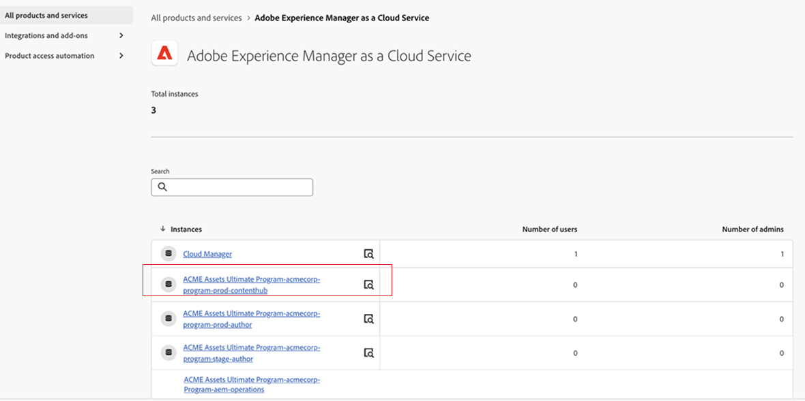

# Content Hub implementeren {#deploy-content-hub}

Content Hub is beschikbaar als onderdeel van Experience Manager Assets as a Cloud Service voor het democratiseren van de toegang tot online-inhoud voor organisaties en hun zakelijke partners.

De activa die op Experience Manager Assets as a Cloud Service zijn gemarkeerd met Goedgekeurd, zijn beschikbaar voor distributie van activa op Content Hub.

Dit artikel biedt een end-to-end workflow om Content Hub toegang te bieden aan gebruikers, inclusief de variaties van bevoegdheden op basis van hun behoeften.

Bekijk deze video voor informatie over hoe u Content Hub for Experience Manager Assets kunt inschakelen:

>[!VIDEO](https://video.tv.adobe.com/v/3470434)

De verschillende privileges in Content Hub zijn onder meer:

* [ de gebruikers van Content Hub ](#onboard-content-hub-users): De merkgoedgekeurde activa van de toegang op het portaal van Content Hub.

* [ de beheerders van Content Hub ](#onboard-content-hub-administrator): Toegang tot het [ Gebruikersinterface van de Configuratie ](/help/assets/configure-content-hub-ui-options.md) op Content Hub naast de toegang tot van merk-goedgekeurde activa, het uploaden van activa aan Content Hub, de integratie van Adobe Express om beelden uit te geven (als u Adobe Express rechten hebt).

* [ de gebruikers van Content Hub met rechten om activa ](#onboard-content-hub-users-add-assets) toe te voegen: Mogelijkheid om [ activa aan Content Hub ](/help/assets/upload-brand-approved-assets.md) te uploaden naast de toegang tot van merk goedgekeurde activa op het portaal van Content Hub.

* [ de gebruikers van Content Hub met rechten om activa aan nieuwe variaties ](#onboard-content-hub-users-remix-assets) opnieuw te mengen: [ Integratie van Adobe Express ](/help/assets/edit-images-content-hub.md) (als u de rechten van Adobe Express hebt) naast de toegang tot van merk goedgekeurde activa op het portaal van Content Hub.

* [ de gebruikers van Experience Manager Assets ](#experience-manager-assets-users): Mogelijkheid om activa op Experience Manager Assets as a Cloud Service goed te keuren om die activa op Content Hub ter beschikking te stellen.

De volgende tabel geeft een overzicht van de beschikbare Content Hub-gebruikerstypen, de rechten waarover deze beschikken en de productprofielen die zijn vereist om deze rechten te verkrijgen:

| Gebruikersrol | Content Hub-gebruikers | Content Hub-gebruikers met rechten om elementen toe te voegen | Content Hub-gebruikers met rechten om middelen opnieuw te mixen | Content Hub-beheerders |
|---------------|----------|----------|-------------------------|---|
| **Mogelijkheden** |
| Gebruik merkgoedgekeurde middelen op de Content Hub-portal | ✓ | ✓ | ✓ | ✓ |
| Elementen uploaden vanaf Content Hub Portal | - | ✓ | ✓ | ✓ |
| Afbeeldingen bewerken met Adobe Express-integratie | - | - | ✓ | - |
| De Content Hub-configuratie-interface openen | - | - | - | ✓ |
| **Gebruiker moet in deze productprofielen (Admin Console) zijn** |
| AEM > Delivery Instance > AEM Assets Limited Users | ✓ | ✓ | ✓ | ✓ |
| AEM > Production Author Instance > AEM Users | - | ✓ | ✓ | - |
| AEM > Production Author instance > AEM Administrators | - | - | - | ✓ |
| Adobe Express | - | - | ✓ | - |
| **Meer informatie** | Zie [ de gebruikers van Content Hub ](#onboard-content-hub-users) | Zie [ de gebruikers van Content Hub met rechten om activa ](#onboard-content-hub-users-add-assets) toe te voegen | Zie [ de gebruikers van Content Hub met rechten om activa aan nieuwe variaties opnieuw te mengen ](#onboard-content-hub-users-remix-assets) | Zie [ de beheerders van Content Hub ](#onboard-content-hub-administrator) |

>[!NOTE]
>
>[ de gebruikers van Experience Manager Assets ](#experience-manager-assets-users) hebben de capaciteit om activa op een milieu van as a Cloud Service van Experience Manager Assets goed te keuren om die activa op Content Hub ter beschikking te stellen. Deze gebruikers moeten worden toegevoegd aan AEM > Production Author-instantie > AEM Users-productprofiel met Admin Console.

## Stap 1: Content Hub for Experience Manager Assets inschakelen met Cloud Manager {#enable-content-hub}

Om toegang te krijgen tot het Content Hub-portaal, moeten beheerders eerst Content Hub voor Experience Manager Assets as a Cloud Service inschakelen met Cloud Manager.

### Machtigingen {#permissions-edit-program}

U moet de rol Bedrijfseigenaar hebben om programma&#39;s in Cloud Manager uit te geven. Voor meer informatie, zie [ Programma&#39;s ](/help/implementing/cloud-manager/getting-access-to-aem-in-cloud/editing-programs.md) uitgeven.

Content Hub voor Experience Manager Assets inschakelen:

1. Meld u aan bij Cloud Manager. Zorg ervoor dat u de juiste organisatie selecteert terwijl u zich aanmeldt. In Cloud Manager worden al uw programma&#39;s vermeld.

1. Navigeer naar het Experience Manager Assets as a Cloud Service-programma, klik op het pictogram Meer opties (...) en selecteer **[!UICONTROL Edit Program]** .

   

1. Selecteer in het dialoogvenster [!UICONTROL Edit Program] de tab **[!UICONTROL Solutions & Add-ons]** .

1. Vouw **[!UICONTROL Assets]** uit en selecteer **[!UICONTROL Content Hub]** .
   

   >[!NOTE]
   >
   >Als **[!UICONTROL Update]** niet voor u wordt toegelaten na het selecteren van Content Hub, zorg ervoor dat u Go-Live montages voor het programma hebt gespecificeerd.

1. Klik op **[!UICONTROL Update]**.

Content Hub is nu ingeschakeld voor Experience Manager Assets as a Cloud Service. Nadat u Content Hub hebt ingeschakeld in een productieomgeving, kunt u deze niet op een zelfbedieningsmanier uitschakelen.

>[!NOTE]
>
>U kunt Content Hub openen en gebruiken met maximaal 250 Content Hub-gebruikers. Neem contact op met uw Adobe-vertegenwoordiger als u nog meer vragen hebt.

Als u nog geen ervaring hebt met Experience Manager Assets, klikt u op **[!UICONTROL Add Program]** en geeft u de programmagegevens op (Programmanaam, Instellen voor productie). Klik vervolgens op **[!UICONTROL Continue]** . U kunt vervolgens **[!UICONTROL Assets]** en **[!UICONTROL Content Hub]** selecteren op het tabblad **[!UICONTROL Solutions & Add-ons]** .

### Content Hub-exemplaar en productprofiel op Admin Console{#content-hub-instance-product-profile}

Na [ toelatend Content Hub voor Assets as a Cloud Service gebruikend Cloud Manager ](#enable-content-hub), is er een nieuwe instantie die binnen AEM Assets as a Cloud Service op Admin Console met `delivery` als achtervoegsel wordt gecreeerd:

>[!NOTE]
>
>Als u Content Hub vóór 14 augustus 2024 hebt ingericht, wordt de nieuwe instantie gemaakt met `contenthub` als achtervoegsel.

De instantienaam voor Content Hub bevat geen `author` of `publish` .

Klik op de instantienaam om het Content Hub-productprofiel weer te geven.

>[!NOTE]
>
>Als u Content Hub vóór 14 augustus 2024 hebt ingericht, wordt het Content Hub-productprofiel `contenthub` vermeld na `Limited Users` in plaats van `delivery` .

## Stap 2: on-board Content Hub-beheerder {#onboard-content-hub-administrator}

De beheerders van Content Hub kunnen tot het [ Gebruikersinterface van de Configuratie ](/help/assets/configure-content-hub-ui-options.md) op Content Hub toegang hebben naast de toegang tot van merk-goedgekeurde activa, die activa aan Content Hub uploaden, Adobe Express integratie om beelden uit te geven (als u Adobe Express rechten hebt).

Aan boord van de Content Hub-beheerder:

1. [ Toegang en klik het profiel van het de gebruikersproduct van Content Hub ](#content-hub-instance-product-profile).

1. Klik op **[!UICONTROL Add users]** om gebruikers of gebruikersgroepen toe te voegen aan het productprofiel.

1. Klik op **[!UICONTROL Save]** om de wijzigingen op te slaan.

1. Nadat u de gebruiker aan het Content Hub-productprofiel hebt toegevoegd, opent u de Experience Manager Assets-productprofielen door op de AEM as a Cloud Service-productnaam in de lijst met producten op Admin Console te klikken.

1. Klik op de productieauteur-instantie voor AEM as a Cloud Service:
   

   Admin Console geeft twee productprofielen voor AEM as a Cloud Service weer: beheerders en gebruikers.
1. Klik op het productprofiel Beheerders en klik op **[!UICONTROL Add users]** om de gebruiker aan het productprofiel toe te voegen.
   

1. Klik op **[!UICONTROL Save]** om de wijzigingen op te slaan.

## Stap 3: Content Hub-gebruikers aan boord {#onboard-content-hub-users}

Content Hub-gebruikers hebben toegang tot middelen die beschikbaar zijn op de portal, maar kunnen geen nieuwe middelen toevoegen of bestaande middelen wijzigen.

Aan boord van Content Hub-gebruikers:

1. [ Toegang en klik het profiel van het de gebruikersproduct van Content Hub ](#content-hub-instance-product-profile).

1. Klik op **[!UICONTROL Add users]** om gebruikers of gebruikersgroepen toe te voegen aan het productprofiel.

1. Klik op **[!UICONTROL Save]** om de wijzigingen op te slaan.

Deze gebruikers hebben nu toegang tot de middelen die beschikbaar zijn op de Content Hub-portal.

>[!NOTE]
>
>U kunt alle geavanceerde bedrijfsfuncties gebruiken, zoals synchronisatie met externe identiteitsproviders.

### Hoe kan ik Content Hub openen? {#access-content-hub}

Content Hub is op de volgende manieren toegankelijk:

* Gebruik de volgende koppeling om Content Hub te openen:

  `https://experience.adobe.com/#/assets/contenthub`

* Meld u aan bij `experience.adobe com` en klik op **[!UICONTROL Experience Manager Assets Content Hub]** beschikbaar in de sectie **[!UICONTROL Quick access]** :
  

* Meld u aan bij `experience.adobe com` en klik op **[!UICONTROL Experience Manager Assets Content Hub]** beschikbaar in de productschakeloptie:
  

### E-mailberichten aan gebruikers uitschakelen {#disable-email-notifications}

Als beheerders e-mailmeldingen die naar gebruikers worden verzonden moeten uitschakelen wanneer ze aan het Content Hub-productprofiel worden toegevoegd:

Klik op het zoekpictogram naast de naam van het productprofiel en schakel de schakeloptie **[!UICONTROL Notify users by email]** uit.

 onbruikbaar

## Stap 4: Content Hub-gebruikers aan boord met rechten om elementen toe te voegen (optioneel) {#onboard-content-hub-users-add-assets}

De gebruikers van Content Hub met rechten om activa toe te voegen kunnen [ nieuwe merk-goedgekeurde activa aan Content Hub ](/help/assets/upload-brand-approved-assets.md) uploaden.

Aan boord van Content Hub-gebruikers met rechten om gebruikers toe te voegen:

1. [ na het toevoegen van de gebruiker aan het het productprofiel van Content Hub ](#onboard-content-hub-users), toegang tot de productprofielen van Experience Manager Assets door de het productnaam van AEM as a Cloud Service in de lijst van producten op Admin Console te klikken.

1. Klik op de productieauteur-instantie voor AEM as a Cloud Service:
   

   Admin Console geeft twee productprofielen voor AEM as a Cloud Service weer: beheerders en gebruikers.
1. Klik op het gebruikersprofiel en klik op **[!UICONTROL Add users]** om de gebruiker aan het productprofiel toe te voegen.
   

1. Klik op **[!UICONTROL Save]** om de wijzigingen op te slaan.

## Stap 4: Content Hub-gebruikers aan boord met rechten om elementen te combineren met nieuwe variaties (optioneel) {#onboard-content-hub-users-remix-assets}

De gebruikers van Content Hub met rechten om activa aan nieuwe variaties opnieuw te mengen kunnen [ bestaande activa wijzigen gebruikend Adobe Express en de activa opslaan aan de bewaarplaats ](/help/assets/edit-images-content-hub.md). Elementen bewerken met Adobe Express is alleen beschikbaar als de gebruiker Adobe Express-rechten heeft.

Content Hub-gebruikers met rechten om elementen te combineren tot nieuwe variaties:

1. [ na het toevoegen van de gebruiker aan het het productprofiel van Content Hub ](#onboard-content-hub-users), toegang tot de productprofielen van Experience Manager Assets door de het productnaam van AEM as a Cloud Service in de lijst van producten op Admin Console te klikken.

1. Klik op de productieauteur-instantie voor AEM as a Cloud Service:
   

   Admin Console geeft twee productprofielen voor AEM as a Cloud Service weer: beheerders en gebruikers.
1. Klik op het gebruikersprofiel en klik op **[!UICONTROL Add users]** om de gebruiker aan het productprofiel toe te voegen.
   

1. Klik op **[!UICONTROL Save]** om de wijzigingen op te slaan.

## Experience Manager Assets-gebruikers {#experience-manager-assets-users}

Experience Manager Assets-gebruikers kunnen op AEM as a Cloud Service middelen goedkeuren zodat deze beschikbaar zijn op Content Hub.

Experience Manager Assets-gebruikers configureren:

1. Open Experience Manager Assets-productprofielen door op de AEM as a Cloud Service-productnaam in de lijst met producten op Admin Console te klikken.

1. Klik op de productieauteur-instantie voor AEM as a Cloud Service:
   

   Admin Console geeft twee productprofielen voor AEM as a Cloud Service weer: beheerders en gebruikers.
1. Klik op het gebruikersprofiel en klik op **[!UICONTROL Add users]** om de gebruiker aan het productprofiel toe te voegen.
   

1. Klik op **[!UICONTROL Save]** om de wijzigingen op te slaan.

   >[!NOTE]
   >
   > U te hoeven niet aan het [ het productprofiel van Content Hub ](#onboard-content-hub-users) voor de gebruikers van Experience Manager Assets worden toegevoegd.
