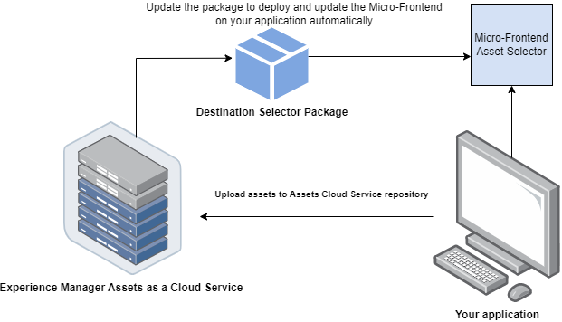

# Micro-front-bestemmingskiezer {#Overview}

Micro-Frontend de Selector van de Bestemming verstrekt een gebruikersinterface binnen uw toepassing die gemakkelijk met de [!DNL Experience Manager Assets as a Cloud Service] bewaarplaats integreert. U kunt zoeken naar of bladeren naar de juiste map in de [!DNL Experience Manager Assets as a Cloud Service] -opslagplaats en elementen van uw toepassing uploaden.

De gebruikersinterface Micro-Frontend wordt beschikbaar gesteld in uw toepassingservaring gebruikend het pakket van de Selecteur van de Bestemming. Eventuele updates van het pakket worden automatisch geïmporteerd en de meest recente geïmplementeerde doelkiezer wordt automatisch in de toepassing geladen.



De Selector van de bestemming verstrekt vele voordelen, zoals:

* Eenvoudige integratie met alle Adobe- of niet-Adobe toepassingen die gebruikmaken van de Vanilla JavaScript-bibliotheek.
* Eenvoudig te handhaven aangezien de updates aan het pakket van de Selecteur van de Bestemming automatisch worden opgesteld aan de Selecteur van de Bestemming beschikbaar voor uw toepassing. Uw toepassing hoeft geen updates uit te voeren om de laatste wijzigingen te laden.
* Gemak van aanpassing aangezien er eigenschappen beschikbaar zijn die de vertoning van de Selecteur van de Bestemming binnen uw toepassing controleren.
* In volledige tekst zoeken om snel naar mappen te navigeren om elementen vanuit uw toepassing te uploaden.
* Mogelijkheid om mappen te maken, mappen te sorteren in oplopende of aflopende volgorde en ze weer te geven in de lijst-, raster-, galerij- of watervalweergave.

Het werkingsgebied van dit artikel moet aantonen hoe te om de Selecteur van de Bestemming met een [!DNL Adobe] toepassing onder Verenigde Shell te gebruiken of wanneer u reeds een imsToken hebt die voor authentificatie wordt geproduceerd. Deze workflows worden in dit artikel niet-SUSI-stromen genoemd.

Voer de volgende taken uit om de doelkiezer te integreren en te gebruiken in uw [!DNL Experience Manager Assets as a Cloud Service] -opslagplaats:

* [Doelkiezer integreren met Vanilla JS](#integration-with-vanilla-js)
* [Weergaveeigenschappen voor doelkiezer definiëren](#destination-selector-properties)
* [Doelselectie gebruiken](#using-destination-selector)

## Doelkiezer integreren met Vanilla JS {#integration-with-vanilla-js}

U kunt elke [!DNL Adobe] -toepassing of niet-Adobe-toepassing integreren met [!DNL Experience Manager Assets] als een [!DNL Cloud Service] -opslagplaats en elementen selecteren vanuit de toepassing.

De integratie wordt gedaan door het pakket van de Selecteur van de Bestemming in te voeren en met de as a Cloud Service van Assets te verbinden gebruikend de bibliotheek van Vanilla JavaScript. U moet een `index.html` of een geschikt bestand in uw toepassing bewerken op -

* De verificatiedetails definiëren
* Toegang krijgen tot de Assets as a Cloud Service dataopslag
* De weergave-eigenschappen voor de doelkiezer configureren

U kunt verificatie uitvoeren zonder enkele IMS-eigenschappen te definiëren, als:

* U integreert een [!DNL Adobe] toepassing op [ Verenigde Shell ](https://experienceleague.adobe.com/docs/experience-manager-cloud-service/content/overview/aem-cloud-service-on-unified-shell.html?lang=en).
* Er is al een IMS-token gegenereerd voor verificatie.

## Vereisten {#prerequisites}

Definieer de voorwaarden in het `index.html` -bestand of een vergelijkbaar bestand in de implementatie van de toepassing om de verificatiegegevens te definiëren voor toegang tot de [!DNL Experience Manager Assets] als een [!DNL Cloud Service] -opslagplaats. Voorwaarden zijn:

* imsOrg
* imsToken
* apikey

## Installatie {#installation}

De Selecteur van de bestemming is beschikbaar via zowel ESM CDN (bijvoorbeeld, [ esm.sh ](https://esm.sh/)/[ kabel ](https://www.skypack.dev/)) als [ UMD ](https://github.com/umdjs/umd) versie.

In browsers die {versie 0} gebruiken UMD **(geadviseerd):**

In browsers die {versie 0} gebruiken UMD **(geadviseerd):**

```
<script src="https://experience.adobe.com/solutions/CQ-assets-selectors/static-assets/resources/assets-selectors.js"></script>

<script>
  const { renderAssetSelector } = PureJSSelectors;
</script>
```

In browsers met `import maps` steun gebruikend **versie van ESM CDN**:

```
<script type="module">
  import { AssetSelector } from 'https://experience.adobe.com/solutions/CQ-assets-selectors/static-assets/resources/@assets/selectors/index.js'
</script>
```

In Deno/de Federatie van de Module van het Pakket gebruikend **versie van ESM CDN**:

```
import { AssetSelector } from 'https://experience.adobe.com/solutions/CQ-assets-selectors/static-assets/resources/@assets/selectors/index.js'
```

### Geselecteerd doel {#selected-destination}

Doelkiezer ontvangt een callback van `onItemSelect` , `onTreeToggleItem` of `onTreeSelectionChange` met de geselecteerde map die het object (map, afbeelding, enzovoort) bevat.

**Syntaxis van het Schema**

```
interface SelectedDestination {
  id: string;
  children: SelectedDestination[];
  'repo:repositoryId': string;
  'dc:format': string;
  'repo:assetClass': string;
  'storage:directoryType': string;
  'storage:region': string;
  'repo:name': string;
  'repo:path': string;
  'repo:ancestors': string[];
  'repo:createDate': string;
  'storage:assignee':

  { type: string; id: string; }
  ;
  'repo:assetId': string;
  'aem:published': boolean;
  'repo:createdBy': string;
  'repo:state': string;
  'repo:id': string;
  'repo:modifyDate': string;
  _page:

  { orderBy: string; count: number; };
}
```

In de volgende tabel worden enkele belangrijke eigenschappen van het geselecteerde doel beschreven.

| Eigenschap | Type | Toelichting |
|---|---|---|
| *repo:repositoryId* | string | Unieke id voor de gegevensopslagruimte waar het middel is opgeslagen. |
| *repo:id* | string | Unieke id voor het element. |
| *repo:assetClass* | string | De classificatie van het element (bijvoorbeeld afbeelding, video, document). |
| *repo:name* | string | De naam van het element, inclusief de bestandsextensie. |
| *repo:grootte* | getal | De grootte van het element in bytes. |
| *repo:weg* | string | De locatie van het middel in de opslagplaats. |
| *repo:voorouders* | `Array<string>` | Een array van bovenliggende items voor het middel in de repository. |
| *repo:staat* | string | Huidige status van het middel in de repository (bijvoorbeeld actief, verwijderd enzovoort). |
| *repo:createdBy* | string | De gebruiker of het systeem dat het element heeft gemaakt. |
| *reactie:createDate* | string | De datum en tijd waarop het element is gemaakt. |
| *repo:modifiedBy* | string | De gebruiker of het systeem dat het element als laatste heeft gewijzigd. |
| *reactie:modifyDate* | string | De datum en het tijdstip waarop het element voor het laatst is gewijzigd. |
| *dc:formaat* | string | De indeling van het element. |
| *_page* | orderBy: string; count: number; order | Hiermee neemt u het paginanummer van het document op. |

Voor een volledige lijst van eigenschappen en gedetailleerd voorbeeld, bezoek [ het Voorbeeld van de Code van de Selecteur van de Bestemming ](https://github.com/adobe/aem-assets-selectors-mfe-examples).

### Voorbeeld voor de niet-SUSI-stroom {#non-ims-vanilla}

In dit voorbeeld wordt getoond hoe u de doelkiezer kunt gebruiken met een niet-SUSI-flow wanneer u een [!DNL Adobe] -toepassing uitvoert onder Unified Shell of wanneer u `imsToken` al hebt gegenereerd voor verificatie.

Omvat het pakket van de Selecteur van de Bestemming in uw code gebruikend de `script` markering, zoals aangetoond in _lijnen 6-15_ van het hieronder voorbeeld. Nadat het script is geladen, is de algemene variabele `PureJSSelectors` beschikbaar voor gebruik. Bepaal de Eigenschappen van de Selecteur van de Bestemming [ ](#destination-selector-properties) zoals aangetoond in _lijnen 16-23_. De eigenschappen `imsOrg` en `imsToken` zijn beide vereist voor verificatie in niet-SUSI-stroom. De eigenschap `handleSelection` wordt gebruikt om de geselecteerde elementen af te handelen. Om de Selector van de Bestemming terug te geven, roep de `renderDestinationSelector` functie zoals vermeld in _lijn 17_. De selecteur van de Bestemming wordt getoond in het `<div>` containerelement, zoals aangetoond in _lijnen 21 en 22_.

Als u deze stappen uitvoert, kunt u de doelkiezer gebruiken met een niet-SUSI-stroom in de [!DNL Adobe] -toepassing.

```html {line-numbers="true"}
<!DOCTYPE html>
<html>
<head>
    <title>Destination Selector</title>
    <script src="https://experience.adobe.com/solutions/CQ-assets-selectors/assets/resources/assets-selectors.js"></script>
    <script>
        // get the container element in which we want to render the DestinationSelector component
        const container = document.getElementById('destination-selector-container');
        // imsOrg and imsToken are required for authentication in non-SUSI flow
        const destinationSelectorProps = {
            imsOrg: 'example-ims@AdobeOrg',
            imsToken: "example-imsToken",
            apiKey: "example-apiKey-associated-with-imsOrg",
            handleSelection: (assets: SelectedAssetType[]) => {},
        };
        // Call the `renderDestinationSelector` available in PureJSSelectors globals to render DestinationSelector
        PureJSSelectors.renderDestinationSelector(container, destinationselectorprops);
    </script>
</head>

<body>
    <div id="destination-selector-container" style="height: calc(100vh - 80px); width: calc(100vw - 60px); margin: -20px;">
    </div>
</body>

</html>
```

Voor gedetailleerd voorbeeld, bezoek {het Voorbeeld van de Code van de Selecteur van de Bestemming 0} ](https://github.com/adobe/aem-assets-selectors-mfe-examples).[

## Eigenschappen doelkiezer gebruiken {#destination-selector-properties}

U kunt de eigenschappen van de Selector van de Bestemming gebruiken om de manier aan te passen de Selector van de Bestemming wordt teruggegeven. In de volgende tabel worden de eigenschappen weergegeven die u kunt gebruiken om de doelkiezer aan te passen en te gebruiken:

| Eigenschap | Type | Vereist | Standaard | Beschrijving |
|---|---|---|---|---|
| *imsOrg* | string | Ja | | Adobe Identity Management System (IMS) ID die tijdens de provisioning [!DNL Adobe Experience Manager] is toegewezen als een [!DNL Cloud Service] voor uw organisatie. De `imsOrg` -toets is vereist om te verifiëren of de organisatie waartoe u toegang hebt, onder Adobe IMS valt of niet. |
| *imsToken* | string | Nee | | IMS-token voor toonder die wordt gebruikt voor verificatie. `imsToken` is niet vereist als u de SUSI-stroom gebruikt. Dit is echter vereist als u de niet-SUSI-flow gebruikt. |
| *apiKey* | string | Nee | | API-sleutel die wordt gebruikt voor toegang tot de AEM Discovery-service. `apiKey` is niet vereist als u de SUSI-stroom gebruikt. Dit is echter vereist in niet-SUSI-stromen. |
| *rootPath* | string | Nee | /content/dam/ | Het pad naar de map waarin de doelkiezer uw elementen weergeeft. `rootPath` kan ook in de vorm van inkapseling worden gebruikt. Op basis van het volgende pad, `/content/dam/marketing/subfolder/` , kunt u met Doelselectie bijvoorbeeld niet door een bovenliggende map bladeren, maar alleen de onderliggende mappen. |
| *hasMore* | boolean | Nee | | Wanneer de toepassing meer inhoud heeft om weer te geven, kunt u deze eigenschap gebruiken om een lader toe te voegen die de inhoud laadt om deze zichtbaar te maken in de toepassing. Het is een indicator die aangeeft dat inhoud wordt geladen. |
| *orgName* | boolean | Nee | | Het is de naam van org (waarschijnlijk orgID) verbonden aan AEM |
| *initRepoID* | string | Nee | | Het is het pad van de gegevensopslagruimte die u wilt gebruiken in een standaardbeginweergave |
| *onCreateFolder* | string | Nee | | Met de eigenschap `onCreateFolder` kunt u een pictogram toevoegen waarmee een nieuwe map in de toepassing wordt toegevoegd. |
| *onConfirm* | string | Nee | | Dit is een callback wanneer u op de knop Bevestigen klikt. |
| *confirmDisabled* | string | Nee | | This property controls the toggle of the confirm button. |
| *viewType* | string | Nee | | De eigenschap `viewType` wordt gebruikt om de weergaven op te geven die u gebruikt om elementen weer te geven. |
| *viewTypeOptions* | string | Nee | | Deze eigenschap is gerelateerd aan de eigenschap `viewType` . u kunt een of meer weergaven opgeven om elementen weer te geven. Beschikbare viewTypeOptions zijn: Lijstweergave, Rasterweergave, Galerieweergave, Watervalweergave en Boomweergave. |
| *itemNameFormatter* | string | Nee | | Met deze eigenschap kunt u de itemnaam opmaken |
| *i18nSymbols* | `Object<{ id?: string, defaultMessage?: string, description?: string}>` | Nee |  | Als de OOTB-vertalingen onvoldoende zijn voor de behoeften van uw toepassing, kunt u een interface beschikbaar maken waarmee u uw eigen gelokaliseerde aangepaste waarden kunt doorgeven via de `i18nSymbols` -proxy. Als u een waarde door deze interface doorgeeft, overschrijft u de standaardvertalingen die worden geleverd en gebruikt u in plaats daarvan uw eigen vertaling.  Om de opheffing uit te voeren, moet u een geldig ](https://formatjs.io/docs/react-intl/api/#message-descriptor) voorwerp van de Beschrijver van het Bericht [ tot de sleutel van `i18nSymbols` overgaan die u wilt met voeten treden. |
| *inlineAlertSetup* | string | Nee | | Er wordt een waarschuwingsbericht toegevoegd dat u in de toepassing wilt doorgeven. U kunt bijvoorbeeld een waarschuwingsbericht toevoegen dat u geen toestemming hebt om deze map te openen. |
| *intl* | Object | Nee | | Doelselectie biedt standaard OOTB-vertalingen. U kunt de vertaaltaal selecteren door een geldige tekenreeks voor de landinstelling op te geven via de eigenschap `intl.locale` . Bijvoorbeeld: `intl={{ locale: "es-es" }}` </br></br> de gesteunde scènekoorden volgen [ ISO 639 - Codes ](https://www.iso.org/iso-639-language-codes.html) voor de vertegenwoordiging van namen van taalnormen. </br></br> Lijst met ondersteunde landinstellingen: Engels - &#39;en-us&#39; (standaard) Spaans - &#39;es-es&#39; Duits - &#39;de-de&#39; Frans - &#39;fr-fr&#39; Italiaans - &#39;it-it&#39; Japans - &#39;ja-jp&#39; Koreaans - &#39;ko-kr&#39; Portugees - &#39;pt-br&#39; Chinees (traditioneel) - &#39;zh-cn&#39; Chinees (Taiwan) - &#39;zh-tw&#39; |

## Voorbeelden voor het gebruik van de eigenschappen van de doelkiezer {#usage-examples}

U kunt de Eigenschappen van de Selecteur van de Bestemming [ ](#destination-selector-properties) in het `index.html` dossier bepalen om de vertoning van de Selecteur van de Bestemming binnen uw toepassing aan te passen.

### Voorbeeld 1: Een map maken in de doelkiezer

Met Doelkiezer kunt u een map maken om elementen op de desbetreffende locatie te uploaden, verplaatsen of kopiëren.


### Voorbeeld 2: weergavetype van doelkiezer opgeven

Met Doelselectie wordt een grote verscheidenheid aan elementen in vier verschillende weergaven weergegeven, waaronder de lijstweergave, de rasterweergave, de galerijweergave en de watervalweergave. U kunt de eigenschap `viewType` gebruiken om het standaardweergavetype op te geven. De eigenschap `viewTypeOptions` wordt samen met de eigenschap `viewType` gebruikt om andere weergavetypen op te geven, zodat andere opties voor weergavetype in een vervolgkeuzelijst kunnen worden weergegeven. Er kan één argument worden gebruikt voor het geval u slechts één optie wilt weergeven.


### Voorbeeld 3: Pad initialiseren van Assets-map

Gebruik de eigenschap `path` om de mapnaam te definiëren die automatisch wordt weergegeven wanneer de doelkiezer wordt weergegeven.


## Doelselectie gebruiken {#using-destination-selector}

Als de doelkiezer is ingesteld en u bent geverifieerd dat u de doelkiezer als [!DNL Adobe Experience Manager] -toepassing kunt gebruiken, kunt u elementen selecteren of verschillende andere bewerkingen uitvoeren om te zoeken naar uw elementen in de opslagplaats. [!DNL Cloud Service]


* **A**: [ bar van het Onderzoek ](#search-bar)
* **B**: [ Sorterend ](#sorting)
* **C**: [ Assets ](#assets-repo)
* **D**: [ voeg achtervoegsel of prefix ](#add-suffix-or-prefix) toe
* **E**: [ creeer nieuwe omslag ](#create-new-folder)
* **F**: [ Mening ](#types-of-view)
* **G**: [ Info ](#info)
* **H**: [ Uitgezochte omslag ](#select-folder)

### Zoekbalk {#search-bar}

Met de optie Doelselectie kunt u zoeken in volledige tekst naar elementen in de geselecteerde opslagplaats. Als u bijvoorbeeld het trefwoord `wave` in de zoekbalk typt, worden alle elementen met het trefwoord `wave` dat in een van de metagegevenseigenschappen wordt vermeld, weergegeven.

### Sorteren {#sorting}

U kunt elementen in de doelkiezer sorteren op naam, dimensie of grootte van een element. U kunt de elementen ook in oplopende of aflopende volgorde sorteren.

### Assets-opslagplaats {#assets-repo}

Met de doelkiezer kunt u ook gegevens bekijken in de opslagruimte die u in de AEM-toepassing hebt gekozen. Met de eigenschap `repositoryID` kunt u het pad van de doelmap initialiseren dat u in de eerste instantie van de doelkiezer wilt weergeven.

### Achtervoegsel of voorvoegsel toevoegen {#add-suffix-or-prefix}

Dit is een voorbeeld van de eigenschap `optionsFormSetup` . U kunt dit gebruiken om de selectie te bevestigen; deze wordt doorgegeven aan de gebeurtenis `onConfirm` .

### Een map maken {#create-new-folder}

Hiermee kunt u als [!DNL Cloud Service] een map maken in de doelmap van de [!DNL Adobe Experience Manager] -map.

### Weergavetypen {#types-of-view}

Met de optie Doelselectie kunt u het element in vier verschillende weergaven weergeven:

* **[!UICONTROL List View]**: De lijstmening toont scrollable dossiers en omslagen in één enkele kolom.
* **[!UICONTROL Grid View]**: De netmening toont scrollable dossiers en omslagen in een net van rijen en kolommen.
* **[!UICONTROL Gallery View]**: De galeriemening toont dossiers of omslagen in een centrum-gesloten horizontale lijst.
* **[!UICONTROL Waterfall View]**: De watervalmening toont dossiers of omslagen in de vorm van een Bridge.

### Info {#info}

Met het informatie- of infopictogram kunt u metagegevens van het geselecteerde element weergeven. Het bevat verschillende details, zoals afmetingen, grootte, beschrijving, pad, gewijzigde datum en datum. De metagegevens worden weergegeven tijdens het uploaden of kopiëren of het maken van een element.

### Map selecteren {#select-folder}

De Uitgezochte omslagknoop laat u activa selecteren voor diverse verrichtingen verbonden aan [ eigenschappen ](#destination-selector-properties) op bestemmingsselecteur uitvoeren.
