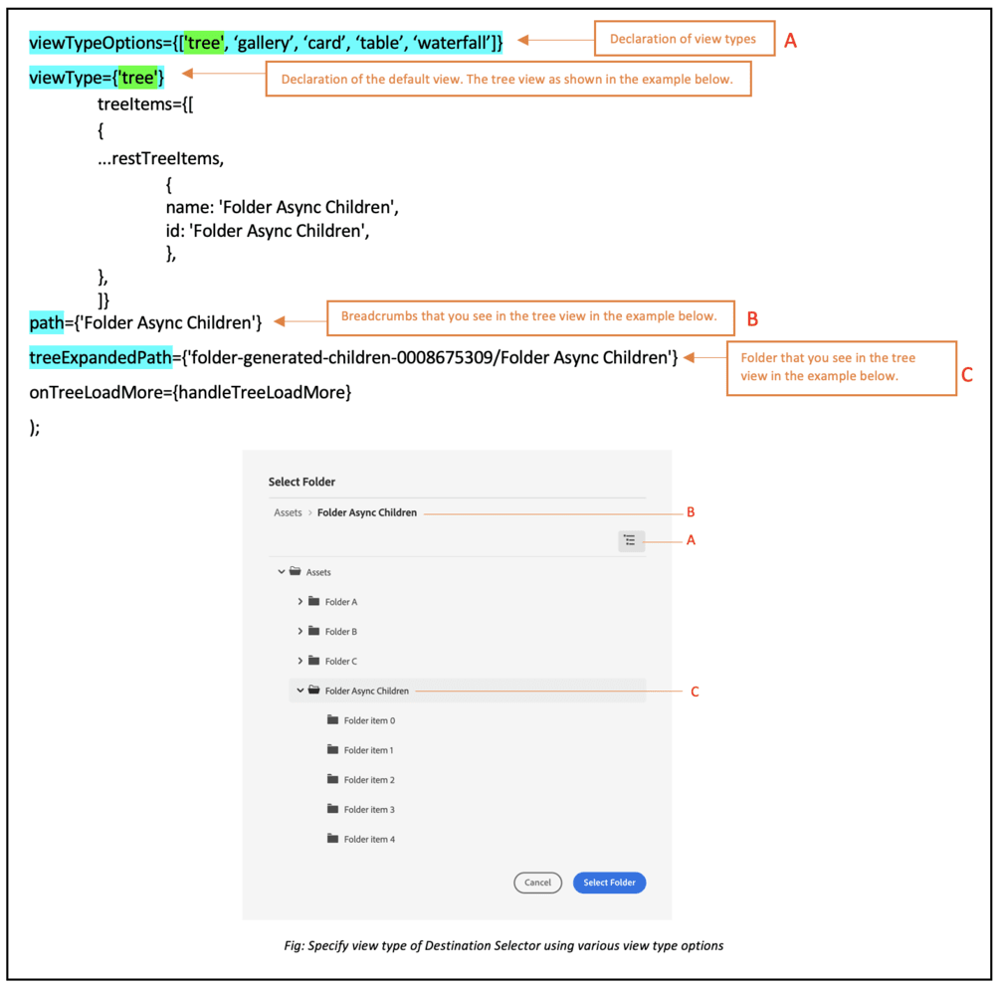

# Micro-front-bestemmingskiezer {#Overview}

Micro-Front de Selector van de Bestemming verstrekt een gebruikersinterface binnen uw toepassing die gemakkelijk met het [!DNL Experience Manager Assets as a Cloud Service] opslagplaats. U kunt naar de juiste map in de [!DNL Experience Manager Assets as a Cloud Service] opslagplaats en uploadt activa van uw toepassing.

De gebruikersinterface Micro-Frontend wordt beschikbaar gesteld in uw toepassingservaring gebruikend het pakket van de Selecteur van de Bestemming. Eventuele updates van het pakket worden automatisch geïmporteerd en de meest recente geïmplementeerde doelkiezer wordt automatisch in de toepassing geladen.


De Selector van de bestemming verstrekt vele voordelen, zoals:

* Eenvoudig te integreren met alle Adobe- of niet-Adobe-toepassingen die gebruikmaken van Vanilla JavaScript-bibliotheek.
* Eenvoudig te handhaven aangezien de updates aan het pakket van de Selecteur van de Bestemming automatisch worden opgesteld aan de Selecteur van de Bestemming beschikbaar voor uw toepassing. Uw toepassing hoeft geen updates uit te voeren om de laatste wijzigingen te laden.
* Gemak van aanpassing aangezien er eigenschappen beschikbaar zijn die de vertoning van de Selecteur van de Bestemming binnen uw toepassing controleren.
* In volledige tekst zoeken om snel naar mappen te navigeren om elementen vanuit uw toepassing te uploaden.
* Mogelijkheid om mappen te maken, mappen te sorteren in oplopende of aflopende volgorde en ze weer te geven in de lijst-, raster-, galerij- of watervalweergave.

Het bereik van dit artikel is om aan te tonen hoe u de doelkiezer kunt gebruiken met een [!DNL Adobe] toepassing onder Verenigde Shell of wanneer u reeds een imsToken hebt die voor authentificatie wordt geproduceerd. Deze workflows worden in dit artikel niet-SUSI-stromen genoemd.

Voer de volgende taken uit om de Kiezer van de Bestemming met uw te integreren en te gebruiken [!DNL Experience Manager Assets as a Cloud Service] opslagplaats:

* [Doelkiezer integreren met Vanilla JS](#integration-with-vanilla-js)
* [Weergaveeigenschappen voor doelkiezer definiëren](#destination-selector-properties)
* [Doelselectie gebruiken](#using-destination-selector)

## Doelkiezer integreren met Vanilla JS {#integration-with-vanilla-js}

U kunt alle [!DNL Adobe] of niet-Adobe [!DNL Experience Manager Assets] als [!DNL Cloud Service] opslagplaats en selecteer elementen vanuit de toepassing.

De integratie wordt gedaan door het pakket van de Selecteur van de Bestemming in te voeren en met de as a Cloud Service Activa te verbinden gebruikend de bibliotheek Vanilla JavaScript. U moet een `index.html` of een geschikt bestand in uw toepassing naar -

* De verificatiedetails definiëren
* Toegang krijgen tot de as a Cloud Service gegevensopslagruimte
* De weergave-eigenschappen voor de doelkiezer configureren

U kunt verificatie uitvoeren zonder enkele IMS-eigenschappen te definiëren, als:

* U integreert een [!DNL Adobe] toepassing op [Unified Shell](https://experienceleague.adobe.com/docs/experience-manager-cloud-service/content/overview/aem-cloud-service-on-unified-shell.html?lang=en).
* Er is al een IMS-token gegenereerd voor verificatie.

## Vereisten {#prerequisites}

Definieer de vereisten in het dialoogvenster `index.html` bestand of een vergelijkbaar bestand in de implementatie van de toepassing om de verificatiegegevens te definiëren voor toegang tot het [!DNL Experience Manager Assets] als [!DNL Cloud Service] opslagplaats. Voorwaarden zijn:

* imsOrg
* imsToken
* apikey

## Installatie {#installation}

Doelkiezer is beschikbaar via beide ESM CDN (bijvoorbeeld [esm.sh](https://esm.sh/)/[skypack](https://www.skypack.dev/)) en [UMD](https://github.com/umdjs/umd) versie.

In browsers die **UMD-versie** (aanbevolen):

In browsers die **UMD-versie** (aanbevolen):

```
<script src="https://experience.adobe.com/solutions/CQ-assets-selectors/static-assets/resources/assets-selectors.js"></script>

<script>
  const { renderAssetSelector } = PureJSSelectors;
</script>
```

In browsers met `import maps` ondersteuning gebruiken **ESM CDN-versie**:

```
<script type="module">
  import { AssetSelector } from 'https://experience.adobe.com/solutions/CQ-assets-selectors/static-assets/resources/@assets/selectors/index.js'
</script>
```

In Deno/Webpack Module Federation met **ESM CDN-versie**:

```
import { AssetSelector } from 'https://experience.adobe.com/solutions/CQ-assets-selectors/static-assets/resources/@assets/selectors/index.js'
```

### Geselecteerd doel {#selected-destination}

De Selecteur van de bestemming ontvangt callback van `onItemSelect`, `onTreeToggleItem`, of `onTreeSelectionChange` met de geselecteerde map die het object bevat (map, afbeelding, enzovoort).

**Schema Syntax**

```
interface SelectedDestination {
  id: string;
  children: SelectedDestination[];
  'repo:repositoryId': string;
  'dc:format': string;
  'repo:assetClass': string;
  'storage:directoryType': string;
  'storage:region': string;
  'repo:name': string;
  'repo:path': string;
  'repo:ancestors': string[];
  'repo:createDate': string;
  'storage:assignee':

  { type: string; id: string; }
  ;
  'repo:assetId': string;
  'aem:published': boolean;
  'repo:createdBy': string;
  'repo:state': string;
  'repo:id': string;
  'repo:modifyDate': string;
  _page:

  { orderBy: string; count: number; };
}
```

In de volgende tabel worden enkele belangrijke eigenschappen van het geselecteerde doel beschreven.

| Eigenschap | Type | Toelichting |
|---|---|---|
| *repo:repositoryId* | string | Unieke id voor de gegevensopslagruimte waar het middel is opgeslagen. |
| *repo:id* | string | Unieke id voor het element. |
| *repo:assetClass* | string | De classificatie van het element (bijvoorbeeld afbeelding, video, document). |
| *repo:naam* | string | De naam van het element, inclusief de bestandsextensie. |
| *repo:grootte* | getal | De grootte van het element in bytes. |
| *repo:pad* | string | De locatie van het middel in de opslagplaats. |
| *repo:voorouders* | `Array<string>` | Een array van bovenliggende items voor het middel in de repository. |
| *repo:status* | string | Huidige status van het middel in de repository (bijvoorbeeld actief, verwijderd enzovoort). |
| *repo:createdBy* | string | De gebruiker of het systeem dat het element heeft gemaakt. |
| *repo:createDate* | string | De datum en tijd waarop het element is gemaakt. |
| *repo:modifiedBy* | string | De gebruiker of het systeem dat het element als laatste heeft gewijzigd. |
| *repo:modifyDate* | string | De datum en het tijdstip waarop het element voor het laatst is gewijzigd. |
| *dc:indeling* | string | De indeling van het element. |
| *_page* | orderBy: string; count: number; order | Hiermee neemt u het paginanummer van het document op. |

Voor een volledige lijst met eigenschappen en een gedetailleerd voorbeeld gaat u naar [Voorbeeld van code doelkiezer](https://github.com/adobe/aem-assets-selectors-mfe-examples).

### Voorbeeld voor de niet-SUSI-stroom {#non-ims-vanilla}

In dit voorbeeld wordt getoond hoe u de optie Doelkiezer kunt gebruiken met een niet-SUSI-stroom wanneer u een [!DNL Adobe] toepassing onder Verenigde Shell of wanneer u reeds hebt `imsToken` gegenereerd voor verificatie.

Neem het pakket Doelkiezer in de code op met het gereedschap `script` tag, zoals weergegeven in _lijnen 6-15_ van het onderstaande voorbeeld. Nadat het script is geladen, wordt het `PureJSSelectors` algemene variabele is beschikbaar voor gebruik. De doelkiezer definiëren [eigenschappen](#destination-selector-properties) zoals getoond in _lijnen 16-23_. De `imsOrg` en `imsToken` beide eigenschappen zijn vereist voor verificatie in niet-SUSI-stroom. De `handleSelection` wordt gebruikt om de geselecteerde elementen af te handelen. Om de Selector van de Bestemming terug te geven, roep `renderDestinationSelector` functie als vermeld in _lijn 17_. De doelkiezer wordt weergegeven in het dialoogvenster `<div>` containerelement, zoals getoond in _lijnen 21 en 22_.

Als u deze stappen uitvoert, kunt u de doelkiezer gebruiken met een niet-SUSI-stroom in uw [!DNL Adobe] toepassing.

```html {line-numbers="true"}
<!DOCTYPE html>
<html>
<head>
    <title>Destination Selector</title>
    <script src="https://experience.adobe.com/solutions/CQ-assets-selectors/assets/resources/assets-selectors.js"></script>
    <script>
        // get the container element in which we want to render the DestinationSelector component
        const container = document.getElementById('destination-selector-container');
        // imsOrg and imsToken are required for authentication in non-SUSI flow
        const destinationSelectorProps = {
            imsOrg: 'example-ims@AdobeOrg',
            imsToken: "example-imsToken",
            apiKey: "example-apiKey-associated-with-imsOrg",
            handleSelection: (assets: SelectedAssetType[]) => {},
        };
        // Call the `renderDestinationSelector` available in PureJSSelectors globals to render DestinationSelector
        PureJSSelectors.renderDestinationSelector(container, destinationselectorprops);
    </script>
</head>

<body>
    <div id="destination-selector-container" style="height: calc(100vh - 80px); width: calc(100vw - 60px); margin: -20px;">
    </div>
</body>

</html>
```

Ga voor meer informatie naar [Voorbeeld van code doelkiezer](https://github.com/adobe/aem-assets-selectors-mfe-examples).

## Eigenschappen doelkiezer gebruiken {#destination-selector-properties}

U kunt de eigenschappen van de Selector van de Bestemming gebruiken om de manier aan te passen de Selector van de Bestemming wordt teruggegeven. In de volgende tabel worden de eigenschappen weergegeven die u kunt gebruiken om de doelkiezer aan te passen en te gebruiken:

| Eigenschap | Type | Vereist | Standaard | Beschrijving |
|---|---|---|---|---|
| *imsOrg* | string | Ja | | Adobe Identity Management System (IMS)-id die tijdens de provisioning is toegewezen [!DNL Adobe Experience Manager] als [!DNL Cloud Service] voor uw organisatie. De `imsOrg` is vereist om te controleren of de organisatie waartoe u toegang hebt, onder Adobe IMS valt of niet. |
| *imsToken* | string | Nee | | IMS-token voor toonder die wordt gebruikt voor verificatie. `imsToken` is niet vereist als u de SUSI-flow gebruikt. Dit is echter vereist als u de niet-SUSI-flow gebruikt. |
| *apiKey* | string | Nee | | API-sleutel die wordt gebruikt voor toegang tot de AEM Discovery-service. `apiKey` is niet vereist als u de SUSI-flow gebruikt. Dit is echter vereist in niet-SUSI-stromen. |
| *rootPath* | string | Nee | /content/dam/ | Het pad naar de map waarin de doelkiezer uw elementen weergeeft. `rootPath` kan ook in de vorm van inkapseling worden gebruikt. Als u bijvoorbeeld het volgende pad kiest, `/content/dam/marketing/subfolder/`Met Doelselectie kunt u niet door een bovenliggende map bladeren, maar alleen de onderliggende mappen. |
| *hasMore* | boolean | Nee | | Wanneer de toepassing meer inhoud heeft om weer te geven, kunt u deze eigenschap gebruiken om een lader toe te voegen die de inhoud laadt om deze zichtbaar te maken in de toepassing. Het is een indicator die aangeeft dat inhoud wordt geladen. |
| *orgName* | boolean | Nee | | Het is de naam van org (waarschijnlijk orgID) verbonden aan AEM |
| *initRepoID* | string | Nee | | Het is het pad van de gegevensopslagruimte die u wilt gebruiken in een standaardbeginweergave |
| *onCreateFolder* | string | Nee | | De `onCreateFolder` Met deze eigenschap kunt u een pictogram toevoegen waarmee een nieuwe map in de toepassing wordt toegevoegd. |
| *onConfirm* | string | Nee | | Dit is een callback wanneer u op de knop Bevestigen klikt. |
| *confirmDisabled* | string | Nee | | This property controls the toggle of the confirm button. |
| *viewType* | string | Nee | | De `viewType` wordt gebruikt om de weergaven op te geven die u gebruikt om elementen weer te geven. |
| *viewTypeOptions* | string | Nee | | Deze eigenschap is gerelateerd aan `viewType` eigenschap. u kunt een of meer weergaven opgeven om elementen weer te geven. Beschikbare viewTypeOptions zijn: Lijstweergave, Rasterweergave, Galerieweergave, Watervalweergave en Boomweergave. |
| *itemNameFormatter* | string | Nee | | Met deze eigenschap kunt u de itemnaam opmaken |
| *i18nSymbolen* | `Object<{ id?: string, defaultMessage?: string, description?: string}>` | Nee |  | Als de OOTB-vertalingen onvoldoende zijn voor de behoeften van uw toepassing, kunt u een interface beschikbaar maken waarmee u uw eigen aangepaste gelokaliseerde waarden kunt doorgeven via de `i18nSymbols` prop. Als u een waarde door deze interface doorgeeft, overschrijft u de standaardvertalingen die worden geleverd en gebruikt u in plaats daarvan uw eigen vertaling.  Als u de overschrijving wilt uitvoeren, moet u een geldige waarde opgeven [Berichtbeschrijving](https://formatjs.io/docs/react-intl/api/#message-descriptor) naar de toets van `i18nSymbols` die u wilt overschrijven. |
| *inlineAlertSetup* | string | Nee | | Er wordt een waarschuwingsbericht toegevoegd dat u in de toepassing wilt doorgeven. U kunt bijvoorbeeld een waarschuwingsbericht toevoegen dat u geen toestemming hebt om deze map te openen. |
| *intl* | Object | Nee | | Doelselectie biedt standaard OOTB-vertalingen. U kunt de vertaaltaal selecteren door een geldige landinstelling op te geven via het dialoogvenster `intl.locale` prop. Bijvoorbeeld: `intl={{ locale: "es-es" }}` </br></br> De landinstellingstekenreeksen die worden ondersteund volgen de [ISO 639 - Codes](https://www.iso.org/iso-639-language-codes.html) voor de vertegenwoordiging van namen van taalnormen. </br></br> Lijst met ondersteunde landinstellingen: Engels - &#39;en-us&#39; (standaard) Spaans - &#39;es-es&#39; Duits - &#39;de-de&#39; Frans - &#39;fr-fr&#39; Italiaans - &#39;it-it&#39; Japans - &#39;ja-jp&#39; Koreaans - &#39;ko-kr&#39; Portugees - &#39;pt-br&#39; Chinees (traditioneel) - &#39;zh-cn&#39; Chinees (Taiwan) - &#39;zh-tw&#39; |

## Voorbeelden voor het gebruik van de eigenschappen van de doelkiezer {#usage-examples}

U kunt de doelkiezer definiëren [eigenschappen](#destination-selector-properties) in de `index.html` bestand om de weergave van de doelkiezer in uw toepassing aan te passen.

### Voorbeeld 1: Een map maken in de doelkiezer

Met Doelkiezer kunt u een map maken om elementen op de desbetreffende locatie te uploaden, verplaatsen of kopiëren.


### Voorbeeld 2: weergavetype van doelkiezer opgeven

Met Doelselectie wordt een grote verscheidenheid aan elementen in vier verschillende weergaven weergegeven, waaronder de lijstweergave, de rasterweergave, de galerijweergave en de watervalweergave. Als u standaardweergavetype wilt opgeven, kunt u `viewType` eigenschap. De `viewTypeOptions` eigenschap wordt samen met `viewType` om andere weergavetypen op te geven, zodat andere opties voor weergavetype in een vervolgkeuzelijst kunnen worden weergegeven. Er kan één argument worden gebruikt voor het geval u slechts één optie wilt weergeven.



### Voorbeeld 3: Pad van middelenmap initialiseren

Gebruik de `path` eigenschap om de mapnaam te definiëren die automatisch wordt weergegeven wanneer de doelkiezer wordt weergegeven.


## Doelselectie gebruiken {#using-destination-selector}

Zodra de selecteur van de Bestemming opstelling is en u voor authentiek wordt verklaard om de Selecteur van de Bestemming met uw te gebruiken [!DNL Adobe Experience Manager] als [!DNL Cloud Service] kunt u elementen selecteren of verschillende andere bewerkingen uitvoeren om te zoeken naar uw elementen in de opslagplaats.


* **A**: [Zoekbalk](#search-bar)
* **B**: [Sorteren](#sorting)
* **C**: [Activa](#assets-repo)
* **D**: [Achtervoegsel of voorvoegsel toevoegen](#add-suffix-or-prefix)
* **E**: [Nieuwe map maken](#create-new-folder)
* **F**: [Weergave](#types-of-view)
* **G**: [Info](#info)
* **H**: [Map selecteren](#select-folder)

### Zoekbalk {#search-bar}

Met de optie Doelselectie kunt u zoeken in volledige tekst naar elementen in de geselecteerde opslagplaats. Als u bijvoorbeeld het trefwoord typt `wave` in de zoekbalk, alle elementen met de opdracht `wave` trefwoord dat in een van de metagegevenseigenschappen wordt vermeld, wordt weergegeven.

### Sorteren {#sorting}

U kunt elementen in de doelkiezer sorteren op naam, dimensie of grootte van een element. U kunt de elementen ook in oplopende of aflopende volgorde sorteren.

### Bewaarplaats activa {#assets-repo}

Met de doelkiezer kunt u ook gegevens bekijken in de opslagruimte die u in de AEM-toepassing hebt gekozen. U kunt `repositoryID` eigenschap om het pad van de doelmap te initialiseren dat u wilt weergeven in de eerste instantie van de doelkiezer.

### Achtervoegsel of voorvoegsel toevoegen {#add-suffix-or-prefix}

Het is een voorbeeld van het `optionsFormSetup` eigenschap. U kunt dit gebruiken om de selectie te bevestigen, wordt het overgegaan op `onConfirm` gebeurtenis.

### Een map maken {#create-new-folder}

Hiermee kunt u een map maken in de doelmap van uw [!DNL Adobe Experience Manager] als [!DNL Cloud Service].

### Weergavetypen {#types-of-view}

Met de optie Doelselectie kunt u het element in vier verschillende weergaven weergeven:

* **[!UICONTROL List View]**: In de lijstweergave worden schuifbare bestanden en mappen in één kolom weergegeven.
* **[!UICONTROL Grid View]**: In de rasterweergave worden schuifbare bestanden en mappen weergegeven in een raster met rijen en kolommen.
* **[!UICONTROL Gallery View]**: In de galerieweergave worden bestanden of mappen weergegeven in een horizontale lijst die in het midden is vergrendeld.
* **[!UICONTROL Waterfall View]**: In de watervalweergave worden bestanden of mappen weergegeven in de vorm van een Bridge.

### Info {#info}

Met het informatie- of infopictogram kunt u metagegevens van het geselecteerde element weergeven. Het bevat verschillende details, zoals afmetingen, grootte, beschrijving, pad, gewijzigde datum en datum. De metagegevens worden weergegeven tijdens het uploaden of kopiëren of het maken van een element.

### Map selecteren {#select-folder}

Met de knop Map selecteren kunt u elementen selecteren voor diverse bewerkingen die zijn gekoppeld aan [eigenschappen](#destination-selector-properties) op doelkiezer.
