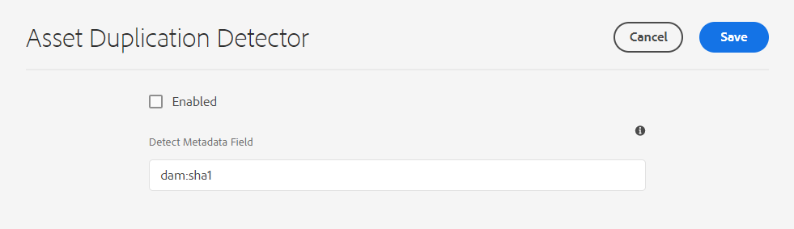

# Gedupliceerde elementen detecteren {#detect-duplicate-assets}

| Versie | Artikelkoppeling |
| -------- | ---------------------------- |
| AEM 6.5 | [ klik hier ](https://experienceleague.adobe.com/docs/experience-manager-65/assets/managing/duplicate-detection.html?lang=en) |
| AEM as a Cloud Service | Dit artikel |

Als een DAM-gebruiker een of meer middelen uploadt die al in de opslagplaats aanwezig zijn, detecteert [!DNL Experience Manager] de duplicatie en wordt de gebruiker hiervan op de hoogte gesteld. Dubbele detectie is standaard uitgeschakeld, omdat deze invloed kan hebben op de prestaties, afhankelijk van de grootte van de opslagplaats en het aantal geüploade middelen.

De functie inschakelen:

1. Navigeer naar **[!UICONTROL Tools > Assets > Assets Configurations]** .

1. Klik op **[!UICONTROL Asset Duplication Detector]**.

1. Klik op [!UICONTROL Asset Duplication Detector page] in het **[!UICONTROL Enabled]** .

   `dam:sha1` -waarde voor het veld Metagegevens detecteren zorgt ervoor dat dubbele elementen worden gedetecteerd, zelfs als de bestandsnamen verschillend zijn.

1. Klik op **[!UICONTROL Save]**.

   

>[!NOTE]
>
>Als u de Detector van de Duplicatie gebruikend `/apps/example/config.author/com.adobe.cq.assetcompute.impl.assetprocessor.AssetDuplicationDetector.cfg.json` configuratiedossier (configuratie OSGi) hebt gevormd, kunt u het blijven gebruiken, echter, adviseert Adobe het gebruiken van de nieuwe methode.

Zodra deze optie is ingeschakeld, stuurt Experience Manager meldingen van dubbele middelen naar Experience Manager Inbox. Het is een geaggregeerd resultaat voor meerdere duplicaten. Op basis van de resultaten kunnen gebruikers ervoor kiezen de elementen te verwijderen.

>[!NOTE]
>
>Wanneer u middelen uploadt naar de repository, detecteert Experience Manager duplicatie en meldt het u over de eerste 100 dubbele middelen.
