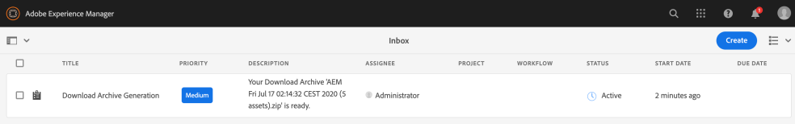

# Download assets from [!DNL Adobe Experience Manager] {#download-assets-from-aem}

U kunt elementen downloaden, zoals statische en dynamische uitvoeringen. U kunt ook e-mails met koppelingen naar middelen rechtstreeks verzenden vanuit [!DNL Adobe Experience Manager Assets]. Gedownloade elementen worden gebundeld in een ZIP-bestand. Het gecomprimeerde ZIP-bestand heeft een maximale bestandsgrootte van 1 GB voor de exporttaak. Er zijn maximaal 500 totale elementen per exporttaak toegestaan.

>[!NOTE]
>
>Ontvangers van e-mailberichten moeten lid zijn van de `dam-users` groep om toegang te krijgen tot de koppeling voor het downloaden van postadressen in het e-mailbericht. Om de elementen te kunnen downloaden, moeten de leden machtigingen hebben om workflows te starten die het downloaden van elementen activeren.

De elementtypen Afbeeldingssets, Spin-sets, Gemengde mediasets en Carousel-sets kunnen niet worden gedownload.

U kunt Experience Manager-elementen downloaden met de volgende methoden:

* [Gebruikersinterface Experience Manager](#download-in-aem)
* Gebruikersinterface voor het delen van elementen
* [Commentaar voor het delen van bedrijfsmiddelen](https://adobe-marketing-cloud.github.io/asset-share-commons/)
* [Brand Portal](https://experienceleague.adobe.com/docs/experience-manager-brand-portal/using/introduction/brand-portal.html)
* [Desktop-app](https://experienceleague.adobe.com/docs/experience-manager-desktop-app/using/using.html#download-assets)

## Elementen downloaden via AEM interface {#download-in-aem}

De asynchrone downloaddienst verstrekt een kader voor naadloze download van grote activa. Kleinere bestanden worden in realtime gedownload vanuit de gebruikersinterface. De grote bestanden worden asynchroon gedownload en gebruikers worden via meldingen via Experience Managers in het Postvak IN op de hoogte gebracht van het invullen. Zie [Experience Manager inbox](https://experienceleague.adobe.com/docs/experience-manager-cloud-service/sites/authoring/getting-started/inbox.html)begrijpen.



*Afbeelding: Melding downloaden via [!DNL Experience Manager] Postvak IN.*

Asynchrone downloads worden in een van de volgende gevallen geactiveerd:

* Als er meer dan 10 elementen of meer dan 100 MB zijn om te downloaden.
* Als het downloaden meer dan 30 seconden duurt om voor te bereiden.

Voer de volgende stappen uit om elementen te downloaden:

1. Klik in [!DNL Experience Manager] de gebruikersinterface op **[!UICONTROL Assets]** > **[!UICONTROL Files]**.
1. Navigeer naar de elementen die u wilt downloaden. Selecteer de map of selecteer een of meer middelen in de map. On the toolbar, click **[!UICONTROL Download]**.

   ![Beschikbare opties voor het downloaden van elementen van [!DNL Experience Manager Assets]](/help/assets/assets/asset-download1.png)

   *Afbeelding: Opties in het dialoogvenster Downloaden.*

1. Selecteer in het dialoogvenster Downloaden de gewenste downloadopties.

   | Downloadoptie | Beschrijving |
   |---|---|
   | **[!UICONTROL Create separate folder for each asset]** | Selecteer deze optie om elk element dat u downloadt, inclusief elementen, op te nemen in onderliggende mappen die onder de bovenliggende map van het element zijn genest in één map op uw lokale computer. Als deze optie *niet* standaard is geselecteerd, wordt de maphiërarchie genegeerd en worden alle elementen naar één map op uw lokale computer gedownload. |
   | **[!UICONTROL Email]** | Selecteer deze optie als u een e-mailbericht wilt verzenden naar de ontvanger. De standaard e-mailsjablonen zijn beschikbaar op de volgende locaties:<ul><li>`/libs/settings/dam/workflow/notification/email/downloadasset`.</li><li>`/libs/settings/dam/workflow/notification/email/transientworkflowcompleted`.</li></ul> De malplaatjes die u tijdens plaatsing aanpast zijn beschikbaar bij de volgende plaatsen: <ul><li>`/apps/settings/dam/workflow/notification/email/downloadasset`.</li><li>`/apps/settings/dam/workflow/notification/email/transientworkflowcompleted`.</li></ul>U kunt huurdersspecifieke douanemalplaatjes bij de volgende plaatsen opslaan:<ul><li>`/conf/<tenant_specific_config_root>/settings/dam/workflow/notification/email/downloadasset`.</li><li>`/conf/<tenant_specific_config_root>/settings/dam/workflow/notification/email/transientworkflowcompleted`.</li></ul> |
   | **[!UICONTROL Asset(s)]** | Selecteer deze optie als u het element in de oorspronkelijke vorm zonder vertoningen wilt downloaden.<br>De optie Subassets is beschikbaar als het oorspronkelijke element subassets heeft. |
   | **[!UICONTROL Rendition(s)]** | Een vertoning is de binaire representatie van een element. Elementen hebben een primaire representatie, namelijk die van het geüploade bestand. Zij kunnen om het even welk aantal vertegenwoordiging hebben. <br> Met deze optie kunt u de uitvoeringen selecteren die u wilt downloaden. Welke uitvoeringen beschikbaar zijn, is afhankelijk van het element dat u hebt geselecteerd. |
   | **[!UICONTROL Smart Crops]** | Selecteer deze optie als u alle slimme uitsnijduitvoeringen van het geselecteerde element vanuit [!DNL Experience Manager]de bron wilt downloaden. Er wordt een ZIP-bestand met de Smart Crop-uitvoeringen gemaakt en gedownload naar uw lokale computer. |
   | **[!UICONTROL Dynamic Rendition(s)]** | Selecteer deze optie als u een reeks alternatieve vertoningen in real-time wilt genereren. Wanneer u deze optie selecteert, selecteert u ook de uitvoeringen die u dynamisch wilt maken door een optie te selecteren in de lijst [Voorinstelling](/help/assets/dynamic-media/image-presets.md) afbeelding. <br>Bovendien kunt u de grootte en maateenheid, de indeling, de kleurruimte, de resolutie en eventuele optionele afbeeldingsaanpassingen selecteren, zoals het omkeren van de afbeelding. De optie is alleen beschikbaar als u deze hebt [!DNL Dynamic Media] ingeschakeld. |

1. In the dialog box, click **[!UICONTROL Download]**.

## Enable asset download servlet {#enable-asset-download-servlet}

Met de standaardservlet in [!DNL Experience Manager] kunnen geverifieerde gebruikers willekeurig grote, gelijktijdige downloadaanvragen afgeven om ZIP-bestanden met elementen te maken. De downloadvoorbereiding kan prestatiesimplicaties hebben of kan zelfs de server en het netwerk overbelasten. Om dergelijke potentiële DoS-achtige risico&#39;s te verlichten die door deze eigenschap worden veroorzaakt, is de component `AssetDownloadServlet` OSGi gehandicapt voor publiceer instanties.

Om het downloaden van activa van uw DAM toe te staan, bijvoorbeeld wanneer het gebruiken van iets zoals de Commons van het Aandeel van Activa of andere portaalachtige implementatie, laat manueel servlet via een configuratie OSGi toe. Adobe raadt u aan de toegestane downloadgrootte zo laag mogelijk in te stellen zonder dat dit van invloed is op de vereisten voor het dagelijks downloaden. Een hoge waarde kan van invloed zijn op de prestaties.

1. Maak een map met een naamgevingsconventie die zich richt op de publicatie-runtime, namelijk `config.publish`:

   `/apps/<your-app-name>/config.publish`

1. Maak in de configuratiemap een nieuw bestand van het type `nt:file` genaamd `com.day.cq.dam.core.impl.servlet.AssetDownloadServlet.config`.
1. Vul `com.day.cq.dam.core.impl.servlet.AssetDownloadServlet.config` met de volgende code. Hiermee stelt u een maximale grootte (in bytes) in voor het downloaden als waarde van `asset.download.prezip.maxcontentsize`. In het onderstaande voorbeeld wordt de maximale grootte van de ZIP-download ingesteld op maximaal 100 kB.

   ```java
   enabled=B"true"
   asset.download.prezip.maxcontentsize=I"102400"
   ```

## Asset Download-server uitschakelen {#disable-asset-download-servlet}

De functie `Asset Download Servlet` kan worden uitgeschakeld in een [!DNL Experience Manager] publicatie-instantie door de configuratie van de verzender bij te werken om aanvragen voor het downloaden van middelen te blokkeren. servlet kan ook manueel via de console OSGi direct worden onbruikbaar gemaakt.

1. Om activa te blokkeren downloadverzoeken via een verzenderconfiguratie geef de `dispatcher.any` configuratie uit en voeg een nieuwe regel aan de [filtersectie](https://experienceleague.adobe.com/docs/experience-manager-dispatcher/using/configuring/dispatcher-configuration.html#configuring)toe.

   `/0100 { /type "deny" /url "*.assetdownload.zip/assets.zip*" }`

>[!MORELIKETHIS]
>
>* [Met DRM beveiligde middelen downloaden](drm.md)
>* [Items downloaden met de bureaubladtoepassing Experience Manager op Windows of Mac](https://helpx.adobe.com/experience-manager/desktop-app/aem-desktop-app.html)
>* [Elementen downloaden met de Adobe Assets Link vanuit de ondersteunde Adobe Creative Cloud-apps](https://helpx.adobe.com/nl/enterprise/using/manage-assets-using-adobe-asset-link.html)

