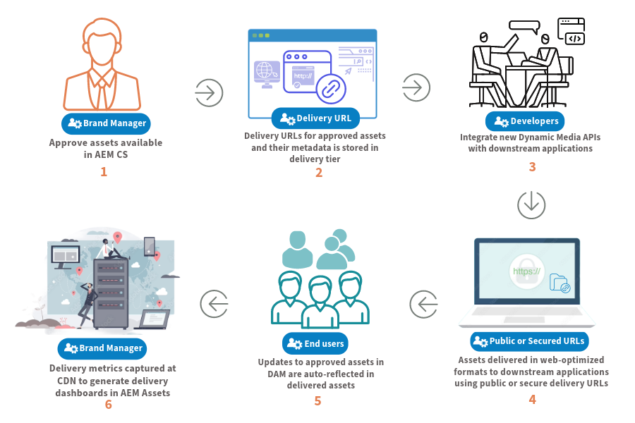

# Dynamische media met OpenAPI-mogelijkheden {#new-dynaminc-media-apis-overview}

In de snelle digitale wereld van vandaag, is het ontsluiten van het volledige potentieel van de digitale activa van uw merk cruciaal om voor de concurrentie te blijven. Een holistische DAM-oplossing (Digital Assets Management) vereenvoudigt het beheer van bedrijfsmiddelen, bevordert de consistentie van merken en versnelt de levering van inhoud, waarbij de integriteit van merken en uitzonderlijke ervaringen met klanten worden gegarandeerd.

Dynamische media met OpenAPI-mogelijkheden zetten DAM tot de kern van een flexibel en efficiënt systeem van de toeleveringsketen voor inhoud om het beheer en de levering van middelen te garanderen.

## Waarom Dynamic Media gebruiken met OpenAPI-mogelijkheden? {#dynamic-media-open-api-features}

Dynamische media met OpenAPI-mogelijkheden bieden de volgende belangrijke voordelen:

* **Naadloze integraties**: De dynamische Media met mogelijkheden OpenAPI biedt een uitvoerige reeks onderzoek en levering APIs aan. Het staat uw ontwikkelaars toe om levering van activa met hun toepassingen [&#x200B; gemakkelijk &#x200B;](/help/assets/integrate-dynamic-media-open-apis.md) te integreren. De toepassingen zijn onder andere Adobe en toepassingen van derden. Het verstrekt a [&#x200B; Micro Frontend activa selecteerde gebruikersinterface &#x200B;](/help/assets/overview-asset-selector.md) om goedgekeurde activa te zoeken en te selecteren. De kiezer kan moeiteloos worden geïntegreerd met elke toepassing die is gebaseerd op JavaScript-frameworks zoals React JS, Angular JS en Vanilla JS.

* **Gecentraliseerd beheer van digitale activa**: DAM is de enige bron van waarheid voor alle digitale activa. Uw digitale middelen worden centraal beheerd in AEM Assets en worden aan verbruikende toepassingen geleverd door verwijzing gebruikend levering URLs, zonder activa te kopiëren binaries.

* **updates in real time**: Om het even welke veranderingen die in goedgekeurde activa in DAM, met inbegrip van versieupdates en meta-gegevenswijzigingen worden aangebracht, worden automatisch weerspiegeld in levering URLs. Met een korte tijd-aan-Levende (TTL) waarde van 10 minuten die voor Dynamische Media met mogelijkheden OpenAPI via CDN wordt gevormd, worden de updates zichtbaar over alle creatie en gepubliceerde interfaces binnen 10 minuten.

* **de consistentie van het Merk**: Slechts [&#x200B; merk-goedgekeurde activa &#x200B;](/help/assets/approve-assets.md) worden blootgesteld aan stroomafwaartse toepassingen. [&#x200B; de Managers en de Marketers van de Merk handhaven strikte controle over merkactiva &#x200B;](/help/assets/restrict-assets-delivery.md). Alleen goedgekeurde en nieuwste versie van het middel is beschikbaar voor gebruik, zodat alle kanalen en toepassingen consistent blijven.

* **Web-geoptimaliseerde levering**: De digitale activa worden geleverd in Web-geoptimaliseerde formaten om de Velen van het Web van de Kern van uw digitale ervaringen te verbeteren. Dit omvat ondersteuning voor WebP-uitvoeringen voor afbeeldingen, adaptieve streaming via HLS- of DASH-protocollen voor video&#39;s en originele uitvoeringen voor documenten.

* [&#x200B; Dynamische activa transformatie &#x200B;](https://developer.adobe.com/experience-cloud/experience-manager-apis): Ons systeem staat voor de transformatie van het beeld toe het gebruiken van parameters URL die als beeldbepalingen worden bekend. Breedte, hoogte, roteren, spiegelen, kwaliteit, uitsnijden, opmaken en slim uitsnijden. Transformeerde uitvoeringen worden dynamisch gegenereerd en naadloos via de CDN geleverd.

* **Veilige levering van activa**: De dynamische Media met mogelijkheden OpenAPI verstrekt een mechanisme voor controle over toegang tot uw digitale activa. U kunt gebruikersrollen of groepen als meta-gegevens voor te beveiligen activa specificeren en een vooraf bepaald tijdskader plaatsen waarin [&#x200B; slechts geautoriseerde gebruikers tot deze activa &#x200B;](/help/assets/restrict-assets-delivery.md) kunnen toegang hebben. De leverings-URL&#39;s voor beveiligde elementen worden tijdens de beperkte periode niet opgelost voor onbevoegde gebruikers.

* **Inzichten van Gegevens om geïnformeerde besluiten (aanstaande) te nemen**: Buiten activabeheer en levering, vangt het de inzichten van leveringsgegevens in activa leveranties bij CDN die de managers van het Merk toestaan om leveringsmetriek over kanalen te volgen. Het stelt hen in staat gegevensgestuurde beslissingen te nemen met het oog op een continue optimalisering van het beheer en de leveringsstrategieën van activa.

Voor informatie over het beschikbare Dynamische dienstenaanbod van Media en hun mogelijkheden, zie [&#x200B; Dynamische Media Prime en Ultimate &#x200B;](/help/assets/dynamic-media/dm-prime-ultimate.md).

>[!NOTE]
>
>DM Prime-klanten kunnen basisopties voor het wijzigen van afbeeldingen gebruiken, zoals roteren, uitsnijden, spiegelen, hoogte, breedte en kwaliteit. Smart Imaging biedt geen ondersteuning voor AVIF voor DM Prime-klanten.

## Vereisten voor toegang tot dynamische media met OpenAPI-mogelijkheden {#prerequisites-dynaminc-media-open-apis}

Voor toegang tot Dynamic Media met OpenAPI-mogelijkheden hebt u licenties nodig voor:

* AEM Assets as a Cloud Service

* AEM Dynamic Media

## Hoe kan ik de Dynamic Media inschakelen met OpenAPI-mogelijkheden? {#enable-dynamic-media-open-apis}

Voordat u een aanvraag indient om Dynamic Media met OpenAPI-mogelijkheden op AEM as a Cloud Service in te schakelen, moet u controleren of dit nog niet het geval is.

Zodra de [&#x200B; Eerste vereisten &#x200B;](#prerequisites-dynaminc-media-open-apis) worden voldaan en als de Dynamische Media met mogelijkheden OpenAPI op uw instantie van AEM as a Cloud Service wordt toegelaten, is er een Levering URL beschikbaar voor elk goedgekeurd middel in de bewaarplaats. Voor informatie over hoe te om levering URL te kopiëren, zie [&#x200B; levering URL van het Exemplaar voor goedgekeurde activa &#x200B;](approve-assets.md#copy-delivery-url-approved-assets). Adobe raadt u aan deze methode te gebruiken om te controleren of Dynamic Media met OpenAPI-mogelijkheden is ingeschakeld op AEM as a Cloud Service voordat een ondersteuningsticket wordt verzonden om dit in te schakelen.

Als u Dynamic Media met OpenAPI-mogelijkheden op AEM as a Cloud Service wilt inschakelen, verzendt u een Adobe Support-ticket met de volgende gegevens:

* Programma Cloud Services en omgeving-id

* Details van het gebruiksgeval dat moet worden opgelost met Dynamic Media met integratie van OpenAPI-mogelijkheden.

* Details van de downstreamtoepassing(en) voor integratie met Dynamic Media met OpenAPI-mogelijkheden.

  >[!NOTE]
  >
  > Als u wilt integreren met een niet-Adobe-toepassing, moet u domeinnamen opgeven voor de lijst van gewenste personen waar de toepassing wordt gehost.

* Details van zeer belangrijke klantencontacten betrokken bij integratieproject.

* Lijst met sleutelleden van het Adobe-accountteam (e-mail).

Nadat u het ondersteuningsticket hebt verzonden, schakelt Adobe Dynamic Media met OpenAPI-mogelijkheden in uw Cloud Services-omgeving in en deelt u de gegevens, zoals de IMS Client ID, zodat u verder kunt gaan met de integratie.

>[!NOTE]
>
>Sluit `/conf/global/settings/dam/assets-configurations/assetdelivery` uit van een inhoudspakket om deactivering van dynamische media met OpenAPI-mogelijkheden te voorkomen.

## Dien meer in zeer belangrijke mogelijkheden {#learn-more-key-capabilities}

<table>
<td>
   
   

      <a href="/help/assets/approve-assets.md">
      <strong> keur activa in Experience Manager Assets </strong> goed
      </a>
   

   

      <em> keur activa in AEM Assets goed om activabeheer te stroomlijnen, die een gecontroleerd en efficiënt proces verzekeren om activa te behandelen.</em>
   

</td>
<td>
   
   

      <a href="/help/assets/integrate-dynamic-media-open-apis.md">
      <strong> integreer AEM Assets met stroomafwaartse toepassingen </strong>
      </a>
   

   

      <em> integreer uw eigen douanegebruikersinterface met de bewaarplaats van Experience Manager Assets gebruikend het Onderzoek en Levering APIs of gebruik Adobe Micro-Front de Kiezer van Activa.</em>
   

</td>
<td>
   
   

      <a href="/help/assets/overview-asset-selector.md">
      <strong> de Micro-Frontend van Adobe selecteur van Activa </strong>
      </a>
   

   

      <em> een gebruikersinterface die met de bewaarplaats van AEM Assets aan onderzoeksactiva in wisselwerking staat en dan hen in uw toepassing creërende ervaring gebruikt.</em>
   

</td>
</table>
<table>

<table>
<td>
   
   

      <a href="/help/assets/search-assets-api.md">
      <strong> activa van het Onderzoek in de bewaarplaats van Experience Manager Assets </strong>
      </a>
   

   

      <em> de activa van het Onderzoek in de bewaarplaats van AEM Assets zodat zij aan stroomafwaartse toepassingen kunnen leveren.</em>
   

</td>
<td>
   
   

      <a href="/help/assets/deliver-assets-apis.md">
      <strong> lever activa aan stroomafwaartse toepassingen </strong>
      </a>
   

   

      <em> lever activa aan geïntegreerde stroomafwaartse toepassingen gebruikend een Levering URL.</em>
   

</td>
<td>
   
   

      <a href="/help/assets/restrict-assets-delivery.md">
      <strong> Beperk toegang tot activa in Experience Manager </strong>
      </a>
   

   

      <em> DAM Admin of Merk Managers beperken de toegang door rollen voor goedgekeurde activa op de het auteursinstantie van AEM as a Cloud Service te vormen.</em>
   

</td>

</table>
<table>
<td>
   
   

      <a href="/help/assets/integrate-remote-approved-assets-with-sites.md">
      <strong> integreer verre AEM Assets met AEM Sites </strong>
      </a>
   

   

      <em> Leer hoe te om verre AEM Assets met het milieu van AEM Sites te integreren. </em>
   

</td>
<td>
   
   

      <a href="/help/assets/dynamic-media-open-apis-faqs.md">
      <strong> Dynamische Media met mogelijkheden OpenAPI vroeg vaak vragen </strong>
      </a>
   

   

      <em> krijg een antwoord op de meest gestelde Dynamische Media met mogelijkheden OpenAPI vaak gestelde vragen.</em>
   

</td>
<td>
   
   

      <a href="/help/assets/configure-custom-domain.md">
      <strong> vorm douanedomein </strong>
      </a>
   

   

      <em> terwijl AEM as a Cloud Service met een standaarddomein komt, kunt u het aanpassen zoals aan uw behoeften.</em>
   

</td>

</table>
