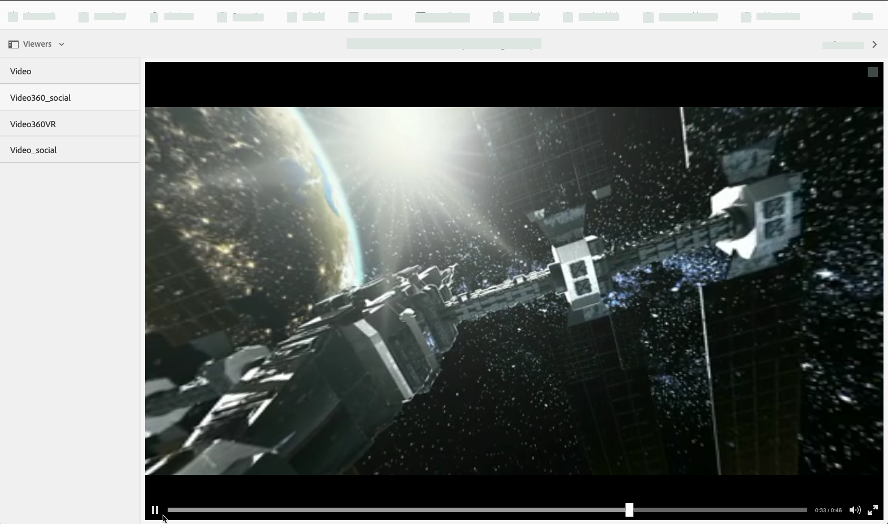

# 360/VR-video {#vr-video}

In video&#39;s van 360° wordt een weergave in elke richting tegelijkertijd vastgelegd. Ze worden opgenomen met een omnidirectionele camera of een verzameling camera&#39;s. Tijdens het afspelen op een plat beeldscherm heeft de gebruiker controle over de kijkhoek; bij het afspelen op mobiele apparaten worden doorgaans de ingebouwde gyroscopische besturingselementen toegepast.

Dynamic Media biedt native ondersteuning voor de levering van 360 video-elementen. Standaard is geen aanvullende configuratie nodig voor weergave of afspelen. U levert 360 Video gebruikend standaardvideouitbreidingen zoals .mp4, .mkv, en .mov. De meest algemene codec is H.264.

Met de 360/VR-videoviewer kunt u rechthoekige video renderen. Het resultaat is een indrukwekkende kijkervaring van een kamer, eigenschap, locatie, landschap, medische procedure enzovoort.

Ruimtelijke audio wordt momenteel niet ondersteund. Als audio in stereo wordt gemengd, verandert de balans (L/R) niet omdat de klant de kijkhoek van de camera wijzigt.

Zie [ Gebruikend Dynamische Media 360 Video&#39;s en de Videominiatuur van de Douane met AEM Assets ](https://experienceleague.adobe.com/docs/experience-manager-learn/assets/dynamic-media/dynamic-media-360-video-custom-thumbnail-feature-video-use.html#dynamic-media).

Zie ook [ het Leiden Kijker stelt ](/help/assets/dynamic-media/managing-viewer-presets.md) vooraf in.

## 360 Video in actie {#video-in-action}

Selecteer [ Post 360 van de Ruimte ](https://s7d1.scene7.com/s7viewers/html5/Video360Viewer.html?asset=Viewers/space_station_360-AVS) om een browser venster te openen en op een video van 360° te letten. Tijdens het afspelen van video sleept u de aanwijzer naar een nieuwe locatie om de weergavehoek te wijzigen.

*Videoframe van Post 360 van de Ruimte*

## 360/VR-video en Adobe Premiere Pro {#vr-video-and-adobe-premiere-pro}

Met Adobe Premier Pro kunt u 360/VR-beeldmateriaal weergeven en bewerken. U kunt bijvoorbeeld logo&#39;s en tekst op de juiste wijze in een scène plaatsen en effecten en overgangen toepassen die specifiek zijn ontworpen voor rechthoekige media.

Zie [ video 360/VR ](https://helpx.adobe.com/premiere-pro/how-to/edit-360-vr-video.html) uitgeven.

## Elementen uploaden voor gebruik met de 360-videoviewer {#uploading-assets-for-use-with-the-video-viewer}

360 videoactiva die in [!DNL Experience Manager] worden geupload worden geëtiketteerd als **Multimedia** op een pagina van Activa, gelijkend op normale videoactiva.

 worden gezien
*Geüploade 360-video activa die in de mening van de Kaart worden gezien. Het middel wordt geëtiketteerd als Multimedia.*

**uploadt activa voor gebruik met de 360 Video kijker:**

1. Er is een map gemaakt voor uw 360-video-element.
1. [ pas een adaptief videoprofiel op de omslag ](/help/assets/dynamic-media/video-profiles.md#applying-a-video-profile-to-folders) toe.

   Bij het renderen van 360-video-inhoud worden hogere eisen gesteld aan de resolutie van de bronvideo en aan de resolutie van gecodeerde vertoningen dan aan de standaard niet-360-video-inhoud.

   U kunt het uit-van-de-doos Aangepast Videoprofiel gebruiken dat reeds met Dynamische Media wordt geleverd. De kwaliteit van 360-video is echter merkbaar lager dan bij niet-360-video die is gecodeerd met dezelfde instellingen die zijn gerenderd met een niet-360-videoviewer. Ga daarom als volgt te werk als u hoogwaardige 360 video nodig hebt:

   * In het ideale geval heeft uw oorspronkelijke 360-video-inhoud een van de volgende resoluties:

      * 1080p - 1920 x 1080, bekend als Full HD- of FHD-resolutie of,
      * 2160p - 3840 x 2160, bekend als 4k, UHD of Ultra HD-resolutie. Deze grote weergaveresolutie wordt meestal aangetroffen op hoogwaardige televisies en computermonitoren. De resolutie van 2160p wordt vaak &#39;4k&#39; genoemd omdat de breedte dichtbij 4000 pixels ligt. Met andere woorden, het biedt vier keer de pixels van 1080p.

   * [ creeer een douane Aangepast VideoProfiel ](/help/assets/dynamic-media/video-profiles.md#creating-a-video-encoding-profile-for-adaptive-streaming) met vertoningen van hogere kwaliteit. U kunt bijvoorbeeld een adaptief videoprofiel maken dat de volgende drie instellingen bevat:

      * Width=auto; Height=720; Bitsnelheid=2500 kbps
      * Breedte=automatisch; Hoogte=1080; Bitsnelheid=5000 kbps
      * Breedte=auto; Hoogte=1440; Bitsnelheid=6600 kbps

   * Verwerk 360-video-inhoud in een map die exclusief is bestemd voor 360 video-elementen.

   Deze benadering plaatst grotere eisen op het netwerk en CPU van de gebruiker.

1. [ uploadt uw video aan de omslag ](/help/assets/manage-video-assets.md#upload-and-preview-video-assets).

<!--

## Overriding the default aspect ratio of 360 videos  {#overriding-the-default-aspect-ratio-of-videos}

For an uploaded asset to qualify as a 360 video that you intend to use with the 360 Video viewer, the asset must have an aspect ratio of 2.

By default, AEM detects video as "360" if its aspect ratio (width/height) is 2.0. If you are an Administrator, you can override the default aspect ratio setting of 2 by setting the optional `s7video360AR` property in CRXDE Lite at the following:

* `/conf/global/settings/cloudconfigs/dmscene7/jcr:content`

  * **Property type**: Double
  * **Value**: floating-point aspect ratio, default 2.0.

After you set this property, it takes effect immediately on both existing videos and newly uploaded videos.

The aspect ratio applies to 360 video assets for the asset details page and the [Video 360 Media WCM component](/help/assets/dynamic-media/adding-dynamic-media-assets-to-pages.md#dynamic-media-components).

Start by uploading 360 Videos.

-->

## Voorvertoning 360-video {#previewing-video}

Met Voorvertoning kunt u zien hoe uw 360-video er uitziet voor klanten en kunt u controleren of deze goed functioneert.

Zie ook [ het uitgeven Kijker stelt ](/help/assets/dynamic-media/managing-viewer-presets.md#editing-viewer-presets) vooraf in.

Als u tevreden bent met de 360-video, kunt u deze publiceren.

Zie [ Inbeddend de Video of Kijker van het Beeld op een Web-pagina ](/help/assets/dynamic-media/embed-code.md).
Zie [ Koppelend URLs aan uw Webtoepassing ](/help/assets/dynamic-media/linking-urls-to-yourwebapplication.md). De op URL gebaseerde methode van het verbinden is niet mogelijk als uw interactieve inhoud verbindingen met relatieve URLs, in het bijzonder verbindingen met [!DNL Experience Manager Sites] pagina&#39;s heeft.
Zie [ Toevoegend Dynamische Media Assets aan pagina&#39;s ](/help/assets/dynamic-media/adding-dynamic-media-assets-to-pages.md).

**aan voorproef 360 Video&#39;s:**

1. Navigeer in **[!UICONTROL Assets]** naar een bestaande 360-video die u hebt gemaakt. Selecteer het 360 Video-element om het element te openen in de voorvertoningsmodus.

   

   Selecteer het 360-video-element om een voorvertoning van de video weer te geven.

1. Selecteer op de voorvertoningspagina, linksboven op de pagina, de vervolgkeuzelijst en selecteer vervolgens **[!UICONTROL Viewers]** .

   

   Selecteer **[!UICONTROL Video360_social]** in de lijst Viewers en voer een van de volgende handelingen uit:

   * Als u de kijkhoek van de statische scène wilt wijzigen, sleept u de aanwijzer over de video.
   * Selecteer de knop **[!UICONTROL Play]** van de video om het afspelen te starten. Terwijl de video wordt afgespeeld, sleept u de aanwijzer over de video om de kijkhoek te wijzigen.

   *A 360-video screenshot.*

   * Selecteer **[!UICONTROL Video360VR]** in de lijst Viewers.

     VR-video (Virtual Reality) is overweldigende video-inhoud die wordt benaderd met headsets van virtuele realiteit. Net als bij gewone video&#39;s maakt u aan het begin VR-video&#39;s wanneer een video wordt opgenomen of vastgelegd met videocamera&#39;s van 360°.

   
   *A 360 VR videoscreenshot.*

1. Selecteer **[!UICONTROL Close]** rechtsboven op de voorvertoningspagina.

## 360-video publiceren {#publishing-video}

Als u 360-video wilt gebruiken, moet u deze publiceren. Wanneer u een 360-video publiceert, wordt de URL en de insluitcode geactiveerd. Het publiceert ook de 360 Video aan de Dynamische wolk van Media die met een CDN voor scalable en prestatieslevering geïntegreerd is.

Zie [ het Publiceren van Dynamische Media Assets ](/help/assets/dynamic-media/publishing-dynamicmedia-assets.md) voor details op hoe te om 360 Video te publiceren.
Zie ook [ Inbeddend de Video of Kijker van het Beeld op een Web-pagina ](/help/assets/dynamic-media/embed-code.md).
Zie ook [ het Verbinden URLs aan uw Webtoepassing ](/help/assets/dynamic-media/linking-urls-to-yourwebapplication.md). De op URL gebaseerde methode van het verbinden is niet mogelijk als uw interactieve inhoud verbindingen met relatieve URLs, in het bijzonder verbindingen met [!DNL Experience Manager Sites] pagina&#39;s heeft.
Zie ook [ Toevoegend Dynamische Media Assets aan pagina&#39;s ](/help/assets/dynamic-media/adding-dynamic-media-assets-to-pages.md).
